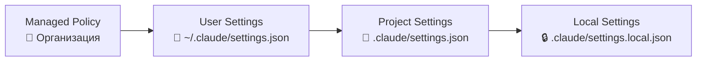

# Уровень 3: Настройки и разрешения

## Зачем нужна система настроек

Представьте многоквартирный дом. Есть правила от управляющей компании (нельзя шуметь после 23:00), есть правила дома (домофон закрывается в 22:00), есть правила квартиры (снимаем обувь у двери), и есть ваши личные привычки (ставлю будильник на 7:00). Каждый уровень может ужесточать правила, но не ослаблять то, что установлено выше.

Так же работают настройки Claude Code -- четыре уровня, от корпоративной политики до личных предпочтений.

## Иерархия настроек



**Приоритет: managed > user > project > local.** Верхний уровень всегда побеждает.

| Файл | Расположение | В Git? | Кто управляет |
|------|-------------|--------|---------------|
| Managed policy | Устанавливается организацией | -- | DevOps / Security |
| User settings | `~/.claude/settings.json` | Нет | Разработчик |
| Project settings | `.claude/settings.json` | Да | Команда |
| Local settings | `.claude/settings.local.json` | Нет | Разработчик |

## Правила разрешений: allow и deny

Настройки определяют, какие инструменты Claude может использовать без запроса:

```json
{
  "permissions": {
    "allow": [
      "Read",
      "Glob",
      "Grep",
      "Bash(git log*)",
      "Bash(npm test*)",
      "Bash(npx tsc*)"
    ],
    "deny": [
      "Bash(rm -rf*)",
      "Bash(curl*)",
      "WebFetch"
    ]
  }
}
```

Паттерны поддерживают `*` как wildcard: `Bash(git *)` разрешает любую git-команду, `Bash(npm *)` -- любую npm-команду.

## Режимы работы

Claude Code поддерживает несколько режимов, влияющих на то, сколько автономии получает агент:

| Режим | Что делает | Когда использовать |
|-------|-----------|-------------------|
| `default` | Спрашивает перед опасными действиями | Повседневная работа |
| `plan` | Только анализирует, не меняет файлы | Разведка в незнакомом коде |
| `auto` | Выполняет действия без подтверждений | Доверенные задачи, CI/CD |
| `acceptEdits` | Автоматически принимает правки файлов | Массовый рефакторинг |
| `bypassPermissions` | Игнорирует все ограничения | ⚠️ Только для экспериментов |

💡 **Совет:** начинайте с `plan` для анализа, переключайтесь на `default` для работы. `auto` -- только когда полностью доверяете задаче.

## Классификатор безопасности в auto mode

В режиме `auto` Claude не слепо выполняет всё подряд. Встроенный классификатор оценивает каждое действие:

- ✅ **Безопасные** (чтение файлов, git status) -- выполняются сразу
- ⚠️ **Условно безопасные** (редактирование файлов) -- зависят от настроек allow/deny
- ❌ **Опасные** (удаление файлов, сетевые запросы) -- требуют подтверждения даже в auto

## ⚠️ Частые ошибки новичков

### 🐛 1. Слишком широкие разрешения

```json
// ❌ Плохо -- разрешает абсолютно всё в Bash
{
  "permissions": {
    "allow": ["Bash(*)"]
  }
}
```

> Это снимает все ограничения. Claude сможет выполнить `rm -rf /`, `curl` с отправкой данных наружу и любую другую команду.

```json
// ✅ Хорошо -- только конкретные инструменты
{
  "permissions": {
    "allow": [
      "Bash(git *)",
      "Bash(npm test*)",
      "Bash(npx tsc*)"
    ]
  }
}
```

### 🐛 2. Секреты в project settings

```bash
# ❌ .claude/settings.json коммитится в git!
# Никогда не кладите туда токены или пути с username

# ✅ Для личных настроек используйте:
# .claude/settings.local.json (gitignored)
# ~/.claude/settings.json (глобальный, вне репозитория)
```

### 🐛 3. bypassPermissions в продакшене

Режим `bypassPermissions` отключает **все** проверки безопасности. Используйте его только для локальных экспериментов, никогда -- на CI/CD или в shared-окружениях.

## 📌 Итоги

- 🔥 Настройки образуют иерархию: managed > user > project > local
- ✅ `allow` / `deny` задают точные правила для инструментов с поддержкой wildcards
- 💡 Режим `plan` -- безопасная разведка, `auto` -- для доверенных задач
- ⚠️ Минимизируйте разрешения: давайте только то, что реально нужно
- 📌 Личные настройки -- в `settings.local.json`, командные -- в `settings.json`
