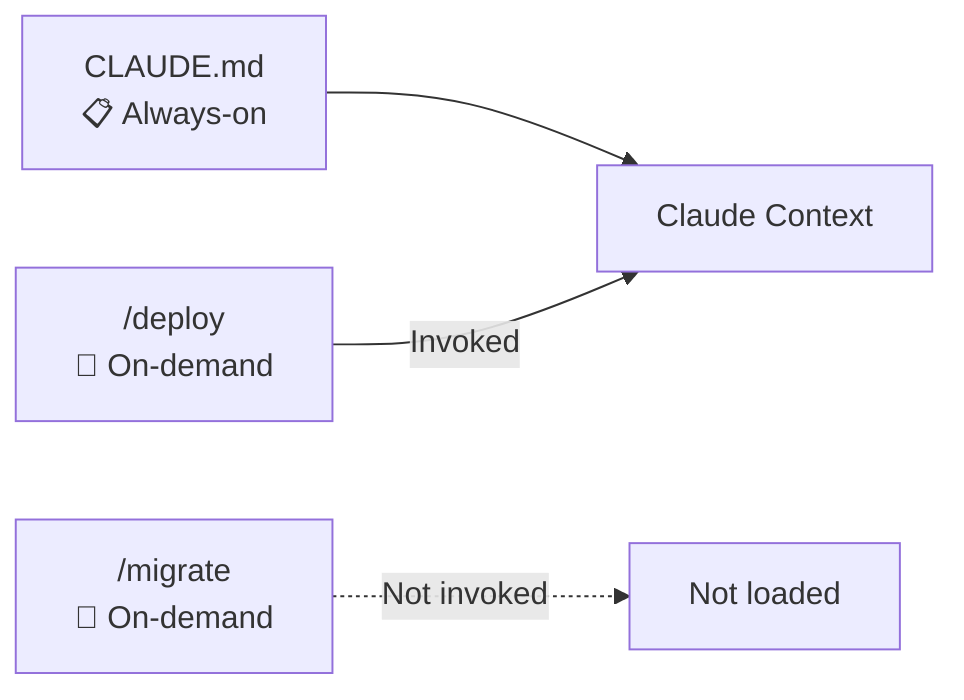
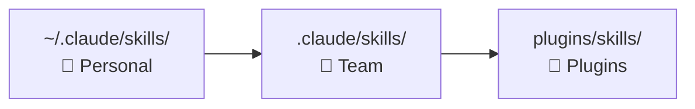

# Level 4: Skills

## Introduction

In previous levels, we worked with CLAUDE.md -- a file that Claude reads on every launch. This is convenient for general project rules, but imagine: you have 15 different processes (deployment, migrations, code review, test writing, documentation generation), and instructions for each take 50-100 lines. If you cram everything into CLAUDE.md, you get a 1000+ line wall of text, from which Claude will extract the relevant 5%.

Skills solve this problem. If CLAUDE.md is the **rules of the road** (you always know them), a skill is the **instruction manual for a specific device** in the car (you take it out of the glove compartment when needed). Claude loads a skill into context only on request -- saving tokens and improving response accuracy.



---

## Anatomy of SKILL.md

Each skill is a `SKILL.md` file in a specific directory. The file consists of YAML frontmatter (metadata) and a body (instructions for Claude):

```markdown
---
name: deploy
description: Deploy application to staging or production environment
allowed-tools: Bash(kubectl:*), Bash(helm:*), Read
model: sonnet
---

## Deployment Procedure

### Preliminary Checks
1. Check cluster status: !`kubectl cluster-info`
2. Make sure all tests passed
3. Check that the branch is up to date with main

### Deployment
1. Apply configuration for environment $1
2. Deploy version $2
3. Check pod status

### Post-deployment
1. Run smoke tests
2. Check logs for errors
```

---

## All Frontmatter Fields

### name -- Skill Name

```yaml
---
name: deploy
---
```

Defines the slash command name: a skill with `name: deploy` is invoked as `/deploy`. If `name` is not specified, the directory name is used.

### description -- Description for Auto-invocation

```yaml
---
description: Deploy application to staging or production environment
---
```

🔥 **Critical field.** Claude uses `description` to understand when the skill is relevant. If the user writes "deploy to staging", Claude matches the request against available skill descriptions and suggests using `/deploy`.

Without `description`, the skill is available only via direct `/deploy` invocation -- auto-selection doesn't work.

💡 **Tip:** write `description` as an answer to "When is this skill needed?", not "What does this skill do?".

```yaml
# ❌ Weak description -- too generic
description: Deployment skill

# ✅ Good description -- clear trigger
description: Deploy application to staging or production, rollback if health checks fail
```

### allowed-tools -- Tool Restriction

```yaml
---
allowed-tools: Bash(kubectl:*), Bash(helm:*), Read
---
```

Defines which tools the skill can use. This is the **principle of least privilege** for skills -- a deploy script doesn't need access to `Write` or `WebFetch`.

If not specified, the skill inherits the current session's permissions.

Supported formats:
```yaml
allowed-tools: Read, Write, Edit           # Enumeration
allowed-tools: Bash(git:*)                 # Only git commands
allowed-tools: Bash(npm:*), Bash(npx:*)    # npm and npx
```

### model -- Model Override

```yaml
---
model: sonnet
---
```

Allows using a different model for a specific skill. Useful for cost savings: simple skills (formatting, linting) can run on a fast and cheap model, while complex ones (architectural analysis) -- on the most powerful.

| Value | When to use |
|-------|-------------|
| `sonnet` | Simple, template tasks |
| `opus` | Complex analysis, architectural decisions |
| not specified | Current session model |

### effort -- Cost/Quality Balance

```yaml
---
effort: low
---
```

Controls how much "thinking" Claude invests in the response. `low` -- fast and cheap, `high` -- thorough and expensive.

### Additional Fields

| Field | Value | When to use |
|-------|-------|-------------|
| `disable-model-invocation: true` | Manual invocation only via `/name` | Dangerous skills (deployment, migrations) |
| `user-invocable: false` | Hidden from user, available only to Claude | Auxiliary skills, invoked from other skills |
| `context: fork` | Isolated context (doesn't see dialog) | Skills with large intermediate output |
| `paths: ["src/**/*.test.ts"]` | Auto-activation when working with files matching pattern | Testing best practices, style guides |

`context: fork` -- analogy: opening a task in a separate browser tab. The skill doesn't see the dialog history and doesn't clutter it. Useful when the skill generates a lot of output or works with confidential data.

---

## Slash Commands and Variables

### Invoking Skills

Skills are invoked via slash commands in the dialog with Claude:

```bash
/deploy staging v2.1.0
/migrate create add_user_email
/review --focus security
```

### Available Variables

Inside `SKILL.md`, the following variables are available for working with arguments and environment:

| Variable | Value | Example for `/deploy staging v2.1.0` |
|----------|-------|---------------------------------------|
| `$ARGUMENTS` | All arguments as-is | `staging v2.1.0` |
| `$0` | Command name | `deploy` |
| `$1` | First argument | `staging` |
| `$2` | Second argument | `v2.1.0` |
| `$3`...`$N` | N-th argument | -- |
| `${CLAUDE_SKILL_DIR}` | Path to skill directory | `/project/.claude/skills/deploy` |
| `${CLAUDE_SESSION_ID}` | Current session ID | `abc123...` |

### Variable Usage Example

```markdown
---
name: migrate
description: Create or run database migrations
allowed-tools: Bash(npx prisma:*)
---

Action: $1 | Name: $2

If $1 == "create": !`npx prisma migrate dev --name $2`
If $1 == "run": !`npx prisma migrate deploy`
If $1 == "status": !`npx prisma migrate status`
```

---

## Where to Place Skills

### Three Placement Levels



**Personal Skills** (`~/.claude/skills/`)
- Your personal tools
- Not committed to git
- Available in all projects

```
~/.claude/skills/
  my-review/
    SKILL.md
  quick-test/
    SKILL.md
```

**Team Skills** (`.claude/skills/`)
- Committed to git
- Available to the whole team
- Standardize processes

```
.claude/skills/
  deploy/
    SKILL.md
    templates/
  migrate/
    SKILL.md
  code-review/
    SKILL.md
```

**Plugin Skills** (`plugins/skills/`)
- Come from connected plugins
- Managed through the plugin system

---

## Supporting Files

Next to `SKILL.md` you can place supporting files -- templates, examples, references. Claude automatically gets access to them via `${CLAUDE_SKILL_DIR}`.

```
.claude/skills/deploy/
  SKILL.md                        # Main instructions
  templates/
    deployment.yaml               # Deployment template
    rollback-plan.md              # Rollback plan
  references/
    env-configs.md                # Environment configurations
    health-check-endpoints.md     # Health check endpoints
  examples/
    successful-deploy.md          # Example of successful deployment
```

Inside `SKILL.md`, refer to them like this:

```markdown
Read the deployment template from ${CLAUDE_SKILL_DIR}/templates/deployment.yaml
and adapt it for environment $1.
```

💡 Supporting files are a powerful tool. Instead of describing everything in text in SKILL.md, put real config examples, templates, and checklists next to it.

---

## Built-in Skills

Claude Code comes with a set of useful skills:

### /batch -- Batch Processing

Runs a prompt or command on multiple files:

```bash
/batch "Add JSDoc comments to all exported functions" src/**/*.ts
```

### /simplify -- Quality Review

Analyzes changed code for reusability, quality, and efficiency:

```bash
/simplify
# Claude will check current changes and suggest simplifications
```

### /loop -- Repeating Execution

Runs a command or prompt repeating at a specified interval:

```bash
/loop 5m "Check deployment status"
# Every 5 minutes Claude will check the status
```

---

## Creating Skills for a Team

Typical skills worth creating for a project:

| Skill | Focus | Typical allowed-tools |
|-------|-------|----------------------|
| `/deploy` | Deploy to environment | `Bash(kubectl:*), Bash(helm:*), Read` |
| `/migrate` | DB migrations | `Bash(npx prisma:*), Read` |
| `/review` | Code review | `Read, Glob, Grep, Bash(git diff:*)` |
| `/test-gen` | Test generation | `Read, Write, Bash(npm test:*)` |

Each skill should follow this structure: purpose, prerequisites, step-by-step algorithm, result verification, rollback plan.

---

## ⚠️ Common Beginner Mistakes

### 🐛 1. Skill without description

```yaml
# ❌ Claude won't be able to auto-select the skill
---
name: deploy
allowed-tools: Bash(*)
---
```

> Claude will see the skill in the available list, but without `description` won't determine when to suggest it. The user will write "deploy to staging", and Claude won't think to suggest `/deploy`.

```yaml
# ✅ Clear description = auto-selection
---
name: deploy
description: Deploy application to staging or production environment
allowed-tools: Bash(kubectl:*), Bash(helm:*)
---
```

### 🐛 2. Overly Broad allowed-tools

```yaml
# ❌ A deploy skill doesn't need Write or WebFetch
---
allowed-tools: "*"
---
```

> Principle of least privilege: if a deploy skill suddenly starts editing files or making web requests, that's a red flag. Restricted `allowed-tools` protect against unexpected behavior.

```yaml
# ✅ Minimum necessary set
---
allowed-tools: Bash(kubectl:*), Bash(helm:*), Read
---
```

### 🐛 3. One Giant Skill Instead of Several

```markdown
# ❌ 500-line skill: deployment, migrations, tests, and monitoring
---
name: devops
description: All DevOps operations
---
```

> Problems: Claude spends tokens parsing a huge instruction, description is too vague for auto-selection, impossible to give different `allowed-tools` for different operations.

```bash
# ✅ Separate skills with clear focus
.claude/skills/
  deploy/SKILL.md        # Deployment only
  migrate/SKILL.md       # Migrations only
  test-e2e/SKILL.md      # E2E tests only
  monitor/SKILL.md       # Monitoring only
```

### 🐛 4. Hardcoded Paths and Values

```markdown
# ❌ Hardcoded paths
Deploy to server 192.168.1.100 using /home/vasya/deploy.sh
```

```markdown
# ✅ Variables and supporting files
Read environment configuration from ${CLAUDE_SKILL_DIR}/references/env-configs.md
and deploy to environment $1
```

---

## Best Practices

- **Naming:** verbs or short phrases (`deploy`, `migrate`, `test-gen`). For large projects -- namespaces: `db-migrate`, `db-seed`, `db-backup`
- **Instruction structure:** purpose (1 line) -> prerequisites -> step-by-step algorithm -> result verification -> rollback plan
- **Testing:** before committing, invoke the skill with typical arguments and edge cases (empty arguments, non-existent files). Check that `allowed-tools` is sufficient and `description` triggers auto-selection

## 📌 Summary

- 🔥 Skill -- on-demand instruction, loads only on request (context saving)
- ✅ `description` -- key field for automatic skill selection
- 📌 Three placement levels: personal, team, plugins
- 💡 Supporting files allow storing templates and examples next to the skill
- ⚠️ Principle of least privilege: limit `allowed-tools`
- 🎯 One skill = one task. Break complex processes into separate skills
- 🔥 Built-in `/batch`, `/simplify`, `/loop` cover common scenarios
