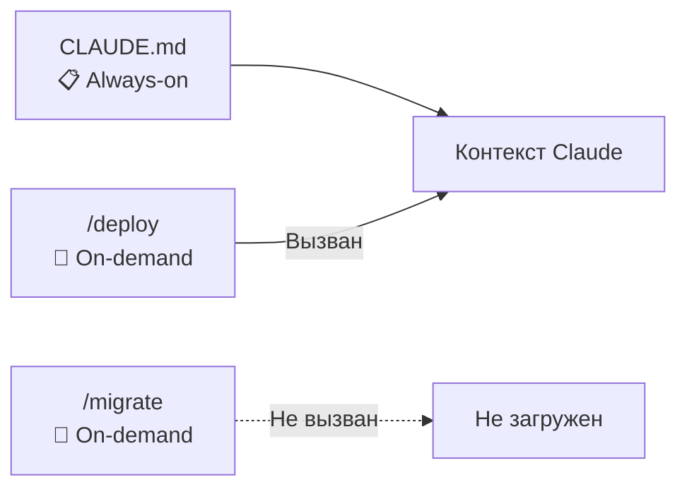
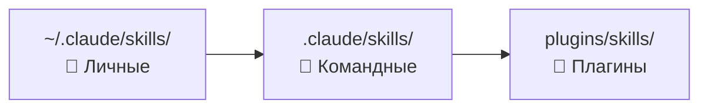

# Уровень 4: Навыки (Skills)

## Введение

На прошлых уровнях мы работали с CLAUDE.md -- файлом, который Claude читает при каждом запуске. Это удобно для общих правил проекта, но представьте: у вас 15 разных процессов (деплой, миграции, code review, написание тестов, генерация документации), и инструкции для каждого занимают по 50-100 строк. Если всё запихнуть в CLAUDE.md, получится простыня на 1000+ строк, из которой Claude будет вычитывать релевантные 5%.

Навыки (Skills) решают эту проблему. Если CLAUDE.md -- это **правила дорожного движения** (знаешь всегда), то skill -- это **инструкция к конкретному прибору** в автомобиле (достаёшь из бардачка, когда нужно). Claude загружает навык в контекст только по запросу -- экономя токены и повышая точность ответов.



---

## Анатомия SKILL.md

Каждый навык -- это файл `SKILL.md` в определённой директории. Файл состоит из YAML frontmatter (метаданные) и тела (инструкции для Claude):

```markdown
---
name: deploy
description: Deploy application to staging or production environment
allowed-tools: Bash(kubectl:*), Bash(helm:*), Read
model: sonnet
---

## Процедура деплоя

### Предварительные проверки
1. Проверь статус кластера: !`kubectl cluster-info`
2. Убедись, что все тесты прошли
3. Проверь, что ветка актуальна с main

### Деплой
1. Примени конфигурацию для окружения $1
2. Задеплой версию $2
3. Проверь статус подов

### Пост-деплой
1. Проведи smoke-тесты
2. Проверь логи на ошибки
```

---

## Все поля frontmatter

### name -- имя навыка

```yaml
---
name: deploy
---
```

Определяет имя слэш-команды: навык с `name: deploy` вызывается как `/deploy`. Если `name` не указан, используется имя папки.

### description -- описание для автовызова

```yaml
---
description: Deploy application to staging or production environment
---
```

🔥 **Ключевое поле.** Claude использует `description` чтобы понять, когда навык релевантен. Если пользователь пишет "задеплой на стейджинг", Claude сопоставит запрос с описаниями доступных навыков и предложит использовать `/deploy`.

Без `description` навык доступен только по прямому вызову `/deploy` -- автоматический подбор не работает.

💡 **Совет:** пишите `description` как ответ на вопрос "Когда этот навык нужен?", а не "Что этот навык делает?".

```yaml
# ❌ Слабое описание -- слишком общее
description: Deployment skill

# ✅ Хорошее описание -- чёткий триггер
description: Deploy application to staging or production, rollback if health checks fail
```

### allowed-tools -- ограничение инструментов

```yaml
---
allowed-tools: Bash(kubectl:*), Bash(helm:*), Read
---
```

Определяет, какие инструменты навык может использовать. Это **принцип минимальных привилегий** для навыков -- деплой-скрипту не нужен доступ к `Write` или `WebFetch`.

Если поле не указано, навык наследует разрешения текущей сессии.

Поддерживаемые форматы:
```yaml
allowed-tools: Read, Write, Edit           # Перечисление
allowed-tools: Bash(git:*)                 # Только git-команды
allowed-tools: Bash(npm:*), Bash(npx:*)    # npm и npx
```

### model -- переопределение модели

```yaml
---
model: sonnet
---
```

Позволяет использовать другую модель для конкретного навыка. Полезно для экономии: простые навыки (форматирование, линтинг) могут работать на быстрой и дешёвой модели, а сложные (архитектурный анализ) -- на самой мощной.

| Значение | Когда использовать |
|----------|-------------------|
| `sonnet` | Простые, шаблонные задачи |
| `opus` | Сложный анализ, архитектурные решения |
| не указан | Модель текущей сессии |

### effort -- баланс стоимость/качество

```yaml
---
effort: low
---
```

Управляет тем, сколько "думания" Claude вкладывает в ответ. `low` -- быстро и дёшево, `high` -- тщательно и дорого.

### Дополнительные поля

| Поле | Значение | Когда использовать |
|------|---------|-------------------|
| `disable-model-invocation: true` | Только ручной вызов через `/name` | Опасные навыки (деплой, миграции) |
| `user-invocable: false` | Скрыт от пользователя, доступен только Claude | Вспомогательные навыки, вызываемые из других |
| `context: fork` | Изолированный контекст (не видит диалог) | Навыки с большим промежуточным выводом |
| `paths: ["src/**/*.test.ts"]` | Автоактивация при работе с файлами по паттерну | Тестовые best practices, стилевые гайды |

`context: fork` -- аналогия: открытие задачи в отдельной вкладке браузера. Навык не видит историю диалога и не засоряет её. Полезно когда навык генерирует много вывода или работает с конфиденциальными данными.

---

## Слэш-команды и переменные

### Вызов навыков

Навыки вызываются через слэш-команды в диалоге с Claude:

```bash
/deploy staging v2.1.0
/migrate create add_user_email
/review --focus security
```

### Доступные переменные

Внутри `SKILL.md` доступны переменные для работы с аргументами и окружением:

| Переменная | Значение | Пример для `/deploy staging v2.1.0` |
|-----------|---------|--------------------------------------|
| `$ARGUMENTS` | Все аргументы целиком | `staging v2.1.0` |
| `$0` | Имя команды | `deploy` |
| `$1` | Первый аргумент | `staging` |
| `$2` | Второй аргумент | `v2.1.0` |
| `$3`...`$N` | N-й аргумент | -- |
| `${CLAUDE_SKILL_DIR}` | Путь к папке навыка | `/project/.claude/skills/deploy` |
| `${CLAUDE_SESSION_ID}` | ID текущей сессии | `abc123...` |

### Пример использования переменных

```markdown
---
name: migrate
description: Create or run database migrations
allowed-tools: Bash(npx prisma:*)
---

Действие: $1 | Имя: $2

Если $1 == "create": !`npx prisma migrate dev --name $2`
Если $1 == "run": !`npx prisma migrate deploy`
Если $1 == "status": !`npx prisma migrate status`
```

---

## Где размещать навыки

### Три уровня расположения



**Личные навыки** (`~/.claude/skills/`)
- Ваши персональные инструменты
- Не попадают в git
- Доступны во всех проектах

```
~/.claude/skills/
  my-review/
    SKILL.md
  quick-test/
    SKILL.md
```

**Командные навыки** (`.claude/skills/`)
- Коммитятся в git
- Доступны всей команде
- Стандартизируют процессы

```
.claude/skills/
  deploy/
    SKILL.md
    templates/
  migrate/
    SKILL.md
  code-review/
    SKILL.md
```

**Навыки из плагинов** (`plugins/skills/`)
- Приходят из подключённых плагинов
- Управляются через систему плагинов

---

## Supporting files

Рядом со `SKILL.md` можно разместить вспомогательные файлы -- шаблоны, примеры, справочники. Claude автоматически получает к ним доступ через `${CLAUDE_SKILL_DIR}`.

```
.claude/skills/deploy/
  SKILL.md                        # Основные инструкции
  templates/
    deployment.yaml               # Шаблон деплоя
    rollback-plan.md              # План отката
  references/
    env-configs.md                # Конфигурации окружений
    health-check-endpoints.md     # Эндпоинты для проверки
  examples/
    successful-deploy.md          # Пример успешного деплоя
```

Внутри `SKILL.md` обращайтесь к ним так:

```markdown
Прочитай шаблон деплоя из ${CLAUDE_SKILL_DIR}/templates/deployment.yaml
и адаптируй его для окружения $1.
```

💡 Supporting files -- мощный инструмент. Вместо того чтобы описывать всё текстом в SKILL.md, положите рядом реальные примеры конфигов, шаблоны и чек-листы.

---

## Встроенные навыки

Claude Code поставляется с набором полезных навыков:

### /batch -- массовая обработка

Запускает промпт или команду на множестве файлов:

```bash
/batch "Добавь JSDoc комментарии ко всем экспортируемым функциям" src/**/*.ts
```

### /simplify -- ревью на качество

Анализирует изменённый код на переиспользование, качество и эффективность:

```bash
/simplify
# Claude проверит текущие изменения и предложит упрощения
```

### /loop -- повторяющийся запуск

Запускает команду или промпт с повторением через заданный интервал:

```bash
/loop 5m "Проверь статус деплоя"
# Каждые 5 минут Claude проверяет статус
```

---

## Создание навыков для команды

Типичные навыки, которые стоит создать для проекта:

| Навык | Фокус | Типичные allowed-tools |
|-------|-------|----------------------|
| `/deploy` | Деплой на окружение | `Bash(kubectl:*), Bash(helm:*), Read` |
| `/migrate` | Миграции БД | `Bash(npx prisma:*), Read` |
| `/review` | Code review | `Read, Glob, Grep, Bash(git diff:*)` |
| `/test-gen` | Генерация тестов | `Read, Write, Bash(npm test:*)` |

Каждый навык должен следовать структуре: цель, предусловия, пошаговый алгоритм, проверка результата, план отката.

---

## ⚠️ Частые ошибки новичков

### 🐛 1. Навык без description

```yaml
# ❌ Claude не сможет автоматически выбрать навык
---
name: deploy
allowed-tools: Bash(*)
---
```

> Claude увидит навык в списке доступных, но без `description` не сможет определить, когда его предлагать. Пользователь напишет "задеплой на стейджинг", а Claude не догадается предложить `/deploy`.

```yaml
# ✅ Чёткое описание = автоматический подбор
---
name: deploy
description: Deploy application to staging or production environment
allowed-tools: Bash(kubectl:*), Bash(helm:*)
---
```

### 🐛 2. Слишком широкие allowed-tools

```yaml
# ❌ Навыку для деплоя не нужен Write или WebFetch
---
allowed-tools: "*"
---
```

> Принцип минимальных привилегий: если навык для деплоя вдруг начнёт редактировать файлы или делать веб-запросы, это сигнал о проблеме. Ограниченные `allowed-tools` защищают от непредвиденного поведения.

```yaml
# ✅ Минимально необходимый набор
---
allowed-tools: Bash(kubectl:*), Bash(helm:*), Read
---
```

### 🐛 3. Один гигантский навык вместо нескольких

```markdown
# ❌ Навык на 500 строк: и деплой, и миграции, и тесты, и мониторинг
---
name: devops
description: All DevOps operations
---
```

> Проблемы: Claude тратит токены на парсинг огромной инструкции, description слишком размытый для автоподбора, невозможно дать разные `allowed-tools` для разных операций.

```bash
# ✅ Отдельные навыки с чётким фокусом
.claude/skills/
  deploy/SKILL.md        # Только деплой
  migrate/SKILL.md       # Только миграции
  test-e2e/SKILL.md      # Только e2e-тесты
  monitor/SKILL.md       # Только мониторинг
```

### 🐛 4. Жёстко закодированные пути и значения

```markdown
# ❌ Захардкоженные пути
Деплой на сервер 192.168.1.100 используя /home/vasya/deploy.sh
```

```markdown
# ✅ Переменные и supporting files
Прочитай конфигурацию окружения из ${CLAUDE_SKILL_DIR}/references/env-configs.md
и задеплой на окружение $1
```

---

## Best practices

- **Именование:** глаголы или короткие фразы (`deploy`, `migrate`, `test-gen`). Для больших проектов -- неймспейсы: `db-migrate`, `db-seed`, `db-backup`
- **Структура инструкций:** цель (1 строка) -> предусловия -> пошаговый алгоритм -> проверка результата -> план отката
- **Тестирование:** перед коммитом вызовите навык с типичными аргументами и edge cases (пустые аргументы, несуществующие файлы). Проверьте, что `allowed-tools` достаточно и `description` триггерит автоподбор

## 📌 Итоги

- 🔥 Skill -- on-demand инструкция, загружается только по запросу (экономия контекста)
- ✅ `description` -- ключевое поле для автоматического подбора навыка
- 📌 Три уровня размещения: личные, командные, плагины
- 💡 Supporting files позволяют хранить шаблоны и примеры рядом с навыком
- ⚠️ Принцип минимальных привилегий: ограничивайте `allowed-tools`
- 🎯 Один навык = одна задача. Разбивайте сложные процессы на отдельные навыки
- 🔥 Встроенные `/batch`, `/simplify`, `/loop` покрывают частые сценарии
