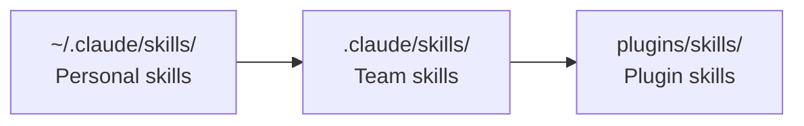

# Level 4: Skills

## Why Skills are Needed

If CLAUDE.md is a permanent instruction that Claude always reads, a skill is a tool taken out of the toolbox only on request. Analogy: CLAUDE.md is your company rules (always in effect), a skill is an instruction manual for a specific machine (needed only when working on it).

Skills save context: instead of loading all instructions into every conversation, Claude loads only what's needed right now.

## Anatomy of SKILL.md

A skill is a `SKILL.md` file with YAML frontmatter and instructions in the body:

```markdown
---
name: deploy
description: Deploy application to staging or production
allowed-tools: Bash(kubectl:*), Bash(helm:*), Read
model: sonnet
---

## Deployment Instructions

1. Check current cluster status: !`kubectl cluster-info`
2. Validate configuration for $1 environment
3. Start deployment of version $2
```

## Key Frontmatter Fields

| Field | Purpose | Example |
|-------|---------|---------|
| `name` | Skill name | `deploy` |
| `description` | When to use (for auto-invocation) | `Deploy app to env` |
| `allowed-tools` | Tool restriction | `Bash(git:*), Read` |
| `model` | Model override | `sonnet`, `opus` |
| `effort` | Cost/quality balance | `low`, `medium`, `high` |
| `disable-model-invocation` | Manual invocation only | `true` |
| `user-invocable` | For Claude only, not for humans | `false` |
| `context: fork` | Context isolation | Skill doesn't see main dialog |
| `paths` | Conditional activation by files | `["src/**/*.test.ts"]` |

## Slash Commands and Variables

Skills are invoked via slash commands:

```bash
# Invoke a skill
/deploy staging v2.1.0

# Available variables inside the skill:
$ARGUMENTS        # "staging v2.1.0" -- all arguments
$0                # "deploy" -- command name
$1                # "staging" -- first argument
$2                # "v2.1.0" -- second argument
${CLAUDE_SKILL_DIR}    # Path to skill directory
${CLAUDE_SESSION_ID}   # Current session ID
```

## Where to Place Skills



- **Personal** (`~/.claude/skills/`) -- your personal skills, not in git
- **Team** (`.claude/skills/`) -- shared for the project, committed to git
- **Plugins** (`plugins/skills/`) -- from connected plugins

## Supporting Files

Next to `SKILL.md` you can place supporting files -- templates, examples, references. Claude will access them automatically:

```
.claude/skills/deploy/
  SKILL.md
  templates/
    deployment.yaml
    rollback-plan.md
  references/
    env-configs.md
```

## Built-in Skills

Claude Code comes with useful skills out of the box:

| Skill | What it does |
|-------|-------------|
| `/batch` | Run a prompt on multiple files |
| `/simplify` | Code review for reusability and quality |
| `/loop` | Run a command repeating at intervals |

## ⚠️ Common Beginner Mistakes

### 🐛 1. Skill without description

```yaml
# ❌ Claude won't be able to auto-select the skill
---
name: deploy
allowed-tools: Bash(*)
---
```

> Without `description`, the skill is available only via direct `/deploy` invocation. Claude won't suggest it automatically, even if the task is a perfect match.

```yaml
# ✅ Description helps with auto-selection
---
name: deploy
description: Deploy application to staging or production environment
allowed-tools: Bash(kubectl:*), Bash(helm:*)
---
```

### 🐛 2. Overly Broad allowed-tools

```yaml
# ❌ A deploy skill doesn't need access to everything
---
allowed-tools: "*"
---
```

```yaml
# ✅ Only necessary tools
---
allowed-tools: Bash(kubectl:*), Bash(helm:*), Read
---
```

### 🐛 3. Giant Skill Instead of Multiple Small Ones

A 500-line skill that deploys, tests, and migrates -- is an anti-pattern. Break into separate skills with clear focus: `/deploy`, `/migrate`, `/test-e2e`.

## 📌 Summary

- 🔥 Skill -- on-demand instruction, unlike always-on CLAUDE.md
- ✅ Invoked via `/skill-name` with argument support `$1`, `$2`, `$ARGUMENTS`
- 💡 `description` is critical for automatic skill invocation
- ⚠️ Limit `allowed-tools` to the minimum necessary
- 📌 Team skills -- in `.claude/skills/`, personal -- in `~/.claude/skills/`
