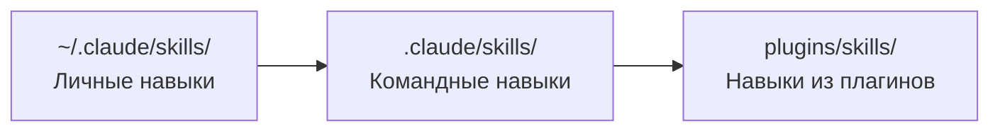

# Уровень 4: Навыки (Skills)

## Зачем нужны навыки

Если CLAUDE.md -- это постоянная инструкция, которую Claude читает всегда, то skill -- это инструмент, который достаётся из ящика только по запросу. Аналогия: CLAUDE.md -- это правила вашей компании (действуют всегда), а skill -- это инструкция к конкретному станку (нужна только когда работаешь на нём).

Навыки экономят контекст: вместо того чтобы загружать все инструкции в каждый диалог, Claude подгружает только то, что нужно прямо сейчас.

## Анатомия SKILL.md

Навык -- это файл `SKILL.md` с YAML frontmatter и инструкциями в теле:

```markdown
---
name: deploy
description: Deploy application to staging or production
allowed-tools: Bash(kubectl:*), Bash(helm:*), Read
model: sonnet
---

## Инструкции по деплою

1. Проверь текущий статус кластера: !`kubectl cluster-info`
2. Валидируй конфигурацию для $1 окружения
3. Запусти деплой версии $2
```

## Ключевые поля frontmatter

| Поле | Назначение | Пример |
|------|-----------|--------|
| `name` | Имя навыка | `deploy` |
| `description` | Когда использовать (для автовызова) | `Deploy app to env` |
| `allowed-tools` | Ограничение инструментов | `Bash(git:*), Read` |
| `model` | Переопределение модели | `sonnet`, `opus` |
| `effort` | Баланс стоимость/качество | `low`, `medium`, `high` |
| `disable-model-invocation` | Только ручной вызов | `true` |
| `user-invocable` | Только для Claude, не для человека | `false` |
| `context: fork` | Изоляция контекста | Навык не видит основной диалог |
| `paths` | Условная активация по файлам | `["src/**/*.test.ts"]` |

## Слэш-команды и переменные

Навыки вызываются через слэш-команды:

```bash
# Вызов навыка
/deploy staging v2.1.0

# Доступные переменные внутри навыка:
$ARGUMENTS        # "staging v2.1.0" -- все аргументы
$0                # "deploy" -- имя команды
$1                # "staging" -- первый аргумент
$2                # "v2.1.0" -- второй аргумент
${CLAUDE_SKILL_DIR}    # Путь к папке навыка
${CLAUDE_SESSION_ID}   # ID текущей сессии
```

## Где размещать навыки



- **Личные** (`~/.claude/skills/`) -- ваши персональные навыки, не в git
- **Командные** (`.claude/skills/`) -- общие для проекта, коммитятся в git
- **Плагины** (`plugins/skills/`) -- из подключённых плагинов

## Supporting files

Рядом со `SKILL.md` можно положить вспомогательные файлы -- шаблоны, примеры, справочники. Claude подключит их автоматически:

```
.claude/skills/deploy/
  SKILL.md
  templates/
    deployment.yaml
    rollback-plan.md
  references/
    env-configs.md
```

## Встроенные навыки

Claude Code поставляется с полезными навыками из коробки:

| Навык | Что делает |
|-------|-----------|
| `/batch` | Запуск промпта на множестве файлов |
| `/simplify` | Ревью кода на переиспользование и качество |
| `/loop` | Запуск команды с повторением по интервалу |

## ⚠️ Частые ошибки новичков

### 🐛 1. Навык без description

```yaml
# ❌ Claude не сможет автоматически выбрать навык
---
name: deploy
allowed-tools: Bash(*)
---
```

> Без `description` навык доступен только по прямому вызову `/deploy`. Claude не предложит его автоматически, даже если задача идеально подходит.

```yaml
# ✅ Описание помогает автоматическому выбору
---
name: deploy
description: Deploy application to staging or production environment
allowed-tools: Bash(kubectl:*), Bash(helm:*)
---
```

### 🐛 2. Слишком широкие allowed-tools

```yaml
# ❌ Навыку для деплоя не нужен доступ ко всему
---
allowed-tools: "*"
---
```

```yaml
# ✅ Только необходимые инструменты
---
allowed-tools: Bash(kubectl:*), Bash(helm:*), Read
---
```

### 🐛 3. Гигантский навык вместо нескольких маленьких

Один навык на 500 строк, который и деплоит, и тестирует, и мигрирует -- антипаттерн. Разбивайте на отдельные навыки с чётким фокусом: `/deploy`, `/migrate`, `/test-e2e`.

## 📌 Итоги

- 🔥 Skill -- on-demand инструкция, в отличие от always-on CLAUDE.md
- ✅ Вызывается через `/skill-name` с поддержкой аргументов `$1`, `$2`, `$ARGUMENTS`
- 💡 `description` критичен для автоматического вызова навыка
- ⚠️ Ограничивайте `allowed-tools` до минимума необходимого
- 📌 Командные навыки -- в `.claude/skills/`, личные -- в `~/.claude/skills/`
