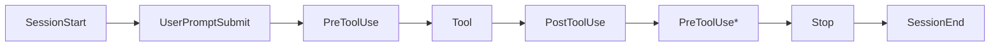
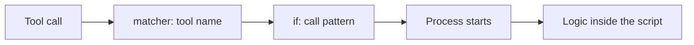

# Level 5: Hooks -- Deterministic Automation

## Introduction

Imagine a factory assembly line. At every stage there's a sensor or mechanism: one checks a part's dimensions, another applies a coating, a third rejects defective items. A worker can make a mistake, forget a step, or do it wrong. But the automation on the line works **the same way every time** -- that is determinism.

In Claude Code, hooks play the same role. CLAUDE.md tells the agent: "Please format the code." A hook **guarantees** that the code gets formatted -- regardless of whether the agent "remembered" the instruction.

```
CLAUDE.md: "Always run the linter after editing" → the agent might forget
PostToolUse(Edit) hook: eslint --fix $FILE       → always runs
```

In this level we'll cover:
1. How to configure hooks in `settings.json`
2. The five types of hooks and when to use each
3. All lifecycle events
4. Matchers, filtering, and flow control
5. Practical patterns for real projects

---

## 1. Hook Configuration

Hooks are configured in the `hooks` section of `settings.json`. There are two levels of configuration:

| File | Scope |
|---|---|
| `~/.claude/settings.json` | Global -- for all projects |
| `.claude/settings.json` | Local -- for the current project only |

Project hooks **add to** global hooks rather than replacing them. If the same matcher is defined at both levels, both sets of hooks run.

### Basic Structure

```json
{
  "hooks": {
    "PreToolUse": [
      {
        "matcher": "Write|Edit",
        "hooks": [
          {
            "type": "command",
            "command": "bash .claude/hooks/validate-write.sh",
            "timeout": 30
          }
        ]
      }
    ],
    "PostToolUse": [
      {
        "matcher": "Edit",
        "hooks": [
          {
            "type": "command",
            "command": "prettier --write $FILE",
            "timeout": 15
          }
        ]
      }
    ]
  }
}
```

Each entry contains:
- **matcher** -- a regex for filtering by tool name
- **hooks** -- an array of hooks that run on a match
- Each hook has a **type**, type-specific fields, and an optional **timeout**

---

## 2. The Five Types of Hooks

### Command -- Running a Shell Command

The most common type. Runs an arbitrary command in the terminal:

```json
{
  "type": "command",
  "command": "prettier --write $FILE",
  "timeout": 15
}
```

The command receives event data via **stdin** in JSON format. The result is determined by the exit code and an optional JSON payload on stdout.

When to use: formatting, linting, file validation, notifications, audit logs.

### Prompt -- LLM-based Analysis

Sends a prompt to Claude itself for an "internal" check:

```json
{
  "type": "prompt",
  "prompt": "Check whether this bash command is safe: $TOOL_INPUT. Check for: destructive operations, data deletion, access to secrets.",
  "timeout": 20
}
```

When to use: semantic analysis that can't be expressed with regular expressions. For example, "is this SQL command safe?" or "does this code contain any secrets?"

### HTTP -- an External Webhook

Sends an HTTP request to a given URL:

```json
{
  "type": "http",
  "url": "https://hooks.slack.com/services/XXX/YYY/ZZZ",
  "method": "POST",
  "timeout": 10
}
```

When to use: integrating with external systems -- Slack notifications, audit systems, CI/CD triggers.

### MCP Tool -- Calling a Tool on an MCP Server

Calls a tool on an already-connected [MCP server](../06-mcp-servers/README.md). The tool's text output is processed the same way as a command hook's stdout:

```json
{
  "type": "mcp_tool",
  "server": "audit-system",
  "tool": "log_event",
  "timeout": 15
}
```

When to use: the action you need is already implemented as an MCP tool. Instead of writing a shell script that hits the same API via `curl`, you reuse an existing integration -- with its authentication and error handling already in place.

This is exactly the case where two Claude Code mechanisms combine: MCP gives the agent tools, and hooks let you call those same tools deterministically, without the model in the loop.

### Agent -- Launching a Subagent

Launches a specialized subagent for a complex check:

```json
{
  "type": "agent",
  "agent": "security-checker",
  "timeout": 60
}
```

When to use: multi-step verification that requires reading several files and making a decision based on context.

⚠️ Agent hooks are marked experimental -- their behavior and format may change. For critical automation, `command` is more reliable.

---

## 3. Lifecycle Events

### The Full Event Diagram



*Claude may call multiple tools within a single response.

### Detailed Event Descriptions

**SessionStart** -- a session begins. Good for loading context, checking the environment:

```json
{
  "matcher": ".*",
  "hooks": [{
    "type": "command",
    "command": "bash .claude/hooks/load-env.sh",
    "timeout": 10
  }]
}
```

**UserPromptSubmit** -- the user submitted a message. You can validate or transform the request before Claude starts working.

**PreToolUse** -- before a tool is called. The most important event -- this is where you can **block** dangerous actions:

```json
{
  "matcher": "Bash",
  "hooks": [{
    "type": "command",
    "command": "bash .claude/hooks/block-dangerous-commands.sh",
    "timeout": 5
  }]
}
```

**PostToolUse** -- after a tool runs. Ideal for post-processing: formatting, notifications.

**Stop** -- Claude finished a response. You can run final checks, update status.

**SubagentStart / SubagentStop** -- subagent lifecycle. Useful for monitoring.

**FileChanged / CwdChanged** -- a file or working directory changed. Lets you react to external changes:

```json
{
  "matcher": "CwdChanged",
  "hooks": [{
    "type": "command",
    "command": "bash .claude/hooks/reload-project-context.sh",
    "timeout": 10
  }]
}
```

### The Full Set of Events

The events above are the ones you start with. There are more than thirty in total, and they cover almost the entire lifecycle of a session, not just tool calls. You don't need to memorize the whole list, but it's useful to know which groups exist -- so you don't build a workaround where a ready-made event already exists:

| Group | Events |
|---|---|
| Session | `SessionStart`, `SessionEnd`, `Setup` |
| Prompt | `UserPromptSubmit`, `UserPromptExpansion` |
| Tools | `PreToolUse`, `PostToolUse`, `PostToolUseFailure`, `PostToolBatch` |
| Permissions | `PermissionRequest`, `PermissionDenied` |
| Conversation flow | `Stop`, `StopFailure`, `Notification`, `MessageDisplay` |
| Subagents and teammates | `SubagentStart`, `SubagentStop`, `TeammateIdle` |
| Tasks | `TaskCreated`, `TaskCompleted` |
| Context | `PreCompact`, `PostCompact`, `InstructionsLoaded` |
| Environment | `ConfigChange`, `CwdChanged`, `FileChanged` |
| Worktrees | `WorktreeCreate`, `WorktreeRemove` |
| MCP elicitation | `Elicitation`, `ElicitationResult` |

Two pairs that are most often overlooked:

- **`PostToolUse` fires only on success.** If you need to react to failed commands, that's `PostToolUseFailure`, a separate event.
- **`InstructionsLoaded`** fires when CLAUDE.md and `.claude/rules/` files are loaded, including lazy loading mid-session. Useful for auditing: which instructions actually made it into the context.

The list keeps growing -- check the documentation.

---

## 4. Matchers and Filtering

### Regex Patterns

A matcher is a regular expression checked against the tool's name:

```json
"matcher": "Edit|Write"        // Any file editing
"matcher": "Bash"              // Terminal commands only
"matcher": ".*"                // Any tool (use with caution!)
"matcher": "Read"              // File reads only
```

### The `if` Field -- a Filter Before the Process Starts

Between a "coarse" matcher and "fine" logic inside the script, there's an intermediate level -- the `if` field. It uses permission-rule syntax:

```json
{
  "matcher": "Bash",
  "if": "Bash(git push*)",
  "hooks": [{
    "type": "command",
    "command": "bash .claude/hooks/guard-push.sh",
    "timeout": 10
  }]
}
```

```json
{
  "matcher": "Edit|Write",
  "if": "Edit(*.ts)",
  "hooks": [{
    "type": "command",
    "command": "npx tsc --noEmit",
    "timeout": 60
  }]
}
```

The key difference from an in-script check: **if `if` doesn't match, the process doesn't start at all**. A hook on `Bash` without `if` starts a new process for every command -- including harmless ones like `ls` and `git status`. With `if`, this doesn't happen.



The rule is simple: the earlier you filter out, the cheaper it is.

⚠️ Two pitfalls:

- `if` is evaluated **only** on tool events: `PreToolUse`, `PostToolUse`, `PostToolUseFailure`, `PermissionRequest`, `PermissionDenied`. On any other event, a hook with `if` set will never fire -- a silent configuration mistake.
- The syntax here is permission rules, not regex. `Bash(git push*)` is a permission pattern, whereas the `matcher` right next to it is a regular expression. Don't mix them up.

### Fine-Grained Filtering Inside the Script

Matcher and `if` filter by tool and call pattern, but sometimes you need logic that can't be expressed with a pattern. Call data arrives on the script's stdin as JSON:

```bash
#!/bin/bash
input=$(cat)
tool_name=$(echo "$input" | jq -r '.tool_name')
command=$(echo "$input" | jq -r '.tool_input.command // empty')
file_path=$(echo "$input" | jq -r '.tool_input.file_path // empty')

# Block git push --force
if [[ "$command" =~ git\ push.*--force ]]; then
  echo '{"hookSpecificOutput":{"permissionDecision":"deny"},"systemMessage":"Force push blocked by the security hook"}'
  exit 0
fi

# Protect .env files from editing
if [[ "$file_path" =~ \.env ]]; then
  echo '{"hookSpecificOutput":{"permissionDecision":"deny"},"systemMessage":"Editing .env files is not allowed"}'
  exit 0
fi

exit 0
```

### Multi-Level Validation

You can combine several hooks for a single matcher -- a fast command hook for simple checks and a prompt hook for deep analysis:

```json
{
  "matcher": "Bash",
  "hooks": [
    {
      "type": "command",
      "command": "bash .claude/hooks/quick-check.sh",
      "timeout": 5
    },
    {
      "type": "prompt",
      "prompt": "Deep analysis of the bash command: $TOOL_INPUT",
      "timeout": 15
    }
  ]
}
```

---

## 5. Input and Output Data

### What Arrives on stdin

For `PreToolUse` and `PostToolUse`, the hook receives JSON with information about the call:

```json
{
  "tool_name": "Edit",
  "tool_input": {
    "file_path": "/src/components/App.tsx",
    "old_string": "const x = 1",
    "new_string": "const x = 2"
  }
}
```

### What You Can Return on stdout

**Permission decision (PreToolUse):**

```json
{
  "hookSpecificOutput": {
    "permissionDecision": "allow"
  }
}
```

Values for `permissionDecision`: `allow`, `deny`, `ask` (ask the user).

**Modifying the input data:**

```json
{
  "hookSpecificOutput": {
    "permissionDecision": "allow",
    "updatedInput": {
      "command": "npm test -- --coverage"
    }
  }
}
```

**Injecting context into Claude:**

```json
{
  "additionalContext": "This file is part of the billing system. Any changes require extra caution.",
  "systemMessage": "The file is in a critical zone"
}
```

### Exit Codes

| Code | Meaning | Behavior |
|---|---|---|
| `0` | Success | The tool runs (unless the JSON says deny) |
| `2` | Block | The tool does NOT run |
| Other | Hook error | The hook is ignored, the tool runs |

---

## 6. Practical Patterns

### Auto-Formatting After Editing

```json
{
  "PostToolUse": [{
    "matcher": "Edit|Write",
    "hooks": [{
      "type": "command",
      "command": "prettier --write $FILE",
      "timeout": 15
    }]
  }]
}
```

### Protecting Critical Files

```bash
#!/bin/bash
# .claude/hooks/protect-files.sh
input=$(cat)
file=$(echo "$input" | jq -r '.tool_input.file_path // empty')

PROTECTED_FILES=(".env" "package-lock.json" "yarn.lock" "docker-compose.prod.yml")

for protected in "${PROTECTED_FILES[@]}"; do
  if [[ "$file" == *"$protected"* ]]; then
    echo "{\"hookSpecificOutput\":{\"permissionDecision\":\"deny\"},\"systemMessage\":\"File $protected is protected from editing\"}"
    exit 0
  fi
done

exit 0
```

### Audit Log of All Actions

```bash
#!/bin/bash
# .claude/hooks/audit.sh
input=$(cat)
tool=$(echo "$input" | jq -r '.tool_name')
timestamp=$(date -u +"%Y-%m-%dT%H:%M:%SZ")

echo "$timestamp | $tool | $(echo "$input" | jq -c '.tool_input')" >> .claude/audit.log
exit 0
```

### Slack Notification on Task Completion

```json
{
  "Stop": [{
    "matcher": ".*",
    "hooks": [{
      "type": "http",
      "url": "https://hooks.slack.com/services/XXX/YYY/ZZZ",
      "method": "POST",
      "timeout": 10
    }]
  }]
}
```

### Auto-Loading Context on Directory Change

```bash
#!/bin/bash
# .claude/hooks/reload-env.sh
new_cwd=$(cat | jq -r '.new_cwd // empty')

if [ -f "$new_cwd/.env" ]; then
  echo "{\"additionalContext\":\"A .env file was found in the new directory. Variables: $(grep -v '^#' "$new_cwd/.env" | cut -d= -f1 | tr '\n' ', ')\"}"
fi

exit 0
```

---

## 7. Debugging Hooks

### Logging for Debugging

Add logging to your hook script:

```bash
#!/bin/bash
input=$(cat)
echo "[DEBUG] $(date) Hook triggered" >> /tmp/claude-hooks.log
echo "[DEBUG] Input: $input" >> /tmp/claude-hooks.log

# ... hook logic ...

echo "[DEBUG] Exit code: 0" >> /tmp/claude-hooks.log
exit 0
```

### Testing a Hook Manually

```bash
# Simulate a hook call
echo '{"tool_name":"Bash","tool_input":{"command":"rm -rf /"}}' | bash .claude/hooks/block-dangerous.sh
echo $?  # Check the exit code
```

### Common Issues

| Symptom | Cause | Fix |
|---|---|---|
| The hook doesn't fire | Wrong matcher | Check the regex: `Edit\|Write` vs `Edit|Write` |
| The hook hangs | No timeout | Add `"timeout": 30` |
| The hook blocks everything | Exit code 2 with no conditions | Add a check before `exit 2` |
| additionalContext doesn't work | Invalid JSON | Check escaping in echo |

---

## ⚠️ Common Beginner Mistakes

### 🐛 1. A Hook Without a Timeout

```json
// ❌ A hung process will block the entire session
{ "type": "command", "command": "npm test" }

// ✅ Timeout limits execution time
{ "type": "command", "command": "npm test", "timeout": 60 }
```

> **Why this is a problem:** if a command hangs (network timeout, infinite loop), Claude Code can't proceed until the process is killed. Without a timeout, this could last forever.

### 🐛 2. Forgotten Exit Code

```bash
# ❌ The script exits with the code of the last command -- unpredictable
echo "check passed"
grep "something" file.txt  # If not found, exit code = 1

# ✅ Explicit exit code at the end
echo "check passed"
grep "something" file.txt || true
exit 0
```

> **Why this is a problem:** the script's exit code determines whether the tool is allowed. A stray nonzero code can cause an unexpected block or error.

### 🐛 3. A Heavy Hook on Every Tool

```json
// ❌ npm test on every single tool call
{ "matcher": ".*", "hooks": [{ "type": "command", "command": "npm test", "timeout": 120 }] }

// ✅ Only after writing files
{ "matcher": "Edit|Write", "hooks": [{ "type": "command", "command": "npm test", "timeout": 120 }] }
```

> **Why this is a problem:** Claude can call dozens of tools within a single task (Read, Glob, Grep, Edit...). A heavy hook on `.*` turns a one-second operation into a one-minute one.

### 🐛 4. Malformed JSON on stdout

```bash
# ❌ Invalid JSON -- quotes aren't escaped
echo '{"systemMessage": "File "dangerous" was blocked"}'

# ✅ Use jq to build the JSON
echo '{}' | jq --arg msg "File \"dangerous\" was blocked" '.systemMessage = $msg'
```

### 🐛 5. A Hook That Breaks the Workflow

```bash
# ❌ The hook modifies the file, but Claude doesn't know about it
prettier --write "$FILE"
# Claude keeps working with the old content in memory

# ✅ Add context so Claude re-reads the file
prettier --write "$FILE"
echo "{\"additionalContext\":\"File $FILE was auto-formatted. Re-read it if needed.\"}"
exit 0
```

---

## 📌 Summary

- ✅ Hooks are deterministic automation, unlike "recommendations" in CLAUDE.md
- ✅ Five types: command, http, mcp_tool, prompt, agent -- from simple to complex
- ✅ Key events: PreToolUse (blocking), PostToolUse (post-processing), Stop (completion)
- ✅ Matchers -- regex for filtering by tool; scripts -- for fine-grained logic
- ✅ Exit code 0 = allow, 2 = deny
- ✅ additionalContext lets you inject information into Claude's context
- ✅ Always set a timeout and an explicit exit code
- ✅ Use precise matchers, not `.*`
