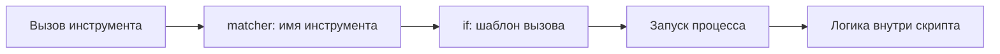

# Уровень 5: Хуки -- детерминированная автоматизация

## Введение

Представьте конвейер на заводе. На каждом этапе стоит датчик или механизм: один проверяет размер детали, другой наносит покрытие, третий отбраковывает дефектные изделия. Рабочий может ошибиться, забыть шаг или сделать его не так. Но автоматика на конвейере работает **каждый раз одинаково** -- это и есть детерминированность.

В Claude Code хуки выполняют ту же роль. CLAUDE.md говорит агенту: "Пожалуйста, форматируй код". Хук **гарантирует**, что код отформатируется -- независимо от того, "запомнил" ли агент инструкцию.

```
CLAUDE.md: "Всегда запускай линтер после редактирования" → агент может забыть
Хук PostToolUse(Edit): eslint --fix $FILE               → выполнится всегда
```

На этом уровне мы разберём:
1. Как настроить хуки в `settings.json`
2. Пять типов хуков и когда какой использовать
3. Все события жизненного цикла
4. Matchers, фильтрацию и управление потоком
5. Практические паттерны для реальных проектов

---

## 1. Конфигурация хуков

Хуки настраиваются в секции `hooks` файла `settings.json`. Есть два уровня конфигурации:

| Файл | Область действия |
|---|---|
| `~/.claude/settings.json` | Глобально -- для всех проектов |
| `.claude/settings.json` | Локально -- только для текущего проекта |

Проектные хуки **дополняют** глобальные, а не заменяют их. Если один и тот же matcher определён на обоих уровнях, выполняются оба набора хуков.

### Базовая структура

```json
{
  "hooks": {
    "PreToolUse": [
      {
        "matcher": "Write|Edit",
        "hooks": [
          {
            "type": "command",
            "command": "bash .claude/hooks/validate-write.sh",
            "timeout": 30
          }
        ]
      }
    ],
    "PostToolUse": [
      {
        "matcher": "Edit",
        "hooks": [
          {
            "type": "command",
            "command": "prettier --write $FILE",
            "timeout": 15
          }
        ]
      }
    ]
  }
}
```

Каждая запись содержит:
- **matcher** -- regex для фильтрации по имени инструмента
- **hooks** -- массив хуков, которые выполняются при совпадении
- Каждый хук имеет **type**, специфичные для типа поля и опциональный **timeout**

---

## 2. Пять типов хуков

### Command -- запуск shell-команды

Самый распространённый тип. Запускает произвольную команду в терминале:

```json
{
  "type": "command",
  "command": "prettier --write $FILE",
  "timeout": 15
}
```

Команда получает данные о событии через **stdin** в формате JSON. Результат определяется exit code и опциональным JSON на stdout.

Когда использовать: форматирование, линтинг, валидация файлов, нотификации, аудит-логи.

### Prompt -- анализ с помощью LLM

Отправляет промпт самому Claude для "внутренней" проверки:

```json
{
  "type": "prompt",
  "prompt": "Проверь, безопасна ли эта bash-команда: $TOOL_INPUT. Проверь: деструктивные операции, удаление данных, доступ к секретам.",
  "timeout": 20
}
```

Когда использовать: семантический анализ, который нельзя выразить регулярными выражениями. Например, "эта SQL-команда безопасна?" или "этот код не содержит секретов?".

### HTTP -- внешний вебхук

Отправляет HTTP-запрос на указанный URL:

```json
{
  "type": "http",
  "url": "https://hooks.slack.com/services/XXX/YYY/ZZZ",
  "method": "POST",
  "timeout": 10
}
```

Когда использовать: интеграция с внешними системами -- Slack-нотификации, аудит-системы, CI/CD-триггеры.

### MCP tool -- вызов инструмента MCP-сервера

Вызывает инструмент на уже подключённом [MCP-сервере](../06-mcp-servers/README.md). Текстовый вывод инструмента обрабатывается так же, как stdout command-хука:

```json
{
  "type": "mcp_tool",
  "server": "audit-system",
  "tool": "log_event",
  "timeout": 15
}
```

Когда использовать: нужное действие уже реализовано как MCP-инструмент. Вместо того чтобы писать shell-скрипт, который дёргает тот же API через `curl`, вы переиспользуете существующую интеграцию -- с её аутентификацией и обработкой ошибок.

Это ровно тот случай, когда два механизма Claude Code складываются: MCP даёт агенту инструменты, а хуки позволяют вызывать эти же инструменты детерминированно, без участия модели.

### Agent -- запуск субагента

Запускает специализированного субагента для сложной проверки:

```json
{
  "type": "agent",
  "agent": "security-checker",
  "timeout": 60
}
```

Когда использовать: многошаговая проверка, где нужно прочитать несколько файлов и принять решение на основе контекста.

⚠️ Agent-хуки помечены как экспериментальные -- их поведение и формат могут измениться. Для критичной автоматики надёжнее `command`.

---

## 3. События жизненного цикла

### Полная схема событий


*Claude может вызвать несколько инструментов за один ответ.

### Подробное описание событий

**SessionStart** -- сессия начинается. Хорош для загрузки контекста, проверки окружения:

```json
{
  "matcher": ".*",
  "hooks": [{
    "type": "command",
    "command": "bash .claude/hooks/load-env.sh",
    "timeout": 10
  }]
}
```

**UserPromptSubmit** -- пользователь отправил сообщение. Можно валидировать или трансформировать запрос до того, как Claude начнёт работать.

**PreToolUse** -- перед вызовом инструмента. Самое важное событие -- здесь можно **заблокировать** опасные действия:

```json
{
  "matcher": "Bash",
  "hooks": [{
    "type": "command",
    "command": "bash .claude/hooks/block-dangerous-commands.sh",
    "timeout": 5
  }]
}
```

**PostToolUse** -- после выполнения инструмента. Идеально для пост-обработки: форматирование, уведомления.

**Stop** -- Claude закончил ответ. Можно запустить финальные проверки, обновить статус.

**SubagentStart / SubagentStop** -- жизненный цикл субагентов. Полезно для мониторинга.

**FileChanged / CwdChanged** -- изменение файла или рабочей директории. Позволяет реагировать на внешние изменения:

```json
{
  "matcher": "CwdChanged",
  "hooks": [{
    "type": "command",
    "command": "bash .claude/hooks/reload-project-context.sh",
    "timeout": 10
  }]
}
```

### Полный набор событий

События выше -- те, с которых начинают. Всего их больше тридцати, и они покрывают почти весь жизненный цикл сессии, а не только вызовы инструментов. Держать в голове весь список не нужно, но полезно знать, какие группы существуют -- чтобы не писать костыль там, где есть готовое событие:

| Группа | События |
|---|---|
| Сессия | `SessionStart`, `SessionEnd`, `Setup` |
| Промпт | `UserPromptSubmit`, `UserPromptExpansion` |
| Инструменты | `PreToolUse`, `PostToolUse`, `PostToolUseFailure`, `PostToolBatch` |
| Разрешения | `PermissionRequest`, `PermissionDenied` |
| Ход диалога | `Stop`, `StopFailure`, `Notification`, `MessageDisplay` |
| Субагенты и команды | `SubagentStart`, `SubagentStop`, `TeammateIdle` |
| Задачи | `TaskCreated`, `TaskCompleted` |
| Контекст | `PreCompact`, `PostCompact`, `InstructionsLoaded` |
| Окружение | `ConfigChange`, `CwdChanged`, `FileChanged` |
| Worktrees | `WorktreeCreate`, `WorktreeRemove` |
| MCP-элицитация | `Elicitation`, `ElicitationResult` |

Две пары, которые чаще всего упускают:

- **`PostToolUse` срабатывает только при успехе.** Если нужно реагировать на упавшие команды -- это `PostToolUseFailure`, отдельное событие.
- **`InstructionsLoaded`** срабатывает при загрузке CLAUDE.md и файлов `.claude/rules/`, в том числе при ленивой подгрузке в середине сессии. Удобно для аудита: какие инструкции реально попали в контекст.

Список пополняется -- сверяйтесь с документацией.

---

## 4. Matchers и фильтрация

### Regex-паттерны

Matcher -- это регулярное выражение, которое проверяется против имени инструмента:

```json
"matcher": "Edit|Write"        // Любое редактирование файлов
"matcher": "Bash"              // Только терминальные команды
"matcher": ".*"                // Любой инструмент (осторожно!)
"matcher": "Read"              // Только чтение файлов
```

### Поле `if` -- фильтр до запуска процесса

Между «грубым» matcher'ом и «тонкой» логикой внутри скрипта есть промежуточный уровень -- поле `if`. Оно использует синтаксис правил разрешений:

```json
{
  "matcher": "Bash",
  "if": "Bash(git push*)",
  "hooks": [{
    "type": "command",
    "command": "bash .claude/hooks/guard-push.sh",
    "timeout": 10
  }]
}
```

```json
{
  "matcher": "Edit|Write",
  "if": "Edit(*.ts)",
  "hooks": [{
    "type": "command",
    "command": "npx tsc --noEmit",
    "timeout": 60
  }]
}
```

Ключевое отличие от проверки внутри скрипта: **если `if` не совпал, процесс не запускается вообще**. Хук на `Bash` без `if` стартует новый процесс на каждую команду -- включая безобидные `ls` и `git status`. С `if` этого не происходит.



Правило простое: чем раньше отсеяли, тем дешевле.

⚠️ Две ловушки:

- `if` вычисляется **только** на событиях инструментов: `PreToolUse`, `PostToolUse`, `PostToolUseFailure`, `PermissionRequest`, `PermissionDenied`. На любом другом событии хук с заданным `if` не сработает никогда -- это тихая ошибка конфигурации.
- Синтаксис здесь -- правила разрешений, а не regex. `Bash(git push*)` -- это шаблон разрешений, тогда как `matcher` рядом с ним -- регулярное выражение. Не перепутайте.

### Тонкая фильтрация внутри скрипта

Matcher и `if` отфильтровывают по инструменту и шаблону вызова, но иногда нужна логика, которую шаблоном не выразить. Данные о вызове приходят на stdin скрипта в JSON:

```bash
#!/bin/bash
input=$(cat)
tool_name=$(echo "$input" | jq -r '.tool_name')
command=$(echo "$input" | jq -r '.tool_input.command // empty')
file_path=$(echo "$input" | jq -r '.tool_input.file_path // empty')

# Блокируем git push --force
if [[ "$command" =~ git\ push.*--force ]]; then
  echo '{"hookSpecificOutput":{"permissionDecision":"deny"},"systemMessage":"Force push заблокирован хуком безопасности"}'
  exit 0
fi

# Защищаем .env файлы от редактирования
if [[ "$file_path" =~ \.env ]]; then
  echo '{"hookSpecificOutput":{"permissionDecision":"deny"},"systemMessage":"Редактирование .env файлов запрещено"}'
  exit 0
fi

exit 0
```

### Многоуровневая валидация

Можно комбинировать несколько хуков для одного matcher -- быстрый command-хук для простых проверок и prompt-хук для глубокого анализа:

```json
{
  "matcher": "Bash",
  "hooks": [
    {
      "type": "command",
      "command": "bash .claude/hooks/quick-check.sh",
      "timeout": 5
    },
    {
      "type": "prompt",
      "prompt": "Глубокий анализ bash-команды: $TOOL_INPUT",
      "timeout": 15
    }
  ]
}
```

---

## 5. Входные и выходные данные

### Что приходит на stdin

Для `PreToolUse` и `PostToolUse` хук получает JSON с информацией о вызове:

```json
{
  "tool_name": "Edit",
  "tool_input": {
    "file_path": "/src/components/App.tsx",
    "old_string": "const x = 1",
    "new_string": "const x = 2"
  }
}
```

### Что можно вернуть на stdout

**Решение о разрешении (PreToolUse):**

```json
{
  "hookSpecificOutput": {
    "permissionDecision": "allow"
  }
}
```

Значения `permissionDecision`: `allow`, `deny`, `ask` (спросить пользователя).

**Модификация входных данных:**

```json
{
  "hookSpecificOutput": {
    "permissionDecision": "allow",
    "updatedInput": {
      "command": "npm test -- --coverage"
    }
  }
}
```

**Инъекция контекста в Claude:**

```json
{
  "additionalContext": "Этот файл -- часть системы биллинга. Любые изменения требуют особой осторожности.",
  "systemMessage": "Файл находится в критической зоне"
}
```

### Exit codes

| Code | Значение | Поведение |
|---|---|---|
| `0` | Успех | Инструмент выполняется (если нет deny в JSON) |
| `2` | Блокировка | Инструмент НЕ выполняется |
| Другие | Ошибка хука | Хук игнорируется, инструмент выполняется |

---

## 6. Практические паттерны

### Автоформатирование после редактирования

```json
{
  "PostToolUse": [{
    "matcher": "Edit|Write",
    "hooks": [{
      "type": "command",
      "command": "prettier --write $FILE",
      "timeout": 15
    }]
  }]
}
```

### Защита критических файлов

```bash
#!/bin/bash
# .claude/hooks/protect-files.sh
input=$(cat)
file=$(echo "$input" | jq -r '.tool_input.file_path // empty')

PROTECTED_FILES=(".env" "package-lock.json" "yarn.lock" "docker-compose.prod.yml")

for protected in "${PROTECTED_FILES[@]}"; do
  if [[ "$file" == *"$protected"* ]]; then
    echo "{\"hookSpecificOutput\":{\"permissionDecision\":\"deny\"},\"systemMessage\":\"Файл $protected защищён от редактирования\"}"
    exit 0
  fi
done

exit 0
```

### Аудит-лог всех действий

```bash
#!/bin/bash
# .claude/hooks/audit.sh
input=$(cat)
tool=$(echo "$input" | jq -r '.tool_name')
timestamp=$(date -u +"%Y-%m-%dT%H:%M:%SZ")

echo "$timestamp | $tool | $(echo "$input" | jq -c '.tool_input')" >> .claude/audit.log
exit 0
```

### Нотификация в Slack при завершении задачи

```json
{
  "Stop": [{
    "matcher": ".*",
    "hooks": [{
      "type": "http",
      "url": "https://hooks.slack.com/services/XXX/YYY/ZZZ",
      "method": "POST",
      "timeout": 10
    }]
  }]
}
```

### Автозагрузка контекста при смене директории

```bash
#!/bin/bash
# .claude/hooks/reload-env.sh
new_cwd=$(cat | jq -r '.new_cwd // empty')

if [ -f "$new_cwd/.env" ]; then
  echo "{\"additionalContext\":\"Обнаружен .env файл в новой директории. Переменные: $(grep -v '^#' "$new_cwd/.env" | cut -d= -f1 | tr '\n' ', ')\"}"
fi

exit 0
```

---

## 7. Отладка хуков

### Логирование для отладки

Добавьте логирование в скрипт хука:

```bash
#!/bin/bash
input=$(cat)
echo "[DEBUG] $(date) Hook triggered" >> /tmp/claude-hooks.log
echo "[DEBUG] Input: $input" >> /tmp/claude-hooks.log

# ... логика хука ...

echo "[DEBUG] Exit code: 0" >> /tmp/claude-hooks.log
exit 0
```

### Тестирование хука вручную

```bash
# Симулируем вызов хука
echo '{"tool_name":"Bash","tool_input":{"command":"rm -rf /"}}' | bash .claude/hooks/block-dangerous.sh
echo $?  # Проверяем exit code
```

### Частые проблемы

| Симптом | Причина | Решение |
|---|---|---|
| Хук не срабатывает | Неверный matcher | Проверьте regex: `Edit\|Write` vs `Edit|Write` |
| Хук зависает | Нет timeout | Добавьте `"timeout": 30` |
| Хук блокирует всё | Exit code 2 без условий | Добавьте проверку перед `exit 2` |
| additionalContext не работает | Невалидный JSON | Проверьте экранирование в echo |

---

## ⚠️ Частые ошибки новичков

### 🐛 1. Хук без timeout

```json
// ❌ Зависший процесс заблокирует всю сессию
{ "type": "command", "command": "npm test" }

// ✅ Timeout ограничивает время выполнения
{ "type": "command", "command": "npm test", "timeout": 60 }
```

> **Почему это проблема:** если команда зависнет (сетевой таймаут, бесконечный цикл), Claude Code не сможет продолжить работу, пока не убьёт процесс. Без timeout это может длиться бесконечно.

### 🐛 2. Забытый exit code

```bash
# ❌ Скрипт завершается с кодом последней команды -- непредсказуемо
echo "check passed"
grep "something" file.txt  # Если не найдёт, exit code = 1

# ✅ Явный exit code в конце
echo "check passed"
grep "something" file.txt || true
exit 0
```

> **Почему это проблема:** exit code скрипта определяет, разрешён ли инструмент. Случайный ненулевой код может привести к неожиданной блокировке или ошибке.

### 🐛 3. Тяжёлый хук на каждый инструмент

```json
// ❌ npm test на каждый вызов ЛЮБОГО инструмента
{ "matcher": ".*", "hooks": [{ "type": "command", "command": "npm test", "timeout": 120 }] }

// ✅ Только после записи файлов
{ "matcher": "Edit|Write", "hooks": [{ "type": "command", "command": "npm test", "timeout": 120 }] }
```

> **Почему это проблема:** Claude может вызывать десятки инструментов за одну задачу (Read, Glob, Grep, Edit...). Тяжёлый хук на `.*` превратит секундную операцию в минутную.

### 🐛 4. JSON в stdout с ошибками

```bash
# ❌ Невалидный JSON -- кавычки не экранированы
echo '{"systemMessage": "Файл "опасный" заблокирован"}'

# ✅ Используйте jq для формирования JSON
echo '{}' | jq --arg msg "Файл \"опасный\" заблокирован" '.systemMessage = $msg'
```

### 🐛 5. Хук, который ломает workflow

```bash
# ❌ Хук модифицирует файл, но Claude не знает об этом
prettier --write "$FILE"
# Claude продолжает работать со старым содержимым в памяти

# ✅ Добавляем контекст, чтобы Claude перечитал файл
prettier --write "$FILE"
echo "{\"additionalContext\":\"Файл $FILE был автоматически отформатирован. Перечитай его при необходимости.\"}"
exit 0
```

---

## 📌 Итоги

- ✅ Хуки -- детерминированная автоматизация, в отличие от "рекомендаций" в CLAUDE.md
- ✅ Пять типов: command, http, mcp_tool, prompt, agent -- от простого к сложному
- ✅ Ключевые события: PreToolUse (блокировка), PostToolUse (пост-обработка), Stop (завершение)
- ✅ Matchers -- regex для фильтрации по инструменту, скрипты -- для тонкой логики
- ✅ Exit code 0 = разрешить, 2 = заблокировать
- ✅ additionalContext позволяет инжектировать информацию в контекст Claude
- ✅ Всегда ставьте timeout и явный exit code
- ✅ Используйте точные matchers, а не `.*`
