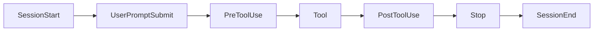

# Level 5: Hooks -- Deterministic Automation

## 🎯 The Problem: Recommendation vs. Guarantee

CLAUDE.md is an instruction for the agent. But the agent can forget, misinterpret, or ignore it in a complex context. A hook is **code that runs automatically** on specific events. The difference is like a "Wash your hands" sign versus an automatic soap dispenser at the entrance to an operating room.

```
CLAUDE.md: "Please format the code after editing"  -- recommendation
PostToolUse(Edit) hook: prettier --write $file      -- guarantee
```

---

## 🔥 Hook Configuration

Hooks are configured in `settings.json` (`.claude/settings.json` for a project or `~/.claude/settings.json` globally):

```json
{
  "hooks": {
    "PreToolUse": [
      {
        "matcher": "Edit|Write",
        "hooks": [
          {
            "type": "command",
            "command": "bash .claude/hooks/validate.sh",
            "timeout": 30
          }
        ]
      }
    ]
  }
}
```

---

## 🔥 Five Types of Hooks

| Type | What it does | When to use |
|---|---|---|
| **command** | Runs a shell command | Formatting, validation, notifications |
| **http** | Sends an HTTP request | External webhooks, auditing |
| **mcp_tool** | Calls a tool on a connected MCP server | Integration with an external system without a wrapper script |
| **prompt** | Sends a prompt to the LLM for analysis | Deep security analysis |
| **agent** | Launches a subagent | Complex multi-step verification |

`command` covers the vast majority of tasks. `mcp_tool` is useful when the action you need already exists as a tool on an MCP server -- no need to write a shell wrapper. `agent` is marked experimental and may change.

---

## 🔥 Lifecycle Events



**Core events:**

| Event | When it fires |
|---|---|
| `PreToolUse` | Before a tool is called (Edit, Bash, Write...) |
| `PostToolUse` | After a tool **successfully** completes |
| `PostToolUseFailure` | After a **failed** tool call |
| `UserPromptSubmit` | The user submitted a message |
| `Stop` | Claude finished a response |
| `SubagentStart` / `SubagentStop` | Subagent lifecycle |
| `SessionStart` / `SessionEnd` | Start and end of a session |

These are the events you start with, but there are more than thirty in total. It's useful to know that at least these also exist:

| Event | When it fires |
|---|---|
| `PermissionRequest` / `PermissionDenied` | A permission request appears / a call is denied |
| `PreCompact` / `PostCompact` | Before and after context compaction |
| `InstructionsLoaded` | CLAUDE.md or a `.claude/rules/` file is loaded |
| `FileChanged` | A tracked file changed on disk |
| `CwdChanged` | The working directory changed (e.g., the agent ran `cd`) |
| `TaskCreated` / `TaskCompleted` | A task was created / marked complete |
| `WorktreeCreate` / `WorktreeRemove` | Creation and removal of a worktree |

The point is that hooks cover almost the entire lifecycle, not just tool calls. See the docs for the full, ever-growing list.

---

## 🔥 Matchers and Filtering

A matcher is a regex that determines **which tool** the hook fires for:

```json
{
  "matcher": "Edit|Write",
  "hooks": [{ "type": "command", "command": "prettier --write $FILE" }]
}
```

```json
{
  "matcher": "Bash",
  "hooks": [{ "type": "command", "command": "bash .claude/hooks/audit-bash.sh" }]
}
```

### The `if` Field -- a Filter Before the Process Starts

`matcher` selects by tool name, but often you need more precision: not "any Bash", but "only `git push`". That's what the `if` field is for, using permission-rule syntax:

```json
{
  "matcher": "Bash",
  "if": "Bash(git push*)",
  "hooks": [{ "type": "command", "command": "bash .claude/hooks/guard-push.sh" }]
}
```

The difference from filtering inside the script is fundamental: if `if` doesn't match, the process **never starts at all**. For a hook on every Bash call, this is a significant saving.

⚠️ `if` is only evaluated on tool-related events (`PreToolUse`, `PostToolUse`, `PostToolUseFailure`, `PermissionRequest`, `PermissionDenied`). On any other event, a hook with `if` set will never fire.

When the `if` filter isn't enough, parse the input inside the script -- it arrives as JSON on stdin:

```bash
#!/bin/bash
input=$(cat)
command=$(echo "$input" | jq -r '.tool_input.command')

# Block dangerous git commands
if [[ "$command" =~ git\ (push|reset|rebase) ]]; then
  echo '{"hookSpecificOutput":{"permissionDecision":"deny"}}'
  exit 0
fi
exit 0  # Allow everything else
```

---

## 🔥 Exit Codes and Flow Control

| Exit code | Meaning |
|---|---|
| `0` | Allow -- the tool runs |
| `2` | Deny -- the tool does NOT run |

A hook can also return JSON with `additionalContext` -- this injects context directly into Claude:

```bash
echo '{"additionalContext": "Warning: this file contains sensitive data. Do not log its contents."}'
exit 0
```

---

## 📌 Practical Patterns

**Auto-format after editing:**
```json
{ "matcher": "Edit|Write", "hooks": [{ "type": "command", "command": "prettier --write $FILE" }] }
```

**Protecting critical files:**
```json
{ "matcher": "Edit|Write", "hooks": [{ "type": "command", "command": "bash .claude/hooks/protect-files.sh" }] }
```

**Reloading the environment on directory change:**
```json
{ "matcher": "CwdChanged", "hooks": [{ "type": "command", "command": "bash .claude/hooks/reload-env.sh" }] }
```

---

## ⚠️ Common Beginner Mistakes

### 🐛 A Hook Without a Timeout

```json
❌  { "type": "command", "command": "npm test" }
✅  { "type": "command", "command": "npm test", "timeout": 60 }
```

Without a timeout, a hung process will block the entire session.

### 🐛 Forgotten Exit Code

```bash
# ❌ The script doesn't return a code -- behavior is unpredictable
echo "checked"

# ✅ Explicit exit code
echo "checked"
exit 0
```

### 🐛 A Hook on Everything

```json
❌  { "matcher": ".*", "hooks": [{ "type": "command", "command": "heavy-check.sh" }] }
```

A hook on every tool will slow work down. Use precise matchers.
