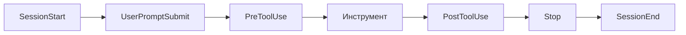

# Уровень 5: Хуки -- детерминированная автоматизация

## 🎯 Проблема: рекомендация vs гарантия

CLAUDE.md -- это инструкция для агента. Но агент может забыть, неправильно интерпретировать или проигнорировать её в сложном контексте. Хук -- это **код, который выполняется автоматически** при определённых событиях. Разница как между табличкой "Мойте руки" и автоматическим дозатором мыла при входе в операционную.

```
CLAUDE.md: "Пожалуйста, форматируй код после редактирования"  -- рекомендация
Хук PostToolUse(Edit): prettier --write $file               -- гарантия
```

---

## 🔥 Конфигурация хуков

Хуки настраиваются в `settings.json` (`.claude/settings.json` для проекта или `~/.claude/settings.json` глобально):

```json
{
  "hooks": {
    "PreToolUse": [
      {
        "matcher": "Edit|Write",
        "hooks": [
          {
            "type": "command",
            "command": "bash .claude/hooks/validate.sh",
            "timeout": 30
          }
        ]
      }
    ]
  }
}
```

---

## 🔥 Четыре типа хуков

| Тип | Что делает | Когда использовать |
|---|---|---|
| **command** | Запускает shell-команду | Форматирование, валидация, нотификации |
| **prompt** | Отправляет промпт LLM для анализа | Глубокий анализ безопасности |
| **http** | Отправляет HTTP-запрос | Внешние вебхуки, аудит |
| **agent** | Запускает субагента | Сложная многошаговая проверка |

---

## 🔥 События жизненного цикла



**Основные события:**

| Событие | Когда срабатывает |
|---|---|
| `PreToolUse` | Перед вызовом инструмента (Edit, Bash, Write...) |
| `PostToolUse` | После выполнения инструмента |
| `UserPromptSubmit` | Пользователь отправил сообщение |
| `Stop` | Claude закончил ответ |
| `SubagentStart` / `SubagentStop` | Жизненный цикл субагента |
| `SessionStart` / `SessionEnd` | Начало и конец сессии |

---

## 🔥 Matchers и фильтрация

Matcher -- это regex, который определяет, **для какого инструмента** срабатывает хук:

```json
{
  "matcher": "Edit|Write",
  "hooks": [{ "type": "command", "command": "prettier --write $FILE" }]
}
```

```json
{
  "matcher": "Bash",
  "hooks": [{ "type": "command", "command": "bash .claude/hooks/audit-bash.sh" }]
}
```

Внутри скрипта можно фильтровать тоньше -- входные данные приходят как JSON на stdin:

```bash
#!/bin/bash
input=$(cat)
command=$(echo "$input" | jq -r '.tool_input.command')

# Блокируем опасные git-команды
if [[ "$command" =~ git\ (push|reset|rebase) ]]; then
  echo '{"hookSpecificOutput":{"permissionDecision":"deny"}}'
  exit 0
fi
exit 0  # Разрешаем остальное
```

---

## 🔥 Exit codes и управление потоком

| Exit code | Значение |
|---|---|
| `0` | Разрешить (allow) -- инструмент выполняется |
| `2` | Заблокировать (deny) -- инструмент НЕ выполняется |

Хук может также вернуть JSON с `additionalContext` -- это инъекция контекста прямо в Claude:

```bash
echo '{"additionalContext": "Внимание: этот файл содержит конфиденциальные данные. Не логируй содержимое."}'
exit 0
```

---

## 📌 Практические паттерны

**Автоформатирование после редактирования:**
```json
{ "matcher": "Edit|Write", "hooks": [{ "type": "command", "command": "prettier --write $FILE" }] }
```

**Защита критических файлов:**
```json
{ "matcher": "Edit|Write", "hooks": [{ "type": "command", "command": "bash .claude/hooks/protect-files.sh" }] }
```

**Перезагрузка окружения при смене директории:**
```json
{ "matcher": "CwdChanged", "hooks": [{ "type": "command", "command": "bash .claude/hooks/reload-env.sh" }] }
```

---

## ⚠️ Частые ошибки новичков

### 🐛 Хук без timeout

```json
❌  { "type": "command", "command": "npm test" }
✅  { "type": "command", "command": "npm test", "timeout": 60 }
```

Без timeout зависший процесс заблокирует всю сессию.

### 🐛 Забыли exit code

```bash
# ❌ Скрипт не возвращает код -- поведение непредсказуемо
echo "checked"

# ✅ Явный exit code
echo "checked"
exit 0
```

### 🐛 Хук на всё подряд

```json
❌  { "matcher": ".*", "hooks": [{ "type": "command", "command": "heavy-check.sh" }] }
```

Хук на каждый инструмент замедлит работу. Используйте точные matchers.
