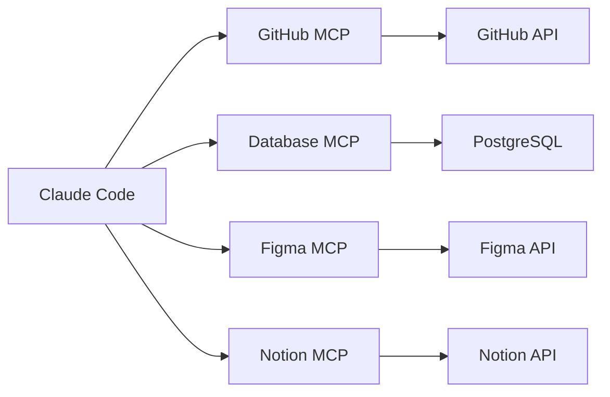

# Level 6: MCP Servers -- External Integrations

## 🎯 What is MCP

Model Context Protocol (MCP) is a standard for connecting **external tools** to an agent. Think of Claude Code as a smartphone: out of the box it can make calls and send messages, while MCP servers are apps from a store that add new capabilities: working with GitHub, databases, Figma, Notion, and anything else.



Without MCP: Claude Code can work with files, the terminal, and Git.
With MCP: Claude Code gets access to **any** external service.

---

## 🔥 Four Transports

| Transport | `type` | How it works | When to use |
|---|---|---|---|
| **stdio** | `stdio` | A local process, communicating via stdin/stdout | Most cases |
| **HTTP** | `http` | A remote URL, request-response | Hosted servers, corporate |
| **WebSocket** | `ws` | A persistent bidirectional connection | The server pushes events itself |
| **SSE** | `sse` | ⚠️ **Deprecated** | Don't use in new configurations |

In 90% of cases you'll use **stdio** -- Claude Code launches a process locally and communicates with it via stdin/stdout.

⚠️ **SSE is marked as deprecated.** The documentation explicitly recommends HTTP instead. If you see `"type": "sse"` in someone else's config, that's legacy -- migrate to `http` when possible.

WebSocket is needed in a narrow case: the server must push events itself, without being asked. If the server just responds to requests, use HTTP -- it supports OAuth and the `claude mcp add --transport` flag, while WebSocket supports neither.

---

## 🔥 Configuration

MCP servers are configured in the `.mcp.json` file:

```json
{
  "mcpServers": {
    "github": {
      "type": "stdio",
      "command": "npx",
      "args": ["@modelcontextprotocol/server-github"],
      "env": {
        "GITHUB_TOKEN": "$GITHUB_TOKEN"
      }
    }
  }
}
```

### Configuration Scopes

| Scope | Location | Goes into git? |
|---|---|---|
| **project** | `.mcp.json` in the **project root** | Yes, that's its purpose |
| **user / local** | `~/.claude.json` | No |

The project's `.mcp.json` lives in the repository root and gets committed -- the whole team gets the same set of servers. On first run, Claude Code will ask for confirmation before using servers from someone else's repository.

⚠️ A common mistake is looking for the config at `~/.claude/.mcp.json`. That path **does not exist**, Claude Code doesn't read it. User-level servers live in `~/.claude.json` under the `mcpServers` key, and the correct way to add them is with the command:

```bash
claude mcp add --scope user github npx @modelcontextprotocol/server-github
```

---

## 🔥 Environment Variables

Values with `$` are substituted from the environment, not hardcoded:

```json
{
  "mcpServers": {
    "database": {
      "type": "stdio",
      "command": "python",
      "args": ["-m", "mcp_server_db"],
      "env": {
        "DATABASE_URL": "$DATABASE_URL",
        "DB_USER": "$DB_USER",
        "DB_PASSWORD": "$DB_PASSWORD"
      }
    }
  }
}
```

💡 Never hardcode tokens and passwords in `.mcp.json` -- use environment variables.

---

## 🔥 Popular MCP Servers

| Server | What it provides |
|---|---|
| **GitHub** | Working with PRs, issues, code review |
| **PostgreSQL / MySQL** | Database queries |
| **Grafana** | Metrics, dashboards, alerts |
| **Figma** | Design tokens, components |
| **Notion** | Documentation, tasks |
| **Slack** | Messages, channels |
| **Context7** | Up-to-date library documentation |

---

## 🔥 Authentication

Three approaches to MCP server authentication:

**1. Environment variables (stdio):**
```json
{ "env": { "API_KEY": "$MY_API_KEY" } }
```

**2. OAuth (for hosted servers):**
Claude Code supports an OAuth flow for remote MCP servers -- tokens refresh automatically.

**3. Fixed tokens:**
Passed via headers or environment variables.

---

## 📌 Managed MCP for Organizations

In a corporate environment, administrators manage which MCP servers are available:

- **Allowlist** -- only approved servers can connect
- **Denylist** -- prohibited servers are blocked
- Centralized configuration through the Admin Console

---

## ⚠️ Common Beginner Mistakes

### 🐛 A Token Right in the Config

```json
❌  { "env": { "GITHUB_TOKEN": "ghp_abc123secret" } }
✅  { "env": { "GITHUB_TOKEN": "$GITHUB_TOKEN" } }
```

The config gets into git -- the token will leak. Always use environment variables.

### 🐛 Forgot to Install the Package

```bash
# ❌ MCP server not found
# Error: Cannot find module '@modelcontextprotocol/server-github'

# ✅ For npx servers, the package downloads automatically,
# but Python servers need explicit installation:
pip install mcp-server-db
```

### 🐛 Didn't Export the Environment Variable

```bash
# ❌ The variable isn't visible to child processes
GITHUB_TOKEN=ghp_abc123

# ✅ export makes the variable available to the MCP server
export GITHUB_TOKEN=ghp_abc123
```
