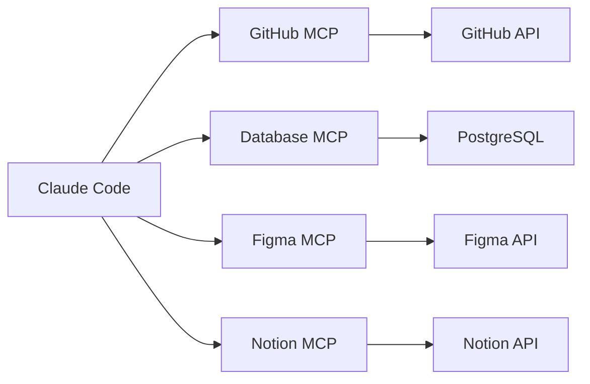

# Уровень 6: MCP-серверы -- внешние интеграции

## 🎯 Что такое MCP

Model Context Protocol (MCP) -- это стандарт подключения **внешних инструментов** к агенту. Представьте Claude Code как смартфон: из коробки он умеет звонить и писать сообщения, а MCP-серверы -- это приложения из магазина, которые добавляют новые возможности: работу с GitHub, базами данных, Figma, Notion и чем угодно ещё.



Без MCP: Claude Code умеет работать с файлами, терминалом и Git.
С MCP: Claude Code получает доступ к **любому** внешнему сервису.

---

## 🔥 Три транспорта

| Транспорт | Как работает | Когда использовать |
|---|---|---|
| **stdio** | Локальный процесс, общение через stdin/stdout | Большинство случаев |
| **HTTP** | Удалённый URL, запрос-ответ | Hosted-серверы, корпоративные |
| **SSE** | Streaming через Server-Sent Events | Долгие операции, real-time |

В 90% случаев вы будете использовать **stdio** -- Claude Code запускает процесс локально и общается с ним через stdin/stdout.

---

## 🔥 Конфигурация

MCP-серверы настраиваются в файле `.mcp.json`:

```json
{
  "mcpServers": {
    "github": {
      "type": "command",
      "command": "npx",
      "args": ["@modelcontextprotocol/server-github"],
      "env": {
        "GITHUB_TOKEN": "$GITHUB_TOKEN"
      }
    }
  }
}
```

### Скоупы конфигурации

| Файл | Область | Кто использует |
|---|---|---|
| `~/.claude/.mcp.json` | Глобально для пользователя | Персональные инструменты |
| `.claude/.mcp.json` | Конкретный проект | Инструменты проекта |

Проектная конфигурация переопределяет глобальную для одноимённых серверов.

---

## 🔥 Переменные окружения

Значения с `$` подставляются из окружения, а не хардкодятся:

```json
{
  "mcpServers": {
    "database": {
      "type": "command",
      "command": "python",
      "args": ["-m", "mcp_server_db"],
      "env": {
        "DATABASE_URL": "$DATABASE_URL",
        "DB_USER": "$DB_USER",
        "DB_PASSWORD": "$DB_PASSWORD"
      }
    }
  }
}
```

💡 Никогда не хардкодьте токены и пароли в `.mcp.json` -- используйте переменные окружения.

---

## 🔥 Популярные MCP-серверы

| Сервер | Что даёт |
|---|---|
| **GitHub** | Работа с PR, issues, code review |
| **PostgreSQL / MySQL** | Запросы к базе данных |
| **Grafana** | Метрики, дашборды, алерты |
| **Figma** | Дизайн-токены, компоненты |
| **Notion** | Документация, задачи |
| **Slack** | Сообщения, каналы |
| **Context7** | Актуальная документация библиотек |

---

## 🔥 Аутентификация

Три подхода к аутентификации MCP-серверов:

**1. Переменные окружения (stdio):**
```json
{ "env": { "API_KEY": "$MY_API_KEY" } }
```

**2. OAuth (для hosted-серверов):**
Claude Code поддерживает OAuth-флоу для удалённых MCP-серверов -- токены обновляются автоматически.

**3. Фиксированные токены:**
Передаются через заголовки или переменные окружения.

---

## 📌 Managed MCP для организаций

В корпоративной среде администраторы управляют доступными MCP-серверами:

- **Allowlist** -- только одобренные серверы могут подключаться
- **Denylist** -- запрещённые серверы блокируются
- Централизованная конфигурация через Admin Console

---

## ⚠️ Частые ошибки новичков

### 🐛 Токен прямо в конфиге

```json
❌  { "env": { "GITHUB_TOKEN": "ghp_abc123secret" } }
✅  { "env": { "GITHUB_TOKEN": "$GITHUB_TOKEN" } }
```

Конфиг попадёт в git -- токен утечёт. Всегда используйте переменные окружения.

### 🐛 Забыли установить пакет

```bash
# ❌ MCP-сервер не найден
# Error: Cannot find module '@modelcontextprotocol/server-github'

# ✅ Для npx-серверов пакет скачивается автоматически,
# но для python-серверов нужна явная установка:
pip install mcp-server-db
```

### 🐛 Не экспортировали переменную окружения

```bash
# ❌ Переменная не видна дочерним процессам
GITHUB_TOKEN=ghp_abc123

# ✅ export делает переменную доступной для MCP-сервера
export GITHUB_TOKEN=ghp_abc123
```
