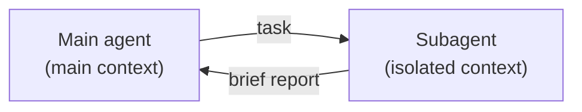
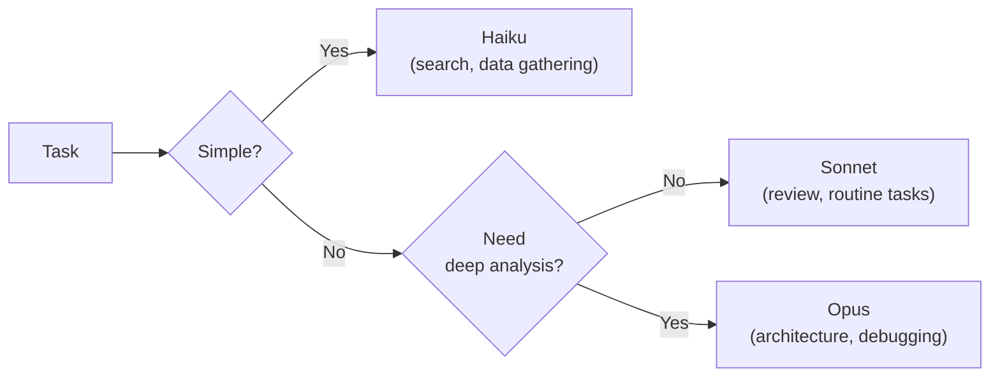

# Level 7: Subagents -- Delegating Tasks

## Introduction

Picture a restaurant's head chef. They don't chop vegetables, wash dishes, or take orders -- there's a dedicated person for each task. The head chef **delegates**, staying focused on what matters most: creating the dish. At the same time, each helper only sees their own part of the work: the line cook on the grill doesn't know what's happening in the pastry station.

Subagents in Claude Code work on the same principle. The main agent is the head chef. It delegates tasks to specialized subagents, each of which works **in an isolated context** with a **restricted set of tools**. The result comes back to the main agent in condensed form.

In this level we'll cover:
1. The context window problem and why subagents solve it
2. Creating and configuring subagents
3. Frontmatter parameters and their effects
4. Patterns: reviewer, researcher, debugger
5. Foreground and background modes
6. Worktrees for filesystem isolation
7. Model selection and cost optimization

---

## 1. The Context Window Problem

### Why Context is a Scarce Resource

Claude Code works with a fixed-size context window. Every file read, every command output, every message you send **takes up space** in that window. When the window fills up, the agent starts "forgetting" earlier parts of the conversation.

```
Context: [████████████████████░░░░░] 80% full

Problem: the agent read 50 files for research,
and now doesn't remember your original task.
```

### How Subagents Solve the Problem



Without subagents:
```
Main agent's context: [task + 50 files + analysis + solution]
→ context overflows, quality drops
```

With subagents:
```
Subagent's context:  [50 files + analysis] → discarded after the work is done
Main agent's context: [task + subagent's brief report + solution]
→ context stays clean, quality stays high
```

The subagent reads 50 files in **its own** context, produces a brief report, and returns it to the main agent. The main agent gets only the result -- its context stays clean.

---

## 2. Subagent Files

### Directory Structure

Subagents are described as markdown files in `.claude/agents/`:

```
.claude/
  agents/
    code-reviewer.md      # Code review
    research.md           # Codebase exploration
    debugger.md           # Debugging
    test-writer.md        # Writing tests
    doc-generator.md      # Documentation generation
```

### File Format

Each file consists of **frontmatter** (YAML metadata) and a **body** (markdown instructions):

```markdown
---
name: code-reviewer
description: Use this agent for code review -- it looks for bugs, performance issues, and style violations
tools: ["Read", "Glob", "Grep"]
model: sonnet
---

You are an experienced code reviewer with 10 years of experience.

## Your Task

Analyze the specified files and find:
1. **Bugs** -- logical errors, incorrect handling of edge cases
2. **Performance** -- O(n^2), unnecessary re-renders, memory leaks
3. **Style** -- deviations from the project's conventions

## Response Format

For each finding, specify:
- File and line
- Severity: critical / major / minor
- Description of the problem
- Suggested fix
```

---

## 3. Frontmatter Parameters

### name

```yaml
name: code-reviewer
```

The subagent's unique name. Used for invocation: "Run code-reviewer to check my changes."

### description

```yaml
description: Use for code review -- looks for bugs, performance issues
```

The description determines **when Claude automatically delegates** a task to this subagent. A good description contains keywords that let the main agent recognize when a task fits.

```yaml
# ❌ Poor description -- too general
description: Helps with code

# ✅ Good description -- specific triggers
description: Use for code review, when the user asks to check changes, find bugs, or assess code quality
```

### tools

```yaml
tools: ["Read", "Glob", "Grep"]
```

The list of tools available to the subagent. This is a **key security mechanism** -- the subagent can't do anything it isn't allowed to do.

| Tool set | Purpose |
|---|---|
| `["Read", "Glob", "Grep"]` | Read-only: review, research, audit |
| `["Read", "Glob", "Grep", "Edit", "Write"]` | Editing: refactoring, fixes |
| `["Read", "Glob", "Grep", "Bash"]` | Terminal: testing, debugging, building |
| `["Read", "Glob", "Grep", "Edit", "Write", "Bash"]` | Full access: complex tasks |

💡 **Principle of least privilege:** grant only the tools needed for the specific task. A reviewer shouldn't be able to edit files.

### model

```yaml
model: sonnet
```

The model the subagent uses:

| Model | Speed | Quality | Cost | When to use |
|---|---|---|---|---|
| **haiku** | Fast | Basic | Low | Search, gathering information, simple analysis |
| **sonnet** | Medium | Good | Medium | Reviews, analysis, routine tasks |
| **opus** | Slow | Best | High | Complex architecture, deep debugging |
| **inherit** | — | — | — | Same model as the main agent |

### context

```yaml
context: fork
```

Context mode:

- **fork** -- the subagent gets a copy of the main agent's current context (it sees the conversation history) and works in isolation. Changes to the subagent's context don't affect the main agent.

### hooks

A subagent can have its own hooks, independent of the main agent's hooks:

```yaml
hooks:
  PostToolUse:
    - matcher: "Edit"
      hooks:
        - type: command
          command: "prettier --write $FILE"
          timeout: 15
```

---

## 4. Subagent Patterns

### Code Reviewer -- Code Review

```markdown
---
name: reviewer
description: Code review -- invoke when changes need to be checked, bugs found, or quality assessed
tools: ["Read", "Glob", "Grep"]
model: sonnet
---

You are a strict but fair code reviewer.

## Process

1. Read the changed files
2. Check each file for:
   - Logical errors
   - Security issues (SQL injection, XSS, secret leaks)
   - Performance issues
   - Violations of project conventions
3. Produce a report

## Report Format

### Critical (blocking)
- [file:line] problem description → suggestion

### Major (serious)
- [file:line] problem description → suggestion

### Minor (small)
- [file:line] problem description → suggestion

### Positive
- What's good about this code
```

Key feature: **read-only tools**. The reviewer can only read, and can't accidentally change code.

### Research Agent -- Codebase Exploration

```markdown
---
name: researcher
description: Codebase exploration -- invoke when you need to understand a module's architecture or find all usages
tools: ["Read", "Glob", "Grep"]
model: haiku
---

You are a codebase researcher. Your task is to quickly understand the structure and return a brief, useful report.

## What You Do

1. Find all files related to the specified module
2. Read the key files (interfaces, exports, entry points)
3. Build a dependency map
4. Return a brief description

## Response Format

- **Module purpose:** one sentence
- **Key files:** a list with descriptions
- **Public API:** exported functions/classes
- **Dependencies:** which modules it depends on
- **Dependents:** which modules use this one
```

We use **Haiku** -- the task is simple (finding and reading files), an expensive model isn't needed.

### Debugger -- Focused Debugging

```markdown
---
name: debugger
description: Debugging errors -- invoke when you need to find the cause of a bug or reproduce an error
tools: ["Read", "Glob", "Grep", "Bash"]
model: sonnet
---

You are an experienced debugger. Act methodically.

## Process

1. **Reproduction:** run the code and confirm the bug
2. **Localization:** narrow down the search to a specific file/function
3. **Analysis:** find the root cause (not the symptom!)
4. **Proposal:** describe a fix with concrete code

## Important

- Don't propose a fix until you've reproduced the bug
- Look for the root cause, not a patch for the symptom
- Check edge cases: null, empty arrays, concurrency
```

The debugger has **Bash** -- it can run code and tests to reproduce bugs.

### Test Writer -- Writing Tests

```markdown
---
name: test-writer
description: Writing tests -- invoke when code needs test coverage
tools: ["Read", "Glob", "Grep", "Edit", "Write", "Bash"]
model: sonnet
---

You write tests. Study the existing tests in the project and follow the same patterns.

## Process

1. Study the code being tested and find existing tests as a style example
2. Determine which scenarios need coverage:
   - Happy path
   - Edge cases (null, empty values, boundaries)
   - Error cases (invalid input, network errors)
3. Write tests following the project's style
4. Run the tests and make sure they pass
```

Full tool set: the test writer needs to read, write, and run tests.

---

## 5. Foreground vs. Background

### Foreground -- Synchronous Execution

The main agent waits for the subagent to finish:

```
You: "Run reviewer to check my changes"
Claude: "Running code review..."
[reviewer works for 30 seconds]
Claude: "Here are the review results: ..."
```

Suitable for tasks whose result you need **immediately** -- a pre-commit review, finding a bug.

### Background -- Asynchronous Execution

The subagent works in parallel, the main agent continues the conversation:

```
You: "Run researcher in the background to study the auth module,
     while we keep working on the API controller"
Claude: "Researcher launched in the background. Let's work on the API."
[30 seconds later]
Claude: "Auth module research complete. Here's a brief report: ..."
```

Suitable for tasks that can be done in parallel.

### Parallel Research

The most powerful pattern -- launching **several subagents at once**:

```
You: "I need to understand the architecture. Launch background research
     on three modules: auth, billing, and notifications"

Claude launches 3 subagents in parallel:
  researcher-1 → auth module
  researcher-2 → billing module
  researcher-3 → notifications module

After 20 seconds, all three return reports.
The main agent synthesizes the overall picture.
```

Instead of reading 150 files sequentially (filling up the context), three agents read 50 each in parallel and each return a page of text.

---

## 6. Resuming Subagents

Background subagents can be **resumed** via SendMessage -- sending additional instructions to a running subagent:

```
You: "Auth researcher, add information about middleware to the report"
```

This lets you **refine the task** without restarting the subagent. The subagent keeps its context (files read, intermediate results) and builds on it.

---

## 7. Worktrees -- Filesystem Isolation

### The Problem

A regular subagent works in the same repository as the main agent. If the subagent edits files, those changes are visible to everyone, including you and other subagents. This can lead to conflicts.

### The Solution: Git Worktrees

A Git worktree is a **separate working copy** of the repository, tied to a different branch:

```bash
# Create a worktree for an experiment
git worktree add ../my-repo-experiment feature-branch

# Now there are two copies:
# /projects/my-repo               -- main (your work)
# /projects/my-repo-experiment    -- isolated (subagent's experiment)
```

### How This Works with Subagents

1. The subagent creates a worktree
2. It works in the isolated copy -- free to change files
3. If the experiment succeeds, it merges the changes into the main branch
4. If not, it removes the worktree, and the main code is untouched

```bash
# Remove the worktree after the work is done
git worktree remove ../my-repo-experiment
```

### When to Use Worktrees

| Scenario | Worktree needed? |
|---|---|
| Read-only research | No |
| Code review | No |
| Refactoring experiment | Yes |
| Two editing agents working in parallel | Yes |
| Prototyping an alternative solution | Yes |

---

## 8. Model Selection and Cost Optimization

### Model Selection Strategy



### Selection Examples

| Task | Model | Why |
|---|---|---|
| Find all files importing X | Haiku | Mechanical search |
| Describe a module's architecture | Haiku | Structured information gathering |
| Review a 10-file PR | Sonnet | Quality analysis needed |
| Find a subtle race condition | Opus | Complex logic, deep understanding needed |
| Design a data migration | Opus | Architectural decision |

### Cost Optimization

Rules that save your budget:

1. **Start with Haiku.** Upgrade the model only if quality is insufficient. Haiku is 20 times cheaper than Opus.

2. **Read-only subagents are cheaper.** A subagent that only reads files is faster and cheaper than one with write access.

3. **Precise tasks save tokens.** "Find all usages of AuthService in src/api/" instead of "Study the authorization module" -- fewer files read, fewer tokens.

4. **Parallel Haikus instead of one Opus.** Three fast Haiku researchers cost less than one Opus, while covering more ground.

---

## ⚠️ Common Beginner Mistakes

### 🐛 1. A Subagent with Full Permissions for a Read-Only Task

```yaml
# ❌ A reviewer with write access -- why?
name: reviewer
tools: ["Read", "Glob", "Grep", "Edit", "Write", "Bash"]

# ✅ The reviewer only reads
name: reviewer
tools: ["Read", "Glob", "Grep"]
```

> **Why this is a problem:** the principle of least privilege. A subagent with excess permissions can accidentally change files. Fewer tools means more predictable behavior.

### 🐛 2. Opus for Trivial Tasks

```yaml
# ❌ Opus for a simple search -- expensive and slow
name: file-finder
model: opus
tools: ["Read", "Glob", "Grep"]

# ✅ Haiku does just as well, but 20 times cheaper
name: file-finder
model: haiku
tools: ["Read", "Glob", "Grep"]
```

> **Why this is a problem:** Opus costs significantly more. For tasks like "find files" or "gather information," Haiku delivers comparable quality at an order of magnitude less cost.

### 🐛 3. A Vague Task Description

```yaml
# ❌ Too general -- the subagent doesn't know where to start
description: Helps with code

# ✅ Specific triggers for automatic delegation
description: Code review -- invoke when the user asks to check changes, find bugs, assess quality, or do a code review
```

> **Why this is a problem:** description is used for **automatic delegation**. If the description is vague, the main agent won't understand when to delegate a task to this subagent.

### 🐛 4. A Huge Task for One Subagent

```markdown
❌ "Study the entire project (500 files), analyze the architecture,
    find all bugs, propose a refactor, and write tests"

✅ Decomposed into several subagents:
   - researcher: "Study the auth module and describe its architecture"
   - reviewer: "Find bugs in src/api/controllers/"
   - test-writer: "Cover UserService with tests"
```

> **Why this is a problem:** a subagent also has a limited context. A huge task will fill its window, and quality will drop. Decomposition is the key to success.

### 🐛 5. Forgot to Specify a Response Format

```markdown
# ❌ The subagent will return the answer in an arbitrary format
Find all bugs in the code.

# ✅ A clear format -- the main agent can easily parse the result
Find bugs. Response format:
- [file:line] severity: description
```

> **Why this is a problem:** the subagent's result gets returned to the main agent. If the format is unpredictable, the main agent spends its own context parsing the response. A structured format saves tokens.

---

## 📌 Summary

- ✅ Subagents solve the context window problem -- an isolated context for each task
- ✅ Subagent files live in `.claude/agents/*.md` with YAML frontmatter
- ✅ Key parameters: name, description, tools, model, context
- ✅ Principle of least privilege -- grant the minimum set of tools
- ✅ Model selection: Haiku (simple) → Sonnet (routine) → Opus (complex)
- ✅ Background subagents for parallel work
- ✅ Worktrees for filesystem isolation during experiments
- ✅ Decompose large tasks into several focused subagents
- ✅ Always specify the subagent's response format
