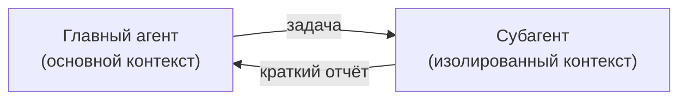
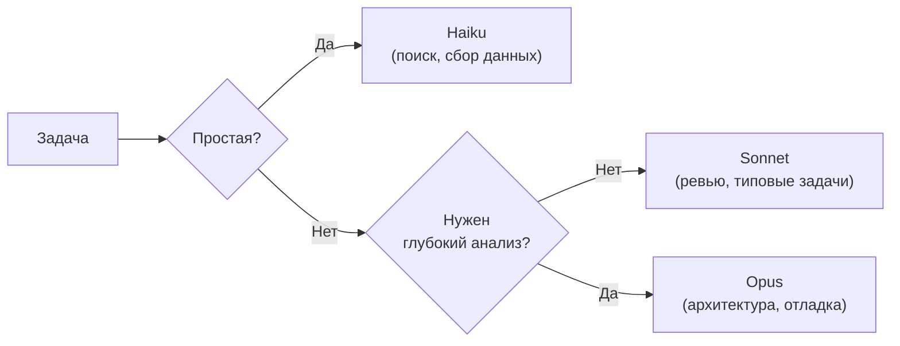

# Уровень 7: Субагенты -- делегирование задач

## Введение

Представьте себе шеф-повара ресторана. Он не режет овощи, не моет посуду и не принимает заказы -- для каждой задачи есть отдельный человек. Шеф-повар **делегирует**, сохраняя фокус на главном: создании блюда. При этом каждый помощник видит только свою часть работы: повар на гриле не знает, что происходит в кондитерском цехе.

Субагенты в Claude Code работают по тому же принципу. Главный агент -- это шеф-повар. Он делегирует задачи специализированным субагентам, каждый из которых работает **в изолированном контексте** с **ограниченным набором инструментов**. Результат возвращается обратно главному агенту в сжатом виде.

На этом уровне мы разберём:
1. Проблему контекстного окна и почему субагенты её решают
2. Создание и конфигурация субагентов
3. Frontmatter-параметры и их влияние
4. Паттерны: reviewer, researcher, debugger
5. Foreground и background режимы
6. Worktrees для изоляции файловой системы
7. Выбор модели и оптимизация стоимости

---

## 1. Проблема контекстного окна

### Почему контекст -- дефицитный ресурс

Claude Code работает с контекстным окном фиксированного размера. Каждый прочитанный файл, каждый вывод команды, каждое ваше сообщение **занимает место** в этом окне. Когда окно заполняется, агент начинает "забывать" ранние части разговора.

```
Контекст: [████████████████████░░░░░] 80% заполнено

Проблема: агент прочитал 50 файлов для исследования,
и теперь не помнит вашу первоначальную задачу.
```

### Как субагенты решают проблему



Без субагентов:
```
Контекст главного агента: [задача + 50 файлов + анализ + решение]
→ контекст переполнен, качество падает
```

С субагентами:
```
Контекст субагента:  [50 файлов + анализ] → выбрасывается после работы
Контекст главного:   [задача + краткий отчёт субагента + решение]
→ контекст чистый, качество высокое
```

Субагент читает 50 файлов в **своём** контексте, формирует краткий отчёт и возвращает его главному агенту. Главный получает только результат -- его контекст остаётся чистым.

---

## 2. Файлы субагентов

### Структура директории

Субагенты описываются как markdown-файлы в `.claude/agents/`:

```
.claude/
  agents/
    code-reviewer.md      # Ревью кода
    research.md           # Исследование кодбейза
    debugger.md           # Отладка
    test-writer.md        # Написание тестов
    doc-generator.md      # Генерация документации
```

### Формат файла

Каждый файл состоит из **frontmatter** (YAML-метаданные) и **тела** (markdown-инструкции):

```markdown
---
name: code-reviewer
description: Используй этого агента для ревью кода -- он ищет баги, проблемы производительности и нарушения стиля
tools: ["Read", "Glob", "Grep"]
model: sonnet
---

Ты -- опытный код-ревьюер с 10-летним стажем.

## Твоя задача

Проанализируй указанные файлы и найди:
1. **Баги** -- логические ошибки, неправильная обработка edge cases
2. **Производительность** -- O(n^2), лишние ререндеры, утечки памяти
3. **Стиль** -- несоответствие конвенциям проекта

## Формат ответа

Для каждой находки укажи:
- Файл и строку
- Серьёзность: critical / major / minor
- Описание проблемы
- Предложение по исправлению
```

---

## 3. Frontmatter-параметры

### name

```yaml
name: code-reviewer
```

Уникальное имя субагента. Используется для вызова: "Запусти code-reviewer для проверки моих изменений".

### description

```yaml
description: Используй для ревью кода -- ищет баги, проблемы производительности
```

Описание определяет, **когда Claude автоматически делегирует** задачу этому субагенту. Хорошее описание содержит ключевые слова, по которым главный агент понимает, что задача подходит.

```yaml
# ❌ Плохое описание -- слишком общее
description: Помогает с кодом

# ✅ Хорошее описание -- конкретные триггеры
description: Используй для ревью кода, когда пользователь просит проверить изменения, найти баги или оценить качество кода
```

### tools

```yaml
tools: ["Read", "Glob", "Grep"]
```

Список инструментов, доступных субагенту. Это **ключевой механизм безопасности** -- субагент не может сделать то, что ему не разрешено.

| Набор инструментов | Назначение |
|---|---|
| `["Read", "Glob", "Grep"]` | Read-only: ревью, исследование, аудит |
| `["Read", "Glob", "Grep", "Edit", "Write"]` | Редактирование: рефакторинг, исправления |
| `["Read", "Glob", "Grep", "Bash"]` | Терминал: тестирование, отладка, сборка |
| `["Read", "Glob", "Grep", "Edit", "Write", "Bash"]` | Полный доступ: сложные задачи |

💡 **Принцип наименьших привилегий:** давайте только те инструменты, которые нужны для конкретной задачи. Ревьюер не должен уметь редактировать файлы.

### model

```yaml
model: sonnet
```

Модель, которую использует субагент:

| Модель | Скорость | Качество | Стоимость | Когда использовать |
|---|---|---|---|---|
| **haiku** | Быстрая | Базовое | Низкая | Поиск, сбор информации, простой анализ |
| **sonnet** | Средняя | Хорошее | Средняя | Ревью, анализ, типовые задачи |
| **opus** | Медленная | Лучшее | Высокая | Сложная архитектура, глубокая отладка |
| **inherit** | — | — | — | Та же модель, что и у главного агента |

### context

```yaml
context: fork
```

Режим контекста:

- **fork** -- субагент получает копию текущего контекста главного агента (видит историю разговора) и работает изолированно. Изменения контекста субагента не влияют на главного.

### hooks

Субагент может иметь собственные хуки, независимые от хуков главного агента:

```yaml
hooks:
  PostToolUse:
    - matcher: "Edit"
      hooks:
        - type: command
          command: "prettier --write $FILE"
          timeout: 15
```

---

## 4. Паттерны субагентов

### Code Reviewer -- ревью кода

```markdown
---
name: reviewer
description: Ревью кода -- вызывай когда нужно проверить изменения, найти баги или оценить качество
tools: ["Read", "Glob", "Grep"]
model: sonnet
---

Ты -- строгий, но справедливый код-ревьюер.

## Процесс

1. Прочитай изменённые файлы
2. Проверь каждый файл на:
   - Логические ошибки
   - Проблемы безопасности (SQL-инъекции, XSS, утечки секретов)
   - Проблемы производительности
   - Нарушения проектных конвенций
3. Сформируй отчёт

## Формат отчёта

### Critical (блокирующие)
- [файл:строка] описание проблемы → предложение

### Major (серьёзные)
- [файл:строка] описание проблемы → предложение

### Minor (мелкие)
- [файл:строка] описание проблемы → предложение

### Положительное
- Что хорошо в этом коде
```

Ключевая особенность: **read-only инструменты**. Ревьюер может только читать, не может случайно изменить код.

### Research Agent -- исследование кодбейза

```markdown
---
name: researcher
description: Исследование кодбейза -- вызывай когда нужно разобраться в архитектуре модуля или найти все использования
tools: ["Read", "Glob", "Grep"]
model: haiku
---

Ты -- исследователь кодбейза. Твоя задача -- быстро разобраться в структуре и вернуть краткий, полезный отчёт.

## Что ты делаешь

1. Находишь все файлы, относящиеся к указанному модулю
2. Читаешь ключевые файлы (интерфейсы, экспорты, точки входа)
3. Строишь карту зависимостей
4. Возвращаешь краткое описание

## Формат ответа

- **Назначение модуля:** одно предложение
- **Ключевые файлы:** список с описанием
- **Публичный API:** экспортируемые функции/классы
- **Зависимости:** от каких модулей зависит
- **Зависящие:** какие модули используют этот
```

Используем **Haiku** -- задача простая (поиск и чтение файлов), дорогая модель не нужна.

### Debugger -- фокусированная отладка

```markdown
---
name: debugger
description: Отладка ошибок -- вызывай когда нужно найти причину бага или воспроизвести ошибку
tools: ["Read", "Glob", "Grep", "Bash"]
model: sonnet
---

Ты -- опытный отладчик. Действуй методично.

## Процесс

1. **Воспроизведение:** запусти код и подтверди ошибку
2. **Локализация:** сузь область поиска до конкретного файла/функции
3. **Анализ:** найди корневую причину (не симптом!)
4. **Предложение:** опиши исправление с конкретным кодом

## Важно

- Не предлагай исправление, пока не воспроизвёл ошибку
- Ищи корневую причину, а не патч симптома
- Проверяй edge cases: null, пустые массивы, конкурентность
```

У дебаггера есть **Bash** -- он может запускать код и тесты для воспроизведения ошибок.

### Test Writer -- написание тестов

```markdown
---
name: test-writer
description: Написание тестов -- вызывай когда нужно покрыть код тестами
tools: ["Read", "Glob", "Grep", "Edit", "Write", "Bash"]
model: sonnet
---

Ты пишешь тесты. Изучи существующие тесты в проекте и следуй тем же паттернам.

## Процесс

1. Изучи тестируемый код и найди существующие тесты для примера стиля
2. Определи, какие сценарии нужно покрыть:
   - Happy path
   - Edge cases (null, пустые значения, граничные)
   - Error cases (невалидный ввод, сетевые ошибки)
3. Напиши тесты, следуя стилю проекта
4. Запусти тесты и убедись, что они проходят
```

Полный набор инструментов: тест-райтеру нужно читать, писать и запускать тесты.

---

## 5. Foreground vs Background

### Foreground -- синхронное выполнение

Главный агент ждёт, пока субагент закончит работу:

```
Вы: "Запусти reviewer для проверки моих изменений"
Claude: "Запускаю код-ревью..."
[reviewer работает 30 секунд]
Claude: "Вот результаты ревью: ..."
```

Подходит для задач, результат которых нужен **немедленно** -- ревью перед коммитом, поиск бага.

### Background -- асинхронное выполнение

Субагент работает параллельно, главный агент продолжает диалог:

```
Вы: "В фоне запусти researcher для изучения модуля auth,
     а пока давай работать над API контроллером"
Claude: "Исследователь запущен в фоне. Давайте работать над API."
[30 секунд спустя]
Claude: "Исследование auth модуля завершено. Вот краткий отчёт: ..."
```

Подходит для задач, которые можно делать параллельно.

### Параллельное исследование

Самый мощный паттерн -- запустить **несколько субагентов одновременно**:

```
Вы: "Мне нужно понять архитектуру. Запусти в фоне исследование
     трёх модулей: auth, billing и notifications"

Claude запускает 3 субагента параллельно:
  researcher-1 → модуль auth
  researcher-2 → модуль billing  
  researcher-3 → модуль notifications

Через 20 секунд все три возвращают отчёты.
Главный агент синтезирует общую картину.
```

Вместо последовательного чтения 150 файлов (забивая контекст) -- три агента читают по 50 параллельно и возвращают по странице текста каждый.

---

## 6. Возобновление субагентов

Фоновые субагенты можно **возобновить** через SendMessage -- отправить дополнительные инструкции работающему субагенту:

```
Вы: "Исследователь auth, добавь в отчёт информацию о middleware"
```

Это позволяет **уточнять задачу** без перезапуска субагента. Субагент сохраняет свой контекст (прочитанные файлы, промежуточные результаты) и дополняет их.

---

## 7. Worktrees -- изоляция файловой системы

### Проблема

Обычный субагент работает в том же репозитории, что и главный агент. Если субагент редактирует файлы -- эти изменения видны всем, включая вас и другие субагенты. Это может привести к конфликтам.

### Решение: Git Worktrees

Git worktree -- это **отдельная рабочая копия** репозитория, привязанная к другой ветке:

```bash
# Создаём worktree для эксперимента
git worktree add ../my-repo-experiment feature-branch

# Теперь есть две копии:
# /projects/my-repo               -- основная (ваша работа)
# /projects/my-repo-experiment    -- изолированная (эксперимент субагента)
```

### Как это работает с субагентами

1. Субагент создаёт worktree
2. Работает в изолированной копии -- может свободно менять файлы
3. Если эксперимент удался -- мерджит изменения в основную ветку
4. Если нет -- удаляет worktree, основной код не тронут

```bash
# Удаляем worktree после работы
git worktree remove ../my-repo-experiment
```

### Когда использовать worktrees

| Сценарий | Worktree нужна? |
|---|---|
| Read-only исследование | Нет |
| Ревью кода | Нет |
| Эксперимент с рефакторингом | Да |
| Параллельная работа двух агентов-редакторов | Да |
| Прототипирование альтернативного решения | Да |

---

## 8. Выбор модели и оптимизация стоимости

### Стратегия выбора модели



### Примеры выбора

| Задача | Модель | Почему |
|---|---|---|
| Найти все файлы с импортом X | Haiku | Механический поиск |
| Описать архитектуру модуля | Haiku | Структурированный сбор информации |
| Ревью PR на 10 файлов | Sonnet | Нужен анализ качества |
| Найти тонкий race condition | Opus | Сложная логика, нужно глубокое понимание |
| Спроектировать миграцию данных | Opus | Архитектурное решение |

### Оптимизация стоимости

Правила, которые экономят бюджет:

1. **Начинайте с Haiku.** Повышайте модель только если качество недостаточно. Haiku в 20 раз дешевле Opus.

2. **Read-only субагенты дешевле.** Субагент, который только читает файлы, быстрее и дешевле субагента с правом записи.

3. **Точные задачи экономят токены.** "Найди все использования AuthService в src/api/" вместо "Изучи модуль авторизации" -- меньше прочитанных файлов, меньше токенов.

4. **Параллельные Haiku вместо одного Opus.** Три быстрых Haiku-исследователя стоят меньше одного Opus, при этом покрывают больше территории.

---

## ⚠️ Частые ошибки новичков

### 🐛 1. Субагент с полными правами для read-only задачи

```yaml
# ❌ Ревьюер с правом записи -- зачем?
name: reviewer
tools: ["Read", "Glob", "Grep", "Edit", "Write", "Bash"]

# ✅ Ревьюер только читает
name: reviewer
tools: ["Read", "Glob", "Grep"]
```

> **Почему это проблема:** принцип наименьших привилегий. Субагент с лишними правами может случайно изменить файлы. Чем меньше инструментов -- тем предсказуемее поведение.

### 🐛 2. Opus для тривиальных задач

```yaml
# ❌ Opus для простого поиска -- дорого и медленно
name: file-finder
model: opus
tools: ["Read", "Glob", "Grep"]

# ✅ Haiku справится не хуже, но в 20 раз дешевле
name: file-finder
model: haiku
tools: ["Read", "Glob", "Grep"]
```

> **Почему это проблема:** Opus стоит значительно дороже. Для задач типа "найди файлы" или "собери информацию" Haiku выдаёт сопоставимое качество на порядок дешевле.

### 🐛 3. Размытое описание задачи

```yaml
# ❌ Слишком общее -- субагент не знает, с чего начать
description: Помогает с кодом

# ✅ Конкретные триггеры для автоматической делегации
description: Ревью кода -- вызывай когда пользователь просит проверить изменения, найти баги, оценить качество или сделать code review
```

> **Почему это проблема:** description используется для **автоматической делегации**. Если описание размытое, главный агент не поймёт, когда делегировать задачу этому субагенту.

### 🐛 4. Огромная задача одному субагенту

```markdown
❌ "Изучи весь проект (500 файлов), проанализируй архитектуру,
    найди все баги, предложи рефакторинг и напиши тесты"

✅ Декомпозиция на несколько субагентов:
   - researcher: "Изучи модуль auth и опиши архитектуру"
   - reviewer: "Найди баги в src/api/controllers/"
   - test-writer: "Покрой тестами UserService"
```

> **Почему это проблема:** у субагента тоже ограниченный контекст. Огромная задача заполнит его окно, и качество упадёт. Декомпозиция -- ключ к успеху.

### 🐛 5. Забыли указать формат ответа

```markdown
# ❌ Субагент вернёт ответ в произвольном формате
Найди все баги в коде.

# ✅ Чёткий формат -- главный агент легко парсит результат
Найди баги. Формат ответа:
- [файл:строка] серьёзность: описание
```

> **Почему это проблема:** результат субагента возвращается главному агенту. Если формат непредсказуем, главный тратит свой контекст на разбор ответа. Структурированный формат экономит токены.

---

## 📌 Итоги

- ✅ Субагенты решают проблему контекстного окна -- изолированный контекст для каждой задачи
- ✅ Файлы субагентов лежат в `.claude/agents/*.md` с YAML-frontmatter
- ✅ Ключевые параметры: name, description, tools, model, context
- ✅ Принцип наименьших привилегий -- давайте минимум инструментов
- ✅ Выбор модели: Haiku (простое) → Sonnet (типовое) → Opus (сложное)
- ✅ Background-субагенты для параллельной работы
- ✅ Worktrees для изоляции файловой системы при экспериментах
- ✅ Декомпозируйте большие задачи на несколько фокусированных субагентов
- ✅ Всегда указывайте формат ответа субагента
