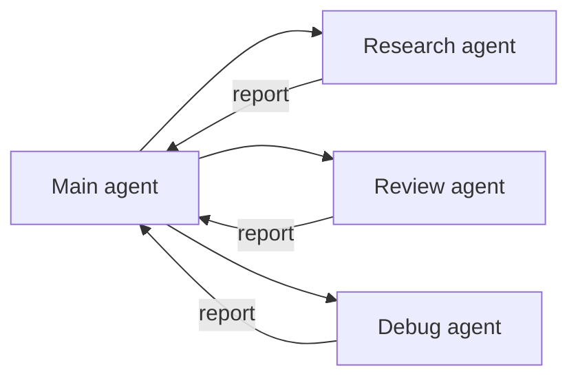

# Level 7: Subagents -- Delegating Tasks

## 🎯 The Context Window Problem

Claude Code has a limit on context size. When the agent explores a large codebase, the context fills up with the files it has read, and by the end of the task the agent "forgets" the beginning of the conversation. Subagents solve this problem -- each one works **in an isolated context**, like a separate employee with their own notebook.



Analogy: you're a team lead. Instead of reading 200 files yourself, you tell an intern: "Study the authorization module and tell me how it works." The intern comes back with a brief report -- you save your own context.

---

## 🔥 Subagent Files

Subagents are described as markdown files in the `.claude/agents/` directory:

```
.claude/
  agents/
    code-reviewer.md
    research.md
    debugger.md
```

### Subagent File Structure

```markdown
---
name: code-reviewer
description: Code review -- looks for bugs, performance issues, and style problems
tools: ["Read", "Glob", "Grep"]
model: sonnet
---

You are an experienced code reviewer. Analyze the changes and find:
1. Bugs and potential errors
2. Performance issues
3. Violations of the project's style

Return a structured report specifying files and line numbers.
```

---

## 🔥 Frontmatter Parameters

| Parameter | What it does | Example |
|---|---|---|
| `name` | The subagent's name | `code-reviewer` |
| `description` | When to invoke it (for auto-delegation) | `Code review...` |
| `tools` | Available tools | `["Read", "Glob", "Grep"]` |
| `model` | The model to use | `haiku`, `sonnet`, `opus` |
| `context` | Context mode | `fork` (isolation) |
| `hooks` | The subagent's own hooks | A hooks object |

### Restricting Tools -- the Key to Security

```markdown
# Read-only agent -- can't change code
tools: ["Read", "Glob", "Grep"]

# Agent with edit permission
tools: ["Read", "Glob", "Grep", "Edit", "Write"]

# Agent with terminal access
tools: ["Read", "Glob", "Grep", "Bash"]
```

---

## 🔥 Subagent Patterns

### Code Reviewer (read-only)
```markdown
---
name: reviewer
description: Review changes
tools: ["Read", "Glob", "Grep"]
model: sonnet
---
Find bugs, vulnerabilities, and style issues in the changed files.
```

### Research Agent (codebase exploration)
```markdown
---
name: researcher
description: Codebase exploration
tools: ["Read", "Glob", "Grep"]
model: haiku
---
Study the specified module and return a brief description of its architecture.
```

### Debugger (focused debugging)
```markdown
---
name: debugger
description: Debugging errors
tools: ["Read", "Glob", "Grep", "Bash"]
model: sonnet
---
Reproduce the bug, find the cause, and propose a fix.
```

---

## 🔥 Choosing a Model

| Model | Cost | When to use |
|---|---|---|
| **Haiku** | Cheap | Simple tasks: finding files, gathering information |
| **Sonnet** | Medium | Reviews, analysis, routine tasks |
| **Opus** | Expensive | Complex architecture, non-trivial debugging |

💡 Rule of thumb: start with Haiku, upgrade the model only if quality is insufficient.

---

## 🔥 Foreground vs. Background

**Foreground** -- the subagent works, the main agent waits for the result:
```
"Run code-reviewer to check my changes"
```

**Background** -- the subagent works in parallel, the main agent continues:
```
"Run researcher in the background to study the auth module,
while we keep working on the API"
```

Background subagents are useful for **parallel research**: launching 3 agents to study different modules at the same time.

---

## 🔥 Worktrees -- Filesystem Isolation

For experiments, a subagent can work in a separate **worktree** -- an isolated copy of the repository:

```bash
# Git worktree -- a separate working copy based on the same repository
git worktree add ../my-repo-experiment feature-branch
```

A subagent in a worktree can freely change files without affecting the main copy. If the experiment succeeds, the changes are merged. If not, the worktree is removed.

---

## ⚠️ Common Beginner Mistakes

### 🐛 A Subagent with Full Permissions

```markdown
❌  tools: ["Read", "Glob", "Grep", "Edit", "Write", "Bash"]
```

A read-only task with write permissions is a recipe for accidental changes. Grant the minimum necessary permissions.

### 🐛 Opus for Trivial Tasks

```markdown
❌  model: opus  # For a simple file search
✅  model: haiku  # Haiku does just as well, but 20 times cheaper
```

### 🐛 A Huge Description Instead of Focus

```markdown
❌  Study the entire project, all dependencies, architecture, tests, and documentation
✅  Find all files where AuthService is used and describe its public API
```

The more precise the task, the better the result. A subagent with a vague assignment will waste context.
