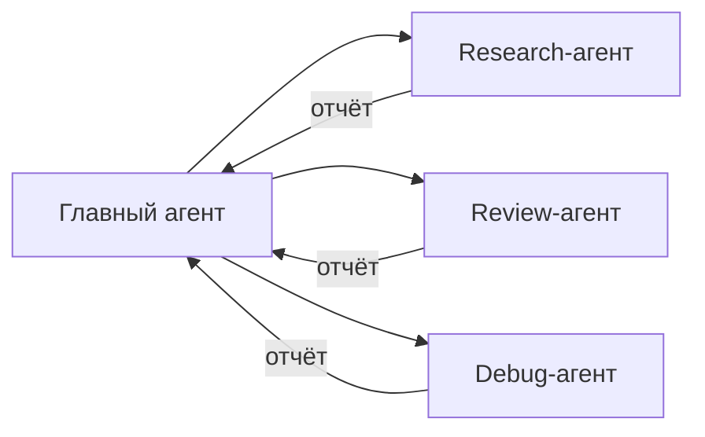

# Уровень 7: Субагенты -- делегирование задач

## 🎯 Проблема контекстного окна

У Claude Code есть ограничение на размер контекста. Когда агент исследует большой кодбейз, контекст забивается прочитанными файлами, и к концу задачи агент "забывает" начало разговора. Субагенты решают эту проблему -- каждый работает **в изолированном контексте**, как отдельный сотрудник с собственным блокнотом.



Аналогия: вы -- тимлид. Вместо того чтобы самому читать 200 файлов, вы говорите стажёру: "Изучи модуль авторизации и расскажи, как он работает". Стажёр возвращается с кратким отчётом -- вы экономите свой контекст.

---

## 🔥 Файлы субагентов

Субагенты описываются как markdown-файлы в директории `.claude/agents/`:

```
.claude/
  agents/
    code-reviewer.md
    research.md
    debugger.md
```

### Структура файла субагента

```markdown
---
name: code-reviewer
description: Ревью кода -- ищет баги, проблемы производительности и стиля
tools: ["Read", "Glob", "Grep"]
model: sonnet
---

Ты -- опытный код-ревьюер. Проанализируй изменения и найди:
1. Баги и потенциальные ошибки
2. Проблемы производительности
3. Нарушения стиля проекта

Возвращай структурированный отчёт с указанием файлов и строк.
```

---

## 🔥 Frontmatter-параметры

| Параметр | Что делает | Пример |
|---|---|---|
| `name` | Имя субагента | `code-reviewer` |
| `description` | Когда его вызывать (для автоделегации) | `Ревью кода...` |
| `tools` | Доступные инструменты | `["Read", "Glob", "Grep"]` |
| `model` | Модель для выполнения | `haiku`, `sonnet`, `opus` |
| `context` | Режим контекста | `fork` (изоляция) |
| `hooks` | Собственные хуки субагента | Объект хуков |

### Ограничение инструментов -- ключ к безопасности

```markdown
# Read-only агент -- не может менять код
tools: ["Read", "Glob", "Grep"]

# Агент с правом редактирования
tools: ["Read", "Glob", "Grep", "Edit", "Write"]

# Агент с доступом к терминалу
tools: ["Read", "Glob", "Grep", "Bash"]
```

---

## 🔥 Паттерны субагентов

### Code Reviewer (read-only)
```markdown
---
name: reviewer
description: Ревью изменений
tools: ["Read", "Glob", "Grep"]
model: sonnet
---
Найди баги, уязвимости и проблемы стиля в изменённых файлах.
```

### Research Agent (исследование кодбейза)
```markdown
---
name: researcher
description: Исследование кодбейза
tools: ["Read", "Glob", "Grep"]
model: haiku
---
Изучи указанный модуль и верни краткое описание архитектуры.
```

### Debugger (фокусированная отладка)
```markdown
---
name: debugger
description: Отладка ошибок
tools: ["Read", "Glob", "Grep", "Bash"]
model: sonnet
---
Воспроизведи ошибку, найди причину и предложи исправление.
```

---

## 🔥 Выбор модели

| Модель | Стоимость | Когда использовать |
|---|---|---|
| **Haiku** | Дешёвая | Простые задачи: поиск файлов, сбор информации |
| **Sonnet** | Средняя | Ревью, анализ, типовые задачи |
| **Opus** | Дорогая | Сложная архитектура, нетривиальная отладка |

💡 Правило: начинайте с Haiku, повышайте модель только если качество недостаточно.

---

## 🔥 Foreground vs Background

**Foreground** -- субагент работает, главный агент ждёт результат:
```
"Запусти code-reviewer для проверки моих изменений"
```

**Background** -- субагент работает параллельно, главный продолжает:
```
"В фоне запусти researcher для изучения модуля auth,
а пока давай работать над API"
```

Фоновые субагенты полезны для **параллельного исследования**: запустить 3 агента на изучение разных модулей одновременно.

---

## 🔥 Worktrees -- изоляция файловой системы

Для экспериментов субагент может работать в отдельной **worktree** -- изолированной копии репозитория:

```bash
# Git worktree -- отдельная рабочая копия на базе того же репозитория
git worktree add ../my-repo-experiment feature-branch
```

Субагент в worktree может свободно менять файлы, не затрагивая основную копию. Если эксперимент удался -- изменения мерджатся. Если нет -- worktree удаляется.

---

## ⚠️ Частые ошибки новичков

### 🐛 Субагент с полными правами

```markdown
❌  tools: ["Read", "Glob", "Grep", "Edit", "Write", "Bash"]
```

Read-only задача с правами на запись -- рецепт случайных изменений. Давайте минимум необходимых прав.

### 🐛 Opus для тривиальных задач

```markdown
❌  model: opus  # Для простого поиска файлов
✅  model: haiku  # Haiku справится не хуже, но в 20 раз дешевле
```

### 🐛 Огромное описание вместо фокуса

```markdown
❌  Изучи весь проект, все зависимости, архитектуру, тесты и документацию
✅  Найди все файлы, где используется AuthService, и опиши его публичный API
```

Чем точнее задача -- тем лучше результат. Субагент с размытым заданием потратит контекст впустую.
