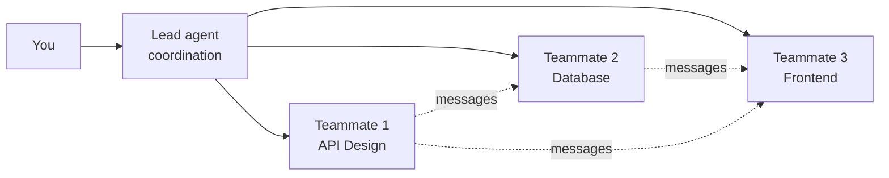

# Level 8: Multi-Agent Teams (Agent Teams)

> ⚠️ **Experimental feature, disabled by default.**
>
> Without the environment variable `CLAUDE_CODE_EXPERIMENTAL_AGENT_TEAMS=1`, no team gets created at session start, no service directories are written, and Claude won't create teammates or even suggest them. Everything described below simply won't work -- and it will look as if you made a mistake in the wording of your request.
>
> ```json
> // ~/.claude/settings.json
> {
>   "env": { "CLAUDE_CODE_EXPERIMENTAL_AGENT_TEAMS": "1" }
> }
> ```
>
> The behavior of this experimental feature may change between versions, so check the documentation.

## Introduction

Imagine you're managing an apartment renovation. You could hire a single all-around handyman: they'll hang wallpaper, do the wiring, and lay tile. But that would take three months. Or you could hire a crew: an electrician, a tiler, and a painter work in parallel, coordinated by a foreman. The result: three weeks instead of three months.

Agent Teams in Claude Code is that same crew. Several Claude Code sessions work simultaneously, each in its own context window, each with its own specialization. The Lead agent coordinates the work, like a foreman on a construction site.

🔥 **Key idea:** Agent Teams isn't just "more agents." It's **coordinated parallel work** with information exchange between participants.

---

## Agent Teams Architecture

### The Lead Agent and Teammates

When you create a team, one session becomes the **Lead**, and the rest become **Teammates**. Each has its own role:



**The Lead agent** is responsible for:
- Breaking the task down into subtasks
- Assigning work to teammates
- Synthesizing results
- Delivering the final report to you

**Teammates** are responsible for:
- Executing their assigned task
- Sharing findings with other teammates
- Claiming tasks from the shared list

### Difference from Subagents

These two mechanisms are often confused, but they solve different problems:

| Property | Subagents | Agent Teams |
|----------------|-----------|-------------|
| Communication | Only with the main agent | Directly with each other |
| Context | Within the parent's session | A separate context window |
| Coordination | None (isolated tasks) | A shared task list, claiming |
| Use case | "Go find out and report back" | "Let's solve this together" |

💡 **The tipping point:** if you're running parallel subagents and they start hitting context limits, or they need to share findings with each other -- it's time to move to Agent Teams.

---

## Creating a Team

A team is created via natural language. You describe the task and the desired composition:

```text
> I'm designing a CLI tool for tracking TODO comments
  in a codebase. Create a team to research it from different angles:
  one teammate handles UX, another handles technical architecture,
  a third plays devil's advocate.
```

Claude will create a Lead agent, which will:
1. Analyze the task
2. Create teammates with the described roles
3. Form a task list
4. Begin coordination

### Managing the Team

You manage the team through the Lead agent using natural language:

```text
> Lead, have the architecture teammate also check
  whether AST parsing could be used instead of regex

> Show the current status of all teammates
```

You can switch between teammates in the terminal to watch each one's progress or give instructions directly, bypassing the Lead.

---

## Usage Patterns

### 1. Parallel Code Review

One PR is reviewed by three agents at once:

```text
> Do a code review of PR #142 with a team of three reviewers:
  1. Security: SQL injection, XSS, secret leaks, CSRF
  2. Architecture: SOLID, module coupling, dependencies
  3. Quality: tests, edge cases, documentation
```

Each reviewer works independently but sees the others' findings. If the security reviewer finds a suspicious pattern, the architecture reviewer can assess how deeply the problem runs through the system.

### 2. Competing Hypotheses

A bug reproduces intermittently. Instead of testing hypotheses one after another, we run them in parallel:

```text
> We have a race condition: payments sometimes duplicate.
  Create a team with three hypotheses:
  1. The problem is in the task queue -- check idempotency
  2. The problem is in DB locks -- check isolation levels
  3. The problem is in the API -- check for repeated client requests
```

Each teammate investigates its own hypothesis. If one finds evidence, the others can switch to verifying the discovered cause.

### 3. Distributed Research

You need to quickly get up to speed on an unfamiliar codebase:

```text
> We just got access to a monorepo (200k lines).
  Create a team to research it:
  1. Frontend: React app, routing, state management
  2. Backend: API, business logic, authorization
  3. Infra: CI/CD, deployment, monitoring, configuration
  Each will prepare a brief report on their area.
```

### 4. Feature Development

Developing a large feature with decomposition:

```text
> We're adding a notification system. Create a team:
  1. API developer: REST endpoints, WebSocket, schemas
  2. DB engineer: migrations, indexes, queues
  3. Frontend developer: components, real-time updates
```

---

## Quality Gates and Monitoring

### Automatic Result Verification

Hooks (`PreToolUse`, `PostToolUse`) also work in the context of teams. You can configure automatic checks:

- **PostToolUse on Edit:** a linter checks every change
- **PreToolUse on Bash:** blocking dangerous commands
- **After completion:** an automatic test run

### Token Usage Tracking

Each teammate consumes tokens independently. A team of 3 agents can use 3+ times more than a single agent. Monitoring is mandatory:

```json
{
  "cost": {
    "total_cost_usd": 0.45,
    "breakdown": {
      "lead": 0.08,
      "teammate_security": 0.15,
      "teammate_architecture": 0.12,
      "teammate_quality": 0.10
    }
  }
}
```

### Display Modes

Control the volume of output:
- **streaming** -- see each teammate's work in real time
- **summary** -- periodic summaries from the Lead
- **results** -- only the final results

---

## When Teams Make Sense and When They Don't

### ✅ Use Teams When:

- **The task is decomposable** into independent subtasks
- **The codebase is large** -- a single agent doesn't have enough context
- **Coordination is needed** -- the results of one subtask affect others
- **Time is critical** -- parallel work saves hours
- **Different expertise is needed** -- security + performance + UX

### ❌ Don't Use Teams When:

- **The task is simple** -- coordination overhead outweighs the benefit
- **The project is small** -- a single agent will handle it faster
- **There's a sequential dependency** -- each step depends on the previous one
- **Budget is limited** -- each teammate consumes tokens

---

## ⚠️ Common Beginner Mistakes

### 🐛 1. A Team That's Too Large

```text
# ❌ Bad: 7 agents for a task that needs 2
> Create a team of 7 specialists to refactor some utilities
```

> **Why this is a mistake:** coordination among 7 agents creates enormous overhead. Everyone exchanges messages with everyone, and the Lead spends tokens on synthesis. The optimal team size is 2-4 teammates.

```text
# ✅ Good: the minimal sufficient team
> Create a team of 2 agents: one refactors module A,
  the other module B. Then they review each other's work.
```

### 🐛 2. Vague Roles

```text
# ❌ Bad: agents will duplicate work
> Create a team, have all three check the code's security
```

> **Why this is a mistake:** without clear zones of responsibility, teammates will do the same thing. You pay for three agents and get the result of one.

```text
# ✅ Good: everyone knows their zone
> Create a team for an audit:
  1. Input data: validation, sanitization, SQL injection
  2. Authentication: tokens, sessions, CORS
  3. Dependencies: CVEs, outdated packages, licenses
```

### 🐛 3. Ignoring Cost

> **Why this is a mistake:** a team of 4 agents working for an hour can cost 4-5 times more than a single agent. Always assess whether parallelization is justified by the time saved.

---

## 📌 Best Practices

1. **Start small** -- try a team of 2 teammates, then scale up
2. **Clear roles** -- every teammate should know its zone of responsibility
3. **Verifiable criteria** -- give each teammate concrete deliverables
4. **Monitor spending** -- track token usage for each teammate
5. **Use display modes** -- `summary` for long-running tasks, `streaming` for debugging
6. **Switch in** -- don't be afraid to give teammates instructions directly through the terminal

---

## 📌 Summary

- 🔥 Agent Teams is coordinated parallel work by several Claude Code sessions
- 📌 The Lead agent coordinates, teammates execute and communicate directly
- 💡 Main patterns: parallel review, competing hypotheses, distributed research
- ⚠️ Teams make sense for complex tasks; for simple ones, the overhead outweighs the benefit
- ✅ Optimal team size: 2-4 teammates with clear roles
- 📌 Always monitor token usage -- every teammate costs money
