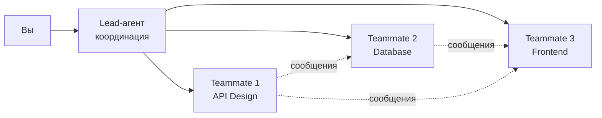

# Уровень 8: Мультиагентные команды (Agent Teams)

> ⚠️ **Экспериментальная функция, выключенная по умолчанию.**
>
> Без переменной окружения `CLAUDE_CODE_EXPERIMENTAL_AGENT_TEAMS=1` команда не создаётся при старте сессии, служебные директории не пишутся, а Claude не станет ни создавать teammates, ни предлагать их. Всё, что описано ниже, просто не сработает -- и выглядеть это будет так, будто вы ошиблись в формулировке запроса.
>
> ```json
> // ~/.claude/settings.json
> {
>   "env": { "CLAUDE_CODE_EXPERIMENTAL_AGENT_TEAMS": "1" }
> }
> ```
>
> Поведение экспериментальной функции может меняться между версиями, поэтому сверяйтесь с документацией.

## Введение

Представьте, что вы руководите ремонтом квартиры. Можно нанять одного универсального мастера: он поклеит обои, проведёт электрику, уложит плитку. Но это займёт три месяца. А можно нанять бригаду: электрик, плиточник и маляр работают параллельно, координируясь через прораба. Результат -- три недели вместо трёх месяцев.

Agent Teams в Claude Code -- это та же бригада. Несколько сессий Claude Code работают одновременно, каждая в своём контекстном окне, со своей специализацией. Lead-агент координирует работу, как прораб на стройке.

🔥 **Ключевая идея:** Agent Teams -- это не просто «больше агентов». Это **координированная параллельная работа** с обменом информацией между участниками.

---

## Архитектура Agent Teams

### Lead-агент и Teammates

Когда вы создаёте команду, одна сессия становится **Lead** (лидером), а остальные -- **Teammates** (участниками). У каждого своя роль:



**Lead-агент** отвечает за:
- Разбиение задачи на подзадачи
- Назначение работы teammates
- Синтез результатов
- Итоговый отчёт вам

**Teammates** отвечают за:
- Выполнение назначенной задачи
- Обмен находками с другими teammates
- Claim задач из общего списка

### Отличие от субагентов

Эти два механизма часто путают, но они решают разные задачи:

| Характеристика | Субагенты | Agent Teams |
|----------------|-----------|-------------|
| Коммуникация | Только с главным агентом | Друг с другом напрямую |
| Контекст | Внутри сессии родителя | Отдельное контекстное окно |
| Координация | Нет (изолированные задачи) | Общий список задач, claim |
| Применение | «Сходи узнай и доложи» | «Давайте вместе решим» |

💡 **Точка перехода:** если вы запускаете параллельных субагентов и они начинают «упираться» в лимиты контекста, или им нужно обмениваться находками -- пора переходить на Agent Teams.

---

## Создание команды

Команда создаётся через естественный язык. Вы описываете задачу и желаемый состав:

```text
> Я проектирую CLI-инструмент для отслеживания TODO-комментариев
  в кодовой базе. Создай команду для исследования с разных сторон:
  один teammate занимается UX, другой — технической архитектурой,
  третий играет роль адвоката дьявола.
```

Claude создаст Lead-агента, который:
1. Проанализирует задачу
2. Создаст teammates с описанными ролями
3. Сформирует список задач
4. Начнёт координацию

### Управление командой

Вы управляете командой через Lead-агента на естественном языке:

```text
> Lead, пусть teammate по архитектуре также проверит,
  можно ли использовать AST-парсинг вместо regex

> Покажи текущий статус всех teammates
```

Вы можете переключаться между teammates в терминале, чтобы видеть прогресс каждого или давать указания напрямую, минуя Lead.

---

## Паттерны использования

### 1. Параллельный Code Review

Один PR проверяется тремя агентами одновременно:

```text
> Проведи code review PR #142 командой из трёх ревьюеров:
  1. Безопасность: SQL-инъекции, XSS, утечки секретов, CSRF
  2. Архитектура: SOLID, связность модулей, зависимости
  3. Качество: тесты, edge cases, документация
```

Каждый ревьюер работает независимо, но видит находки других. Если ревьюер по безопасности нашёл подозрительный паттерн, ревьюер по архитектуре может оценить, насколько глубоко проблема пронизывает систему.

### 2. Competing Hypotheses

Баг воспроизводится нестабильно. Вместо последовательной проверки гипотез запускаем параллельную:

```text
> У нас рейс-кондишн: платежи иногда дублируются.
  Создай команду с тремя гипотезами:
  1. Проблема в очереди задач — проверить идемпотентность
  2. Проблема в блокировках БД — проверить уровни изоляции
  3. Проблема в API — проверить повторные запросы от клиента
```

Каждый teammate исследует свою гипотезу. Если один находит доказательство, другие могут переключиться на верификацию найденной причины.

### 3. Distributed Research

Нужно быстро разобраться в незнакомой кодовой базе:

```text
> Мы только что получили доступ к монорепо (200k строк).
  Создай команду для исследования:
  1. Frontend: React-приложение, роутинг, стейт-менеджмент
  2. Backend: API, бизнес-логика, авторизация
  3. Infra: CI/CD, деплой, мониторинг, конфигурация
  Каждый подготовит краткий отчёт о своей области.
```

### 4. Feature Development

Разработка крупной фичи с декомпозицией:

```text
> Добавляем систему уведомлений. Создай команду:
  1. API-разработчик: REST endpoints, WebSocket, схемы
  2. БД-инженер: миграции, индексы, очереди
  3. Frontend-разработчик: компоненты, real-time обновления
```

---

## Quality Gates и мониторинг

### Автоматическая проверка результатов

Хуки (`PreToolUse`, `PostToolUse`) работают и в контексте команд. Вы можете настроить автоматические проверки:

- **PostToolUse на Edit:** линтер проверяет каждое изменение
- **PreToolUse на Bash:** запрет опасных команд
- **После завершения:** автоматический прогон тестов

### Token Usage Tracking

Каждый teammate потребляет токены независимо. Команда из 3 агентов может израсходовать в 3+ раза больше, чем одиночный агент. Мониторинг обязателен:

```json
{
  "cost": {
    "total_cost_usd": 0.45,
    "breakdown": {
      "lead": 0.08,
      "teammate_security": 0.15,
      "teammate_architecture": 0.12,
      "teammate_quality": 0.10
    }
  }
}
```

### Display Modes

Контролируйте объём вывода:
- **streaming** — видите работу каждого teammate в реальном времени
- **summary** — периодические сводки от Lead
- **results** — только финальные результаты

---

## Когда Teams оправданы, а когда нет

### ✅ Используйте Teams когда:

- **Задача декомпозируема** на независимые подзадачи
- **Большая кодовая база** -- одному агенту не хватает контекста
- **Нужна координация** -- результаты одной подзадачи влияют на другие
- **Время критично** -- параллельная работа экономит часы
- **Разные экспертизы** -- безопасность + производительность + UX

### ❌ Не используйте Teams когда:

- **Простая задача** -- overhead координации больше пользы
- **Маленький проект** -- один агент справится быстрее
- **Последовательная зависимость** -- каждый шаг зависит от предыдущего
- **Бюджет ограничен** -- каждый teammate потребляет токены

---

## ⚠️ Частые ошибки новичков

### 🐛 1. Слишком большая команда

```text
# ❌ Плохо: 7 агентов для задачи на 2
> Создай команду из 7 специалистов для рефакторинга утилит
```

> **Почему это ошибка:** координация между 7 агентами создаёт огромный overhead. Каждый обменивается сообщениями с каждым, Lead тратит токены на синтез. Оптимальный размер команды -- 2-4 teammates.

```text
# ✅ Хорошо: минимальная достаточная команда
> Создай команду из 2 агентов: один рефакторит модуль A,
  другой — модуль B. Потом проверят работу друг друга.
```

### 🐛 2. Нечёткие роли

```text
# ❌ Плохо: агенты будут дублировать работу
> Создай команду, пусть все трое проверят безопасность кода
```

> **Почему это ошибка:** без чётких зон ответственности teammates будут делать одно и то же. Вы платите за трёх агентов, получая результат одного.

```text
# ✅ Хорошо: каждый знает свою зону
> Создай команду для аудита:
  1. Входные данные: валидация, санитизация, SQL-инъекции
  2. Аутентификация: токены, сессии, CORS
  3. Зависимости: CVE, устаревшие пакеты, лицензии
```

### 🐛 3. Игнорирование стоимости

> **Почему это ошибка:** команда из 4 агентов, работающая час, может стоить в 4-5 раз больше одного агента. Всегда оценивайте, оправдана ли параллелизация экономией времени.

---

## 📌 Best Practices

1. **Начинайте с малого** -- попробуйте команду из 2 teammates, потом масштабируйте
2. **Чёткие роли** -- каждый teammate должен знать свою зону ответственности
3. **Проверяемые критерии** -- дайте каждому teammate конкретные deliverables
4. **Мониторьте расходы** -- отслеживайте token usage по каждому teammate
5. **Используйте display modes** -- `summary` для длительных задач, `streaming` для отладки
6. **Переключайтесь** -- не бойтесь давать указания teammates напрямую через терминал

---

## 📌 Итоги

- 🔥 Agent Teams -- параллельная координированная работа нескольких Claude Code сессий
- 📌 Lead-агент координирует, teammates выполняют и общаются напрямую
- 💡 Основные паттерны: параллельный review, competing hypotheses, distributed research
- ⚠️ Teams оправданы для сложных задач; для простых -- overhead больше пользы
- ✅ Оптимальный размер команды: 2-4 teammates с чёткими ролями
- 📌 Всегда мониторьте расход токенов -- каждый teammate стоит денег
