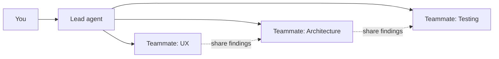

# Level 8: Multi-Agent Teams (Agent Teams)

> ⚠️ **This feature is experimental and disabled by default.** Before trying the examples in this level, enable it with the environment variable `CLAUDE_CODE_EXPERIMENTAL_AGENT_TEAMS=1` -- otherwise Claude simply won't create teammates, and it will look like nothing works.
>
> ```json
> // ~/.claude/settings.json
> {
>   "env": { "CLAUDE_CODE_EXPERIMENTAL_AGENT_TEAMS": "1" }
> }
> ```
>
> Like any experimental feature, the behavioral details may change.

## 🎯 Why Agent Teams Are Needed

Imagine a construction site. One foreman can lay bricks, run wiring, and weld pipes -- but that would take months. Hire a crew of specialists instead, and each takes on their own part, and the house goes up in weeks. Agent Teams is the same idea: several Claude Code sessions work in parallel, each in its own context.

The key difference from subagents: subagents are "go find out and report back." Teams are "let's discuss together, split the work, and coordinate."



## 🔥 Architecture: Lead + Teammates

The Lead agent is the coordinator. It receives the task, breaks it into parts, and hands them out to teammates. Each teammate works in a **separate context window** and can communicate with the others directly.

```text
# Launching a team in natural language
> I need to add a notification system. Create a team:
  one teammate designs the API, another writes DB migrations,
  a third builds React components.
```

The Lead will create the teammates itself, assign tasks, and collect the results. You can switch between teammates in the terminal to watch their progress or give instructions directly.

## 📌 Usage Patterns

### Parallel Code Review

Three agents review one PR from different angles:

- **Security:** SQL injection, XSS, secret leaks
- **Architecture:** SOLID, coupling, dependencies
- **Style:** consistency, naming, documentation

### Competing Hypotheses

A bug reproduces intermittently? Launch several agents with different hypotheses:

```text
> We have a race condition in the payment module. Create a team:
  one investigates the task queue,
  another checks DB locks,
  a third analyzes concurrent API requests.
```

### Distributed Research

A large codebase, and you need to understand "how everything is organized here":

```text
> Create a team to analyze the monorepo:
  one explores the frontend, another the backend,
  a third the infrastructure and CI/CD.
```

## ⚠️ Common Beginner Mistakes

### 🐛 A Team for a Simple Task

```text
# ❌ Bad: overhead outweighs the benefit
> Create a team of 3 agents to fix a typo in the README
```

Each teammate is a separate session with its own context. For simple tasks, use regular mode or a subagent.

### 🐛 No Clear Roles

```text
# ❌ Bad: agents will duplicate work
> Create a team, have everyone check the code

# ✅ Good: everyone knows their zone
> Create a team: one checks security,
  another performance, a third tests
```

## 💡 When Teams Make Sense

| Situation | Recommendation |
|----------|-------------|
| Simple task, small project | Regular mode |
| A focused task without coordination | Subagent |
| A complex task requiring coordination | **Agent Team** |
| Large codebase, parallel analysis | **Agent Team** |

## 📌 Monitoring

The Lead agent tracks token consumption for each teammate. Watch `cost.total_cost_usd` in the status -- teams consume resources multiplied by the number of participants. Display modes (`streaming`, `summary`, `results`) let you control the volume of output from each teammate.
