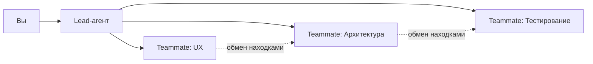

# Уровень 8: Мультиагентные команды (Agent Teams)

> ⚠️ **Фича экспериментальная и по умолчанию выключена.** Прежде чем пробовать примеры из этого уровня, включите её переменной окружения `CLAUDE_CODE_EXPERIMENTAL_AGENT_TEAMS=1` -- иначе Claude просто не станет создавать teammates, и покажется, что ничего не работает.
>
> ```json
> // ~/.claude/settings.json
> {
>   "env": { "CLAUDE_CODE_EXPERIMENTAL_AGENT_TEAMS": "1" }
> }
> ```
>
> Как у всякой экспериментальной функции, детали поведения могут измениться.

## 🎯 Зачем нужны команды агентов

Представьте стройку. Один прораб может класть кирпичи, тянуть проводку и варить трубы -- но это займёт месяцы. А если нанять бригаду специалистов, каждый возьмётся за своё, и дом вырастет за недели. Agent Teams -- это та же идея: несколько Claude Code сессий работают параллельно, каждая в своём контексте.

Ключевое отличие от субагентов: субагенты -- это «сходи узнай и доложи». Команды -- это «давайте вместе обсудим, разделим работу и скоординируемся».



## 🔥 Архитектура: Lead + Teammates

Lead-агент -- это координатор. Он получает задачу, разбивает на части и раздаёт teammates. Каждый teammate работает в **отдельном контекстном окне** и может общаться с другими напрямую.

```text
# Запуск команды естественным языком
> Мне нужно добавить систему уведомлений. Создай команду:
  один teammate проектирует API, другой пишет миграции БД,
  третий делает React-компоненты.
```

Lead сам создаст teammates, назначит задачи и будет собирать результаты. Вы можете переключаться между teammates в терминале, чтобы видеть прогресс или давать указания напрямую.

## 📌 Паттерны использования

### Параллельный code review

Три агента проверяют один PR с разных сторон:

- **Безопасность:** SQL-инъекции, XSS, утечки секретов
- **Архитектура:** SOLID, связность, зависимости
- **Стиль:** консистентность, именование, документация

### Competing hypotheses

Баг воспроизводится нестабильно? Запустите несколько агентов с разными гипотезами:

```text
> У нас рейс-кондишн в платёжном модуле. Создай команду:
  один ищет проблему в очереди задач,
  другой проверяет блокировки в БД,
  третий анализирует конкурентные запросы к API.
```

### Distributed research

Большая кодовая база, нужно понять «как тут всё устроено»:

```text
> Создай команду для анализа монорепо:
  один исследует фронтенд, другой -- бэкенд,
  третий -- инфраструктуру и CI/CD.
```

## ⚠️ Частые ошибки новичков

### 🐛 Команда для простой задачи

```text
# ❌ Плохо: overhead больше пользы
> Создай команду из 3 агентов чтобы поправить опечатку в README
```

Каждый teammate -- это отдельная сессия с собственным контекстом. Для простых задач используйте обычный режим или субагента.

### 🐛 Нет чётких ролей

```text
# ❌ Плохо: агенты будут дублировать работу
> Создай команду, пусть все проверят код

# ✅ Хорошо: каждый знает свою зону
> Создай команду: один проверяет безопасность,
  другой -- производительность, третий -- тесты
```

## 💡 Когда Teams оправданы

| Ситуация | Рекомендация |
|----------|-------------|
| Простая задача, маленький проект | Обычный режим |
| Точечная задача без координации | Субагент |
| Сложная задача, нужна координация | **Agent Team** |
| Большая кодовая база, параллельный анализ | **Agent Team** |

## 📌 Мониторинг

Lead-агент отслеживает расход токенов по каждому teammate. Следите за `cost.total_cost_usd` в статусе -- команды потребляют ресурсы кратно числу участников. Display modes (`streaming`, `summary`, `results`) позволяют контролировать объём вывода от каждого teammate.
