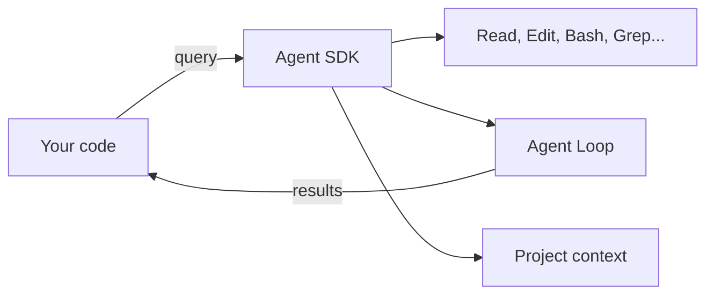

# Level 9: Claude Agent SDK

## 🎯 What is the Agent SDK

If Claude Code is a pilot who flies the plane themselves, the Agent SDK is the autopilot that your program controls. You get the same tools (Read, Edit, Bash, Grep...), the same agent loop and context -- but you call all of it from code.



## 🔥 Agent SDK vs. Client SDK

These are **different** things, and they're often confused:

| | Agent SDK | Client SDK (Anthropic SDK) |
|---|---|---|
| What it does | Runs an autonomous agent | Sends messages to the API |
| Tools | Built-in (Read, Edit, Bash...) | You write your own |
| Agent loop | Built in | You implement it yourself |
| Context | CLAUDE.md, project, git | Only what you pass in |
| Analogy | Hire a developer | Call a consultant |

## 📌 Basic Example

```typescript
import { query, ClaudeAgentOptions } from '@anthropic-ai/claude-agent-sdk'

const options: ClaudeAgentOptions = {
  allowedTools: ['Read', 'Edit', 'Bash', 'Glob', 'Grep'],
  maxTurns: 10
}

// Streaming responses
for await (const message of query({
  prompt: 'Find and fix the bug in auth.ts',
  options
})) {
  if (message.type === 'text') {
    process.stdout.write(message.content)
  }
}
```

## 🔥 Custom Tools

You can define your own tools, extending the agent's capabilities:

```typescript
const tools = [{
  name: 'deploy',
  description: 'Deploy service to staging',
  parameters: {
    service: { type: 'string', description: 'Service name' },
    version: { type: 'string', description: 'Version tag' }
  },
  execute: async ({ service, version }) => {
    const result = await deployToStaging(service, version)
    return { status: result.status, url: result.url }
  }
}]
```

## 📌 Key Capabilities

- **Sessions (resume):** save `session_id` and continue work between calls
- **Hooks from code:** `PreToolUse` and `PostToolUse` for validation and auditing
- **Programmatic subagents:** launch nested agents to decompose tasks
- **Cost tracking:** `cost.total_cost_usd` for monitoring spend
- **Structured outputs:** get results in JSON format

## 💡 CI/CD Integration

The Agent SDK is a great fit for automation:

```bash
# In a pipeline: automatic code review
claude -p "Review the changes in this PR for security issues" \
  --allowedTools Read,Grep,Glob \
  --output-format json
```

## ⚠️ Common Beginner Mistakes

### 🐛 Confusing the SDKs

```typescript
// ❌ This is the Client SDK — no agent loop, no tools
import Anthropic from '@anthropic-ai/sdk'
const client = new Anthropic()
await client.messages.create({ model: 'claude-opus-4-8', messages: [...] })

// ✅ This is the Agent SDK — a full-fledged agent
import { query } from '@anthropic-ai/claude-agent-sdk'
for await (const msg of query({ prompt: '...' })) { ... }
```

### 🐛 Overly Broad Permissions

```typescript
// ❌ The agent can do anything
const options = { allowedTools: ['Bash'] } // rm -rf ?

// ✅ The minimal necessary tools
const options = { allowedTools: ['Read', 'Grep', 'Glob'] }
```

## 📌 Hosting

The Agent SDK runs on various platforms: a self-hosted server, Amazon Bedrock, Google Vertex AI. The choice depends on your security, latency, and cost requirements.
