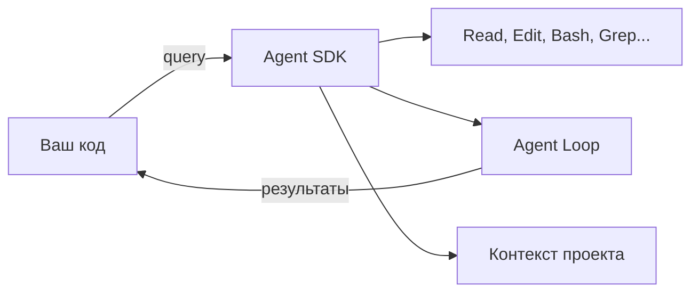

# Уровень 9: Claude Agent SDK

## 🎯 Что такое Agent SDK

Если Claude Code -- это пилот, который сам управляет самолётом, то Agent SDK -- это автопилот, которым управляет ваша программа. Вы получаете те же инструменты (Read, Edit, Bash, Grep...), тот же agent loop и контекст -- но вызываете всё это из кода.



## 🔥 Agent SDK vs Client SDK

Это **разные** вещи, и их часто путают:

| | Agent SDK | Client SDK (Anthropic SDK) |
|---|---|---|
| Что делает | Запускает автономного агента | Отправляет сообщения API |
| Инструменты | Встроенные (Read, Edit, Bash...) | Вы пишете сами |
| Agent loop | Встроенный | Вы реализуете сами |
| Контекст | CLAUDE.md, проект, git | Только то, что передали |
| Аналогия | Нанять разработчика | Позвонить консультанту |

## 📌 Базовый пример

```typescript
import { query, ClaudeAgentOptions } from '@anthropic-ai/claude-agent-sdk'

const options: ClaudeAgentOptions = {
  allowedTools: ['Read', 'Edit', 'Bash', 'Glob', 'Grep'],
  maxTurns: 10
}

// Стриминг ответов
for await (const message of query({
  prompt: 'Find and fix the bug in auth.ts',
  options
})) {
  if (message.type === 'text') {
    process.stdout.write(message.content)
  }
}
```

## 🔥 Custom Tools

Вы можете определить свои инструменты, расширяя возможности агента:

```typescript
const tools = [{
  name: 'deploy',
  description: 'Deploy service to staging',
  parameters: {
    service: { type: 'string', description: 'Service name' },
    version: { type: 'string', description: 'Version tag' }
  },
  execute: async ({ service, version }) => {
    const result = await deployToStaging(service, version)
    return { status: result.status, url: result.url }
  }
}]
```

## 📌 Ключевые возможности

- **Сессии (resume):** сохраняйте `session_id` и продолжайте работу между вызовами
- **Хуки из кода:** `PreToolUse` и `PostToolUse` для валидации и аудита
- **Субагенты программно:** запуск вложенных агентов для декомпозиции задач
- **Cost tracking:** `cost.total_cost_usd` для мониторинга расходов
- **Structured outputs:** получение результатов в JSON-формате

## 💡 Интеграция в CI/CD

Agent SDK идеально подходит для автоматизации:

```bash
# В пайплайне: автоматический code review
claude -p "Review the changes in this PR for security issues" \
  --allowedTools Read,Grep,Glob \
  --output-format json
```

## ⚠️ Частые ошибки новичков

### 🐛 Путаница SDK

```typescript
// ❌ Это Client SDK — нет agent loop, нет инструментов
import Anthropic from '@anthropic-ai/sdk'
const client = new Anthropic()
await client.messages.create({ model: 'claude-opus-4-6', messages: [...] })

// ✅ Это Agent SDK — полноценный агент
import { query } from '@anthropic-ai/claude-agent-sdk'
for await (const msg of query({ prompt: '...' })) { ... }
```

### 🐛 Слишком широкие разрешения

```typescript
// ❌ Агент может делать что угодно
const options = { allowedTools: ['Bash'] } // rm -rf ?

// ✅ Минимальные необходимые инструменты
const options = { allowedTools: ['Read', 'Grep', 'Glob'] }
```

## 📌 Hosting

Agent SDK работает на разных платформах: self-hosted сервер, Amazon Bedrock, Google Vertex AI. Выбор зависит от требований к безопасности, латентности и стоимости.
