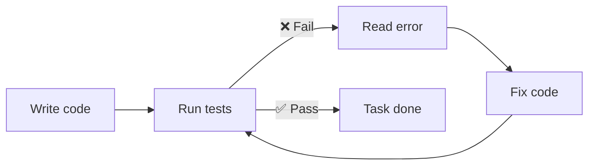

# Level 10: Designing a Repository for an Agent

## Introduction

Have you ever walked into someone else's apartment and immediately known where the kitchen, bathroom, and bedroom are? That's because the apartment is designed following clear conventions: wet areas near the pipes, bedroom farther from the entrance, kitchen next to the living room. You didn't read an "apartment README" — the layout speaks for itself.

A repository works the same way. A well-designed project "speaks for itself": the agent finds the right files in seconds, understands the architecture from the folder structure, and types hint at contracts between modules. A poorly designed one is a studio apartment with wardrobe partitions: everything is there, but you can't find anything.

🔥 **Key idea:** a project that's convenient for an agent is also convenient for people. Investments in structure pay off twice.

---

## Naming Conventions: grep-friendly Names

The agent searches for code through Glob (by file names) and Grep (by contents). File and function names are its search queries. If names are unpredictable, the agent wastes tokens cycling through options.

### Files

```
# ❌ Bad: impossible to find via glob pattern
src/utils/helpers.ts          # What kind of helpers? utils for what?
src/lib/misc.ts               # "Misc" — a useless name
src/components/Comp1.tsx      # What is Comp1?
src/hooks/useStuff.ts         # useStuff — what stuff?
src/api/index.ts              # 15 index.ts files in the project

# ✅ Good: self-documenting, grep-friendly
src/utils/date-formatting.ts
src/utils/price-calculation.ts
src/components/UserProfileCard.tsx
src/hooks/usePaymentStatus.ts
src/api/orders-api.ts
```

### Functions

```typescript
// ❌ Bad: ambiguous abbreviations
function proc(d: any) { ... }
function handleClick() { ... }
function calc(x: number, y: number) { ... }
function getData() { ... }

// ✅ Good: predictable, findable
function processRefundRequest(request: RefundRequest) { ... }
function handlePaymentFormSubmit(data: PaymentFormData) { ... }
function calculateShippingCost(weight: number, distance: number) { ... }
function fetchOrdersByCustomerId(customerId: string) { ... }
```

### The grep-friendly Test

💡 **Rule of thumb:** if you can't find a file via `glob **/*payment*` or a function via `grep "calculateShipping"`, then the agent won't be able to either. Try mentally "googling" your code — if the query isn't obvious, the name should be renamed.

💡 Use **consistent suffixes**: `*-service.ts` for business logic, `*-handler.ts` for handlers, `*-types.ts` for types. The agent sees the pattern and immediately knows where to look.

---

## Monorepo vs Polyrepo

The choice of repository architecture directly impacts agent effectiveness.

### Monorepo

```
project/
├── CLAUDE.md              # General context + project map
├── packages/
│   ├── api/
│   │   ├── CLAUDE.md      # API service context
│   │   └── src/
│   ├── web/
│   │   ├── CLAUDE.md      # Frontend context
│   │   └── src/
│   └── shared/
│       └── src/
└── tools/
```

**Pros for the agent:**
- Sees all dependencies between services
- Can search across the entire project via Grep
- One `CLAUDE.md` describes the big picture

**Cons for the agent:**
- Lots of "noise" — files unrelated to the task
- Context window fills up faster
- Glob may return too many results

**Solution:** per-folder `CLAUDE.md` with responsibility zones:

```markdown
# CLAUDE.md (monorepo root)

## Structure
- `packages/api` — REST API on Express (port 3001)
- `packages/web` — React SPA (port 3000)
- `packages/shared` — shared types and utilities

## Dependencies
web → shared → api (web imports types from shared, api too)

## How to run
- `npm run dev` — start all services
- `npm run test` — tests for all packages
- `npm run test:api` — API tests only
```

### Polyrepo

Each service in a separate repository with its own CLAUDE.md. **Pros:** clean context, less noise, token savings. **Cons:** the agent can't see code from other services and can't verify API compatibility. **Solution:** explicitly describe external dependencies in CLAUDE.md.

---

## README-Driven Development

README is not just documentation for people. For an agent, README is a **specification**. A well-written README allows the agent to understand the project without reading code.

```markdown
# Payment Service

## What it does
Processes payments via Stripe and PayPal.

## How to run
npm run dev          # Local server on :3001
npm run test         # Unit tests
npm run test:e2e     # E2E via Playwright

## Architecture
- `src/handlers/` — HTTP request handlers
- `src/services/` — business logic (Stripe, PayPal integration)
- `src/models/` — Prisma models and migrations
- `src/queue/` — async task processing (BullMQ)

## API endpoints
- POST /api/payments — create a payment
- GET  /api/payments/:id — payment status
- POST /api/refunds — refund

## Environment variables
- STRIPE_SECRET_KEY — Stripe key
- DATABASE_URL — PostgreSQL connection string
```

---

## Tests as a Feedback Loop

Tests are the **most powerful tool** for an agent after the code itself. With tests, the cycle closes:



### Which Tests Help the Agent

```typescript
// ❌ Bad: stub test that checks nothing
test('payment works', () => {
  expect(true).toBe(true)
})

// ❌ Bad: test with vague assertion
test('creates payment', async () => {
  const result = await createPayment(data)
  expect(result).toBeTruthy() // What exactly are we checking?
})

// ✅ Good: specific assertions, clear expectations
test('creates payment with correct amount and status', async () => {
  const payment = await createPayment({
    amount: 1500,
    currency: 'USD',
    customerId: 'cust_123'
  })

  expect(payment.amount).toBe(1500)
  expect(payment.currency).toBe('USD')
  expect(payment.status).toBe('pending')
  expect(payment.customerId).toBe('cust_123')
})

// ✅ Good: test for an error scenario
test('rejects payment with negative amount', async () => {
  await expect(
    createPayment({ amount: -100, currency: 'USD', customerId: 'cust_123' })
  ).rejects.toThrow('Amount must be positive')
})
```

💡 If a test fails with `Expected true, received false`, the agent won't understand what went wrong. If a test fails with `Expected payment.status to be "pending", received "failed"` — the agent knows where to dig. Unit tests with specific error messages are the most useful for the agent.

---

## Verification-Driven Development

Give the agent **verifiable criteria**, not abstract wishes. This is the most effective way to get a quality result.

```text
# ❌ Bad: no success criteria
> Improve API performance
> Make the code cleaner

# ✅ Good: specific metrics and checks
> Optimize getOrdersByCustomer: N+1 → 1 DB query.
  Test: npm run test -- orders.test.ts

# ✅ Good: checklist
> Add validation to POST /api/payments:
  - amount > 0, otherwise 400
  - currency in [USD, EUR, GBP], otherwise 400
  - customerId exists in DB, otherwise 404
  All cases covered by tests.
```

---

## The "Explore -> Plan -> Code" Pattern (Plan Mode)

For complex tasks, a three-step approach works effectively:

```text
# Step 1: Explore — agent studies the codebase
> Explore how the authorization system is structured. Don't change code.
  Tell me: which middlewares are used, where tokens are stored,
  how the refresh flow works.

# Step 2: Plan — agent proposes a plan
> Based on the research, propose a plan for adding 2FA:
  list of files to change, new dependencies, tests.
  Don't write code, only the plan.

# Step 3: Code — agent implements
> Implement the plan from the previous step. After each change
  run npm run test to make sure nothing broke.
```

This pattern is especially useful for:
- Unfamiliar codebases
- Large refactorings
- Tasks with non-obvious solutions

---

## Typing as Documentation

TypeScript and type hints are not just error prevention. For an agent, types are **contracts** that describe what a function accepts and returns.

```typescript
// ❌ Bad: agent doesn't know what comes in and goes out
function process(data: any): any {
  // 100 lines of code...
  return result
}

// ✅ Good: types describe the contract fully
interface OrderInput {
  customerId: string
  items: Array<{ productId: string, quantity: number }>
  shippingAddress: Address
  promoCode?: string
}

interface OrderResult {
  orderId: string
  total: number
  estimatedDelivery: Date
  status: 'created' | 'pending_payment'
}

function processOrder(input: OrderInput): Promise<OrderResult> {
  // The agent knows exactly what comes in and what goes out
}
```

Linters and formatters (ESLint, Prettier) are another feedback loop. The agent runs `npm run lint` after changes and immediately sees issues.

---

## ⚠️ Common Beginner Mistakes

### 🐛 1. No CLAUDE.md

> **Why this is a mistake:** without CLAUDE.md, the agent starts "exploration" — reads package.json, tsconfig, searches for README, scans the structure. That's 5-10 thousand tokens on what can be described in 30 lines.

```markdown
# ✅ Minimal CLAUDE.md
## Project
E-commerce API on Express + Prisma + PostgreSQL

## Structure
- src/handlers/ — HTTP handlers
- src/services/ — business logic
- src/models/ — Prisma schema and migrations

## Commands
- npm run dev — start
- npm run test — tests
- npm run lint — linter
```

### 🐛 2. Meaningless File Names

```
# ❌
src/utils.ts         # 500 lines of "everything"
src/helpers/index.ts # Helpers for what?
src/types.ts         # Types for the entire app in one file
```

> **Why this is a mistake:** the agent can't find the needed code by pattern. `glob **/*utils*` returns one huge file, and the agent has to read it all.

```
# ✅
src/utils/date-formatting.ts    # 30 lines
src/utils/price-calculation.ts  # 40 lines
src/utils/string-validation.ts  # 25 lines
src/types/order-types.ts
src/types/user-types.ts
```

### 🐛 3. Tests Without Assertions

```typescript
// ❌ Bad: test "passes" but checks nothing
test('handles order', async () => {
  await handleOrder(mockData) // No expect()
})
```

> **Why this is a mistake:** the agent runs tests and sees "all green". But the tests check nothing — the agent got a false positive signal about code correctness.

---

## 📌 Agent-Friendly Project Checklist

| Aspect | Bad | Good |
|--------|-----|------|
| Structure | Files scattered without logic | Folders by modules/features |
| Names | `helpers.ts`, `Comp1.tsx` | `date-formatting.ts`, `UserCard.tsx` |
| CLAUDE.md | Missing | Present, with project map |
| Tests | None or empty | Cover core logic |
| Typing | `any` everywhere | Strict types on interfaces |
| Linter | Not configured | ESLint + Prettier |
| README | Missing or outdated | Current, with startup commands |

---

## 📌 Summary

- 🔥 Project structure directly impacts agent work quality
- 📌 Grep-friendly names — the agent searches just like you search in Google
- 💡 CLAUDE.md saves thousands of tokens on project "exploration"
- ✅ Tests — the most important feedback loop for the agent
- 🎯 Verification-driven development: give verifiable criteria, not abstract wishes
- ⚠️ Typing is documentation: `any` for the agent means "I don't know what's here"
- 📌 The explore -> plan -> code pattern helps in unfamiliar codebases
