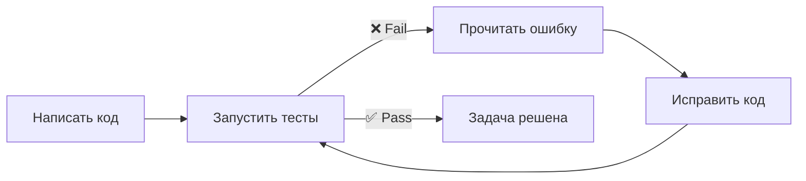

# Уровень 10: Проектирование репозитория под агента

## Введение

Вы когда-нибудь заходили в чужую квартиру и сразу понимали, где кухня, где ванная, где спальня? Это потому что квартира спроектирована по понятным конвенциям: мокрые зоны у стояка, спальня дальше от входа, кухня рядом с гостиной. Вы не читали «README квартиры» -- планировка говорит сама за себя.

Репозиторий работает точно так же. Хорошо спроектированный проект «говорит сам за себя»: агент находит нужные файлы за секунды, понимает архитектуру из структуры папок, а типы подсказывают контракты между модулями. Плохо спроектированный -- это квартира-студия с перегородками из шкафов: вроде всё есть, но ничего не найдёшь.

🔥 **Ключевая идея:** проект, удобный для агента, удобен и для людей. Инвестиции в структуру окупаются дважды.

---

## Naming Conventions: grep-friendly имена

Агент ищет код через Glob (по именам файлов) и Grep (по содержимому). Имена файлов и функций -- это его поисковые запросы. Если имена непредсказуемы, агент тратит токены на перебор вариантов.

### Файлы

```
# ❌ Плохо: невозможно найти по glob-паттерну
src/utils/helpers.ts          # Что за helpers? utils для чего?
src/lib/misc.ts               # «Разное» — бесполезное имя
src/components/Comp1.tsx      # Comp1 — это что?
src/hooks/useStuff.ts         # useStuff — какой stuff?
src/api/index.ts              # 15 файлов index.ts в проекте

# ✅ Хорошо: самодокументирующиеся, grep-friendly
src/utils/date-formatting.ts
src/utils/price-calculation.ts
src/components/UserProfileCard.tsx
src/hooks/usePaymentStatus.ts
src/api/orders-api.ts
```

### Функции

```typescript
// ❌ Плохо: неоднозначные сокращения
function proc(d: any) { ... }
function handleClick() { ... }
function calc(x: number, y: number) { ... }
function getData() { ... }

// ✅ Хорошо: предсказуемые, находимые
function processRefundRequest(request: RefundRequest) { ... }
function handlePaymentFormSubmit(data: PaymentFormData) { ... }
function calculateShippingCost(weight: number, distance: number) { ... }
function fetchOrdersByCustomerId(customerId: string) { ... }
```

### Тест на grep-friendly

💡 **Правило большого пальца:** если вы не можете найти файл через `glob **/*payment*` или функцию через `grep "calculateShipping"`, то и агент не сможет. Попробуйте мысленно «загуглить» ваш код -- если запрос неочевиден, имя стоит переименовать.

💡 Используйте **консистентные суффиксы**: `*-service.ts` для бизнес-логики, `*-handler.ts` для обработчиков, `*-types.ts` для типов. Агент видит паттерн и сразу знает, где что искать.

---

## Монорепо vs Полирепо

Выбор архитектуры репозитория напрямую влияет на эффективность агента.

### Монорепо

```
project/
├── CLAUDE.md              # Общий контекст + карта проекта
├── packages/
│   ├── api/
│   │   ├── CLAUDE.md      # Контекст API-сервиса
│   │   └── src/
│   ├── web/
│   │   ├── CLAUDE.md      # Контекст фронтенда
│   │   └── src/
│   └── shared/
│       └── src/
└── tools/
```

**Плюсы для агента:**
- Видит все зависимости между сервисами
- Может искать по всему проекту через Grep
- Один `CLAUDE.md` описывает общую картину

**Минусы для агента:**
- Много «шума» -- файлы, не относящиеся к задаче
- Контекстное окно заполняется быстрее
- Glob может вернуть слишком много результатов

**Решение:** per-folder `CLAUDE.md` с указанием зоны ответственности:

```markdown
# CLAUDE.md (корень монорепо)

## Структура
- `packages/api` — REST API на Express (порт 3001)
- `packages/web` — React SPA (порт 3000)
- `packages/shared` — общие типы и утилиты

## Зависимости
web → shared → api (web импортирует типы из shared, api тоже)

## Как запускать
- `npm run dev` — запуск всех сервисов
- `npm run test` — тесты всех пакетов
- `npm run test:api` — только API-тесты
```

### Полирепо

Каждый сервис в отдельном репозитории со своим CLAUDE.md. **Плюсы:** чистый контекст, меньше шума, экономия токенов. **Минусы:** агент не видит код других сервисов и не может проверить совместимость API. Решение -- явно описывать внешние зависимости в CLAUDE.md.

---

## README-Driven Development

README -- это не просто документация для людей. Для агента README -- это **спецификация**. Хорошо написанный README позволяет агенту понять проект без чтения кода.

```markdown
# Payment Service

## Что делает
Обрабатывает платежи через Stripe и PayPal.

## Как запустить
npm run dev          # Локальный сервер на :3001
npm run test         # Unit-тесты
npm run test:e2e     # E2E через Playwright

## Архитектура
- `src/handlers/` — обработчики HTTP-запросов
- `src/services/` — бизнес-логика (Stripe, PayPal интеграция)
- `src/models/` — Prisma-модели и миграции
- `src/queue/` — обработка асинхронных задач (BullMQ)

## API endpoints
- POST /api/payments — создание платежа
- GET  /api/payments/:id — статус платежа
- POST /api/refunds — возврат средств

## Переменные окружения
- STRIPE_SECRET_KEY — ключ Stripe
- DATABASE_URL — строка подключения к PostgreSQL
```

---

## Тесты как Feedback Loop

Тесты -- это **самый мощный инструмент** для агента после самого кода. С тестами цикл замыкается:



### Какие тесты помогают агенту

```typescript
// ❌ Плохо: тест-заглушка, который ничего не проверяет
test('payment works', () => {
  expect(true).toBe(true)
})

// ❌ Плохо: тест с расплывчатым assert
test('creates payment', async () => {
  const result = await createPayment(data)
  expect(result).toBeTruthy() // Что конкретно проверяем?
})

// ✅ Хорошо: конкретные проверки, понятные ожидания
test('creates payment with correct amount and status', async () => {
  const payment = await createPayment({
    amount: 1500,
    currency: 'USD',
    customerId: 'cust_123'
  })

  expect(payment.amount).toBe(1500)
  expect(payment.currency).toBe('USD')
  expect(payment.status).toBe('pending')
  expect(payment.customerId).toBe('cust_123')
})

// ✅ Хорошо: тест на ошибочный сценарий
test('rejects payment with negative amount', async () => {
  await expect(
    createPayment({ amount: -100, currency: 'USD', customerId: 'cust_123' })
  ).rejects.toThrow('Amount must be positive')
})
```

💡 Если тест падает с сообщением `Expected true, received false`, агент не поймёт, что пошло не так. Если тест падает с `Expected payment.status to be "pending", received "failed"` -- агент знает, куда копать. Unit-тесты с конкретными ошибками -- самое полезное для агента.

---

## Verification-Driven Development

Давайте агенту **проверяемые критерии**, а не абстрактные пожелания. Это самый эффективный способ получить качественный результат.

```text
# ❌ Плохо: нет критериев успеха
> Улучши производительность API
> Сделай код чище

# ✅ Хорошо: конкретные метрики и проверки
> Оптимизируй getOrdersByCustomer: N+1 → 1 запрос к БД.
  Тест: npm run test -- orders.test.ts

# ✅ Хорошо: чеклист
> Добавь валидацию к POST /api/payments:
  - amount > 0, иначе 400
  - currency из [USD, EUR, GBP], иначе 400
  - customerId существует в БД, иначе 404
  Все кейсы покрыты тестами.
```

---

## Паттерн «Explore -> Plan -> Code» (Plan Mode)

Для сложных задач эффективен трёхэтапный подход:

```text
# Этап 1: Explore — агент изучает кодовую базу
> Изучи, как устроена система авторизации. Не меняй код.
  Расскажи: какие middlewares используются, где хранятся токены,
  как работает refresh flow.

# Этап 2: Plan — агент предлагает план
> На основе исследования предложи план добавления 2FA:
  список файлов для изменения, новые зависимости, тесты.
  Не пиши код, только план.

# Этап 3: Code — агент реализует
> Реализуй план из предыдущего шага. После каждого изменения
  запускай npm run test, чтобы убедиться, что ничего не сломалось.
```

Этот паттерн особенно полезен для:
- Незнакомых кодовых баз
- Крупных рефакторингов
- Задач с неочевидным решением

---

## Типизация как документация

TypeScript и type hints -- это не просто защита от ошибок. Для агента типы -- это **контракты**, которые описывают, что функция принимает и возвращает.

```typescript
// ❌ Плохо: агент не знает, что приходит и уходит
function process(data: any): any {
  // 100 строк кода...
  return result
}

// ✅ Хорошо: типы описывают контракт полностью
interface OrderInput {
  customerId: string
  items: Array<{ productId: string, quantity: number }>
  shippingAddress: Address
  promoCode?: string
}

interface OrderResult {
  orderId: string
  total: number
  estimatedDelivery: Date
  status: 'created' | 'pending_payment'
}

function processOrder(input: OrderInput): Promise<OrderResult> {
  // Агент точно знает, что на входе и на выходе
}
```

Линтеры и форматтеры (ESLint, Prettier) -- ещё один feedback loop. Агент запускает `npm run lint` после изменений и сразу видит проблемы.

---

## ⚠️ Частые ошибки новичков

### 🐛 1. Нет CLAUDE.md

> **Почему это ошибка:** без CLAUDE.md агент начинает «разведку» -- читает package.json, tsconfig, ищет README, сканирует структуру. Это 5-10 тысяч токенов на то, что можно описать в 30 строках.

```markdown
# ✅ Минимальный CLAUDE.md
## Проект
E-commerce API на Express + Prisma + PostgreSQL

## Структура
- src/handlers/ — HTTP обработчики
- src/services/ — бизнес-логика
- src/models/ — Prisma-схема и миграции

## Команды
- npm run dev — запуск
- npm run test — тесты
- npm run lint — линтер
```

### 🐛 2. Бессмысленные имена файлов

```
# ❌ 
src/utils.ts         # 500 строк «всего подряд»
src/helpers/index.ts # Помощники чего?
src/types.ts         # Типы всего приложения в одном файле
```

> **Почему это ошибка:** агент не может найти нужный код по паттерну. `glob **/*utils*` вернёт один огромный файл, и агенту придётся читать всё целиком.

```
# ✅
src/utils/date-formatting.ts    # 30 строк
src/utils/price-calculation.ts  # 40 строк
src/utils/string-validation.ts  # 25 строк
src/types/order-types.ts
src/types/user-types.ts
```

### 🐛 3. Тесты без ассертов

```typescript
// ❌ Плохо: тест «проходит», но ничего не проверяет
test('handles order', async () => {
  await handleOrder(mockData) // Нет expect()
})
```

> **Почему это ошибка:** агент запускает тесты и видит «все зелёные». Но тесты ничего не проверяют -- агент получил ложноположительный сигнал о корректности кода.

---

## 📌 Чеклист Agent-Friendly проекта

| Аспект | Плохо | Хорошо |
|--------|-------|--------|
| Структура | Файлы раскиданы без логики | Папки по модулям/фичам |
| Имена | `helpers.ts`, `Comp1.tsx` | `date-formatting.ts`, `UserCard.tsx` |
| CLAUDE.md | Отсутствует | Есть, с картой проекта |
| Тесты | Нет или пустые | Покрывают основную логику |
| Типизация | `any` повсюду | Строгие типы на интерфейсах |
| Линтер | Не настроен | ESLint + Prettier |
| README | Отсутствует или устарел | Актуальный, с командами запуска |

---

## 📌 Итоги

- 🔥 Структура проекта напрямую влияет на качество работы агента
- 📌 Grep-friendly имена -- агент ищет так же, как вы ищете в Google
- 💡 CLAUDE.md экономит тысячи токенов на «разведке» проекта
- ✅ Тесты -- самый важный feedback loop для агента
- 🎯 Verification-driven development: давайте проверяемые критерии, а не абстрактные пожелания
- ⚠️ Типизация -- это документация: `any` для агента значит «я не знаю, что тут»
- 📌 Паттерн explore -> plan -> code помогает в незнакомых кодовых базах
