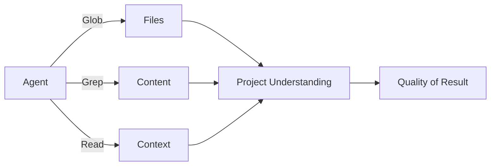
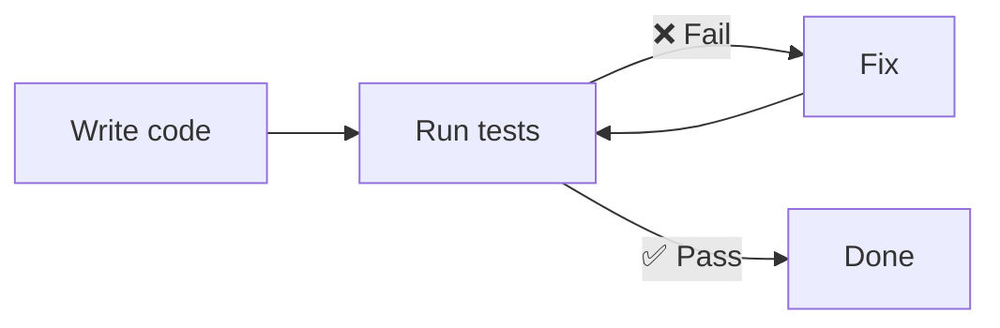

# Level 10: Designing a Repository for an Agent

## 🎯 Why Project Structure Matters

An agent "sees" your project through tools: Glob searches for files by patterns, Grep searches for text, Read reads contents. If a project is a library, then a good structure is a clear catalog with precise navigation. A bad one is a pile of books on the floor where even the librarian can't find what they need.



## 🔥 Naming Conventions

File and function names are search queries for the agent.

```
# ❌ Bad: agent won't find what it needs
src/utils/helpers.ts        # What kind of helpers?
src/lib/misc.ts             # What is misc?
src/components/Comp1.tsx    # What does Comp1 do?
handleClick()               # Which click? Where?

# ✅ Good: grep-friendly, self-documenting
src/utils/date-formatting.ts
src/utils/price-calculation.ts
src/components/UserProfileCard.tsx
handlePaymentFormSubmit()
```

💡 **Rule:** if you can't find a file with `glob **/*payment*`, then the agent won't be able to either.

## 📌 Monorepo vs Polyrepo

| Aspect | Monorepo | Polyrepo |
|--------|----------|----------|
| Context | All code in one place | Clean context of a single service |
| Connections | Agent sees all dependencies | Agent doesn't see other services |
| Noise | Many irrelevant files | Minimal noise |
| CLAUDE.md | One file + per-folder | Its own file in each repo |

For a monorepo, a good CLAUDE.md with a project map is critical so the agent doesn't waste context studying irrelevant parts.

## 🔥 Tests as a Feedback Loop

Tests are the **most important** tool for an agent after the code itself. The agent's work cycle:



```typescript
// ❌ Bad: agent doesn't know if the code works correctly
// No tests at all

// ✅ Good: agent runs tests and sees the result
describe('calculateDiscount', () => {
  it('applies 10% for orders over $100', () => {
    expect(calculateDiscount(150)).toBe(15)
  })
  it('returns 0 for orders under $100', () => {
    expect(calculateDiscount(50)).toBe(0)
  })
})
```

Good tests = a good agent. Without tests, the agent works blind.

## 📌 Verification-Driven Development

Give the agent **verifiable criteria**, not abstract wishes:

```text
# ❌ Bad: no success criteria
> Make authorization better

# ✅ Good: the agent knows when the task is done
> Add rate limiting to the /api/login endpoint:
  - Maximum 5 attempts per 15 minutes from one IP
  - After exceeding — respond with 429
  - Test: 6 consecutive requests → last one gets 429
```

## ⚠️ Common Beginner Mistakes

### 🐛 No CLAUDE.md

Without CLAUDE.md, the agent spends tens of thousands of tokens exploring the project structure. With CLAUDE.md, it immediately knows where everything is.

### 🐛 Untyped Code

```typescript
// ❌ Bad: agent doesn't understand contracts
function process(data: any): any { ... }

// ✅ Good: types are documentation for the agent
function processOrder(order: Order): ProcessedOrder { ... }
```

## 💡 "Agent-Friendly" Project Checklist

- [ ] Clear folder structure with descriptive names
- [ ] CLAUDE.md with context and navigation
- [ ] Tests covering core business logic
- [ ] TypeScript / type hints on key modules
- [ ] Linters and formatters configured
- [ ] README describes how to run and test
