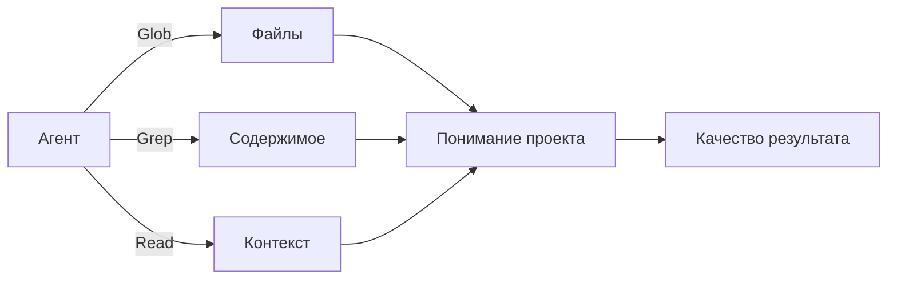
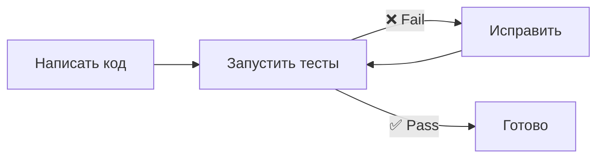

# Уровень 10: Проектирование репозитория под агента

## 🎯 Почему структура проекта решает

Агент «видит» ваш проект через инструменты: Glob ищет файлы по паттернам, Grep ищет текст, Read читает содержимое. Если проект -- это библиотека, то хорошая структура -- это понятный каталог с чёткой навигацией. Плохая -- это свалка книг на полу, где даже библиотекарь не найдёт нужную.



## 🔥 Naming Conventions

Имена файлов и функций -- это поисковые запросы для агента.

```
# ❌ Плохо: агент не найдёт нужное
src/utils/helpers.ts        # Что за helpers?
src/lib/misc.ts             # Что за misc?
src/components/Comp1.tsx    # Что делает Comp1?
handleClick()               # Какой click? Где?

# ✅ Хорошо: grep-friendly, самодокументирующиеся
src/utils/date-formatting.ts
src/utils/price-calculation.ts
src/components/UserProfileCard.tsx
handlePaymentFormSubmit()
```

💡 **Правило:** если вы не можете найти файл по `glob **/*payment*`, значит агент тоже не сможет.

## 📌 Монорепо vs Полирепо

| Аспект | Монорепо | Полирепо |
|--------|----------|----------|
| Контекст | Весь код в одном месте | Чистый контекст одного сервиса |
| Связи | Агент видит все зависимости | Агент не видит другие сервисы |
| Шум | Много нерелевантных файлов | Минимум шума |
| CLAUDE.md | Один файл + per-folder | Свой файл в каждом репо |

Для монорепо критичен хороший CLAUDE.md с картой проекта, чтобы агент не тратил контекст на изучение нерелевантных частей.

## 🔥 Тесты как feedback loop

Тесты -- это **самый важный** инструмент агента после кода. Цикл работы агента:



```typescript
// ❌ Плохо: агент не знает, правильно ли работает код
// Нет тестов вообще

// ✅ Хорошо: агент запускает тесты и видит результат
describe('calculateDiscount', () => {
  it('applies 10% for orders over $100', () => {
    expect(calculateDiscount(150)).toBe(15)
  })
  it('returns 0 for orders under $100', () => {
    expect(calculateDiscount(50)).toBe(0)
  })
})
```

Хорошие тесты = хороший агент. Без тестов агент работает вслепую.

## 📌 Verification-Driven Development

Давайте агенту **проверяемые критерии**, а не абстрактные пожелания:

```text
# ❌ Плохо: нет критериев успеха
> Сделай авторизацию получше

# ✅ Хорошо: агент знает, когда задача выполнена
> Добавь rate limiting к эндпоинту /api/login:
  - Максимум 5 попыток за 15 минут с одного IP
  - После превышения — ответ 429
  - Тест: 6 запросов подряд → последний получает 429
```

## ⚠️ Частые ошибки новичков

### 🐛 Нет CLAUDE.md

Без CLAUDE.md агент тратит десятки тысяч токенов на разведку структуры проекта. С CLAUDE.md он сразу знает, где что лежит.

### 🐛 Нетипизированный код

```typescript
// ❌ Плохо: агент не понимает контракты
function process(data: any): any { ... }

// ✅ Хорошо: типы — это документация для агента
function processOrder(order: Order): ProcessedOrder { ... }
```

## 💡 Чеклист «Agent-Friendly» проекта

- [ ] Понятная структура папок с говорящими именами
- [ ] CLAUDE.md с контекстом и навигацией
- [ ] Тесты покрывают основную бизнес-логику
- [ ] TypeScript / type hints на ключевых модулях
- [ ] Линтеры и форматтеры настроены
- [ ] README описывает как запустить и протестировать
