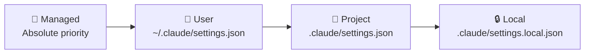

# Level 12: Teamwork and Enterprise

## Introduction

So far we've talked about Claude Code as a single developer's tool. But real projects involve teams: 5, 20, 100 people. Each configures the agent their own way, each has their own habits and standards. Without shared rules, the team gets a codebase that looks like a patchwork quilt.

Analogy: imagine a restaurant where every cook follows their own recipe. One adds salt to taste, another by grams, a third forgets it altogether. The result — every dish tastes different. CLAUDE.md is the restaurant's cookbook: a single set of recipes everyone follows.

In this level we'll cover: how to standardize team workflows, how the organization controls security, and how to scale Claude Code to dozens and hundreds of developers.

---

## CLAUDE.md in Git: Team Shared Standards

### What to Commit

CLAUDE.md in the repository root is the main source of rules for the whole team. It's versioned in git, goes through code review, and evolves with the project.

```
project/
  CLAUDE.md                          # Team standards
  .claude/
    settings.json                    # Team permissions
    rules/
      backend.md                     # Backend rules
      frontend.md                    # Frontend rules
      testing.md                     # Testing rules
    skills/
      deploy/SKILL.md                # Deploy skill
      migrate/SKILL.md               # Migration skill
    agents/
      code-reviewer/AGENT.md         # Code review agent
```

Everything listed above is committed to git. Each change goes through code review — just like any other code.

### What NOT to Commit

```bash
# .gitignore
.claude/settings.local.json    # Developer's personal settings
.claude/todos/                 # Personal TODO lists
```

`settings.local.json` contains paths specific to your machine, personal permissions, and environment settings. Your colleague has a different username, different OS, different toolset.

### Good CLAUDE.md Structure for a Team

```markdown
# Project: E-Commerce Platform

## Stack
- Backend: Node.js + NestJS + TypeScript
- Frontend: React 19 + Vite + CSS Modules
- Database: PostgreSQL + Prisma ORM
- Tests: Vitest (unit), Playwright (e2e)

## Conventions
- No semicolons, single quotes
- Functional React components only
- All API endpoints must have OpenAPI decorators
- Error responses follow RFC 7807 Problem Details

## Architecture
- src/api/ — REST controllers
- src/services/ — business logic
- src/repositories/ — data access
- src/components/ — React components

## Common Commands
- `npm test` — run unit tests
- `npm run test:e2e` — run e2e tests
- `npm run lint` — ESLint + Prettier
- `npx prisma migrate dev` — apply DB migrations
```

💡 **Tip:** CLAUDE.md should be short enough (up to 200 lines) to not waste context. Details go into `.claude/rules/` and skills.

---

## Managed Settings for an Organization

### What Are Managed Settings

Managed settings are configurations set by DevOps or the Security team at the **operating system** level. They have absolute priority: neither the user, the project, nor local settings can override them.



### Managed File Locations

| OS | Directory |
|----|-----------|
| macOS | `/Library/Application Support/ClaudeCode/` |
| Linux | `/etc/claude-code/` |

These directories require root privileges to write — a regular developer cannot change managed settings.

### Typical Managed Policy

```json
{
  "permissions": {
    "disableBypassPermissionsMode": "disable",
    "ask": ["Bash"],
    "deny": ["WebSearch", "WebFetch"]
  },
  "allowManagedPermissionRulesOnly": true,
  "allowManagedHooksOnly": true,
  "sandbox": {
    "autoAllowBashIfSandboxed": false,
    "network": {
      "allowedDomains": [],
      "allowLocalBinding": false
    }
  }
}
```

**Breakdown of key parameters:**

**`allowManagedPermissionRulesOnly: true`** — developers can't add their own allow rules. Only the organization decides what's allowed.

**`allowManagedHooksOnly: true`** — only the organization can configure hooks. Prevents a situation where a developer creates a hook that disables logging.

**`disableBypassPermissionsMode: "disable"`** — the unrestricted mode is blocked. Nobody can disable all security checks.

### Managed Permissions for Different Teams

An organization can create different policies for different scenarios:

```json
// For CI/CD servers — strict policy
{
  "permissions": {
    "allow": ["Bash(npm test*)", "Bash(npm run build*)"],
    "deny": ["Bash(npm publish*)", "Bash(curl*)", "WebFetch"]
  }
}
```

```json
// For developers — moderate policy
{
  "permissions": {
    "deny": ["Bash(rm -rf*)", "Bash(git push --force*)"],
    "disableBypassPermissionsMode": "disable"
  }
}
```

---

## Plugins: Packaging and Distribution

### Why Plugins Are Needed

You created a set of skills for deployment, validation hooks, and code review agents. Now 50 developers across three projects need them. Copy files manually? No — you package them into a plugin.

### Plugin Structure

```
my-company-plugin/
  plugin.json                    # Manifest
  skills/
    deploy/
      SKILL.md
      templates/
        deployment.yaml
    migrate/
      SKILL.md
  hooks/
    scripts/
      security/
        scan-secrets.sh
      workflow/
        update-status.sh
  agents/
    code-reviewer/
      AGENT.md
  mcp-servers/
    internal-docs/
      config.json
```

### plugin.json — Plugin Manifest

```json
{
  "name": "@mycompany/claude-plugin",
  "version": "1.2.0",
  "description": "Company-standard tools for Claude Code",
  "skills": ["skills/deploy", "skills/migrate"],
  "hooks": {
    "PreToolUse": [{
      "matcher": "Write|Edit",
      "hooks": [{
        "type": "command",
        "command": "bash ${CLAUDE_PLUGIN_ROOT}/hooks/scripts/security/scan-secrets.sh",
        "timeout": 30
      }]
    }],
    "PostToolUse": [{
      "matcher": "Bash",
      "hooks": [{
        "type": "command",
        "command": "bash ${CLAUDE_PLUGIN_ROOT}/hooks/scripts/workflow/update-status.sh",
        "timeout": 15
      }]
    }]
  },
  "agents": ["agents/code-reviewer"]
}
```

### Distribution Methods

| Method | When to use |
|--------|-------------|
| Private npm registry | Standard for JS/TS teams |
| Git repository | For organizations without an npm registry |
| Internal marketplace | Large companies with a plugin catalog |

```bash
# Install via npm
npm install --save-dev @mycompany/claude-plugin

# Or via git
# Specify the repository URL in configuration
```

---

## MCP Control via managed-mcp.json

### Why Restrict MCP Servers

An MCP server is a bridge between the agent and an external system (Jira, Slack, DB, API). Each connected server:
- Expands the attack surface (the server might be compromised)
- Increases cost (each call costs tokens)
- Potentially violates compliance (data might leak through a third-party server)

### managed-mcp.json

```json
{
  "allowedServers": [
    "github",
    "jira",
    "internal-docs-server"
  ],
  "blockedServers": ["*"],
  "requireApproval": true
}
```

- **`allowedServers`** — whitelist of allowed servers
- **`blockedServers: ["*"]`** — everything not in the whitelist is blocked
- **`requireApproval`** — new servers require administrator approval

---

## Rules with Path-Specific Targeting

### Different Rules for Different Project Parts

In a monorepo, backend and frontend live side by side, but they have completely different standards. `.claude/rules/` allows setting contextual rules:

```markdown
<!-- .claude/rules/backend.md -->
---
paths: ["src/api/**", "src/services/**", "src/repositories/**"]
---

## Backend Code Standards

- Use NestJS dependency injection patterns
- All endpoints must have `@ApiOperation` and `@ApiResponse` decorators
- Services must be stateless
- Repository methods return domain entities, not Prisma models
- Error responses follow RFC 7807 Problem Details format
- Log with structured logging (pino): `logger.info({ userId, action }, 'message')`
```

```markdown
<!-- .claude/rules/frontend.md -->
---
paths: ["src/components/**", "src/pages/**", "src/hooks/**"]
---

## Frontend Code Standards

- React functional components only (no class components)
- CSS Modules for styling (*.module.css)
- Props defined as TypeScript interfaces, exported separately
- Custom hooks prefixed with `use` and in `src/hooks/`
- No inline styles except dynamic values
- Use React.memo() only after profiling, not preemptively
```

```markdown
<!-- .claude/rules/testing.md -->
---
paths: ["**/*.test.ts", "**/*.test.tsx", "**/*.spec.ts"]
---

## Testing Standards

- Use Vitest for unit tests, Playwright for e2e
- Test file naming: `ComponentName.test.tsx`
- Follow AAA pattern: Arrange, Act, Assert
- Mock external dependencies, not internal modules
- Each test must have a descriptive name: `should return 404 when user not found`
```

Claude automatically loads relevant rules when working with files at the specified paths.

---

## Onboarding New Developers

### The Problem

A new developer joins the project: unfamiliar architecture, dozens of services, hundreds of files. Traditional onboarding: "read Confluence" (200 pages), "look at the code" (good luck), "ask a colleague" (they're busy).

### Solution: Claude Code as an Interactive Mentor

```bash
# Step 1: Learn the project
claude "Tell me about this project's architecture,
       main modules and how they interact"
# Claude reads CLAUDE.md, file structure and gives an overview

# Step 2: Set up the environment
/setup-dev-env
# Skill automatically configures local environment:
# installs dependencies, starts Docker,
# runs migrations, checks everything works

# Step 3: First task
claude "I want to add a new API endpoint for
       listing orders. Show me how this is done
       following project standards"
# Claude knows the conventions from CLAUDE.md and rules/backend.md
```

### Skills for Typical Tasks

```markdown
<!-- .claude/skills/onboarding/SKILL.md -->
---
name: onboarding
description: Guide new developer through project setup and architecture
---

## New Developer Onboarding

1. Read CLAUDE.md to understand stack and conventions
2. Check Docker is running: !`docker info`
3. Install dependencies: !`npm install`
4. Start infrastructure: !`docker compose up -d`
5. Run migrations: !`npx prisma migrate dev`
6. Verify tests pass: !`npm test`
7. Provide architecture overview based on file structure
```

### Agent for Junior Reviews

```markdown
<!-- .claude/agents/junior-reviewer/AGENT.md -->
---
name: junior-reviewer
description: Review code from new team members with detailed explanations
model: opus
---

You are a mentor for a new developer. When reviewing code:

1. Check compliance with .claude/rules/
2. Explain WHY rules exist, not just point out violations
3. Suggest alternatives with code examples
4. Praise good decisions — it's motivating
5. Evaluate test coverage
```

---

## Workflow Standardization

### Hooks for Consistency

```json
{
  "hooks": {
    "PreToolUse": [{
      "matcher": "Write|Edit",
      "hooks": [{
        "type": "prompt",
        "prompt": "Before writing code, verify it follows the project conventions from CLAUDE.md and applicable rules. Check: naming conventions, import style, error handling patterns."
      }]
    }],
    "Stop": [{
      "matcher": ".*",
      "hooks": [{
        "type": "command",
        "command": "npm run lint -- --quiet",
        "timeout": 30
      }]
    }]
  }
}
```

The Stop hook with a linter ensures the agent always leaves code in a consistent state.

---

## ⚠️ Common Beginner Mistakes

### 🐛 1. settings.local.json in Git

```bash
# ❌ Committed local settings
git add .claude/settings.local.json
```

> Your colleague has a different username, different paths, different OS. Their local settings will conflict with yours.

```bash
# ✅ Make sure the file is in .gitignore
echo ".claude/settings.local.json" >> .gitignore
```

### 🐛 2. allowManagedPermissionRulesOnly Without Testing

```json
// ❌ Rolled out to the entire organization at once
{
  "allowManagedPermissionRulesOnly": true,
  "permissions": {
    "allow": ["Read", "Glob"]
    // Forgot Bash(npm test*), Bash(git *)...
  }
}
// Result: agent can only read files
```

> Test managed policy on a pilot group. Start with denying dangerous actions, not with allowing only safe ones.

### 🐛 3. Giant CLAUDE.md

```markdown
<!-- ❌ 600 lines of rules, including recipes for each endpoint -->
# Project Rules
...600 lines...
```

> The agent wastes context reading. Split: base rules in CLAUDE.md (up to 200 lines), details in `.claude/rules/` with path-targeting, procedures in skills.

### 🐛 4. Plugin Without Versioning

Updated a plugin, broke a hook for 50 developers. Use semver, changelog, and gradual rollout.

---

## Best Practices

### For a Team (5-20 people)

1. CLAUDE.md in root with base rules (stack, conventions, commands)
2. `.claude/rules/` for path-specific standards
3. `.claude/skills/` for typical processes (deploy, migrate, review)
4. `.claude/settings.json` with reasonable allow/deny — discussed at code review
5. Onboarding skill for new team members

### For an Organization (50+ developers)

1. Managed policy: ban bypass, restrict MCP, mandatory sandbox
2. Plugin with corporate standards: hooks, skills, agents
3. managed-mcp.json with a whitelist of trusted servers
4. Gradual rollout with a pilot group
5. Regular audits: what's allowed, what's used, what incidents occurred

## 📌 Summary

- 🔥 CLAUDE.md + `.claude/settings.json` in git — unified standards, versioned and reviewed
- ✅ Managed policy — absolute priority, cannot be overridden by a developer
- 📌 Managed file locations: `/Library/Application Support/ClaudeCode/` (macOS), `/etc/claude-code/` (Linux)
- 💡 Plugins package skills + hooks + agents + MCP for reuse across projects
- ⚠️ managed-mcp.json restricts available MCP servers via whitelist
- 🎯 `.claude/rules/` with paths — different rules for backend, frontend, tests
- 🐛 Test managed policy on a pilot group before rolling out to the organization
