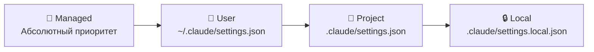
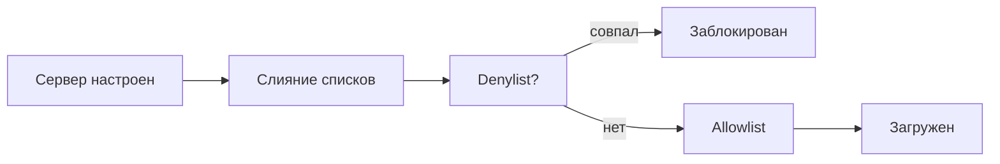

# Уровень 12: Командная работа и Enterprise

## Введение

До сих пор мы говорили о Claude Code как об инструменте одного разработчика. Но реальные проекты -- это команды: 5, 20, 100 человек. Каждый настраивает агент по-своему, у каждого свои привычки и стандарты. Без общих правил команда получает кодовую базу, которая выглядит как лоскутное одеяло.

Аналогия: представьте ресторан, где каждый повар готовит по своему рецепту. Один кладёт соль по вкусу, другой -- по граммам, третий вообще забывает. Результат -- каждое блюдо на вкус разное. CLAUDE.md -- это кулинарная книга ресторана: единые рецепты, которым следуют все.

В этом уровне мы разберём: как стандартизировать работу команды, как организация контролирует безопасность, и как масштабировать Claude Code на десятки и сотни разработчиков.

---

## CLAUDE.md в git: общие стандарты команды

### Что коммитить

CLAUDE.md в корне репозитория -- главный источник правил для всей команды. Он версионируется в git, проходит code review и эволюционирует вместе с проектом.

```
project/
  CLAUDE.md                          # Командные стандарты
  .claude/
    settings.json                    # Командные разрешения
    rules/
      backend.md                     # Правила для backend
      frontend.md                    # Правила для frontend
      testing.md                     # Правила для тестов
    skills/
      deploy/SKILL.md                # Навык деплоя
      migrate/SKILL.md               # Навык миграции
    agents/
      code-reviewer/AGENT.md         # Агент для ревью
```

Всё вышеперечисленное коммитится в git. Каждое изменение проходит code review -- как любой другой код.

### Что НЕ коммитить

```bash
# .gitignore
.claude/settings.local.json    # Личные настройки разработчика
.claude/todos/                 # Персональные TODO-списки
```

`settings.local.json` содержит пути, специфичные для вашей машины, персональные разрешения и настройки окружения. У коллеги другой username, другая ОС, другой набор инструментов.

### Структура хорошего CLAUDE.md для команды

```markdown
# Project: E-Commerce Platform

## Stack
- Backend: Node.js + NestJS + TypeScript
- Frontend: React 19 + Vite + CSS Modules
- Database: PostgreSQL + Prisma ORM
- Tests: Vitest (unit), Playwright (e2e)

## Conventions
- No semicolons, single quotes
- Functional React components only
- All API endpoints must have OpenAPI decorators
- Error responses follow RFC 7807 Problem Details

## Architecture
- src/api/ -- REST controllers
- src/services/ -- business logic
- src/repositories/ -- data access
- src/components/ -- React components

## Common Commands
- `npm test` -- run unit tests
- `npm run test:e2e` -- run e2e tests
- `npm run lint` -- ESLint + Prettier
- `npx prisma migrate dev` -- apply DB migrations
```

💡 **Совет:** CLAUDE.md должен быть достаточно коротким (до 200 строк), чтобы не тратить контекст. Детали -- в `.claude/rules/` и skills.

---

## Managed settings для организации

### Что такое managed settings

Managed settings -- это настройки, установленные DevOps или Security-командой на уровне **операционной системы**. Они имеют абсолютный приоритет: ни пользователь, ни проект, ни local settings не могут их переопределить.



### Расположение managed файлов

| ОС | Директория |
|----|-----------|
| macOS | `/Library/Application Support/ClaudeCode/` |
| Linux | `/etc/claude-code/` |

Эти директории требуют root-прав для записи -- обычный разработчик не может изменить managed settings.

### Типичная managed policy

```json
{
  "permissions": {
    "disableBypassPermissionsMode": "disable",
    "ask": ["Bash"],
    "deny": ["WebSearch", "WebFetch"]
  },
  "allowManagedPermissionRulesOnly": true,
  "allowManagedHooksOnly": true,
  "sandbox": {
    "autoAllowBashIfSandboxed": false,
    "network": {
      "allowedDomains": [],
      "allowLocalBinding": false
    }
  }
}
```

**Разбор ключевых параметров:**

**`allowManagedPermissionRulesOnly: true`** -- разработчики не могут добавлять свои allow-правила. Только организация решает, что разрешено.

**`allowManagedHooksOnly: true`** -- только организация может настраивать хуки. Предотвращает ситуацию, когда разработчик создаёт хук, отключающий логирование.

**`disableBypassPermissionsMode: "disable"`** -- режим без ограничений заблокирован. Никто не может отключить все проверки безопасности.

### Managed permissions для разных команд

Организация может создать разные политики для разных сценариев:

```json
// Для CI/CD серверов -- строгая политика
{
  "permissions": {
    "allow": ["Bash(npm test*)", "Bash(npm run build*)"],
    "deny": ["Bash(npm publish*)", "Bash(curl*)", "WebFetch"]
  }
}
```

```json
// Для разработчиков -- умеренная политика
{
  "permissions": {
    "deny": ["Bash(rm -rf*)", "Bash(git push --force*)"],
    "disableBypassPermissionsMode": "disable"
  }
}
```

---

## Плагины: упаковка и дистрибуция

### Зачем нужны плагины

Вы создали набор скиллов для деплоя, хуков для валидации и агентов для code review. Теперь это нужно 50 разработчикам в трёх проектах. Копировать файлы вручную? Нет -- упаковываете в плагин.

### Структура плагина

```
my-company-plugin/
  plugin.json                    # Манифест
  skills/
    deploy/
      SKILL.md
      templates/
        deployment.yaml
    migrate/
      SKILL.md
  hooks/
    scripts/
      security/
        scan-secrets.sh
      workflow/
        update-status.sh
  agents/
    code-reviewer/
      AGENT.md
  mcp-servers/
    internal-docs/
      config.json
```

### plugin.json -- манифест плагина

```json
{
  "name": "@mycompany/claude-plugin",
  "version": "1.2.0",
  "description": "Company-standard tools for Claude Code",
  "skills": ["skills/deploy", "skills/migrate"],
  "hooks": {
    "PreToolUse": [{
      "matcher": "Write|Edit",
      "hooks": [{
        "type": "command",
        "command": "bash ${CLAUDE_PLUGIN_ROOT}/hooks/scripts/security/scan-secrets.sh",
        "timeout": 30
      }]
    }],
    "PostToolUse": [{
      "matcher": "Bash",
      "hooks": [{
        "type": "command",
        "command": "bash ${CLAUDE_PLUGIN_ROOT}/hooks/scripts/workflow/update-status.sh",
        "timeout": 15
      }]
    }]
  },
  "agents": ["agents/code-reviewer"]
}
```

### Способы распространения

| Метод | Когда использовать |
|-------|-------------------|
| Private npm registry | Стандартный для JS/TS команд |
| Git-репозиторий | Для организаций без npm registry |
| Internal marketplace | Крупные компании с каталогом плагинов |

```bash
# Установка через npm
npm install --save-dev @mycompany/claude-plugin

# Или через git
# Указать URL репозитория в конфигурации
```

---

## Контроль MCP через managed-mcp.json

### Зачем ограничивать MCP-серверы

MCP-сервер -- это мост между агентом и внешней системой (Jira, Slack, БД, API). Каждый подключённый сервер:
- Расширяет поверхность атаки (сервер может быть скомпрометирован)
- Увеличивает стоимость (каждый вызов -- токены)
- Потенциально нарушает compliance (данные могут утечь через сторонний сервер)

### Два разных механизма

Здесь легко запутаться, потому что задачи похожи, а решают их разные файлы:

| Механизм | Что делает | Где живёт |
|---|---|---|
| `managed-mcp.json` | **Раздаёт** фиксированный набор серверов и забирает у пользователя право добавлять свои | Системный путь (не settings.json) |
| `allowedMcpServers` / `deniedMcpServers` | **Фильтруют** то, что пользователь уже настроил сам | Любой settings.json |

Аналогия: `managed-mcp.json` -- это корпоративный ноутбук с предустановленным софтом и без прав администратора. Allow/deny-списки -- это антивирус, который разрешает ставить своё, но блокирует известное плохое.

### managed-mcp.json -- фиксированный набор

Файл лежит **не** в settings.json, а по системному пути:

| Платформа | Путь |
|---|---|
| macOS | `/Library/Application Support/ClaudeCode/managed-mcp.json` |
| Linux / WSL | `/etc/claude-code/managed-mcp.json` |
| Windows | `C:\Program Files\ClaudeCode\managed-mcp.json` |

Формат -- **тот же, что у проектного `.mcp.json`**, то есть ключ `mcpServers`:

```json
{
  "mcpServers": {
    "github": {
      "type": "http",
      "url": "https://api.githubcopilot.com/mcp/"
    },
    "company-internal": {
      "type": "stdio",
      "command": "/usr/local/bin/company-mcp-server",
      "args": ["--config", "/etc/company/mcp-config.json"]
    }
  }
}
```

Если файл развёрнут, Claude Code грузит **только** эти серверы. Попытка добавить свой падает с ошибкой:

```
Cannot add MCP server: enterprise MCP configuration is active
and has exclusive control over MCP servers
```

Отключить MCP в организации целиком -- это пустая карта:

```json
{ "mcpServers": {} }
```

⚠️ Файл читается любым пользователем машины -- **не** кладите в `env` ключи и токены. Для персональных кредов используйте `${VAR}`-подстановку или OAuth.

### allowedMcpServers / deniedMcpServers -- фильтры

Эти настройки живут в settings.json и работают со списком объектов, а не строк. Сервер опознаётся по URL, по команде или по имени:

```json
{
  "allowManagedMcpServersOnly": true,
  "allowedMcpServers": [
    { "serverUrl": "https://api.githubcopilot.com/*" },
    { "serverCommand": ["npx", "-y", "@modelcontextprotocol/server-filesystem", "."] }
  ],
  "deniedMcpServers": [
    { "serverName": "dangerous-server" },
    { "serverUrl": "https://*.untrusted.example.com/*" }
  ]
}
```

Порядок проверки при загрузке сервера:



Denylist сильнее всего -- совпадение в нём не перебивается ничем.

Две тонкости, на которых обжигаются:

- **`allowedMcpServers` не задан** и **задан как `[]`** -- разные вещи. Не задан = разрешено всё. Пустой массив = запрещено всё.
- Без `allowManagedMcpServersOnly: true` allowlist'ы **сливаются со всех источников**, включая личный `~/.claude/settings.json`. То есть пользователь спокойно расширит ваш белый список себе. Denylist сливается всегда, при любых настройках.

⚠️ `serverName` -- это ярлык, который пользователь назначил сам. Любой сервер можно назвать `github`. Для реального контроля используйте `serverUrl` или `serverCommand`.

---

## Rules с path-specific targeting

### Разные правила для разных частей проекта

В monorepo backend и frontend живут рядом, но у них совершенно разные стандарты. `.claude/rules/` позволяет задавать контекстные правила:

```markdown
<!-- .claude/rules/backend.md -->
---
paths: ["src/api/**", "src/services/**", "src/repositories/**"]
---

## Backend Code Standards

- Use NestJS dependency injection patterns
- All endpoints must have `@ApiOperation` and `@ApiResponse` decorators
- Services must be stateless
- Repository methods return domain entities, not Prisma models
- Error responses follow RFC 7807 Problem Details format
- Log with structured logging (pino): `logger.info({ userId, action }, 'message')`
```

```markdown
<!-- .claude/rules/frontend.md -->
---
paths: ["src/components/**", "src/pages/**", "src/hooks/**"]
---

## Frontend Code Standards

- React functional components only (no class components)
- CSS Modules for styling (*.module.css)
- Props defined as TypeScript interfaces, exported separately
- Custom hooks prefixed with `use` and in `src/hooks/`
- No inline styles except dynamic values
- Use React.memo() only after profiling, not preemptively
```

```markdown
<!-- .claude/rules/testing.md -->
---
paths: ["**/*.test.ts", "**/*.test.tsx", "**/*.spec.ts"]
---

## Testing Standards

- Use Vitest for unit tests, Playwright for e2e
- Test file naming: `ComponentName.test.tsx`
- Follow AAA pattern: Arrange, Act, Assert
- Mock external dependencies, not internal modules
- Each test must have a descriptive name: `should return 404 when user not found`
```

Claude автоматически подгружает релевантные rules при работе с файлами в указанных путях.

---

## Онбординг новых разработчиков

### Проблема

Новый разработчик приходит в проект: незнакомая архитектура, десятки сервисов, сотни файлов. Традиционный онбординг: "прочитай Confluence" (200 страниц), "посмотри код" (удачи), "спроси коллегу" (он занят).

### Решение: Claude Code как интерактивный наставник

```bash
# Шаг 1: Изучение проекта
claude "Расскажи про архитектуру этого проекта,
       основные модули и как они взаимодействуют"
# Claude читает CLAUDE.md, структуру файлов и даёт обзор

# Шаг 2: Настройка окружения
/setup-dev-env
# Скилл автоматически настраивает локальное окружение:
# устанавливает зависимости, поднимает Docker,
# запускает миграции, проверяет что всё работает

# Шаг 3: Первая задача
claude "Я хочу добавить новый API endpoint для
       получения списка заказов. Покажи, как это
       делается по стандартам проекта"
# Claude знает конвенции из CLAUDE.md и rules/backend.md
```

### Скиллы для типовых задач

```markdown
<!-- .claude/skills/onboarding/SKILL.md -->
---
name: onboarding
description: Guide new developer through project setup and architecture
---

## Онбординг нового разработчика

1. Прочитай CLAUDE.md для понимания стека и конвенций
2. Проверь, что Docker запущен: !`docker info`
3. Установи зависимости: !`npm install`
4. Подними инфраструктуру: !`docker compose up -d`
5. Запусти миграции: !`npx prisma migrate dev`
6. Проверь, что тесты проходят: !`npm test`
7. Дай обзор архитектуры на основе структуры файлов
```

### Агент для review новичков

```markdown
<!-- .claude/agents/junior-reviewer/AGENT.md -->
---
name: junior-reviewer
description: Review code from new team members with detailed explanations
model: opus
---

Ты -- наставник для нового разработчика. При ревью кода:

1. Проверяй соответствие стандартам из .claude/rules/
2. Объясняй ПОЧЕМУ правила такие, а не просто указывай на нарушения
3. Предлагай альтернативы с примерами кода
4. Хвали удачные решения -- это мотивирует
5. Оценивай покрытие тестами
```

---

## Стандартизация workflows

### Хуки для единообразия

```json
{
  "hooks": {
    "PreToolUse": [{
      "matcher": "Write|Edit",
      "hooks": [{
        "type": "prompt",
        "prompt": "Before writing code, verify it follows the project conventions from CLAUDE.md and applicable rules. Check: naming conventions, import style, error handling patterns."
      }]
    }],
    "Stop": [{
      "matcher": ".*",
      "hooks": [{
        "type": "command",
        "command": "npm run lint -- --quiet",
        "timeout": 30
      }]
    }]
  }
}
```

Хук Stop с линтером гарантирует, что агент всегда оставляет код в согласованном состоянии.

---

## ⚠️ Частые ошибки новичков

### 🐛 1. settings.local.json в git

```bash
# ❌ Закоммитили локальные настройки
git add .claude/settings.local.json
```

> У коллеги другой username, другие пути, другая ОС. Его локальные настройки сломают ваши.

```bash
# ✅ Убедитесь, что файл в .gitignore
echo ".claude/settings.local.json" >> .gitignore
```

### 🐛 2. allowManagedPermissionRulesOnly без тестирования

```json
// ❌ Выкатили на всю организацию сразу
{
  "allowManagedPermissionRulesOnly": true,
  "permissions": {
    "allow": ["Read", "Glob"]
    // Забыли Bash(npm test*), Bash(git *)...
  }
}
// Результат: агент может только читать файлы
```

> Тестируйте managed policy на пилотной группе. Начинайте с deny опасного, а не с allow только безопасного.

### 🐛 3. Гигантский CLAUDE.md

```markdown
<!-- ❌ 600 строк правил, включая рецепты для каждого эндпоинта -->
# Project Rules
...600 строк...
```

> Агент тратит контекст на чтение. Разбивайте: базовые правила в CLAUDE.md (до 200 строк), детали в `.claude/rules/` с path-targeting, процедуры в skills.

### 🐛 4. Плагин без версионирования

Обновили плагин, сломали хук у 50 разработчиков. Используйте semver, changelog и постепенную раскатку.

---

## Best practices

### Для команды (5-20 человек)

1. CLAUDE.md в корне с базовыми правилами (стек, конвенции, команды)
2. `.claude/rules/` для path-specific стандартов
3. `.claude/skills/` для типовых процессов (deploy, migrate, review)
4. `.claude/settings.json` с разумными allow/deny -- обсуждается на code review
5. Онбординг-скилл для новых членов команды

### Для организации (50+ разработчиков)

1. Managed policy: запрет bypass, ограничение MCP, обязательный sandbox
2. Плагин с корпоративными стандартами: хуки, скиллы, агенты
3. managed-mcp.json с белым списком доверенных серверов
4. Постепенная раскатка с пилотной группой
5. Регулярный аудит: что разрешено, что используется, какие инциденты

## 📌 Итоги

- 🔥 CLAUDE.md + `.claude/settings.json` в git -- единые стандарты, версионируемые и ревьюируемые
- ✅ Managed policy -- абсолютный приоритет, не может быть переопределена разработчиком
- 📌 Расположение managed файлов: `/Library/Application Support/ClaudeCode/` (macOS), `/etc/claude-code/` (Linux)
- 💡 Плагины упаковывают skills + hooks + agents + MCP для переиспользования между проектами
- ⚠️ managed-mcp.json ограничивает доступные MCP-серверы по белому списку
- 🎯 `.claude/rules/` с paths -- разные правила для backend, frontend, тестов
- 🐛 Тестируйте managed policy на пилотной группе перед раскаткой на организацию
