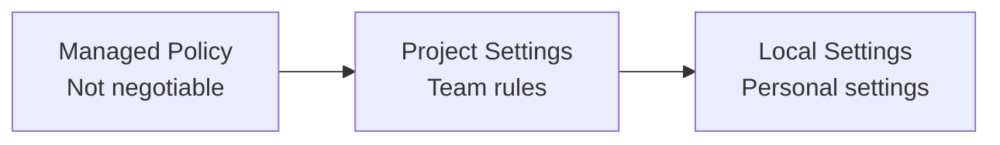

# Level 12: Teamwork and Enterprise

## Shared Standards via CLAUDE.md in Git

When ten developers work with Claude Code, each configures it their own way. One asks to write tests in Jest, another — in Vitest. One requires JSDoc comments, another considers them garbage. The result — chaotic code that looks like it was written by ten different people (because it was).

CLAUDE.md in the repository root solves this problem: a single set of rules for the whole team, versioned in git.

### What to Commit and What Not to

| Commit to git | Do NOT commit |
|---------------|---------------|
| `CLAUDE.md` | `.claude/settings.local.json` |
| `.claude/settings.json` | Personal preferences |
| `.claude/rules/` | Tokens and secrets |
| `.claude/skills/` | |
| `.claude/agents/` | |

## Managed Settings for an Organization

If CLAUDE.md is "team agreements," then managed policy is "management order." A developer cannot override or bypass managed settings.



Managed files are placed by the system administrator:

| OS | Path |
|----|------|
| macOS | `/Library/Application Support/ClaudeCode/` |
| Linux | `/etc/claude-code/` |

```json
// managed-settings.json — enforced restrictions
{
  "permissions": {
    "disableBypassPermissionsMode": "disable",
    "deny": ["WebSearch", "WebFetch", "Bash(curl*)"]
  },
  "allowManagedPermissionRulesOnly": true,
  "allowManagedHooksOnly": true
}
```

## Plugins: Packaging and Distribution

A plugin is a package combining skills, agents, hooks, and MCP servers into one reusable module:

```
my-company-plugin/
  plugin.json          # Plugin manifest
  skills/
    deploy/SKILL.md
    migrate/SKILL.md
  hooks/
    pre-commit-check.sh
  agents/
    code-reviewer/AGENT.md
```

Distribution: via npm (private registry), git repository, or internal marketplace. The team installs the plugin — and everyone gets the same set of tools.

## MCP Control via managed-mcp.json

An organization can restrict which MCP servers are available to developers:

```json
// managed-mcp.json
{
  "allowedServers": ["github", "jira", "internal-docs"],
  "blockedServers": ["*"],
  "requireApproval": true
}
```

Why: security (not all servers are trusted), cost (each MCP call costs tokens), compliance (data must not leak through third-party servers).

## Rules with Path-Specific Targeting

Files in `.claude/rules/` allow setting rules for specific paths — different standards for different project parts:

```markdown
<!-- .claude/rules/backend.md -->
---
paths: ["src/api/**", "src/services/**"]
---

Backend code rules:
- Use NestJS dependency injection
- All endpoints must have OpenAPI decorators
- Error responses follow RFC 7807
```

```markdown
<!-- .claude/rules/frontend.md -->
---
paths: ["src/components/**", "src/pages/**"]
---

Frontend code rules:
- Use React functional components only
- CSS Modules for styling
- All props must have TypeScript interfaces
```

## Onboarding New Developers

CLAUDE.md + skills + agents turn Claude Code into an interactive mentor:

```bash
# New developer on day one:
claude "Explain the architecture of this project"
# Claude reads CLAUDE.md and gives a structured overview

/setup-dev-env
# Skill sets up the local environment

/review my-first-pr
# Agent checks the PR against team standards
```

## ⚠️ Common Beginner Mistakes

### 🐛 1. settings.local.json in Git

```bash
# ❌ Committed personal settings — colleague has different paths
git add .claude/settings.local.json

# ✅ Make sure the file is in .gitignore
echo ".claude/settings.local.json" >> .gitignore
```

### 🐛 2. Managed Policy Without Testing

Rolled out `allowManagedPermissionRulesOnly: true` across the organization without checking that all needed permissions are included. Result: the agent can't execute a single command.

### 🐛 3. One Giant CLAUDE.md

500+ lines of rules — the agent wastes context reading. Split it: CLAUDE.md for general, `.claude/rules/` for path-specific, skills for on-demand instructions.

## 📌 Summary

- 🔥 CLAUDE.md in git — unified standards for the whole team
- ✅ Managed policy — enforced restrictions from the organization that cannot be bypassed
- 💡 Plugins bundle skills, hooks, and agents into a reusable package
- ⚠️ managed-mcp.json controls available MCP servers
- 📌 `.claude/rules/` with paths — different rules for backend, frontend, tests
- 🎯 CLAUDE.md + skills + agents = interactive onboarding for newcomers
