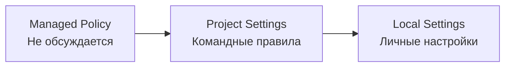

# Уровень 12: Командная работа и Enterprise

## Общие стандарты через CLAUDE.md в git

Когда десять разработчиков работают с Claude Code, каждый настраивает его по-своему. Один просит писать тесты на Jest, другой -- на Vitest. Один требует JSDoc-комментарии, другой считает их мусором. Результат -- хаотичный код, который выглядит так, будто его писали десять разных людей (потому что так и есть).

CLAUDE.md в корне репозитория решает эту проблему: единый набор правил для всей команды, версионируемый в git.

### Что коммитить, а что нет

| Коммитим в git | НЕ коммитим |
|---------------|-------------|
| `CLAUDE.md` | `.claude/settings.local.json` |
| `.claude/settings.json` | Личные preferences |
| `.claude/rules/` | Токены и секреты |
| `.claude/skills/` | |
| `.claude/agents/` | |

## Managed settings для организации

Если CLAUDE.md -- это "договорённости команды", то managed policy -- это "приказ руководства". Разработчик не может переопределить или обойти managed settings.



Managed файлы размещаются системным администратором:

| ОС | Путь |
|----|------|
| macOS | `/Library/Application Support/ClaudeCode/` |
| Linux | `/etc/claude-code/` |

```json
// managed-settings.json -- принудительные ограничения
{
  "permissions": {
    "disableBypassPermissionsMode": "disable",
    "deny": ["WebSearch", "WebFetch", "Bash(curl*)"]
  },
  "allowManagedPermissionRulesOnly": true,
  "allowManagedHooksOnly": true
}
```

## Плагины: упаковка и дистрибуция

Плагин -- пакет, объединяющий skills, agents, hooks и MCP-серверы в один переиспользуемый модуль:

```
my-company-plugin/
  plugin.json          # Манифест плагина
  skills/
    deploy/SKILL.md
    migrate/SKILL.md
  hooks/
    pre-commit-check.sh
  agents/
    code-reviewer/AGENT.md
```

Распространение: через npm (приватный registry), git-репозиторий или внутренний marketplace. Команда устанавливает плагин -- и все получают одинаковый набор инструментов.

## Контроль MCP в организации

Есть два разных механизма, и их легко перепутать.

**1. `managed-mcp.json`** -- раздаёт фиксированный набор серверов и запрещает добавлять свои. Лежит по системному пути (`/Library/Application Support/ClaudeCode/` на macOS, `/etc/claude-code/` на Linux), формат -- как у проектного `.mcp.json`:

```json
// /etc/claude-code/managed-mcp.json
{
  "mcpServers": {
    "github": { "type": "http", "url": "https://api.githubcopilot.com/mcp/" }
  }
}
```

Пустой `{ "mcpServers": {} }` отключает MCP полностью.

**2. `allowedMcpServers` / `deniedMcpServers`** -- фильтруют то, что пользователь настроил сам. Живут в settings.json, значения -- объекты с `serverUrl`, `serverCommand` или `serverName`:

```json
{
  "allowManagedMcpServersOnly": true,
  "allowedMcpServers": [{ "serverUrl": "https://api.githubcopilot.com/*" }],
  "deniedMcpServers": [{ "serverName": "dangerous-server" }]
}
```

Без `allowManagedMcpServersOnly: true` пользователь может расширить белый список в своих настройках. Denylist сливается всегда и перебивает allowlist.

Зачем: безопасность (не все серверы доверенные), стоимость (каждый MCP-вызов -- токены), compliance (данные не должны утекать через сторонние серверы).

## Rules с path-specific targeting

Файлы `.claude/rules/` позволяют задавать правила для конкретных путей -- разные стандарты для разных частей проекта:

```markdown
<!-- .claude/rules/backend.md -->
---
paths: ["src/api/**", "src/services/**"]
---

Backend code rules:
- Use NestJS dependency injection
- All endpoints must have OpenAPI decorators
- Error responses follow RFC 7807
```

```markdown
<!-- .claude/rules/frontend.md -->
---
paths: ["src/components/**", "src/pages/**"]
---

Frontend code rules:
- Use React functional components only
- CSS Modules for styling
- All props must have TypeScript interfaces
```

## Онбординг новых разработчиков

CLAUDE.md + skills + agents превращают Claude Code в интерактивного наставника:

```bash
# Новый разработчик в первый день:
claude "Объясни архитектуру этого проекта"
# Claude читает CLAUDE.md и даёт структурированный обзор

/setup-dev-env
# Скилл настраивает локальное окружение

/review my-first-pr
# Агент проверяет PR по стандартам команды
```

## ⚠️ Частые ошибки новичков

### 🐛 1. settings.local.json в git

```bash
# ❌ Закоммитили личные настройки -- у коллеги другие пути
git add .claude/settings.local.json

# ✅ Убедитесь, что файл в .gitignore
echo ".claude/settings.local.json" >> .gitignore
```

### 🐛 2. Managed policy без тестирования

Выкатили `allowManagedPermissionRulesOnly: true` на всю организацию, не проверив, что все нужные разрешения включены. Результат: агент не может выполнить ни одну команду.

### 🐛 3. Один гигантский CLAUDE.md

500+ строк правил -- агент тратит контекст на чтение. Разбивайте: CLAUDE.md для общего, `.claude/rules/` для path-specific, skills для on-demand инструкций.

## 📌 Итоги

- 🔥 CLAUDE.md в git -- единые стандарты для всей команды
- ✅ Managed policy -- принудительные ограничения от организации, которые нельзя обойти
- 💡 Плагины объединяют skills, hooks, agents в переиспользуемый пакет
- ⚠️ managed-mcp.json контролирует доступные MCP-серверы
- 📌 `.claude/rules/` с paths -- разные правила для backend, frontend, тестов
- 🎯 CLAUDE.md + skills + agents = интерактивный онбординг для новичков
