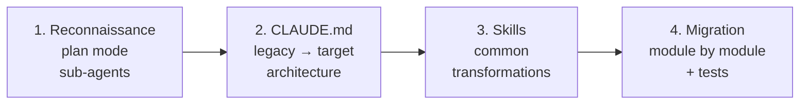
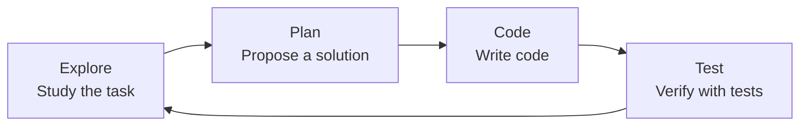

# Level 13: Architectural Patterns and Cases

## Introduction

We've covered all the tools: CLAUDE.md, rules, settings, skills, hooks, MCP, sub-agents, sandbox. Now let's put them all together on real scenarios. Each case is not an abstract example but a situation you'll encounter in your first months of working with an agent.

This level is the "final exam": if you understand how to apply tools in each case, you're ready for productive agent-based development.

---

## Case 1: Migrating a Legacy Codebase

### The Situation

You inherited an Express.js project: 200 files, callback hell, zero typing, tests cover 5% of the code. The task: migrate to NestJS with TypeScript. Without an agent — 3-4 months of manual work. With an agent — you can speed it up significantly, but you need a strategy.

### Strategy: Reconnaissance, Plan, Step-by-Step Migration



### Step 1: Reconnaissance with Sub-agents

```bash
# Run in plan mode — the agent changes nothing
claude --mode plan "Analyze this Express.js project:
- How many routes, controllers, middleware?
- What patterns are used (MVC, layered, chaos)?
- Which dependencies are outdated?
- Where are the most problematic areas?"
```

For large projects, use sub-agents — each analyzes its own part:

```bash
# Sub-agent for route analysis
claude --mode plan "Analyze all files in src/routes/ —
       how many endpoints, which HTTP methods, is there validation"

# Sub-agent for model analysis
claude --mode plan "Analyze all models in src/models/ —
       which ORM, what relationships, are there migrations"
```

### Step 2: CLAUDE.md with Legacy and Target Architecture

```markdown
# Migration: Express → NestJS

## Legacy Architecture (current state)
- Express.js 4.x, JavaScript (no TypeScript)
- Mongoose ODM → migrating to Prisma + PostgreSQL
- Routes in src/routes/, business logic in controllers
- Authentication: passport.js + JWT
- No dependency injection, everything via require()

## Target Architecture
- NestJS 10.x, strict TypeScript
- Prisma ORM + PostgreSQL
- Module structure: src/modules/{name}/
- Each module: controller, service, repository, dto, entity
- Guards for authentication, Pipes for validation

## Migration Rules
- Migrate one module at a time
- Before migration, write integration tests for current behavior
- After migration all tests must be green
- Don't change API contracts (request/response)
```

### Step 3: Skills for Common Transformations

```markdown
<!-- .claude/skills/migrate-route/SKILL.md -->
---
name: migrate-route
description: Migrate an Express route to NestJS controller
allowed-tools: Read, Edit, Write, Bash(npx tsc*), Bash(npm test*)
---

## Migrating Express Route → NestJS Controller

1. Read the Express route in src/routes/$1.js
2. Create NestJS module in src/modules/$1/
3. Create controller, service, module files
4. Move business logic from route to service
5. Add DTO with class-validator for validation
6. Run tests: !`npm test -- --grep "$1"`
7. Run typing check: !`npx tsc --noEmit`
```

### Step 4: Step-by-Step Migration with Safety Net

```bash
# Migrating the users module
/migrate-route users

# Agent:
# 1. Reads src/routes/users.js
# 2. Writes tests for current API
# 3. Creates src/modules/users/{controller,service,module}.ts
# 4. Runs tests — makes sure everything works
# 5. Moves to the next module only if tests are green
```

📌 **Key principle:** tests are a safety net. The agent can break anything, but if tests catch the breakage, you roll back and try again.

---

## Case 2: Greenfield Project from Scratch

### The Situation

A new project, a blank slate. You have a chance to lay down agent-friendly architecture from day one — and it will pay off many times over.

### Step 1: Start with CLAUDE.md

Before writing the first line of code — create CLAUDE.md:

```bash
claude "Create CLAUDE.md for a new project:
       - Backend: NestJS + TypeScript + Prisma + PostgreSQL
       - Frontend: React 19 + Vite + TanStack Router
       - Monorepo on Turborepo
       - Conventions: no semicolons, single quotes, CSS Modules
       - Tests: Vitest (unit), Playwright (e2e)"
```

### Step 2: /init for Structure Generation

```bash
claude "Create initial project structure based on CLAUDE.md:
       - Monorepo with apps/api and apps/web
       - Docker Compose for PostgreSQL
       - Base configs: tsconfig, eslint, prettier
       - GitHub Actions for CI"
```

### Step 3: Agent-Friendly Architecture

What "agent-friendly" means:

```
✅ Agent-friendly:
apps/
  api/
    src/
      modules/
        users/
          users.controller.ts
          users.service.ts
          users.module.ts
          dto/
          entities/
          __tests__/

❌ Agent-unfriendly:
src/
  controllers.ts          # All controllers in one file
  services.ts             # All logic in one file
  types.ts                # 2000 lines of types
```

Principles:
- **One module — one directory** with predictable structure
- **Short files** (up to 200 lines) — fit in context
- **Understandable names** — agent finds files by convention, not by searching
- **Tests next to code** — agent sees code and its tests simultaneously

### Step 4: Iterative Development



```bash
# Each task — an explore-plan-code-test loop
claude "Add authorization module with JWT and refresh tokens"
# Agent:
# 1. Studies current structure
# 2. Proposes a plan (which files to create)
# 3. Writes code following conventions from CLAUDE.md
# 4. Adds tests and verifies
```

---

## Case 3: Multi-Repo Microservice Architecture

### The Problem

You have 12 microservices in separate repositories. The agent is open in `user-service`, but the task requires changes in `order-service` and `notification-service`. The agent sees only one repo.

### Solution 1: CLAUDE.md with Service Map

```markdown
# User Service

## Microservice Architecture
| Service | Repo | Port | Description |
|---------|------|------|-------------|
| user-service | github.com/company/user-svc | 3001 | Auth, profiles |
| order-service | github.com/company/order-svc | 3002 | Orders |
| payment-service | github.com/company/payment-svc | 3003 | Payments |
| notification-service | github.com/company/notif-svc | 3004 | Notifications |

## API Contracts
- POST /users → user-service creates a user
- POST /orders → order-service calls user-service for validation
- POST /payments → payment-service calls order-service
- Events: user.created → notification-service sends welcome email

## Shared Standards
All services follow standards from github.com/company/shared-standards
```

### Solution 2: MCP Server for Cross-Repo Search

An MCP server that indexes all repositories and allows searching code, documentation, and API contracts:

```json
{
  "mcpServers": {
    "cross-repo-search": {
      "command": "node",
      "args": ["./mcp-servers/cross-repo-search/index.js"],
      "env": {
        "REPOS_ROOT": "/home/dev/projects",
        "INDEX_FILE": "/tmp/repo-index.json"
      }
    }
  }
}
```

### Solution 3: Shared Rules Across All Repos

```markdown
<!-- shared-standards/.claude/rules/api-contracts.md -->
---
paths: ["src/controllers/**", "src/routes/**"]
---

## API Contract Rules
- All endpoints documented with OpenAPI
- Versioning: /api/v1/, /api/v2/
- Errors: RFC 7807 Problem Details
- Authentication: Bearer JWT in Authorization header
- Rate limiting: X-RateLimit-* headers in response
```

### Coordinating Changes

```bash
# In user-service: adding a new field to the API
claude "Add 'department' field to User model and API"

# In order-service: updating the user-service client
claude "Update UserClient — user-service now returns
       department field. Check that order-service handles it"

# Coordination via CLAUDE.md descriptions
```

---

## Case 4: CI/CD Pipeline with Agents

### Agent in CI/CD

Claude Code in CI/CD runs via Agent SDK with the `-p` flag (non-interactive, pipe mode):

```bash
# Automated code review
claude -p "Review changes in this PR:
- Compliance with project standards
- Potential bugs
- Test coverage
- Security" < <(git diff main...HEAD)
```

```bash
# Changelog generation
claude -p "Generate changelog based on commits
       from tag $(git describe --tags --abbrev=0) to HEAD.
       Format: Added/Changed/Fixed/Removed"
```

### CI/CD Security

In CI/CD, the agent runs without human oversight. This requires maximum protection:

```json
{
  "permissions": {
    "disableBypassPermissionsMode": "disable",
    "allow": [
      "Read", "Glob", "Grep",
      "Bash(npm test*)",
      "Bash(npm run build*)",
      "Bash(npm run lint*)",
      "Bash(git log*)", "Bash(git diff*)"
    ],
    "deny": [
      "Bash(npm publish*)",
      "Bash(git push*)",
      "Bash(curl*)", "Bash(wget*)",
      "Write", "Edit"
    ]
  },
  "sandbox": {
    "enabled": true,
    "network": {
      "allowedDomains": ["github.com", "*.npmjs.org"]
    }
  }
}
```

### Cost Monitoring

Each agent run in CI/CD means API calls. For a typical code review:
- Small PR (< 100 lines): ~$0.05-0.10
- Medium PR (100-500 lines): ~$0.20-0.50
- Large PR (500+ lines): ~$1-3

Without monitoring, costs can grow unnoticed. Add limits:

```bash
# Cost limit per run
claude -p --max-cost 1.00 "Review this PR"
```

---

## Anti-patterns and Common Mistakes

### Anti-pattern 1: "The Agent Will Handle Everything"

```bash
# ❌ "Rewrite the entire project from JavaScript to TypeScript"
# Result: 200 files changed, 50 compilation errors,
# can't tell what's broken where
```

**Why it's bad:** the agent doesn't plan ten steps ahead. It solves the current task. Without oversight, errors accumulate.

```bash
# ✅ Step-by-step with oversight
# 1. Plan: "Propose a migration order"
# 2. One module at a time
# 3. Tests after each step
# 4. Review the result
```

### Anti-pattern 2: Too Long CLAUDE.md

```markdown
<!-- ❌ 800 lines: architecture, all API contracts,
     examples of each endpoint, migration history... -->
```

**Why it's bad:** CLAUDE.md loads on every launch and every /compact. 800 lines — that's ~2000 tokens of context spent on information needed only 5% of the time.

```markdown
<!-- ✅ CLAUDE.md: 100-150 lines with base rules -->
<!-- Details in .claude/rules/ (loaded by path) -->
<!-- Procedures in .claude/skills/ (loaded on demand) -->
```

### Anti-pattern 3: No Tests

```bash
# ❌ Agent writes code → commit → deploy
# A week later: "Why doesn't registration work?"
```

**Why it's bad:** the agent can write code that compiles but works incorrectly. Without tests, you'll learn this from users.

```bash
# ✅ Tests — first step
claude "Write integration tests for the registration module.
       Then refactor the module, make sure tests are green"
```

### Anti-pattern 4: Ignoring Context Budget

```bash
# ❌ One session for 4 hours, 200 messages
# Agent "forgets" what it did at the start, starts contradicting itself
```

**Why it's bad:** the context window is finite. When the limit is reached, compaction occurs — Claude compresses the history and may lose important details.

```bash
# ✅ Short focused sessions
# Each session — one task
# Sub-agents for independent subtasks
# /compact when you feel the agent is "forgetting"
```

---

## Checklist: Is the Project Ready for Agent-Based Development

### Minimum (don't start without this)

- [ ] CLAUDE.md describes stack, architecture, and key conventions
- [ ] `.claude/settings.json` with allow/deny — the agent knows its boundaries
- [ ] At least smoke tests exist — the agent can verify it didn't break anything
- [ ] `.gitignore` includes `.claude/settings.local.json`

### Recommended

- [ ] `.claude/rules/` with path-specific standards for backend, frontend, tests
- [ ] `.claude/skills/` for recurring tasks (deploy, migrate, review)
- [ ] Sandbox enabled with filesystem and network isolation
- [ ] PreToolUse hook for Bash command validation
- [ ] PostToolUse hook for action auditing

### For a Team

- [ ] CLAUDE.md went through team code review
- [ ] Onboarding skill for new developers
- [ ] Agent or skill for code review against team standards
- [ ] Managed policy with base restrictions (if enterprise)
- [ ] Monitoring of agent usage costs

---

## ⚠️ Common Beginner Mistakes

### 🐛 1. Migration Without Tests — Guaranteed Chaos

```bash
# ❌ "Rewrite all 200 files"
# 3 hours later: nothing compiles, git blame is useless
```

```bash
# ✅ Tests → migrate one module → verify → repeat
claude "Write tests for current users API behavior"
claude "/migrate-route users"
claude "Run tests, make sure everything works"
```

### 🐛 2. Outdated CLAUDE.md

The project switched from REST to GraphQL six months ago, but CLAUDE.md still describes REST controllers. The agent generates REST endpoints in a GraphQL project.

> **Rule:** update CLAUDE.md with every architectural change. Add this to your definition of done.

### 🐛 3. "Rewrite the Entire Project" — Too Big a Task

Context overflows, the agent loses focus, the result is unpredictable.

> **Rule:** maximum task per session — one module or one feature. For bigger tasks — plan + sub-agents.

### 🐛 4. CI/CD Without Cost Limits

Code review for each PR costs $0.10-3.00. With 50 PRs per day, that's $150-4500 per month. Without monitoring, you'll find out from the bill.

---

## Best Practices: Summary Table

| Scenario | Tools | Key Principle |
|----------|-------|---------------|
| Legacy migration | plan mode, skills, tests | Step-by-step, tests as safety net |
| Greenfield | CLAUDE.md, /init | Agent-friendly architecture from day 1 |
| Multi-repo | MCP, shared rules, CLAUDE.md | Full system description in each repo |
| CI/CD | `-p` flag, sandbox, limits | Maximum protection, cost monitoring |
| Any project | Readiness checklist | CLAUDE.md + settings + tests — minimum |

## 📌 Summary

- 🔥 Legacy migration: reconnaissance (plan) → CLAUDE.md → skills for transformations → step-by-step with tests
- ✅ Greenfield: agent-friendly architecture from day one — modularity, short files, tests next to code
- 💡 Multi-repo: CLAUDE.md with service map + MCP for cross-repo search + shared rules
- ⚠️ CI/CD: `-p` flag, strict sandbox, deny on write/push, cost limits
- 📌 Main anti-patterns: "the agent will handle everything", 800-line CLAUDE.md, no tests, no budget control
- 🎯 Readiness checklist — verify before starting agent-based development on any project
