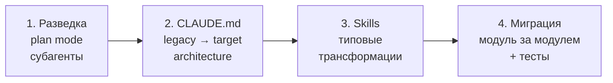
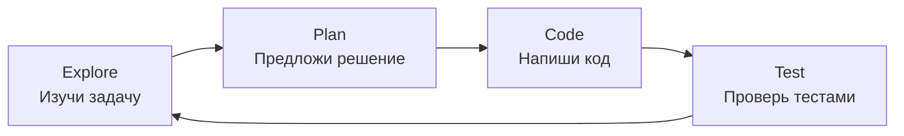

# Уровень 13: Архитектурные паттерны и кейсы

## Введение

Мы прошли все инструменты: CLAUDE.md, rules, settings, skills, hooks, MCP, субагенты, sandbox. Теперь соберём всё вместе на реальных сценариях. Каждый кейс -- это не абстрактный пример, а ситуация, с которой вы столкнётесь в первые месяцы работы с агентом.

Этот уровень -- "выпускной экзамен": если вы понимаете, как применить инструменты в каждом кейсе, вы готовы к продуктивной агентской разработке.

---

## Кейс 1: Миграция legacy-кодбейза

### Ситуация

Вам достался Express.js-проект: 200 файлов, callback hell, нулевая типизация, тесты покрывают 5% кода. Задача: мигрировать на NestJS с TypeScript. Без агента -- 3-4 месяца ручной работы. С агентом -- можно значительно ускорить, но нужна стратегия.

### Стратегия: разведка, план, пошаговая миграция



### Шаг 1: Разведка с субагентами

```bash
# Запускаем в plan mode -- агент ничего не меняет
claude --mode plan "Проанализируй этот Express.js проект:
- Сколько роутов, контроллеров, middleware?
- Какие паттерны используются (MVC, layered, хаос)?
- Какие зависимости устарели?
- Где самые проблемные места?"
```

Для крупных проектов используйте субагентов -- каждый анализирует свою часть:

```bash
# Субагент для анализа роутов
claude --mode plan "Проанализируй все файлы в src/routes/ --
       сколько эндпоинтов, какие HTTP-методы, есть ли валидация"

# Субагент для анализа моделей
claude --mode plan "Проанализируй все модели в src/models/ --
       какая ORM, какие связи, есть ли миграции"
```

### Шаг 2: CLAUDE.md с legacy и target архитектурой

```markdown
# Migration: Express → NestJS

## Legacy Architecture (текущее состояние)
- Express.js 4.x, JavaScript (без TypeScript)
- Mongoose ODM → мигрируем на Prisma + PostgreSQL
- Роуты в src/routes/, бизнес-логика в контроллерах
- Аутентификация: passport.js + JWT
- Нет dependency injection, всё через require()

## Target Architecture (целевое состояние)
- NestJS 10.x, строгий TypeScript
- Prisma ORM + PostgreSQL
- Модульная структура: src/modules/{name}/
- Каждый модуль: controller, service, repository, dto, entity
- Guards для аутентификации, Pipes для валидации

## Migration Rules
- Мигрируем один модуль за раз
- Перед миграцией пишем интеграционные тесты для текущего поведения
- После миграции все тесты должны быть зелёными
- Не меняем API-контракты (request/response)
```

### Шаг 3: Skills для типовых трансформаций

```markdown
<!-- .claude/skills/migrate-route/SKILL.md -->
---
name: migrate-route
description: Migrate an Express route to NestJS controller
allowed-tools: Read, Edit, Write, Bash(npx tsc*), Bash(npm test*)
---

## Миграция роута Express → NestJS Controller

1. Прочитай Express-роут в src/routes/$1.js
2. Создай NestJS-модуль в src/modules/$1/
3. Создай controller, service, module файлы
4. Перенеси бизнес-логику из роута в service
5. Добавь DTO с class-validator для валидации
6. Запусти тесты: !`npm test -- --grep "$1"`
7. Запусти типизацию: !`npx tsc --noEmit`
```

### Шаг 4: Пошаговая миграция с safety net

```bash
# Миграция модуля users
/migrate-route users

# Агент:
# 1. Читает src/routes/users.js
# 2. Пишет тесты для текущего API
# 3. Создаёт src/modules/users/{controller,service,module}.ts
# 4. Запускает тесты -- убеждается что всё работает
# 5. Переходит к следующему модулю только если тесты зелёные
```

📌 **Ключевой принцип:** тесты -- это страховочная сеть. Агент может сломать что угодно, но если тесты ловят поломку, вы откатываете и пробуете снова.

---

## Кейс 2: Greenfield-проект с нуля

### Ситуация

Новый проект, чистый лист. У вас есть шанс заложить agent-friendly архитектуру с первого дня -- и это окупится в разы.

### Шаг 1: Начинаем с CLAUDE.md

Прежде чем написать первую строку кода -- создаём CLAUDE.md:

```bash
claude "Создай CLAUDE.md для нового проекта:
       - Backend: NestJS + TypeScript + Prisma + PostgreSQL
       - Frontend: React 19 + Vite + TanStack Router
       - Monorepo на Turborepo
       - Конвенции: no semicolons, single quotes, CSS Modules
       - Тесты: Vitest (unit), Playwright (e2e)"
```

### Шаг 2: /init для генерации структуры

```bash
claude "Создай начальную структуру проекта на основе CLAUDE.md:
       - Monorepo с apps/api и apps/web
       - Docker Compose для PostgreSQL
       - Базовые конфигурации: tsconfig, eslint, prettier
       - GitHub Actions для CI"
```

### Шаг 3: Agent-friendly архитектура

Что значит "agent-friendly":

```
✅ Agent-friendly:
apps/
  api/
    src/
      modules/
        users/
          users.controller.ts
          users.service.ts
          users.module.ts
          dto/
          entities/
          __tests__/

❌ Agent-unfriendly:
src/
  controllers.ts          # Все контроллеры в одном файле
  services.ts             # Вся логика в одном файле
  types.ts                # 2000 строк типов
```

Принципы:
- **Один модуль -- одна директория** с предсказуемой структурой
- **Короткие файлы** (до 200 строк) -- помещаются в контекст
- **Понятные имена** -- агент находит файлы по конвенции, а не по поиску
- **Тесты рядом с кодом** -- агент видит код и его тесты одновременно

### Шаг 4: Итеративная разработка



```bash
# Каждая задача -- цикл explore-plan-code-test
claude "Добавь модуль авторизации с JWT и refresh-токенами"
# Агент:
# 1. Изучает текущую структуру
# 2. Предлагает план (какие файлы создать)
# 3. Пишет код по конвенциям из CLAUDE.md
# 4. Добавляет тесты и проверяет
```

---

## Кейс 3: Мультирепо микросервисная архитектура

### Проблема

У вас 12 микросервисов в отдельных репозиториях. Агент открыт в `user-service`, но задача требует изменений в `order-service` и `notification-service`. Агент видит только один репо.

### Решение 1: CLAUDE.md с картой сервисов

```markdown
# User Service

## Микросервисная архитектура
| Сервис | Репо | Порт | Описание |
|--------|------|------|----------|
| user-service | github.com/company/user-svc | 3001 | Авторизация, профили |
| order-service | github.com/company/order-svc | 3002 | Заказы |
| payment-service | github.com/company/payment-svc | 3003 | Платежи |
| notification-service | github.com/company/notif-svc | 3004 | Уведомления |

## API-контракты
- POST /users → user-service создаёт пользователя
- POST /orders → order-service вызывает user-service для проверки
- POST /payments → payment-service вызывает order-service
- События: user.created → notification-service отправляет welcome email

## Общие стандарты
Все сервисы следуют стандартам из github.com/company/shared-standards
```

### Решение 2: MCP-сервер для кросс-репо поиска

MCP-сервер, который индексирует все репозитории и позволяет искать код, документацию и API-контракты:

```json
{
  "mcpServers": {
    "cross-repo-search": {
      "command": "node",
      "args": ["./mcp-servers/cross-repo-search/index.js"],
      "env": {
        "REPOS_ROOT": "/home/dev/projects",
        "INDEX_FILE": "/tmp/repo-index.json"
      }
    }
  }
}
```

### Решение 3: Общие rules для всех репо

```markdown
<!-- shared-standards/.claude/rules/api-contracts.md -->
---
paths: ["src/controllers/**", "src/routes/**"]
---

## API Contract Rules
- Все эндпоинты документированы с OpenAPI
- Версионирование: /api/v1/, /api/v2/
- Ошибки: RFC 7807 Problem Details
- Аутентификация: Bearer JWT в заголовке Authorization
- Rate limiting: X-RateLimit-* заголовки в ответе
```

### Координация изменений

```bash
# В user-service: добавляем новое поле в API
claude "Добавь поле 'department' в модель User и API"

# В order-service: обновляем клиент user-service
claude "Обнови UserClient -- user-service теперь возвращает
       поле department. Проверь, что order-service его обрабатывает"

# Координация через описание в CLAUDE.md
```

---

## Кейс 4: CI/CD пайплайн с агентами

### Агент в CI/CD

Claude Code в CI/CD запускается через Agent SDK с флагом `-p` (non-interactive, pipe mode):

```bash
# Автоматический code review
claude -p "Проверь изменения в этом PR:
- Соответствие стандартам проекта
- Потенциальные баги
- Покрытие тестами
- Безопасность" < <(git diff main...HEAD)
```

```bash
# Генерация changelog
claude -p "Сгенерируй changelog на основе коммитов
       с тега $(git describe --tags --abbrev=0) до HEAD.
       Формат: Added/Changed/Fixed/Removed"
```

### Безопасность CI/CD

В CI/CD агент работает без человеческого контроля. Это требует максимальной защиты:

```json
{
  "permissions": {
    "disableBypassPermissionsMode": "disable",
    "allow": [
      "Read", "Glob", "Grep",
      "Bash(npm test*)",
      "Bash(npm run build*)",
      "Bash(npm run lint*)",
      "Bash(git log*)", "Bash(git diff*)"
    ],
    "deny": [
      "Bash(npm publish*)",
      "Bash(git push*)",
      "Bash(curl*)", "Bash(wget*)",
      "Write", "Edit"
    ]
  },
  "sandbox": {
    "enabled": true,
    "network": {
      "allowedDomains": ["github.com", "*.npmjs.org"]
    }
  }
}
```

### Мониторинг стоимости

Каждый запуск агента в CI/CD -- это API-вызовы. Для типичного code review:
- Маленький PR (< 100 строк): ~$0.05-0.10
- Средний PR (100-500 строк): ~$0.20-0.50
- Большой PR (500+ строк): ~$1-3

Без мониторинга затраты могут вырасти незаметно. Добавьте лимиты:

```bash
# Ограничение стоимости на запуск (только в print-режиме)
claude -p --max-budget-usd 1.00 "Review this PR"

# Дополнительно: потолок по числу агентских шагов
claude -p --max-budget-usd 1.00 --max-turns 20 "Review this PR"
```

`--max-budget-usd` останавливает работу, когда сумма API-вызовов достигает лимита. `--max-turns` страхует от другого сценария -- агент не жжёт деньги, а зацикливается на одной задаче.

---

## Антипаттерны и типичные ошибки

### Антипаттерн 1: "Агент сделает всё сам"

```bash
# ❌ "Перепиши весь проект с JavaScript на TypeScript"
# Результат: 200 файлов изменены, 50 ошибок компиляции,
# непонятно где что сломалось
```

**Почему плохо:** агент не планирует на десять шагов вперёд. Он решает текущую задачу. Без контроля ошибки накапливаются.

```bash
# ✅ Пошагово с контролем
# 1. Plan: "Предложи порядок миграции"
# 2. Один модуль за раз
# 3. Тесты после каждого шага
# 4. Review результата
```

### Антипаттерн 2: Слишком длинный CLAUDE.md

```markdown
<!-- ❌ 800 строк: архитектура, все API-контракты,
     примеры каждого эндпоинта, история миграций... -->
```

**Почему плохо:** CLAUDE.md загружается при каждом запуске и каждом /compact. 800 строк -- это ~2000 токенов контекста, потраченных на информацию, которая нужна в 5% случаев.

```markdown
<!-- ✅ CLAUDE.md: 100-150 строк с базовыми правилами -->
<!-- Детали в .claude/rules/ (подгружаются по path) -->
<!-- Процедуры в .claude/skills/ (подгружаются по запросу) -->
```

### Антипаттерн 3: Отсутствие тестов

```bash
# ❌ Агент пишет код → коммит → деплой
# Через неделю: "Почему регистрация не работает?"
```

**Почему плохо:** агент может написать код, который компилируется, но работает неправильно. Без тестов вы узнаете об этом от пользователей.

```bash
# ✅ Тесты -- первый шаг
claude "Напиши интеграционные тесты для модуля регистрации.
       Потом рефакторь модуль, убедись что тесты зелёные"
```

### Антипаттерн 4: Игнорирование контекстного бюджета

```bash
# ❌ Одна сессия на 4 часа, 200 сообщений
# Агент "забывает" что делал в начале, начинает противоречить себе
```

**Почему плохо:** контекстное окно конечно. При достижении лимита происходит compaction -- Claude сжимает историю и может потерять важные детали.

```bash
# ✅ Короткие фокусированные сессии
# Каждая сессия -- одна задача
# Субагенты для независимых подзадач
# /compact когда чувствуете, что агент "забывает"
```

---

## Чеклист: готов ли проект к агентской разработке

### Минимум (без этого не начинайте)

- [ ] CLAUDE.md описывает стек, архитектуру и ключевые конвенции
- [ ] `.claude/settings.json` с allow/deny -- агент знает свои границы
- [ ] Есть хотя бы smoke-тесты -- агент может проверить, не сломал ли он что-то
- [ ] `.gitignore` включает `.claude/settings.local.json`

### Рекомендуется

- [ ] `.claude/rules/` с path-specific стандартами для backend, frontend, тестов
- [ ] `.claude/skills/` для повторяющихся задач (deploy, migrate, review)
- [ ] Sandbox включён с filesystem и network изоляцией
- [ ] PreToolUse хук для валидации Bash-команд
- [ ] PostToolUse хук для аудита действий

### Для команды

- [ ] CLAUDE.md прошёл code review всей команды
- [ ] Онбординг-скилл для новых разработчиков
- [ ] Агент или скилл для code review по стандартам команды
- [ ] Managed policy с базовыми ограничениями (если enterprise)
- [ ] Мониторинг стоимости использования агента

---

## ⚠️ Частые ошибки новичков

### 🐛 1. Миграция без тестов -- гарантированный хаос

```bash
# ❌ "Перепиши все 200 файлов"
# 3 часа спустя: ничего не компилируется, git blame бесполезен
```

```bash
# ✅ Тесты → миграция одного модуля → проверка → повтор
claude "Напиши тесты для текущего поведения users API"
claude "/migrate-route users"
claude "Запусти тесты, убедись что всё работает"
```

### 🐛 2. Устаревший CLAUDE.md

Проект перешёл с REST на GraphQL полгода назад, а CLAUDE.md всё ещё описывает REST-контроллеры. Агент генерирует REST-эндпоинты в GraphQL-проекте.

> **Правило:** обновляйте CLAUDE.md при каждом архитектурном изменении. Добавьте это в definition of done.

### 🐛 3. "Перепиши весь проект" -- слишком большая задача

Контекст переполняется, агент теряет фокус, результат непредсказуем.

> **Правило:** максимальная задача для одной сессии -- один модуль или одна фича. Для больших задач -- план + субагенты.

### 🐛 4. CI/CD без лимитов стоимости

Code review каждого PR стоит $0.10-3.00. При 50 PR в день за месяц набежит $150-4500. Без мониторинга вы узнаете из счёта.

---

## Best practices: сводная таблица

| Сценарий | Инструменты | Ключевой принцип |
|----------|------------|-----------------|
| Legacy миграция | plan mode, skills, тесты | Пошагово, тесты -- safety net |
| Greenfield | CLAUDE.md, /init | Agent-friendly архитектура с дня 1 |
| Мультирепо | MCP, общие rules, CLAUDE.md | Описание всей системы в каждом репо |
| CI/CD | `-p` флаг, sandbox, лимиты | Максимальная защита, мониторинг стоимости |
| Любой проект | Чеклист готовности | CLAUDE.md + settings + тесты -- минимум |

## 📌 Итоги

- 🔥 Legacy-миграция: разведка (plan) → CLAUDE.md → skills для трансформаций → пошагово с тестами
- ✅ Greenfield: agent-friendly архитектура с первого дня -- модульность, короткие файлы, тесты рядом с кодом
- 💡 Мультирепо: CLAUDE.md с картой сервисов + MCP для кросс-репо поиска + общие rules
- ⚠️ CI/CD: флаг `-p`, строгий sandbox, deny на write/push, лимиты стоимости
- 📌 Главные антипаттерны: "агент сделает всё сам", 800-строчный CLAUDE.md, нет тестов, нет контроля бюджета
- 🎯 Чеклист готовности -- проверьте перед началом агентской разработки в любом проекте
