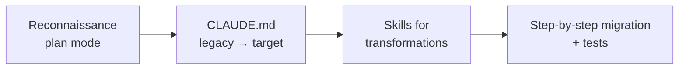

# Level 13: Architectural Patterns and Cases

## Case 1: Migrating a Legacy Codebase

Imagine: you inherited an Express.js project with 200 files, zero documentation, and tests that are "to be written later." The task — migrate to NestJS. Without an agent, this is months of manual work. With an agent — it's a strategy:



**Step 1: Reconnaissance.** Run the agent in plan mode — it analyzes structure, dependencies, patterns. Doesn't change a single line.

**Step 2: CLAUDE.md.** Describe the current and target architecture. The agent knows where we're migrating from and to.

**Step 3: Skills.** Create skills for common transformations: `/extract-service`, `/convert-route-to-controller`, `/add-dto-validation`.

**Step 4: Tests as a safety net.** Before each transformation — a test, after — a check. The agent doesn't move to the next step until tests are green.

## Case 2: Greenfield Project from Scratch

A new project — a chance to lay down agent-friendly architecture from day one:

```bash
# 1. Start with CLAUDE.md
claude "Create CLAUDE.md for a new project:
       NestJS + React + PostgreSQL + Prisma"

# 2. Generate structure
claude "/init" # Creates project skeleton

# 3. Iterative development
claude "Add authorization module with JWT"
# The agent knows the stack and conventions from CLAUDE.md
```

Agent-friendly architecture: clear module separation, understandable names, tests from the first commit, CLAUDE.md kept current at every stage.

## Case 3: Multi-Repo Microservices

Problem: the agent sees only one repository, but your system is 12 microservices across different repos.

Solutions:
- **MCP server** for cross-repo code and documentation search
- **Shared .claude/rules/** — identical standards across all repos
- **CLAUDE.md** with descriptions of all services and their interactions
- **Sub-agents** for coordinating changes across repos

```markdown
<!-- CLAUDE.md in each repo -->
## Microservice Architecture
- user-service (port 3001) — auth and profiles
- order-service (port 3002) — orders, depends on user-service
- payment-service (port 3003) — payments, depends on order-service
- notification-service (port 3004) — notifications, subscribes to events
```

## Case 4: CI/CD Pipeline with Agents

An agent in CI/CD runs via Agent SDK with the `-p` flag (non-interactive):

```bash
# In the CI/CD pipeline
claude -p "Review PR #${PR_NUMBER}: code review against project standards"
claude -p "Generate changelog based on commits since the last release"
```

Key uses: automated code review, changelog generation, standards compliance check, documentation updates.

⚠️ Required: strict sandbox, minimal permissions, cost monitoring.

## Anti-patterns

| Anti-pattern | Problem | Solution |
|-------------|---------|----------|
| "The agent will handle everything" | No oversight, errors accumulate | Plan → review → execute |
| Too long CLAUDE.md | Wastes context, reduces accuracy | Rules + skills + short CLAUDE.md |
| No tests | Agent breaks things without noticing | Tests before the agent starts work |
| Ignoring context budget | Agent "forgets" the beginning of the conversation | Compact, short sessions, sub-agents |

## Readiness Checklist

- [ ] CLAUDE.md describes stack, architecture, and conventions
- [ ] `.claude/settings.json` with allow/deny configured
- [ ] Tests exist (at least smoke tests)
- [ ] Skills for recurring tasks
- [ ] Sandbox enabled (filesystem + network)
- [ ] `.gitignore` includes `.claude/settings.local.json`

## ⚠️ Common Beginner Mistakes

### 🐛 1. Migration Without Tests

```bash
# ❌ "Agent, rewrite everything to NestJS"
# 2 hours later: 50 files changed, nothing works, can't tell where it broke
```

```bash
# ✅ Step-by-step with tests
# 1. Write tests for current behavior
# 2. Migrate one module
# 3. Verify tests are green
# 4. Repeat
```

### 🐛 2. CLAUDE.md Not Updated

The project evolves, but CLAUDE.md describes architecture from six months ago. The agent generates code using outdated patterns.

### 🐛 3. Giving the Agent Too Big a Task

"Rewrite the entire project" — context overflows, the agent loses the thread. Break it into small tasks, use sub-agents.

## 📌 Summary

- 🔥 Migration: reconnaissance → CLAUDE.md → skills → step-by-step migration with tests
- ✅ Greenfield: CLAUDE.md from day one, agent-friendly architecture
- 💡 Multi-repo: MCP server + shared rules + service descriptions in CLAUDE.md
- ⚠️ CI/CD: `-p` flag, strict sandbox, cost monitoring
- 📌 Main anti-pattern: "the agent will handle everything" without oversight and tests
- 🎯 Readiness checklist — minimum to start agent-based development
