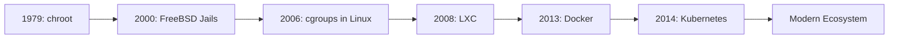
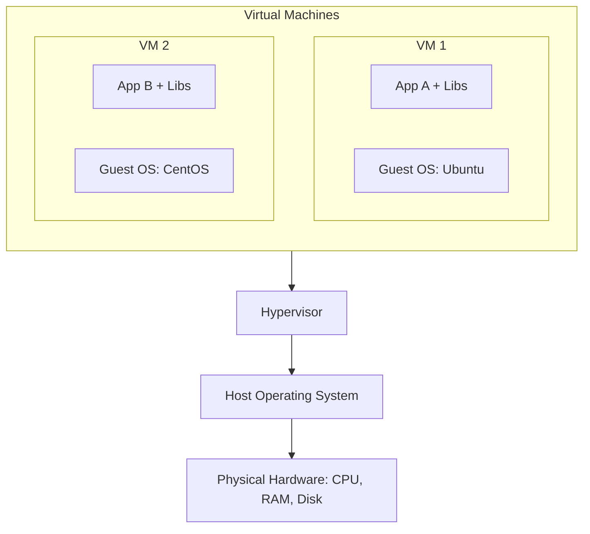
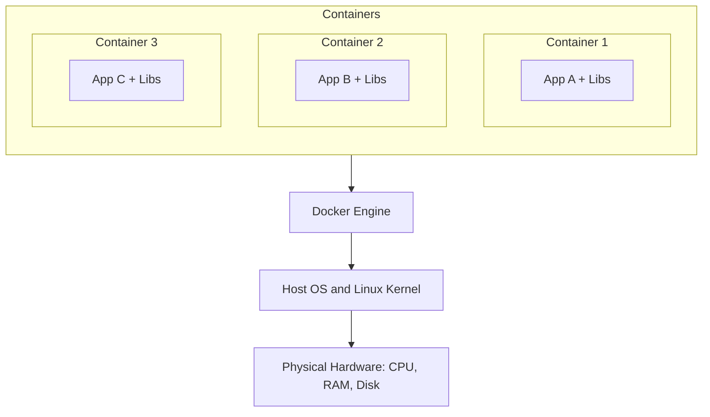
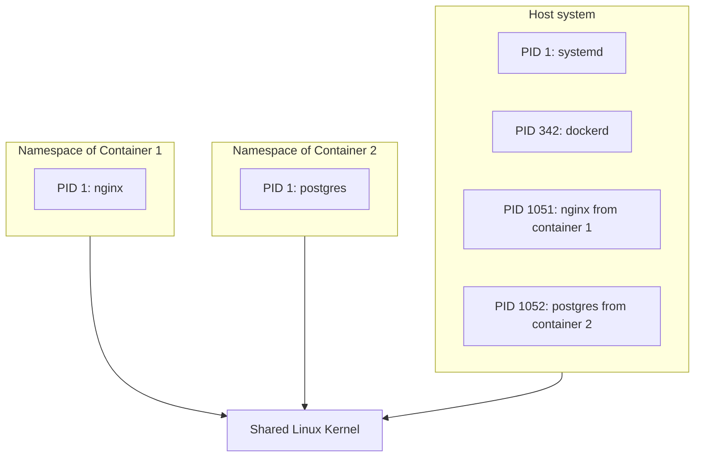
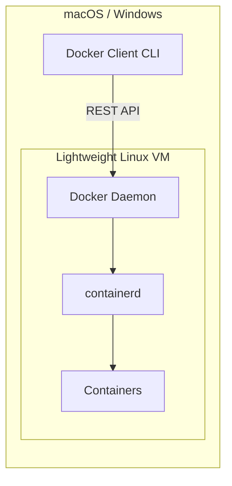
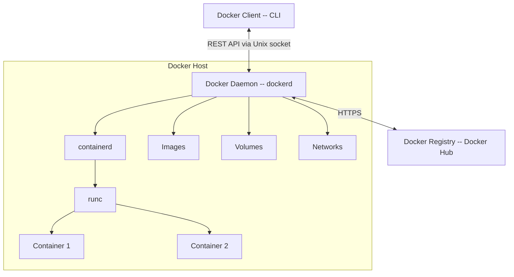
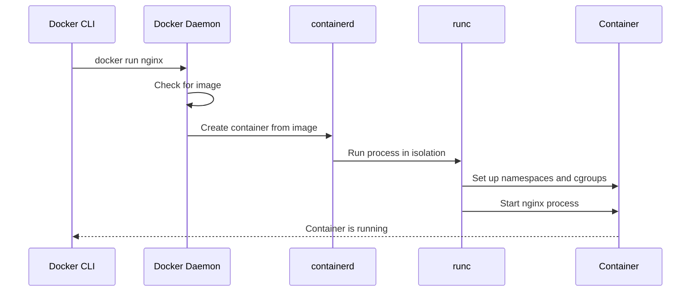
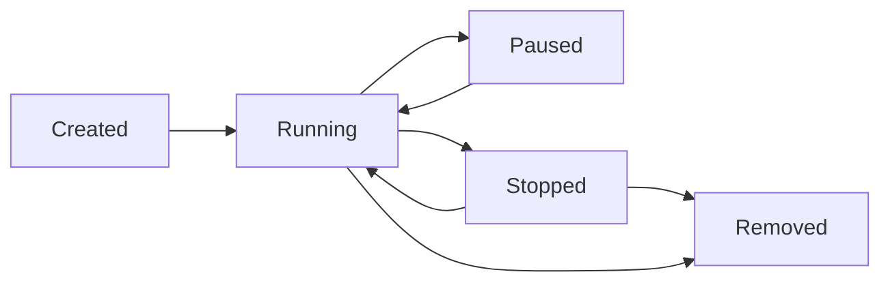

# Level 0: Introduction to Docker -- Containerization, Architecture, and First Steps

## Introduction

Imagine you send a friend a cake recipe. You write: "Take flour, eggs, butter, and sugar, mix and put in the oven." Your friend follows the recipe, but the cake doesn't turn out -- they have a different oven, different flour, different proportions. Sound familiar? In the development world, this is called **"Works on my machine"** -- a problem that Docker solves once and for all.

Docker is like sending your friend not a recipe, but a **ready-made cake in a sealed package** along with the oven it was baked in. It doesn't matter what kitchen your friend has -- the cake will be exactly as you baked it.

In this level, we will explore in detail:

1. **What Docker is** -- and why it became the industry standard
2. **Containers vs virtual machines** -- two approaches to isolation and their fundamental differences
3. **Docker Architecture** -- what components make up the platform and how they interact
4. **Docker objects** -- images, containers, volumes, networks
5. **Docker Hub and registries** -- where images are stored and distributed
6. **Common beginner mistakes** -- so you don't trip over the same pitfalls thousands of developers have already stumbled on

---

## 1. What is Docker and Why You Need It

### Definition

Docker is an open platform for developing, shipping, and running applications in **containers**. A container is a lightweight, isolated runtime environment that contains everything needed for an application to work: code, dependencies, libraries, system utilities, and configuration.

The key word here is **everything needed**. A container does not depend on what is installed on the host machine. It doesn't matter what operating system you have, what library versions are installed, what environment variables are set -- the container carries its own environment with it.

### Brief History

Docker appeared in 2013 -- created by Solomon Hykes at dotCloud. Containerization technologies existed before Docker (LXC, chroot, FreeBSD Jails), but Docker made containers **accessible to ordinary developers**. Before Docker, containers were a system administrator tool requiring deep Linux knowledge. Docker offered a simple CLI interface and the Dockerfile concept, which allowed describing a runtime environment as code.



### Problems Docker Solves

To understand Docker's value, let's look at typical development problems without it.

#### Problem 1: "Works on my machine"

This is perhaps the most famous problem in development. Code works for one developer but crashes for another, for a tester, or on the production server.

```
Developer: "Everything works on my machine!"
Tester: "Well, it crashes for me..."
DevOps: "The server has a completely different Node.js version"
```

The reason is simple -- environments differ:

```bash
# Developer 1: macOS, Node 18, npm 9
node --version  # v18.17.0
npm --version   # 9.6.7

# Developer 2: Ubuntu, Node 20, npm 10
node --version  # v20.10.0
npm --version   # 10.2.3

# Production server: Amazon Linux, Node 16
node --version  # v16.20.2
npm --version   # 8.19.4
```

Different Node.js versions can handle the same code differently. For example, `Array.prototype.findLast` appeared only in Node 18.0 -- code using this method will work for the first developer but crash on the production server.

With Docker, everyone works with the same image where specific versions of everything are fixed -- from the OS to the latest library.

#### Problem 2: Dependency Hell

Project A requires PostgreSQL 14 and Redis 6. Project B -- PostgreSQL 16 and Redis 7. Project C -- also MongoDB 7. Installing all of this on one machine is already difficult. And when project D requires PostgreSQL 14.3 while project A needs PostgreSQL 14.10, real chaos begins.

Analogy: imagine your apartment has one outlet but ten appliances. You buy extension cords, adapters, they start heating up and sparking. Docker is like giving each appliance **its own outlet** with the right voltage.

```bash
# With Docker, each project gets exactly what it needs
docker run -d --name proj-a-db postgres:14.10
docker run -d --name proj-b-db postgres:16.2
docker run -d --name proj-c-db mongo:7
```

These databases run in parallel, don't interfere with each other, and each is exactly the version the project needs.

#### Problem 3: Reproducible Environment

Without Docker, setting up a working environment for a new developer is a half-day quest (and sometimes several days). "Install PostgreSQL, configure it like this, then install Redis, then Elasticsearch, don't forget RabbitMQ..." -- and each step can go wrong.

A Docker image describes the environment **as code** in a `Dockerfile`:

```dockerfile
FROM node:20-alpine
WORKDIR /app
COPY package*.json ./
RUN npm ci
COPY . .
EXPOSE 3000
CMD ["npm", "start"]
```

This file can be:
- Versioned in Git alongside the project code
- Automatically built in a CI/CD pipeline
- Guaranteed to reproduce on any machine with Docker
- Reviewed in a code review, like regular code

A new developer on the team? Instead of a multi-page environment setup guide -- one command:

```bash
docker compose up -d
```

#### Problem 4: Slow Deployment

A virtual machine takes minutes to boot -- it needs to initialize the OS kernel, start system services, configure networking. A container starts in **seconds** because it uses the already-running kernel of the host system.

This is critical for:
- **Microservice architecture** -- where dozens of services start and stop constantly
- **CI/CD** -- where every commit goes through building and testing
- **Auto-scaling** -- when you need to quickly launch additional service instances under increased load

### Where Docker Is Used in Real Projects

Docker is not a toy for experiments. It is used everywhere:

- **Local development** -- unified environment for the entire team
- **CI/CD** -- building and testing in isolated containers
- **Production** -- deploying applications in Kubernetes, Docker Swarm, AWS ECS
- **Microservices** -- each service in its own container with independent deployment
- **Data Science** -- reproducible environments for training models

According to the Stack Overflow 2023 survey, Docker is used by over 50% of professional developers. It's not just a tool -- it's the industry standard.

---

## 2. Containers vs Virtual Machines

Containers and virtual machines solve the same problem -- **application isolation**. But they do it fundamentally differently. Understanding this difference is the foundation for working with Docker.

### How Virtual Machines Work

A virtual machine emulates a **full computer**: it has its own processor (virtual), memory, disk, and **its own operating system**. A **hypervisor** runs on top of physical hardware -- a special program that distributes the physical host's resources among virtual machines.

Analogy: a virtual machine is like a **separate apartment** in a multi-story building. Each apartment has its own walls, plumbing, electricity. Tenants are completely isolated from each other, but each apartment requires a full set of utilities.

Hypervisors come in two types:

- **Type 1 (bare-metal)** -- runs directly on hardware, without a host OS. Examples: VMware ESXi, Microsoft Hyper-V, Xen. Used in data centers.
- **Type 2 (hosted)** -- runs as an application on top of a regular OS. Examples: VirtualBox, VMware Workstation, Parallels. Used for development.



What matters: each VM carries a **full OS** with it. Ubuntu Server -- that's at least 1-2 GB on disk. Windows Server -- 10-15 GB. And each VM needs RAM allocated for this OS, even if the application inside only uses 50 MB.

### How Containers Work

A container does **not** emulate a computer. It uses the **host OS kernel** and isolates processes using two Linux mechanisms:

- **Namespaces** -- provide isolation. Each container sees its own set of processes, its own file system, its own network. The container "thinks" it is the only one on the machine.
- **Cgroups (Control Groups)** -- limit resources. You can set how much CPU, RAM, and disk I/O is available to a container.

Analogy: a container is like a **room in a shared apartment**. Each tenant has their own room with a lock, but the kitchen, bathroom, and hallway are shared. It's more economical than a separate apartment, but tenants share some resources.



Note: **there is no Guest OS**. A container contains only the application and its dependencies. Instead of 1-2 GB per OS -- tens of megabytes for a minimal set of libraries.

### Comparison Table

| Characteristic | Containers | Virtual Machines |
|---|---|---|
| **Isolation** | Process-level via namespaces | Full hardware virtualization |
| **OS** | Share host OS kernel | Each VM has its own full OS |
| **Startup time** | Seconds | Minutes |
| **Image size** | Megabytes: 10-500 MB | Gigabytes: 1-20 GB |
| **RAM consumption** | Minimal: only the application | Significant: OS + application |
| **Performance** | Near-native: no virtualization overhead | Lower due to hardware emulation |
| **Density** | Dozens-hundreds of containers per host | Units-tens of VMs per host |
| **Security** | Shared kernel -- potential attack vector | Stronger isolation |
| **Portability** | Any machine with Docker | Between same-type hypervisors |

### What "Share the OS Kernel" Means

This is a key concept that is important to understand deeply. The operating system kernel is the "mediator" between applications and hardware. It manages memory, file system, network, processes.

When you run a container, the process inside it talks to the **same kernel** as the host system's processes. But thanks to namespaces, this process sees only its own "sandbox":



The nginx process inside the container sees itself as PID 1 -- the only process in the system. But on the host, it's a regular process with PID 1051, running alongside hundreds of other processes.

### When to Use Containers vs VMs

**Containers are suitable when:**
- You need to run many similar services with maximum density
- Startup speed and resource savings are important
- All services run on Linux
- You need scalability through orchestrators like Kubernetes
- The environment is described as code and versioned

**VMs are suitable when:**
- Full security-level isolation is needed -- for example, for multi-tenant environments
- You need to run a different OS -- Windows on a Linux host or vice versa
- The application requires a specific kernel or kernel modules
- You need compatibility with legacy systems that can't be containerized

In practice, containers and VMs are often used **together**. A typical cloud setup: VMs provide client-level isolation (each client in their own VM), and containers provide microservice-level isolation within each VM.

### Docker on macOS and Windows -- Where's Linux?

If containers use the Linux kernel, how does Docker work on macOS and Windows? The answer is simple: Docker Desktop runs a **lightweight Linux VM** under the hood. On macOS it's HyperKit or Apple Virtualization Framework, on Windows it's WSL 2 (Windows Subsystem for Linux).



That's why Docker on macOS works slightly slower than on Linux -- there's an additional virtualization layer. But for development, this difference is usually unnoticeable.

---

## 3. Docker Architecture

Docker is built on a **client-server architecture**. Understanding the components will help you better troubleshoot errors and optimize your work with Docker.

### General Scheme



### Docker Client -- CLI

Docker Client is the command-line interface through which you interact with Docker. Every command you enter is turned into an HTTP request to Docker Daemon.

```bash
# All these commands are HTTP requests to Docker Daemon
docker run nginx          # POST /containers/create + POST /containers/{id}/start
docker build .            # POST /build
docker pull ubuntu:22.04  # POST /images/create?fromImage=ubuntu&tag=22.04
docker ps                 # GET /containers/json
```

The client communicates with the Daemon through a **Unix socket** (`/var/run/docker.sock`) on Linux/macOS or a **named pipe** on Windows. The client and Daemon can run on different machines -- for example, you can manage a Docker server in the cloud from your laptop.

```bash
# Connecting to a remote Docker Daemon
export DOCKER_HOST=tcp://192.168.1.100:2376
docker ps  # Will show containers on the remote machine
```

### Docker Daemon -- dockerd

Docker Daemon is a server process that manages all Docker objects. It:

- Accepts API requests from the client
- Manages images -- downloads, stores, removes
- Manages containers -- creates, starts, stops
- Manages networks and volumes
- Delegates container launching to the runtime -- containerd

The Daemon runs with root privileges, which is both its strength (full system control) and weakness (potential attack vector). This is why the Docker socket must be protected -- anyone with access to the socket effectively has root access to the host system.

### Container Runtime -- containerd and runc

Docker Daemon doesn't start containers directly. Between the `docker run` command and a running process -- there are two layers of the runtime environment:

**containerd** -- high-level runtime. Responsible for the full container lifecycle:
- Downloading and storing images
- Creating and deleting containers
- Managing networks and storage

**runc** -- low-level runtime. Directly creates the container by calling Linux system functions to set up namespaces and cgroups. runc is the reference implementation of the OCI (Open Container Initiative) specification.



Why this separation? Because containerd and runc are standardized components that can be replaced. For example, Kubernetes can use containerd directly, without Docker Daemon. And instead of runc, you can plug in another runtime -- gVisor for additional security or Kata Containers for running containers in micro-VMs.

### Docker Registry

A registry is a storage for Docker images. When you run `docker pull nginx`, Docker downloads the image from a registry. When you run `docker push myapp:1.0` -- you upload the image to a registry.

**Docker Hub** (hub.docker.com) -- the largest public registry, used by default. It contains:

- **Official images** -- nginx, postgres, node, python, redis. Maintained by the Docker team and community, security-checked.
- **Verified publisher images** -- from companies like Microsoft, Oracle, Canonical. Have a special badge.
- **Community images** -- from any users. Named as `username/imagename`. No quality or security guarantees -- use with caution.

```bash
# Search for images on Docker Hub
docker search nginx

# Download a specific version
docker pull nginx:1.25-alpine

# Upload your own image
docker login
docker push myuser/my-app:1.0
```

Besides Docker Hub, there are alternative registries:

| Registry | Purpose |
|---|---|
| **GitHub Container Registry** -- ghcr.io | Integration with GitHub Actions |
| **Amazon ECR** | For AWS projects |
| **Google Artifact Registry** -- gcr.io | For GCP projects |
| **Azure Container Registry** | For Azure projects |
| **Harbor** | Self-hosted open-source registry |

---

## 4. Docker Objects in Detail

Docker operates with four main types of objects. Each solves its own task.

### Image

An image is a **read-only template** with instructions for creating a container. If a container is a running process, an image is the program on disk from which that process is launched.

Analogy: an image is a **house blueprint**. From one blueprint, you can build as many identical houses (containers) as you want. But the blueprint itself is not a house -- you can't live in it.

Images are built **in layers** -- this is one of Docker's key features. Each instruction in a Dockerfile creates a new layer, and layers are cached and reused.

```dockerfile
FROM node:20-alpine     # Layer 1: base image with Node.js
WORKDIR /app            # Layer 2: create working directory
COPY package*.json ./   # Layer 3: copy dependency files
RUN npm ci              # Layer 4: install dependencies
COPY . .                # Layer 5: copy application code
```


Why layers? For **caching**. If you only changed the application code (layer 5), Docker won't reinstall dependencies (layer 4) -- it will take them from the cache. This speeds up builds from minutes to seconds.

Additionally, layers are **shared** between images. If you have 10 Node.js applications, the base layer `node:20-alpine` exists on disk in a single copy.

```bash
# View image layers and their sizes
docker image history nginx:latest

# View all local images
docker images

# Remove an image
docker rmi nginx:latest
```

Key properties of images:
- **Immutability** -- once created, an image cannot be changed, you can only create a new one
- **Inheritance** -- images are built on top of other images via the `FROM` instruction
- **Tagging** -- one image can have multiple tags: `nginx:latest`, `nginx:1.25`, `nginx:1.25.3-alpine`
- **Content addressing** -- each image has a unique SHA256 hash

### Container

A container is a **running instance of an image**. It adds a thin writable layer on top of the read-only image layers. Everything the application writes inside the container goes into this writable layer.


You can create as many containers from one image as you want. Each gets its own writable layer, but the image layers are shared among all containers. This saves disk space.

```bash
# Create and start a container
docker run -d --name my-nginx -p 8080:80 nginx:latest

# View running containers
docker ps

# View all containers, including stopped ones
docker ps -a

# Stop a container
docker stop my-nginx

# Remove a container
docker rm my-nginx
```

A container can be in several states:



### Volume

The writable layer of a container is **ephemeral** -- it gets deleted along with the container. This is a problem for data that must survive a restart: databases, uploaded files, logs.

A volume is Docker's **persistent data storage** mechanism. Volumes are stored separately from the container and persist even after it is removed.

Analogy: a container is a rented apartment, and a volume is a safe in a bank. If you move out of the apartment (delete the container), the things in the safe (data in the volume) stay in place.

```bash
# Create a named volume
docker volume create my-data

# Run a container with an attached volume
docker run -d -v my-data:/var/lib/postgresql/data postgres:16

# View all volumes
docker volume ls

# Remove a volume (only if it's not in use)
docker volume rm my-data
```

Besides named volumes, Docker also supports **bind mounts** -- directly mounting a host directory into a container:

```bash
# Bind mount: host directory mounted into container
docker run -v /home/user/project:/app my-app

# Convenient for development: code changes are immediately visible in the container
```

### Network

Docker networks allow containers to communicate with each other and with the outside world. By default, Docker creates several types of networks:

| Driver | Description | When to use |
|---|---|---|
| **bridge** | Isolated network on the host -- used by default | Containers on the same host |
| **host** | Container uses host network directly | When maximum network performance is needed |
| **none** | Container is fully isolated from network | For tasks that don't need networking |
| **overlay** | Network across multiple Docker hosts | Docker Swarm, clusters |

```bash
# Create a custom bridge network
docker network create my-network

# Run two containers in the same network
docker run -d --name web --network my-network nginx
docker run -d --name api --network my-network my-api

# Containers can reach each other by name:
# From the api container: curl http://web:80
```

In custom bridge networks, containers can reach each other **by name** (DNS resolution). The default bridge network doesn't have this -- another reason to always create your own networks.

---

## 5. Installing Docker

### Docker Desktop vs Docker Engine

Docker is available in two variants:

- **Docker Desktop** -- a graphical application for macOS and Windows. Includes Docker Engine, Docker CLI, Docker Compose, Kubernetes, and a GUI. Suitable for development.
- **Docker Engine** -- a server component for Linux. Installed via package manager. Suitable for servers and CI/CD.

### Installing on macOS

1. Download Docker Desktop from the official website: https://www.docker.com/products/docker-desktop/
2. Drag the application to the Applications folder
3. Launch Docker Desktop
4. Wait until the Docker icon in the menu bar stops animating

```bash
# Verify installation
docker --version
# Docker version 24.0.7, build afdd53b

docker compose version
# Docker Compose version v2.23.3
```

### Installing on Ubuntu/Debian

```bash
# 1. Remove old versions, if any
sudo apt-get remove docker docker-engine docker.io containerd runc

# 2. Install prerequisites
sudo apt-get update
sudo apt-get install ca-certificates curl gnupg

# 3. Add Docker's official GPG key
sudo install -m 0755 -d /etc/apt/keyrings
curl -fsSL https://download.docker.com/linux/ubuntu/gpg | sudo gpg --dearmor -o /etc/apt/keyrings/docker.gpg
sudo chmod a+r /etc/apt/keyrings/docker.gpg

# 4. Add the Docker repository
echo \
  "deb [arch=$(dpkg --print-architecture) signed-by=/etc/apt/keyrings/docker.gpg] https://download.docker.com/linux/ubuntu \
  $(lsb_release -cs) stable" | sudo tee /etc/apt/sources.list.d/docker.list > /dev/null

# 5. Install Docker Engine
sudo apt-get update
sudo apt-get install docker-ce docker-ce-cli containerd.io docker-buildx-plugin docker-compose-plugin

# 6. Verify
sudo docker run --rm hello-world
```

---

## 6. Common Beginner Mistakes

### Mistake 1: Using `latest` in production

```bash
# ❌ Bad -- unpredictable changes
docker run -d nginx

# ✅ Good -- fixed version
docker run -d nginx:1.25.3-alpine
```

### Mistake 2: Running as root

By default, container processes run as root. This is a security risk -- if someone escapes the container, they get root on the host.

### Mistake 3: Ignoring resource limits

Without limits, a single "greedy" container can bring down the entire host.

### Mistake 4: Not cleaning up

Stopped containers, unused images, dangling volumes -- they accumulate and waste disk space.

```bash
# Clean everything unused
docker system prune -a
```

### Mistake 5: Treating containers as persistent storage

Everything written inside a container disappears when it's deleted. For persistent data, always use volumes.

---

## Summary

- Docker is a containerization platform that solves environment compatibility, reproducibility, and deployment speed problems
- Containers and VMs solve isolation differently: containers share the OS kernel and operate at the process level, VMs emulate a full computer
- Docker Architecture: Client sends commands to Daemon, Daemon delegates to containerd, containerd uses runc to create containers
- Docker objects: images -- immutable layered templates, containers -- running instances of images, volumes -- persistent storage, networks -- communication between containers
- Docker Hub is a public registry with official and community images, but private alternatives also exist
- Always specify concrete image tags, use volumes for data, and don't forget to clean up unused resources
