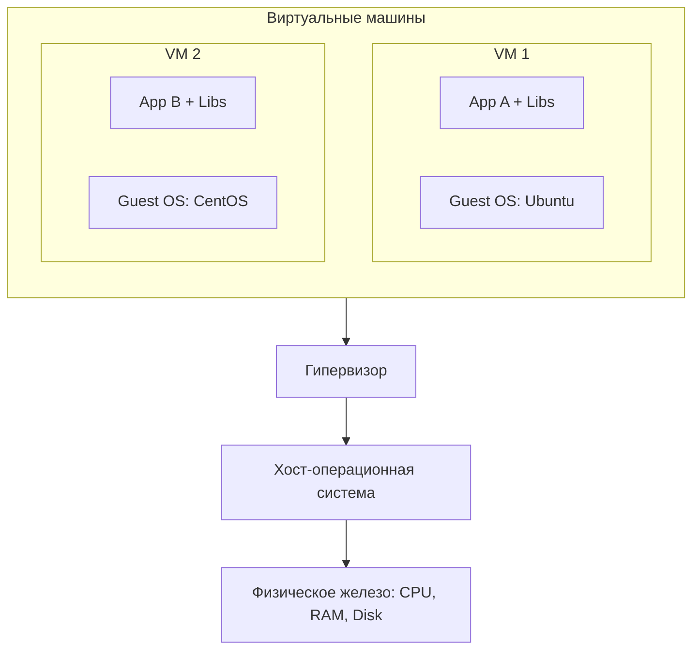
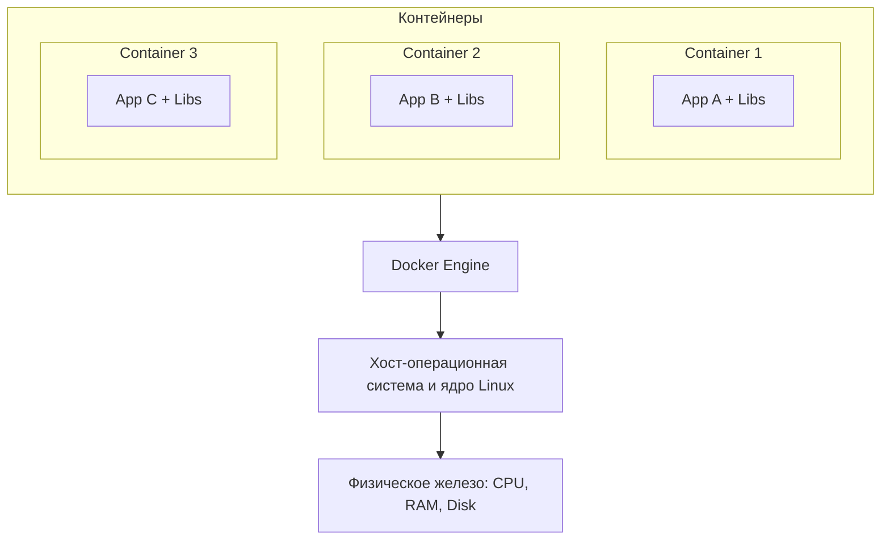
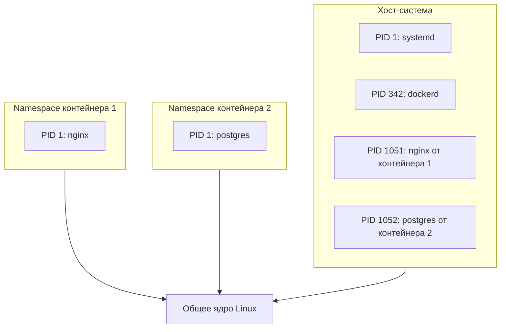
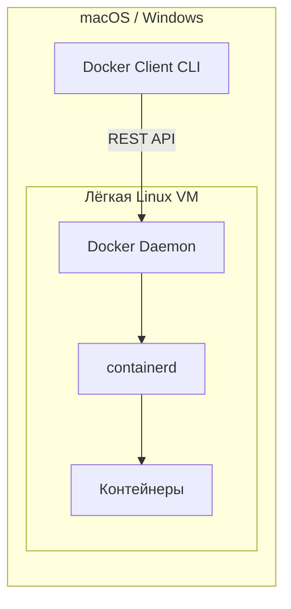
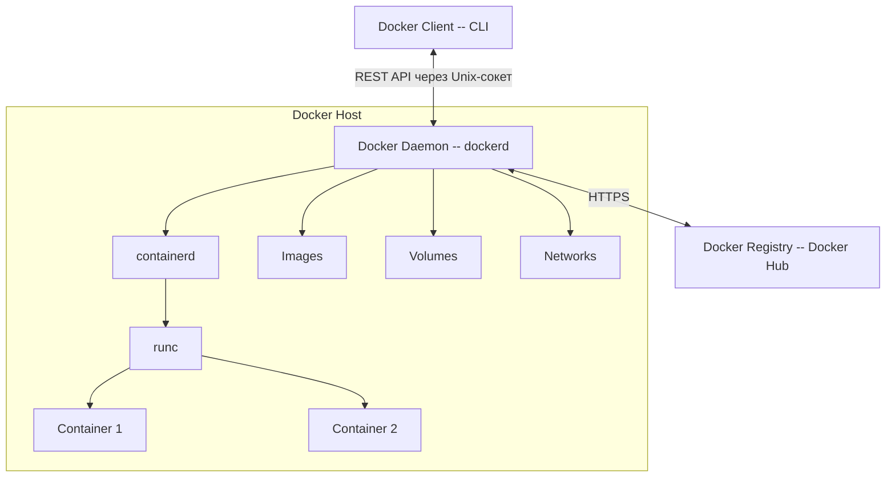
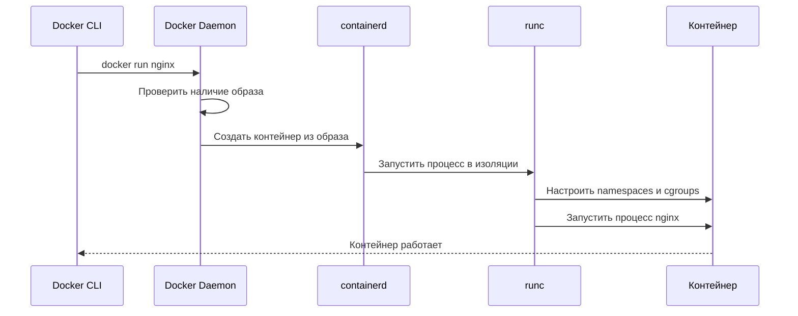
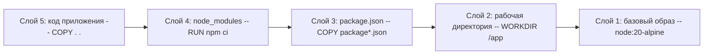
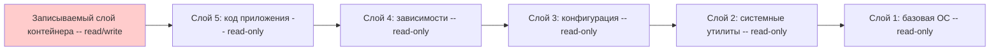
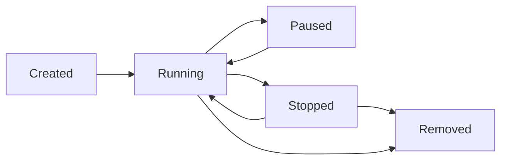

# Уровень 0: Введение в Docker -- контейнеризация, архитектура и первые шаги

## Введение

Представьте, что вы отправляете другу рецепт торта. Вы пишете: "Возьми муку, яйца, масло и сахар, смешай и поставь в духовку". Друг следует рецепту, но торт не получается -- у него другая духовка, другая мука, другие пропорции. Знакомая ситуация? В мире разработки это называется **"Works on my machine"** -- проблема, которую Docker решает раз и навсегда.

Docker -- это как отправить другу не рецепт, а **готовый торт в герметичной упаковке** вместе с духовкой, в которой он был испечён. Неважно, какая кухня у друга -- торт будет точно таким, каким вы его испекли.

На этом уровне мы подробно разберём:

1. **Что такое Docker** -- и почему он стал стандартом индустрии
2. **Контейнеры vs виртуальные машины** -- два подхода к изоляции и их принципиальные различия
3. **Архитектура Docker** -- из каких компонентов состоит платформа и как они взаимодействуют
4. **Docker-объекты** -- образы, контейнеры, тома, сети
5. **Docker Hub и реестры** -- где хранятся и распространяются образы
6. **Типичные ошибки новичков** -- чтобы вы не наступили на грабли, на которые уже наступили тысячи разработчиков

---

## 1. Что такое Docker и зачем он нужен

### Определение

Docker -- это открытая платформа для разработки, доставки и запуска приложений в **контейнерах**. Контейнер -- это лёгкая, изолированная среда выполнения, которая содержит всё необходимое для работы приложения: код, зависимости, библиотеки, системные утилиты и конфигурацию.

Ключевое слово здесь -- **всё необходимое**. Контейнер не зависит от того, что установлено на хост-машине. Неважно, какая у вас операционная система, какие версии библиотек стоят, какие переменные окружения заданы -- контейнер несёт с собой свою собственную среду.

### Краткая история

Docker появился в 2013 году -- его создал Соломон Хайкс в компании dotCloud. Технологии контейнеризации существовали и до Docker (LXC, chroot, FreeBSD Jails), но Docker сделал контейнеры **доступными для обычных разработчиков**. До Docker контейнеры были инструментом системных администраторов, требующим глубокого понимания Linux. Docker предложил простой CLI-интерфейс и концепцию Dockerfile, которая позволила описывать среду выполнения как код.


### Какие проблемы решает Docker

Чтобы понять ценность Docker, посмотрим на типичные проблемы разработки без него.

#### Проблема 1: "Works on my machine"

Это, пожалуй, самая известная проблема в разработке. Код работает у одного разработчика, но падает у другого, у тестировщика, или на production-сервере.

```
Разработчик: "У меня всё работает!"
Тестировщик: "А у меня падает..."
DevOps: "На сервере вообще другая версия Node.js"
```

Причина проста -- окружения отличаются:

```bash
# Разработчик 1: macOS, Node 18, npm 9
node --version  # v18.17.0
npm --version   # 9.6.7

# Разработчик 2: Ubuntu, Node 20, npm 10
node --version  # v20.10.0
npm --version   # 10.2.3

# Production-сервер: Amazon Linux, Node 16
node --version  # v16.20.2
npm --version   # 8.19.4
```

Разные версии Node.js могут по-разному обрабатывать один и тот же код. Например, `Array.prototype.findLast` появился только в Node 18.0 -- код, использующий этот метод, будет работать у первого разработчика, но упадёт на production-сервере.

С Docker все работают с одним и тем же образом, в котором зафиксированы конкретные версии всего -- от ОС до последней библиотеки.

#### Проблема 2: Dependency Hell

Проект A требует PostgreSQL 14 и Redis 6. Проект B -- PostgreSQL 16 и Redis 7. Проект C -- ещё и MongoDB 7. Установить всё это на одну машину -- уже сложно. А когда проект D требует PostgreSQL 14.3, а проект A -- PostgreSQL 14.10, начинается настоящий хаос.

Аналогия: представьте, что у вас в квартире одна розетка, а приборов -- десять. Вы покупаете удлинители, тройники, они начинают греться и искрить. Docker -- это как дать каждому прибору **собственную розетку** с нужным напряжением.

```bash
# С Docker каждый проект получает именно то, что ему нужно
docker run -d --name proj-a-db postgres:14.10
docker run -d --name proj-b-db postgres:16.2
docker run -d --name proj-c-db mongo:7
```

Эти базы данных работают параллельно, не мешают друг другу, и каждая -- именно той версии, которая нужна проекту.

#### Проблема 3: Воспроизводимость окружения

Без Docker настройка рабочего окружения для нового разработчика -- это квест на полдня (а иногда и на несколько дней). "Установи PostgreSQL, настрой его так-то, потом поставь Redis, потом Elasticsearch, не забудь про RabbitMQ..." -- и каждый шаг может пойти не так.

Docker-образ описывает окружение **как код** в файле `Dockerfile`:

```dockerfile
FROM node:20-alpine
WORKDIR /app
COPY package*.json ./
RUN npm ci
COPY . .
EXPOSE 3000
CMD ["npm", "start"]
```

Этот файл можно:
- Версионировать в Git вместе с кодом проекта
- Автоматически собирать в CI/CD-пайплайне
- Гарантированно воспроизвести на любой машине с Docker
- Проверить на code review, как обычный код

Новый разработчик в команде? Вместо многостраничной инструкции по настройке окружения -- одна команда:

```bash
docker compose up -d
```

#### Проблема 4: Медленное развёртывание

Виртуальная машина загружается минуты -- ей нужно инициализировать ядро ОС, запустить системные сервисы, настроить сеть. Контейнер стартует за **секунды**, потому что использует уже работающее ядро хост-системы.

Это критически важно для:
- **Микросервисной архитектуры** -- где десятки сервисов запускаются и останавливаются постоянно
- **CI/CD** -- где каждый коммит проходит через сборку и тестирование
- **Автомасштабирования** -- когда нужно быстро запустить дополнительные экземпляры сервиса при росте нагрузки

### Где используется Docker в реальных проектах

Docker -- не игрушка для экспериментов. Он используется повсеместно:

- **Локальная разработка** -- единое окружение для всей команды
- **CI/CD** -- сборка и тестирование в изолированных контейнерах
- **Production** -- развёртывание приложений в Kubernetes, Docker Swarm, AWS ECS
- **Микросервисы** -- каждый сервис в своём контейнере с независимым деплоем
- **Data Science** -- воспроизводимые среды для обучения моделей

По данным опроса Stack Overflow 2023, Docker используют более 50% профессиональных разработчиков. Это не просто инструмент -- это стандарт индустрии.

---

## 2. Контейнеры vs виртуальные машины

Контейнеры и виртуальные машины решают одну задачу -- **изоляцию приложений**. Но делают это принципиально по-разному. Понимание этой разницы -- фундамент для работы с Docker.

### Как работают виртуальные машины

Виртуальная машина эмулирует **полноценный компьютер**: у неё есть свой процессор (виртуальный), память, диск и **своя операционная система**. Над физическим оборудованием работает **гипервизор** -- специальная программа, которая распределяет ресурсы физического хоста между виртуальными машинами.

Аналогия: виртуальная машина -- это как **отдельная квартира** в многоквартирном доме. У каждой квартиры свои стены, своя сантехника, своё электричество. Жильцы полностью изолированы друг от друга, но каждая квартира требует полного набора коммуникаций.

Гипервизоры бывают двух типов:

- **Тип 1 (bare-metal)** -- работает прямо на железе, без хост-ОС. Примеры: VMware ESXi, Microsoft Hyper-V, Xen. Используется в дата-центрах.
- **Тип 2 (hosted)** -- работает как приложение поверх обычной ОС. Примеры: VirtualBox, VMware Workstation, Parallels. Используется для разработки.



Что важно: каждая VM тащит с собой **полноценную ОС**. Ubuntu Server -- это минимум 1-2 ГБ на диске. Windows Server -- 10-15 ГБ. И каждой VM нужно выделить RAM для этой ОС, даже если приложение внутри потребляет всего 50 МБ.

### Как работают контейнеры

Контейнер **не** эмулирует компьютер. Он использует **ядро хост-операционной системы** и изолирует процессы с помощью двух механизмов Linux:

- **Namespaces** -- обеспечивают изоляцию. Каждый контейнер видит свой собственный набор процессов, свою файловую систему, свою сеть. Контейнер "думает", что он -- единственный на машине.
- **Cgroups (Control Groups)** -- ограничивают ресурсы. Можно задать, сколько CPU, RAM и дискового I/O доступно контейнеру.

Аналогия: контейнер -- это как **комната в коммунальной квартире**. У каждого жильца своя комната с замком, но кухня, ванная и коридор -- общие. Это экономнее, чем отдельная квартира, но жильцы разделяют некоторые ресурсы.



Обратите внимание: **нет Guest OS**. Контейнер содержит только приложение и его зависимости. Вместо 1-2 ГБ на ОС -- десятки мегабайт на минимальный набор библиотек.

### Сравнительная таблица

| Характеристика | Контейнеры | Виртуальные машины |
|---|---|---|
| **Изоляция** | На уровне процессов через namespaces | Полная аппаратная виртуализация |
| **ОС** | Разделяют ядро хост-ОС | Каждая VM имеет свою полную ОС |
| **Время запуска** | Секунды | Минуты |
| **Размер образа** | Мегабайты: 10-500 МБ | Гигабайты: 1-20 ГБ |
| **Потребление RAM** | Минимальное: только приложение | Значительное: ОС + приложение |
| **Производительность** | Близка к нативной: нет оверхеда виртуализации | Ниже из-за эмуляции аппаратуры |
| **Плотность** | Десятки-сотни контейнеров на хосте | Единицы-десятки VM на хосте |
| **Безопасность** | Общее ядро -- потенциальный вектор атаки | Более сильная изоляция |
| **Переносимость** | Любая машина с Docker | Между гипервизорами одного типа |

### Что значит "разделяют ядро ОС"

Это ключевая концепция, которую важно понять глубоко. Ядро операционной системы -- это "посредник" между приложениями и железом. Оно управляет памятью, файловой системой, сетью, процессами.

Когда вы запускаете контейнер, процесс внутри него обращается к **тому же ядру**, что и процессы хост-системы. Но благодаря namespaces этот процесс видит только свою "песочницу":



Процесс nginx внутри контейнера видит себя как PID 1 -- единственный процесс в системе. Но на хосте это обычный процесс с PID 1051, работающий рядом с сотнями других процессов.

### Когда использовать контейнеры, а когда -- VM

**Контейнеры подходят, когда:**
- Нужно запустить много однотипных сервисов с максимальной плотностью
- Важна скорость запуска и экономия ресурсов
- Все сервисы работают на Linux
- Нужна масштабируемость через оркестраторы вроде Kubernetes
- Окружение описывается как код и версионируется

**VM подходят, когда:**
- Нужна полная изоляция уровня безопасности -- например, для мультитенантных сред
- Требуется запуск другой ОС -- Windows на Linux-хосте или наоборот
- Приложение требует специфического ядра или модулей ядра
- Нужна совместимость с legacy-системами, которые не контейнеризируются

На практике контейнеры и VM часто используются **вместе**. Типичная схема в облаке: VM обеспечивают изоляцию на уровне клиентов (каждый клиент -- в своей VM), а контейнеры -- изоляцию на уровне микросервисов внутри каждой VM.

### Docker на macOS и Windows -- а где же Linux?

Если контейнеры используют ядро Linux, как Docker работает на macOS и Windows? Ответ прост: Docker Desktop запускает **лёгкую виртуальную машину с Linux** под капотом. На macOS это HyperKit или Apple Virtualization Framework, на Windows -- WSL 2 (Windows Subsystem for Linux).



Вот почему Docker на macOS работает чуть медленнее, чем на Linux -- есть дополнительный слой виртуализации. Но для разработки эта разница обычно незаметна.

---

## 3. Архитектура Docker

Docker построен на **клиент-серверной архитектуре**. Понимание компонентов поможет вам лучше разбираться в ошибках и оптимизировать работу с Docker.

### Общая схема



### Docker Client -- CLI

Docker Client -- это интерфейс командной строки, через который вы взаимодействуете с Docker. Каждая команда, которую вы вводите, превращается в HTTP-запрос к Docker Daemon.

```bash
# Все эти команды -- HTTP-запросы к Docker Daemon
docker run nginx          # POST /containers/create + POST /containers/{id}/start
docker build .            # POST /build
docker pull ubuntu:22.04  # POST /images/create?fromImage=ubuntu&tag=22.04
docker ps                 # GET /containers/json
```

Клиент общается с Daemon через **Unix-сокет** (`/var/run/docker.sock`) на Linux/macOS или **named pipe** на Windows. Клиент и Daemon могут работать на разных машинах -- например, вы можете управлять Docker-сервером в облаке со своего ноутбука.

```bash
# Подключение к удалённому Docker Daemon
export DOCKER_HOST=tcp://192.168.1.100:2376
docker ps  # Покажет контейнеры на удалённой машине
```

### Docker Daemon -- dockerd

Docker Daemon -- это серверный процесс, который управляет всеми Docker-объектами. Он:

- Принимает API-запросы от клиента
- Управляет образами -- скачивает, хранит, удаляет
- Управляет контейнерами -- создаёт, запускает, останавливает
- Управляет сетями и томами
- Делегирует запуск контейнеров среде выполнения -- containerd

Daemon работает с привилегиями root, что является одновременно его силой (полный контроль над системой) и слабостью (потенциальный вектор атаки). Именно поэтому Docker-сокет нужно защищать -- любой, кто имеет доступ к сокету, фактически имеет root-доступ к хост-системе.

### Container Runtime -- containerd и runc

Docker Daemon не запускает контейнеры напрямую. Между командой `docker run` и работающим процессом -- два уровня среды выполнения:

**containerd** -- высокоуровневый рантайм. Отвечает за полный жизненный цикл контейнера:
- Скачивание и хранение образов
- Создание и удаление контейнеров
- Управление сетями и хранилищем

**runc** -- низкоуровневый рантайм. Непосредственно создаёт контейнер, вызывая системные функции Linux для настройки namespaces и cgroups. runc -- это эталонная реализация спецификации OCI (Open Container Initiative).



Зачем такое разделение? Потому что containerd и runc -- стандартизированные компоненты, которые можно заменить. Например, Kubernetes может использовать containerd напрямую, без Docker Daemon. А вместо runc можно подставить другой рантайм -- gVisor для дополнительной безопасности или Kata Containers для запуска контейнеров в микро-VM.

### Docker Registry

Реестр -- это хранилище Docker-образов. Когда вы выполняете `docker pull nginx`, Docker скачивает образ из реестра. Когда выполняете `docker push myapp:1.0` -- загружает образ в реестр.

**Docker Hub** (hub.docker.com) -- крупнейший публичный реестр, используемый по умолчанию. Здесь хранятся:

- **Официальные образы** -- nginx, postgres, node, python, redis. Поддерживаются командой Docker и сообществом, проходят проверку безопасности.
- **Верифицированные образы** -- от компаний вроде Microsoft, Oracle, Canonical. Имеют специальный значок.
- **Пользовательские образы** -- от любых разработчиков. Именуются как `username/imagename`.

```bash
# Поиск образов на Docker Hub
docker search nginx

# Скачивание конкретной версии
docker pull nginx:1.25-alpine

# Загрузка своего образа
docker login
docker push myuser/my-app:1.0
```

Помимо Docker Hub, существуют альтернативные реестры:

| Реестр | Назначение |
|---|---|
| **GitHub Container Registry** -- ghcr.io | Интеграция с GitHub Actions |
| **Amazon ECR** | Для проектов на AWS |
| **Google Artifact Registry** -- gcr.io | Для проектов на GCP |
| **Azure Container Registry** | Для проектов на Azure |
| **Harbor** | Self-hosted open-source реестр |

---

## 4. Docker-объекты подробно

Docker оперирует четырьмя основными типами объектов. Каждый из них решает свою задачу.

### Image -- образ

Образ -- это **шаблон только для чтения** с инструкциями по созданию контейнера. Если контейнер -- это работающий процесс, то образ -- это программа на диске, из которой этот процесс запускается.

Аналогия: образ -- это **чертёж дома**. По одному чертежу можно построить сколько угодно одинаковых домов (контейнеров). Но сам чертёж -- не дом, в нём нельзя жить.

Образы строятся **послойно** -- это одна из ключевых особенностей Docker. Каждая инструкция в Dockerfile создаёт новый слой, а слои кэшируются и переиспользуются.

```dockerfile
FROM node:20-alpine     # Слой 1: базовый образ с Node.js
WORKDIR /app            # Слой 2: создать рабочую директорию
COPY package*.json ./   # Слой 3: скопировать файлы зависимостей
RUN npm ci              # Слой 4: установить зависимости
COPY . .                # Слой 5: скопировать код приложения
```



Зачем нужны слои? Для **кэширования**. Если вы изменили только код приложения (слой 5), Docker не будет заново устанавливать зависимости (слой 4) -- он возьмёт их из кэша. Это ускоряет сборку с минут до секунд.

Кроме того, слои **переиспользуются** между образами. Если у вас 10 приложений на Node.js, базовый слой `node:20-alpine` существует на диске в одном экземпляре.

```bash
# Посмотреть слои образа и их размер
docker image history nginx:latest

# Посмотреть все локальные образы
docker images

# Удалить образ
docker rmi nginx:latest
```

Ключевые свойства образов:
- **Неизменяемость** -- после создания образ нельзя изменить, можно только создать новый
- **Наследование** -- образы строятся на основе других образов через инструкцию `FROM`
- **Тегирование** -- один образ может иметь несколько тегов: `nginx:latest`, `nginx:1.25`, `nginx:1.25.3-alpine`
- **Адресация по содержимому** -- каждый образ имеет уникальный SHA256-хеш

### Container -- контейнер

Контейнер -- это **запущенный экземпляр образа**. Он добавляет тонкий записываемый слой поверх слоёв образа только для чтения. Всё, что приложение записывает на диск внутри контейнера, попадает в этот записываемый слой.



Из одного образа можно создать сколько угодно контейнеров. Каждый получит свой записываемый слой, но слои образа разделяются между всеми контейнерами. Это экономит дисковое пространство.

```bash
# Создать и запустить контейнер
docker run -d --name my-nginx -p 8080:80 nginx:latest

# Посмотреть запущенные контейнеры
docker ps

# Посмотреть все контейнеры, включая остановленные
docker ps -a

# Остановить контейнер
docker stop my-nginx

# Удалить контейнер
docker rm my-nginx
```

Контейнер может находиться в нескольких состояниях:



### Volume -- том

Записываемый слой контейнера **эфемерен** -- он удаляется вместе с контейнером. Это проблема для данных, которые должны пережить перезапуск: базы данных, загруженные файлы, логи.

Том -- это механизм **персистентного хранения данных**, управляемый Docker. Тома хранятся отдельно от контейнера и сохраняются даже после его удаления.

Аналогия: контейнер -- это съёмная квартира, а том -- это сейф в банке. Если вы переедете из квартиры (удалите контейнер), вещи в сейфе (данные в томе) останутся на месте.

```bash
# Создать именованный том
docker volume create my-data

# Запустить контейнер с подключённым томом
docker run -d -v my-data:/var/lib/postgresql/data postgres:16

# Посмотреть все тома
docker volume ls

# Удалить том (только если он не используется)
docker volume rm my-data
```

Помимо именованных томов, Docker поддерживает **bind mounts** -- прямое подключение директории хост-системы в контейнер:

```bash
# Bind mount: директория хоста подключается в контейнер
docker run -v /home/user/project:/app my-app

# Удобно для разработки: изменения в коде сразу видны в контейнере
```

### Network -- сеть

Docker-сети позволяют контейнерам общаться друг с другом и с внешним миром. По умолчанию Docker создаёт несколько типов сетей:

| Драйвер | Описание | Когда использовать |
|---|---|---|
| **bridge** | Изолированная сеть на хосте -- используется по умолчанию | Контейнеры на одном хосте |
| **host** | Контейнер использует сеть хоста напрямую | Когда нужна максимальная сетевая производительность |
| **none** | Контейнер полностью изолирован от сети | Для задач, не требующих сети |
| **overlay** | Сеть между несколькими Docker-хостами | Docker Swarm, кластеры |

```bash
# Создать пользовательскую bridge-сеть
docker network create my-network

# Запустить два контейнера в одной сети
docker run -d --name web --network my-network nginx
docker run -d --name api --network my-network my-api

# Контейнеры могут обращаться друг к другу по имени:
# Из контейнера api: curl http://web:80
```

В пользовательских bridge-сетях контейнеры могут обращаться друг к другу **по имени** (DNS-резолвинг). В дефолтной bridge-сети этого нет -- ещё одна причина всегда создавать свои сети.

---

## 5. Установка Docker

### Docker Desktop vs Docker Engine

Docker доступен в двух вариантах:

- **Docker Desktop** -- графическое приложение для macOS и Windows. Включает Docker Engine, Docker CLI, Docker Compose, Kubernetes и графический интерфейс. Подходит для разработки.
- **Docker Engine** -- серверный компонент для Linux. Устанавливается через пакетный менеджер. Подходит для серверов и CI/CD.

### Установка на macOS

1. Скачайте Docker Desktop с официального сайта: https://www.docker.com/products/docker-desktop/
2. Перетащите приложение в папку Applications
3. Запустите Docker Desktop
4. Дождитесь, пока иконка Docker в строке меню перестанет анимироваться

```bash
# Проверка установки
docker --version
# Docker version 24.0.7, build afdd53b

docker compose version
# Docker Compose version v2.23.3
```

### Установка на Ubuntu/Debian

```bash
# 1. Удалить старые версии, если есть
sudo apt-get remove docker docker-engine docker.io containerd runc

# 2. Установить зависимости
sudo apt-get update
sudo apt-get install ca-certificates curl gnupg

# 3. Добавить GPG-ключ Docker
sudo install -m 0755 -d /etc/apt/keyrings
curl -fsSL https://download.docker.com/linux/ubuntu/gpg | \
  sudo gpg --dearmor -o /etc/apt/keyrings/docker.gpg

# 4. Добавить репозиторий
echo \
  "deb [arch=$(dpkg --print-architecture) \
  signed-by=/etc/apt/keyrings/docker.gpg] \
  https://download.docker.com/linux/ubuntu \
  $(. /etc/os-release && echo "$VERSION_CODENAME") stable" | \
  sudo tee /etc/apt/sources.list.d/docker.list > /dev/null

# 5. Установить Docker Engine
sudo apt-get update
sudo apt-get install docker-ce docker-ce-cli containerd.io \
  docker-buildx-plugin docker-compose-plugin

# 6. Добавить пользователя в группу docker
sudo usermod -aG docker $USER
# Перелогиньтесь для применения изменений
```

### Проверка установки

После установки выполните несколько команд для проверки:

```bash
# Версия Docker
docker --version

# Подробная информация о системе
docker info

# Запуск тестового контейнера
docker run hello-world
```

Команда `docker run hello-world` скачает маленький образ, создаст контейнер и выведет приветственное сообщение. Если вы видите текст "Hello from Docker!" -- всё работает.

---

## 6. Первые команды Docker

Перед тем как переходить к практическим заданиям, познакомимся с основными командами.

### Работа с образами

```bash
# Скачать образ из реестра
docker pull nginx:1.25-alpine

# Посмотреть локальные образы
docker images

# Удалить образ
docker rmi nginx:1.25-alpine

# Посмотреть подробную информацию об образе
docker inspect nginx:1.25-alpine
```

### Работа с контейнерами

```bash
# Запустить контейнер в фоновом режиме
docker run -d --name my-web -p 8080:80 nginx

# Посмотреть запущенные контейнеры
docker ps

# Посмотреть логи контейнера
docker logs my-web

# Подключиться к работающему контейнеру
docker exec -it my-web bash

# Остановить контейнер
docker stop my-web

# Удалить контейнер
docker rm my-web
```

### Разбор команды `docker run`

Команда `docker run` -- самая важная и самая используемая. Разберём её флаги:

```bash
docker run -d --name my-web -p 8080:80 -v data:/usr/share/nginx/html nginx:1.25
#          |  |              |           |                                |
#          |  |              |           |                                +-- образ:тег
#          |  |              |           +-- том: хост_путь:контейнер_путь
#          |  |              +-- порт: хост_порт:контейнер_порт
#          |  +-- имя контейнера
#          +-- detached mode -- запуск в фоне
```

| Флаг | Назначение | Пример |
|---|---|---|
| `-d` | Запуск в фоновом режиме | `docker run -d nginx` |
| `--name` | Задать имя контейнеру | `docker run --name web nginx` |
| `-p` | Проброс портов -- хост:контейнер | `docker run -p 8080:80 nginx` |
| `-v` | Подключение тома или bind mount | `docker run -v data:/app nginx` |
| `-e` | Задать переменную окружения | `docker run -e DB_HOST=localhost app` |
| `--rm` | Удалить контейнер после остановки | `docker run --rm nginx` |
| `-it` | Интерактивный режим с терминалом | `docker run -it ubuntu bash` |
| `--network` | Подключить к сети | `docker run --network my-net app` |

---

## Типичные ошибки новичков

### 1. Путать образы и контейнеры

Это самая частая ошибка. Новички думают, что `docker pull` запускает приложение.

```bash
# ❌ Скачать образ и ждать, что приложение заработает
docker pull nginx
curl http://localhost  # Connection refused!
```

Образ -- это шаблон, он лежит на диске и ничего не делает. Чтобы приложение заработало, нужно создать из образа контейнер.

```bash
# ✅ Скачать образ и запустить контейнер
docker pull nginx
docker run -d -p 80:80 nginx
curl http://localhost  # Welcome to nginx!
```

Аналогия: `docker pull` -- это как скачать установщик программы. `docker run` -- это как запустить установщик и открыть программу.

### 2. Думать, что контейнер -- это виртуальная машина

```bash
# ❌ Пытаться "зайти" в контейнер как в виртуальную машину и установить туда софт
docker exec -it my-container bash
apt-get install vim  # Будет работать, но...
```

Проблема: всё, что вы установили вручную внутри контейнера, исчезнет при его пересоздании. Контейнеры -- **одноразовые**. Если нужен vim -- добавьте его в Dockerfile.

```bash
# ✅ Все изменения -- через Dockerfile
FROM nginx:latest
RUN apt-get update && apt-get install -y vim
```

### 3. Забывать про эфемерность данных

```bash
# ❌ Запустить базу данных без тома
docker run -d --name my-db postgres:16
# Работаем, заполняем данными...
docker rm -f my-db  # Все данные потеряны навсегда!
```

Записываемый слой контейнера удаляется вместе с контейнером. Для данных, которые должны сохраняться, **всегда** используйте тома.

```bash
# ✅ Том сохранит данные между пересозданиями контейнера
docker run -d --name my-db -v pgdata:/var/lib/postgresql/data postgres:16
docker rm -f my-db
# Данные в томе pgdata целы!
docker run -d --name my-db-new -v pgdata:/var/lib/postgresql/data postgres:16
# Новый контейнер подхватит данные из тома
```

### 4. Не указывать тег образа

```bash
# ❌ Использовать latest по умолчанию
docker pull nginx
docker run nginx
```

Тег `latest` -- это не "последняя стабильная версия". Это просто тег, который авторы образа привязывают к какой-то версии. Он может измениться в любой момент, и ваше приложение сломается.

```bash
# ✅ Всегда указывайте конкретную версию
docker pull nginx:1.25.3-alpine
docker run nginx:1.25.3-alpine
```

### 5. Запускать Docker от root без необходимости

```bash
# ❌ Всегда использовать sudo
sudo docker run nginx
sudo docker ps
sudo docker build .
```

Работа от root -- риск безопасности. Добавьте своего пользователя в группу `docker`:

```bash
# ✅ Настроить один раз -- использовать без sudo
sudo usermod -aG docker $USER
# Перелогиньтесь, затем:
docker run nginx  # Без sudo
```

### 6. Не чистить за собой

Docker накапливает неиспользуемые образы, остановленные контейнеры, ненужные тома и сети. Со временем это съедает десятки гигабайт дискового пространства.

```bash
# Посмотреть, сколько места занимает Docker
docker system df

# Удалить всё неиспользуемое
docker system prune -a

# Удалить только остановленные контейнеры
docker container prune

# Удалить неиспользуемые тома (осторожно!)
docker volume prune
```

---

## Итоги

- Docker -- платформа контейнеризации, решающая проблемы совместимости окружений, воспроизводимости и скорости развёртывания
- Контейнеры и VM решают задачу изоляции по-разному: контейнеры разделяют ядро ОС и работают на уровне процессов, VM эмулируют полноценный компьютер
- Архитектура Docker: Client отправляет команды Daemon, Daemon делегирует containerd, containerd использует runc для создания контейнеров
- Docker-объекты: образы -- неизменяемые шаблоны из слоёв, контейнеры -- запущенные экземпляры образов, тома -- персистентное хранилище, сети -- связь между контейнерами
- Docker Hub -- публичный реестр с официальными и пользовательскими образами, но существуют и приватные альтернативы
- Всегда указывайте конкретный тег образа, используйте тома для данных и не забывайте чистить неиспользуемые ресурсы
