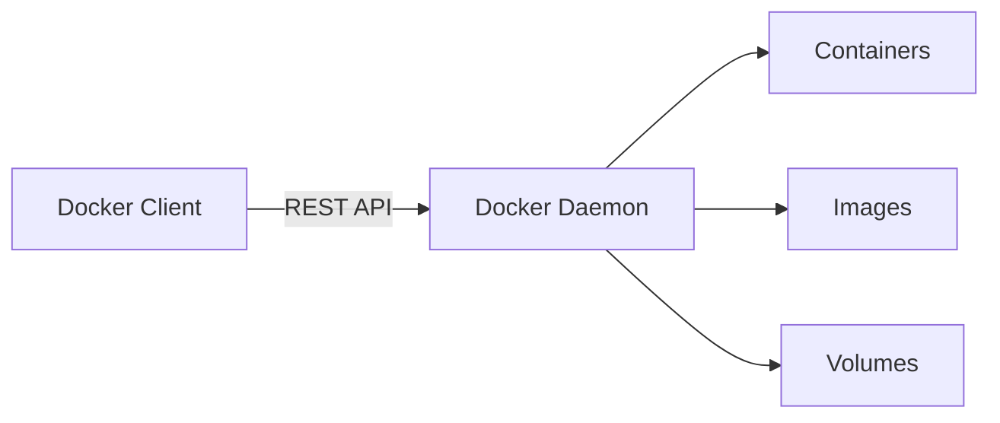
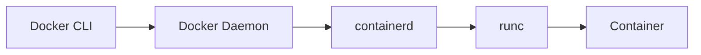
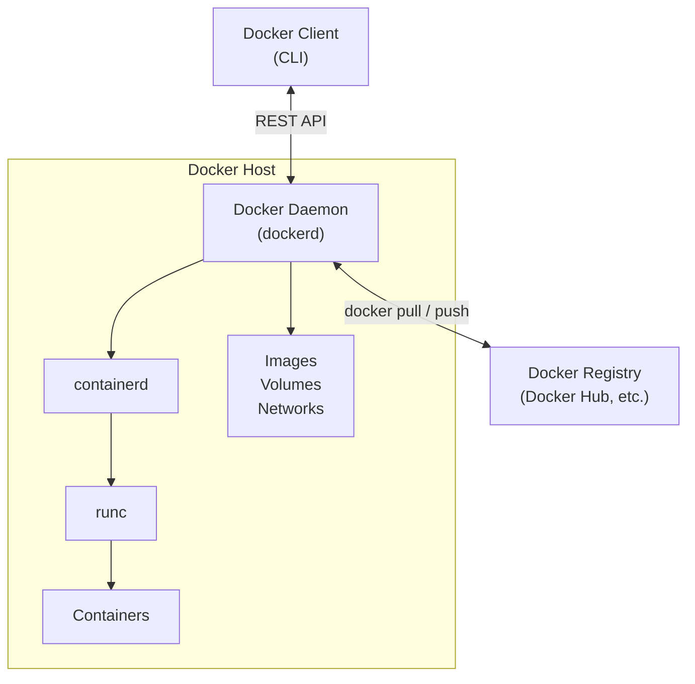

# 🔥 Level 0: Introduction to Docker

## 🎯 What is Docker and why it matters

Docker is a platform for developing, delivering, and running applications in **containers**. A container is a lightweight, isolated environment that contains everything an application needs to run: code, dependencies, libraries, system utilities, and configuration.

### Problems Docker solves

Imagine a typical developer's workday:

```
Developer: "It works on my machine!"
QA engineer: "It crashes on mine..."
DevOps: "The server has a completely different Node.js version"
```

Sound familiar? Docker solves this and many other problems:

**1. "Works on my machine"**

Without Docker, every developer configures their environment manually. Different versions of languages, libraries, databases — all of this creates divergence between environments.

```bash
# Developer 1
node --version  # v18.17.0
npm --version   # 9.6.7

# Developer 2
node --version  # v20.10.0
npm --version   # 10.2.3
```

With Docker, everyone works with the same image, which guarantees an identical environment.

**2. Dependency Hell**

Project A requires PostgreSQL 14 and Redis 6, project B — PostgreSQL 16 and Redis 7. Without Docker you have to juggle versions or run everything on separate machines.

```bash
# With Docker each project has its own versions
docker run postgres:14   # For project A
docker run postgres:16   # For project B
```

**3. Environment reproducibility**

A Docker image describes the environment as code (`Dockerfile`). This means the environment can be:
- Versioned in Git
- Built automatically in CI/CD
- Reliably reproduced on any machine

**4. Fast deployment**

A container starts in seconds, not minutes (unlike a virtual machine). This speeds up development, testing, and deployment.

## 🔥 Containers vs virtual machines

Containers and virtual machines (VMs) are two approaches to application isolation. They solve a similar problem but work differently.

### Virtual machines

A virtual machine emulates a **fully functional computer**: it has its own CPU, memory, disk, and **its own operating system**. A **hypervisor** (e.g., VMware, VirtualBox, Hyper-V) runs on top of the physical hardware and distributes resources between VMs.

```mermaid
block-beta
    columns 1
    block:vm["Virtual Machine"]
        columns 2
        block:appA["App A\nLibs/Deps\nGuest OS"]
        end
        block:appB["App B\nLibs/Deps\nGuest OS"]
        end
    end
    hypervisor["Hypervisor"]
    hostOS["Host Operating System"]
    hardware["Physical Hardware"]
```

### Containers

A container uses the **host OS kernel**. It has no OS of its own — instead it isolates processes using Linux mechanisms: **namespaces** (isolation) and **cgroups** (resource limits).

```mermaid
block-beta
    columns 1
    block:containers["Containers"]
        columns 2
        block:appA2["App A\nLibs/Deps"]
        end
        block:appB2["App B\nLibs/Deps"]
        end
    end
    engine["Docker Engine"]
    hostOS2["Host Operating System"]
    hardware2["Physical Hardware"]
```

### Comparison table

| Characteristic | Containers | Virtual Machines |
|---|---|---|
| **Isolation** | Process-level (namespaces) | Full hardware virtualization |
| **OS** | Share the host OS kernel | Each VM has its own full OS |
| **Startup time** | Seconds | Minutes |
| **Image size** | Megabytes (10–500 MB) | Gigabytes (1–20 GB) |
| **RAM usage** | Minimal (application only) | Significant (OS + application) |
| **Performance** | Near-native | Lower due to virtualization |
| **Density** | Tens to hundreds per host | Units to tens per host |
| **Portability** | Across any Linux hosts | Between hypervisors of the same type |
| **Security** | Shared kernel — potential risk | Stronger isolation |

### When to use which

**Containers are a good fit when:**
- You need to run many similar services
- Startup speed and resource efficiency matter
- All services run on Linux
- You need scalability (Kubernetes)

**VMs are a good fit when:**
- Full isolation (security) is required
- You need to run a different OS (Windows on Linux)
- The application requires a specific kernel
- Legacy system compatibility is needed

💡 In practice, containers and VMs are often used **together**: VMs provide isolation at the infrastructure level, while containers provide isolation at the application level inside the VMs.

## 🔥 Docker Architecture

Docker is built on a **client-server architecture**. Main components:

### Docker Client (CLI)

This is what you interact with: commands `docker build`, `docker run`, `docker pull`, etc. The client sends commands to the Docker Daemon via a REST API.

```bash
# All these commands are sent to Docker Daemon
docker run nginx          # Start a container
docker build .            # Build an image
docker pull ubuntu:22.04  # Download an image
```

### Docker Daemon (dockerd)

The **server-side** of Docker. The Daemon manages Docker objects: images, containers, networks, and volumes. It listens for API requests from the client and executes them.



### Container Runtime (containerd + runc)

The Docker Daemon does not start containers directly. It delegates this to **containerd** (a high-level runtime), which in turn uses **runc** (a low-level runtime) to create containers based on the OCI specification.



### Docker Registry

**Image storage**. Docker Hub is the default public registry, but private registries can also be used.

```bash
# Download an image from Docker Hub
docker pull nginx:latest

# Download from a private registry
docker pull registry.company.com/my-app:1.0
```

### Full interaction diagram



## 📌 Docker Objects

### Image

An image is a **read-only template** with instructions for creating a container. Images are built in **layers**: each instruction in a `Dockerfile` creates a new layer.

```bash
# View the layers of an image
docker image history nginx:latest
```

Key properties:
- An image is immutable
- Images are built from a `Dockerfile`
- Images can be inherited from (`FROM`)
- Layers are cached to speed up builds

### Container

A container is a **running instance of an image**. It adds a writable layer on top of the image. Multiple containers can be created from a single image.

```bash
# Create and start a container
docker run -d --name my-nginx nginx:latest

# View running containers
docker ps
```

### Volume

A volume is a mechanism for **persistent data storage**. Data inside a container lives only as long as the container exists, while volumes preserve data across restarts.

```bash
# Create a volume and attach it to a container
docker run -v my-data:/var/lib/data my-app
```

### Network

Docker networks enable communication between containers. By default, Docker creates a **bridge network**, but other drivers are also available.

```bash
# Create a custom network
docker network create my-network

# Start a container in the network
docker run --network my-network my-app
```

## 📌 Docker Hub and registries

**Docker Hub** (hub.docker.com) is the largest public Docker image registry. It hosts:

- **Official images** (nginx, postgres, node, python) — maintained by Docker and the community
- **Verified Publisher images** — from verified companies (Microsoft, Oracle)
- **Community images** — from any developers

```bash
# Search for images
docker search nginx

# Download an image
docker pull nginx:1.25

# Upload your own image
docker push myuser/my-app:1.0
```

Alternative registries:
- **GitHub Container Registry** (ghcr.io)
- **Amazon ECR** — for AWS
- **Google Container Registry** (gcr.io)
- **Harbor** — self-hosted open-source registry

## ⚠️ Common beginner mistakes

### 🐛 1. Confusing images and containers

```bash
# ❌ Thinking an image is a running application
docker pull nginx     # This downloads the image, not starts the application!
```

> **Why this is a mistake:** an image is a template (analogous to a class in OOP). For the application to work, you need to create a container from the image (analogous to an instance/object).

```bash
# ✅ Download the image AND start a container
docker pull nginx
docker run -d -p 80:80 nginx
```

### 🐛 2. Thinking Docker is a virtual machine

```
❌ "Docker creates a virtual machine with a separate OS"
```

> **Why this is a mistake:** Docker containers use the host OS kernel. They have no Linux kernel of their own, no bootloader, no hardware emulation. That is exactly why containers are lightweight and start in seconds.

```
✅ Docker uses Linux mechanisms (namespaces, cgroups) to isolate
   processes within a single OS kernel.
```

### 🐛 3. Forgetting that container data is ephemeral

```bash
# ❌ Start a DB without a volume and lose data when the container is deleted
docker run -d postgres:16
docker rm -f <container-id>  # All data is lost!
```

> **Why this is a mistake:** by default all data is stored in the container's writable layer. When a container is deleted, the layer is destroyed along with the data.

```bash
# ✅ Always use volumes for important data
docker run -d -v pgdata:/var/lib/postgresql/data postgres:16
```

### 🐛 4. Running Docker as root unnecessarily

```bash
# ❌ Always using sudo
sudo docker run nginx
sudo docker ps
```

> **Why this is a mistake:** running as root is a security risk. If a container is compromised, an attacker gains root access to the host system.

```bash
# ✅ Add the user to the docker group
sudo usermod -aG docker $USER
# After re-login:
docker run nginx  # No sudo needed
```

## 📌 Summary

- ✅ Docker is a containerization platform that solves environment compatibility problems
- ✅ Containers are lighter than VMs: they share the OS kernel and start in seconds
- ✅ Docker architecture: Client (CLI) → Daemon (dockerd) → containerd → runc
- ✅ Docker objects: images (templates), containers (instances), volumes, networks
- ✅ Docker Hub is a public image registry, but private alternatives exist
- ❌ Containers are not virtual machines — do not confuse them
- 📌 Container data is ephemeral — use volumes for persistence
