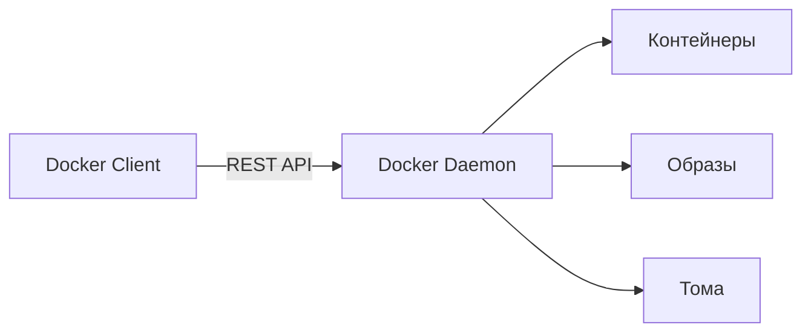
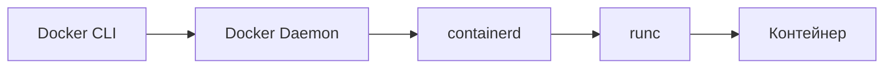
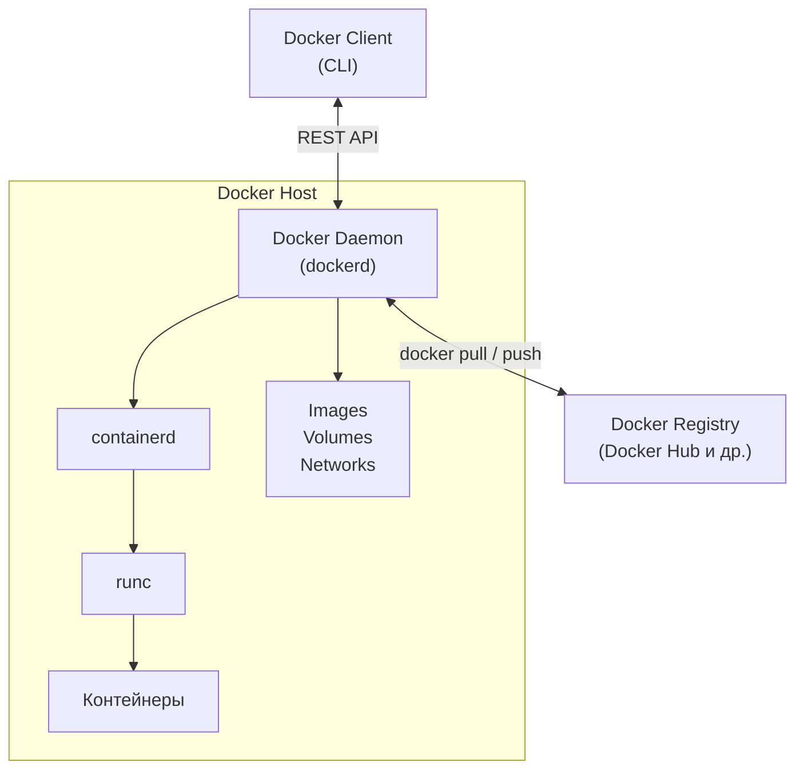

# 🔥 Уровень 0: Введение в Docker

## 🎯 Что такое Docker и зачем он нужен

Docker -- это платформа для разработки, доставки и запуска приложений в **контейнерах**. Контейнер -- это лёгкая, изолированная среда, которая содержит всё необходимое для работы приложения: код, зависимости, библиотеки, системные утилиты и конфигурацию.

### Какие проблемы решает Docker

Представьте типичный рабочий день разработчика:

```
Разработчик: "У меня всё работает!"
Тестировщик: "А у меня падает..."
DevOps: "На сервере вообще другая версия Node.js"
```

Знакомо? Docker решает эту и множество других проблем:

**1. "Works on my machine" (Работает на моей машине)**

Без Docker каждый разработчик настраивает окружение вручную. Разные версии языков, библиотек, баз данных -- всё это создаёт расхождения между средами.

```bash
# Разработчик 1
node --version  # v18.17.0
npm --version   # 9.6.7

# Разработчик 2
node --version  # v20.10.0
npm --version   # 10.2.3
```

С Docker все работают с одним и тем же образом, который гарантирует идентичное окружение.

**2. Dependency Hell (Ад зависимостей)**

Проект A требует PostgreSQL 14 и Redis 6, проект B -- PostgreSQL 16 и Redis 7. Без Docker приходится жонглировать версиями или запускать всё на разных машинах.

```bash
# С Docker каждый проект имеет свои версии
docker run postgres:14   # Для проекта A
docker run postgres:16   # Для проекта B
```

**3. Воспроизводимость окружения**

Docker-образ описывает окружение как код (`Dockerfile`). Это значит, что окружение можно:
- Версионировать в Git
- Автоматически собирать в CI/CD
- Гарантированно воспроизвести на любой машине

**4. Быстрое развёртывание**

Контейнер запускается за секунды, а не за минуты (как виртуальная машина). Это ускоряет разработку, тестирование и деплой.

## 🔥 Контейнеры vs виртуальные машины

Контейнеры и виртуальные машины (VM) -- это два подхода к изоляции приложений. Они решают похожую задачу, но работают по-разному.

### Виртуальные машины

Виртуальная машина эмулирует **полноценный компьютер**: у неё есть свой процессор, память, диск и **своя операционная система**. Над физическим оборудованием работает **гипервизор** (например, VMware, VirtualBox, Hyper-V), который распределяет ресурсы между VM.

```mermaid
block-beta
    columns 1
    block:vm["Виртуальная машина"]
        columns 2
        block:appA["App A\nLibs/Deps\nGuest OS"]
        end
        block:appB["App B\nLibs/Deps\nGuest OS"]
        end
    end
    hypervisor["Гипервизор"]
    hostOS["Хост-операционная система"]
    hardware["Физическое железо"]
```

### Контейнеры

Контейнер использует **ядро хост-операционной системы**. У него нет своей ОС -- вместо этого он изолирует процессы с помощью механизмов Linux: **namespaces** (изоляция) и **cgroups** (ограничение ресурсов).

```mermaid
block-beta
    columns 1
    block:containers["Контейнеры"]
        columns 2
        block:appA2["App A\nLibs/Deps"]
        end
        block:appB2["App B\nLibs/Deps"]
        end
    end
    engine["Docker Engine"]
    hostOS2["Хост-операционная система"]
    hardware2["Физическое железо"]
```

### Сравнительная таблица

| Характеристика | Контейнеры | Виртуальные машины |
|---|---|---|
| **Изоляция** | На уровне процессов (namespaces) | Полная аппаратная виртуализация |
| **ОС** | Разделяют ядро хост-ОС | Каждая VM имеет свою полную ОС |
| **Время запуска** | Секунды | Минуты |
| **Размер образа** | Мегабайты (10-500 МБ) | Гигабайты (1-20 ГБ) |
| **Потребление RAM** | Минимальное (только приложение) | Значительное (ОС + приложение) |
| **Производительность** | Близка к нативной | Ниже из-за виртуализации |
| **Плотность** | Десятки-сотни на хосте | Единицы-десятки на хосте |
| **Переносимость** | Между любыми Linux-хостами | Между гипервизорами одного типа |
| **Безопасность** | Общее ядро -- потенциальный риск | Более сильная изоляция |

### Когда использовать что

**Контейнеры подходят, когда:**
- Нужно запустить много однотипных сервисов
- Важна скорость запуска и экономия ресурсов
- Все сервисы работают на Linux
- Нужна масштабируемость (Kubernetes)

**VM подходят, когда:**
- Нужна полная изоляция (безопасность)
- Требуется запуск другой ОС (Windows на Linux)
- Приложение требует специфичного ядра
- Нужна совместимость с legacy-системами

💡 На практике контейнеры и VM часто используются **вместе**: VM обеспечивают изоляцию на уровне инфраструктуры, а контейнеры -- на уровне приложений внутри VM.

## 🔥 Архитектура Docker

Docker построен на **клиент-серверной архитектуре**. Основные компоненты:

### Docker Client (CLI)

Это то, с чем вы взаимодействуете: команды `docker build`, `docker run`, `docker pull` и т.д. Клиент отправляет команды Docker Daemon через REST API.

```bash
# Все эти команды отправляются Docker Daemon
docker run nginx          # Запустить контейнер
docker build .            # Собрать образ
docker pull ubuntu:22.04  # Скачать образ
```

### Docker Daemon (dockerd)

**Серверная часть** Docker. Daemon управляет Docker-объектами: образами, контейнерами, сетями и томами. Он слушает API-запросы от клиента и выполняет их.



### Container Runtime (containerd + runc)

Docker Daemon не запускает контейнеры напрямую. Он делегирует это **containerd** (высокоуровневый рантайм), который в свою очередь использует **runc** (низкоуровневый рантайм) для создания контейнеров на основе OCI-спецификации.



### Docker Registry

**Хранилище образов**. Docker Hub -- это публичный реестр по умолчанию, но можно использовать приватные реестры.

```bash
# Скачать образ из Docker Hub
docker pull nginx:latest

# Скачать из приватного реестра
docker pull registry.company.com/my-app:1.0
```

### Полная схема взаимодействия



## 📌 Docker-объекты

### Image (Образ)

Образ -- это **шаблон только для чтения** с инструкциями по созданию контейнера. Образы строятся **послойно**: каждая инструкция в `Dockerfile` создаёт новый слой.

```bash
# Посмотреть слои образа
docker image history nginx:latest
```

Ключевые свойства:
- Образ неизменяем (immutable)
- Образы строятся из `Dockerfile`
- Образы можно наследовать (`FROM`)
- Слои кэшируются для ускорения сборки

### Container (Контейнер)

Контейнер -- это **запущенный экземпляр образа**. Он добавляет записываемый слой поверх образа. Можно создать несколько контейнеров из одного образа.

```bash
# Создать и запустить контейнер
docker run -d --name my-nginx nginx:latest

# Посмотреть запущенные контейнеры
docker ps
```

### Volume (Том)

Том -- это механизм **персистентного хранения данных**. Данные в контейнере живут только пока контейнер существует, а тома сохраняют данные между перезапусками.

```bash
# Создать том и подключить к контейнеру
docker run -v my-data:/var/lib/data my-app
```

### Network (Сеть)

Docker-сети обеспечивают связь между контейнерами. По умолчанию Docker создаёт **bridge-сеть**, но доступны и другие драйверы.

```bash
# Создать пользовательскую сеть
docker network create my-network

# Запустить контейнер в сети
docker run --network my-network my-app
```

## 📌 Docker Hub и реестры

**Docker Hub** (hub.docker.com) -- крупнейший публичный реестр Docker-образов. Здесь хранятся:

- **Официальные образы** (nginx, postgres, node, python) -- поддерживаются Docker и сообществом
- **Верифицированные образы** -- от проверенных компаний (Microsoft, Oracle)
- **Пользовательские образы** -- от любых разработчиков

```bash
# Поиск образов
docker search nginx

# Скачивание образа
docker pull nginx:1.25

# Загрузка своего образа
docker push myuser/my-app:1.0
```

Альтернативные реестры:
- **GitHub Container Registry** (ghcr.io)
- **Amazon ECR** -- для AWS
- **Google Container Registry** (gcr.io)
- **Harbor** -- self-hosted open-source реестр

## ⚠️ Частые ошибки новичков

### 🐛 1. Путать образы и контейнеры

```bash
# ❌ Думать, что образ — это запущенное приложение
docker pull nginx     # Это скачивает образ, а не запускает приложение!
```

> **Почему это ошибка:** образ -- это шаблон (аналог класса в ООП). Чтобы приложение заработало, нужно создать из образа контейнер (аналог экземпляра/объекта).

```bash
# ✅ Скачать образ И запустить контейнер
docker pull nginx
docker run -d -p 80:80 nginx
```

### 🐛 2. Думать, что Docker -- это виртуальная машина

```
❌ "Docker создаёт виртуальную машину с отдельной ОС"
```

> **Почему это ошибка:** Docker-контейнеры используют ядро хост-ОС. У них нет своего ядра Linux, нет своего загрузчика (bootloader), нет аппаратной эмуляции. Именно поэтому контейнеры легковесные и запускаются за секунды.

```
✅ Docker использует механизмы Linux (namespaces, cgroups) для изоляции
   процессов в рамках одного ядра ОС.
```

### 🐛 3. Забывать, что данные в контейнере эфемерны

```bash
# ❌ Запустить БД без тома и потерять данные при удалении контейнера
docker run -d postgres:16
docker rm -f <container-id>  # Все данные потеряны!
```

> **Почему это ошибка:** по умолчанию все данные хранятся в записываемом слое контейнера. При удалении контейнера слой уничтожается вместе с данными.

```bash
# ✅ Всегда используйте тома для важных данных
docker run -d -v pgdata:/var/lib/postgresql/data postgres:16
```

### 🐛 4. Запускать Docker от root без необходимости

```bash
# ❌ Всегда использовать sudo
sudo docker run nginx
sudo docker ps
```

> **Почему это ошибка:** работа от root -- это риск безопасности. Если контейнер скомпрометирован, атакующий получает root-доступ к хост-системе.

```bash
# ✅ Добавить пользователя в группу docker
sudo usermod -aG docker $USER
# После перелогина:
docker run nginx  # Без sudo
```

## 📌 Итоги

- ✅ Docker -- платформа контейнеризации, решающая проблемы совместимости окружений
- ✅ Контейнеры легковеснее VM: разделяют ядро ОС, запускаются за секунды
- ✅ Архитектура Docker: Client (CLI) → Daemon (dockerd) → containerd → runc
- ✅ Docker-объекты: образы (шаблоны), контейнеры (экземпляры), тома, сети
- ✅ Docker Hub -- публичный реестр образов, но есть и приватные альтернативы
- ❌ Контейнеры -- это не виртуальные машины, не путайте их
- 📌 Данные в контейнере эфемерны -- используйте тома для персистентности
