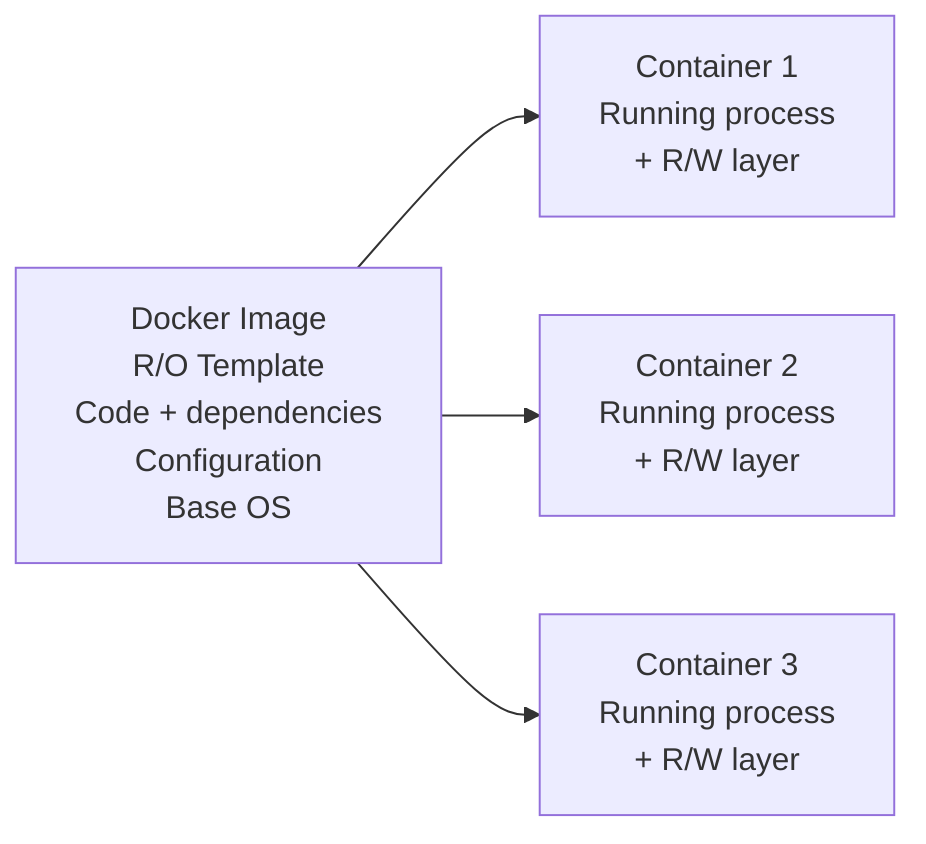
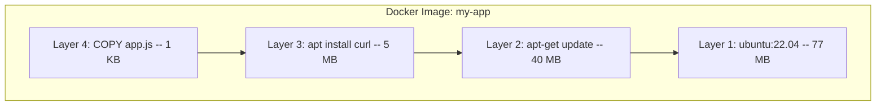
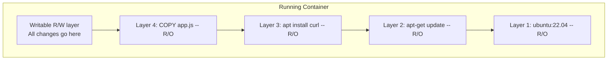
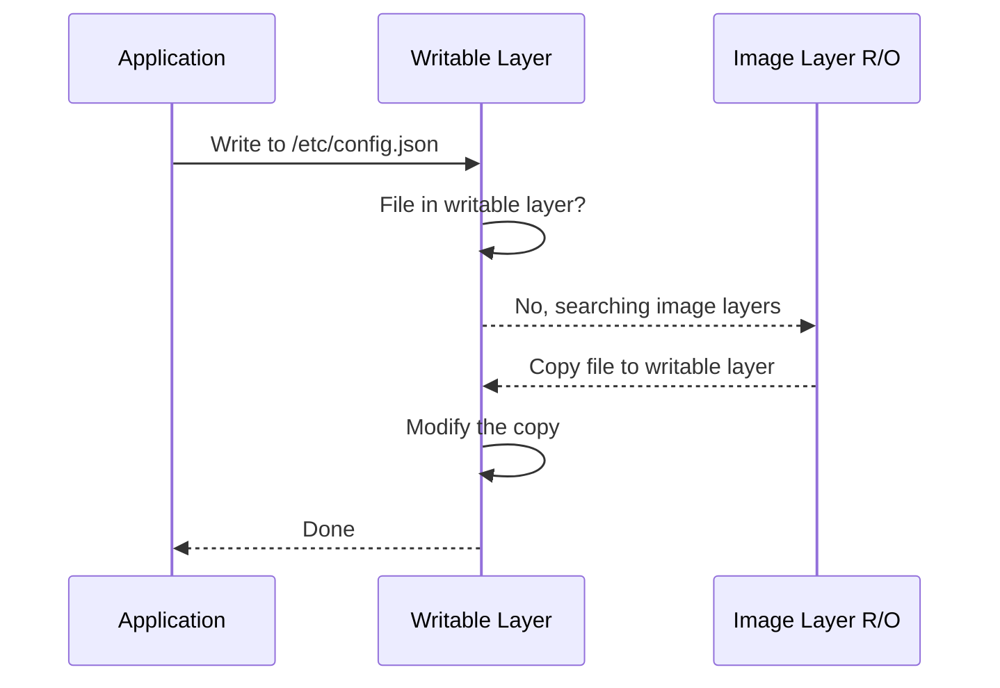
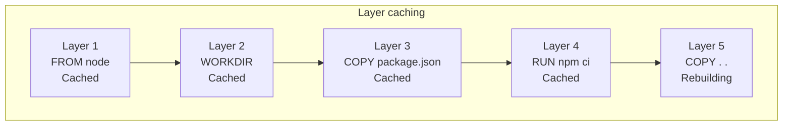
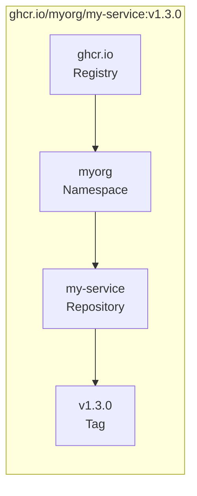
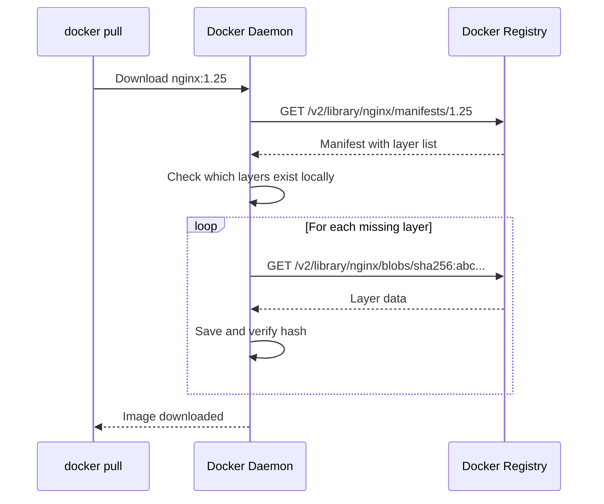
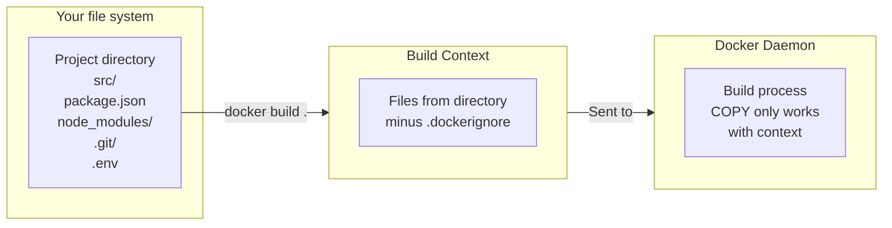

# Level 1: Docker Images -- pull, build, tags, layers, registries

## Introduction

Imagine you order a pizza. You don't drive to the farm for flour, grow tomatoes, or raise cows for mozzarella. Instead, you open an app, choose a recipe -- and get the finished product. Docker images work the same way: instead of manually installing an OS, libraries, a runtime, and configuring the environment -- you take a ready-made image that already has all of this assembled.

But an image is not just an archive with files. It's a **layered structure** with smart caching, a hash-based addressing system, and a global network of registries for distribution. Understanding how images are structured internally is the key to working efficiently with Docker.

In this level, we will explore in detail:

1. **What an image is** -- what it consists of and how it differs from a container
2. **Layered file system** -- how layers, UnionFS, and Copy-on-Write work
3. **Registries and naming** -- where images come from and how to name them correctly
4. **docker pull** -- downloading images and what happens under the hood
5. **Dockerfile** -- instructions for building your own images
6. **docker build** -- the build process and context
7. **Tags and versioning** -- naming strategies and the latest trap
8. **Image management** -- viewing, removing, exporting

---

## 1. What is a Docker Image

### Definition

A Docker image is a **read-only template** containing everything needed to run an application: executable code, runtime, system libraries, environment variables, and configuration files.

If we draw a programming analogy, an image is a **class** in OOP. By itself, a class does nothing -- it describes structure and behavior. To get a working object, you need to create an **instance** of the class. In the Docker world, a container is an instance of an image.



You can create as many containers from one image as you want. Each container runs in isolation and has its own writable layer for changes, but **the source image remains unchanged**.

### Image vs Container -- What's the Difference

Beginners often confuse these two concepts. The difference is simple:

| Characteristic | Image | Container |
|---|---|---|
| State | Immutable | Mutable |
| Analogy | Building blueprint | Built building |
| Storage | On disk as a set of layers | In memory as a process + R/W layer |
| Creation | `docker build` or `docker pull` | `docker run` or `docker create` |
| Quantity | One instance | As many as you want from one image |

Another analogy: an image is a **cake recipe**, and a container is the **cake itself**. You can bake a hundred cakes from one recipe. Each cake lives its own life -- one can be decorated with strawberries, another with chocolate -- but the recipe doesn't change.

### Immutability -- A Key Property

Images are **immutable**. This means that once an image is created, its contents cannot be changed. If you need to update an application or add a library -- you create a **new image** based on the old one.

Immutability provides two important advantages:

1. **Reproducibility.** The same image on your laptop, on the test server, and in production -- this is guaranteed the same environment.
2. **Security.** A running container cannot "corrupt" the image. Even if a container crashes, the image remains clean, and you can create a new container from it.

---

## 2. Layered File System

### Why Layers Are Needed

If Docker stored each image as a monolithic archive, it would be extremely inefficient. Imagine: you have 10 images based on `ubuntu:22.04`. Without layers, each would store its own copy of Ubuntu -- that's 770 MB instead of 77 MB.

Docker solves this problem with **layers**. An image is a stack of layers, where each layer represents a set of file system changes. Layers can be **reused** between different images.

Analogy: imagine a stack of transparent projector films. Each film has part of the image drawn on it. When you stack all the films together, you get the complete picture. And one film (for example, the background) can be used in different presentations.

### How Layers Are Created

Each instruction in a Dockerfile creates a new layer. Consider an example:

```dockerfile
FROM ubuntu:22.04          # Layer 1: base image, ~77 MB
RUN apt-get update         # Layer 2: updated package index, ~40 MB
RUN apt-get install -y curl # Layer 3: curl binary and dependencies, ~5 MB
COPY app.js /app/          # Layer 4: application file, ~1 KB
CMD ["node", "app.js"]     # Metadata, does not create a separate layer
```

Each layer stores only the **difference** (diff) relative to the previous state -- which files were added, modified, or deleted. It's like a version control system where each commit stores only the changes.



### UnionFS -- Merging Layers

Docker uses a **Union File System** (UnionFS) to combine all layers into a single file system. The user (or application inside the container) sees a normal file system with directories and files, unaware of the layers.

There are several UnionFS implementations: **overlay2** (used by default in modern Docker versions), **aufs**, **btrfs**, and others. In practice, you rarely need to think about the specific implementation -- Docker chooses the optimal one automatically.

```bash
# Check which storage driver is used
docker info | grep "Storage Driver"
# Storage Driver: overlay2
```

### Copy-on-Write -- Writing by Copying

When a container starts, a thin **writable layer** is added on top of the image layers (all read-only). All changes the container makes to the file system go into this layer.



But what happens when a container wants to **modify** a file belonging to one of the image layers? This is where the **Copy-on-Write** (CoW) mechanism comes in:

1. The container wants to modify `/etc/config.json` from layer 2
2. Docker **copies** this file from layer 2 to the writable layer
3. Changes are applied to the copy in the writable layer
4. The original in layer 2 remains untouched



Thanks to CoW:
- The image **never changes** during container operation
- Multiple containers from one image **share** image layers, saving space
- The writable layer is usually **small** because it only stores changes

### Layer Caching During Build

When rebuilding an image, Docker checks each layer: if the instruction and context haven't changed, the layer is taken from the **cache**. This dramatically speeds up repeated builds.

```
$ docker build -t my-app .
[+] Building 0.8s (9/9) FINISHED
 => CACHED [1/5] FROM node:20-alpine        ← From cache!
 => CACHED [2/5] WORKDIR /app               ← From cache!
 => CACHED [3/5] COPY package*.json ./       ← From cache!
 => CACHED [4/5] RUN npm ci                 ← From cache!
 => [5/5] COPY . .                          ← Only this layer rebuilds
```

Cache invalidation works **cascadingly**: if layer N changed, then all layers after it (N+1, N+2, ...) also rebuild, even if their instructions didn't change. This is a key concept for Dockerfile optimization.



### Layer Reuse Between Images

When multiple images use the same base image, shared layers are stored on disk in a **single copy**.

```bash
# Both images use node:20-alpine as base
docker pull my-frontend:1.0   # Downloads node:20-alpine layers + its own
docker pull my-backend:1.0    # node:20-alpine layers already exist -- not downloaded!
```

This saves both disk space and download time. On a CI server building dozens of microservices on the same base, savings can amount to gigabytes.

### Viewing Image Layers

You can see all layers of an image using `docker image history`:

```bash
docker image history nginx:1.25

IMAGE          CREATED       CREATED BY                                    SIZE
a8758716bb6a   2 weeks ago   CMD ["nginx" "-g" "daemon off;"]              0B
<missing>      2 weeks ago   STOPSIGNAL SIGQUIT                            0B
<missing>      2 weeks ago   EXPOSE map[80/tcp:{}]                         0B
<missing>      2 weeks ago   ENTRYPOINT ["/docker-entrypoint.sh"]          0B
<missing>      2 weeks ago   COPY 30-tune-worker-processes.sh /docker...   4.62kB
...
```

For more detailed information about a specific layer, use `docker image inspect`:

```bash
# Show all image metadata in JSON
docker image inspect nginx:1.25

# Show only the list of layers
docker image inspect nginx:1.25 --format '{{range .RootFS.Layers}}{{println .}}{{end}}'
```

---

## 3. Docker Registry and Image Naming

### What is a Registry

A **Docker Registry** is a storage for Docker images. Continuing the programming analogy: a registry is like npm for Node.js or PyPI for Python, but for Docker images.

A registry allows you:
- **Download** images to your local machine (`docker pull`)
- **Upload** your own images for distribution (`docker push`)
- **Store** different image versions using tags
- **Control access** to private images

### Main Public Registries

| Registry | Address | Features |
|---|---|---|
| **Docker Hub** | `docker.io` | Largest public registry, used by default. Free: 1 private repository. |
| **GitHub Container Registry** | `ghcr.io` | Integration with GitHub Actions and GitHub Packages. Free for public repos. |
| **Amazon ECR** | `<id>.dkr.ecr.<region>.amazonaws.com` | Private registry in AWS. IAM integration for authorization. |
| **Google Artifact Registry** | `<region>-docker.pkg.dev` | Google Cloud registry. Supports not only Docker but also npm, Maven, etc. |
| **Azure Container Registry** | `<name>.azurecr.io` | Private registry in Azure. Azure AD integration. |
| **Harbor** | self-hosted | Open-source solution for your own private registry. |

### Full Image Name -- Anatomy

A full Docker image name consists of several parts:

```
[registry/][namespace/]repository[:tag|@digest]
```

Let's break down each part:



- **Registry** -- registry address. If not specified, Docker uses `docker.io` (Docker Hub).
- **Namespace** -- user or organization. For official Docker Hub images, the namespace is `library` (hidden).
- **Repository** -- image name.
- **Tag** -- version or variant. Default -- `latest`.
- **Digest** -- SHA256 hash uniquely identifying a specific build.

Examples of short and full names:

```bash
# What you write         →  What Docker actually uses
nginx                   →  docker.io/library/nginx:latest
nginx:1.25              →  docker.io/library/nginx:1.25
myuser/my-app:2.0       →  docker.io/myuser/my-app:2.0
ghcr.io/org/svc:v1.0    →  ghcr.io/org/svc:v1.0  (registry specified explicitly)
```

### Image Types on Docker Hub

Docker Hub divides images into three categories:

**Official Images** -- images curated by Docker Inc. and trusted communities. Examples: `nginx`, `postgres`, `node`, `python`. They have no namespace -- available simply by name. These images are security-checked, regularly updated, and follow best practices.

**Verified Publisher** -- images from verified companies. Examples: `bitnami/redis`, `datadog/agent`. Docker Hub verifies that the publisher is a real company.

**Community Images** -- images from any users. Format: `username/imagename`. No quality or security guarantees -- use with caution.

💡 **Tip:** for production, try to use Official Images or Verified Publishers. Community images are fine for experiments, but in production you should build your own images based on official ones.

### Registry Authorization

To work with private registries or upload images, you need to authorize:

```bash
# Authorize in Docker Hub
docker login

# Authorize in another registry
docker login ghcr.io
docker login <account-id>.dkr.ecr.us-east-1.amazonaws.com

# Logout
docker logout ghcr.io
```

After authorization, Docker saves credentials to `~/.docker/config.json`. On CI servers, environment variables or credential helpers are typically used instead of interactive login.

---

## 4. docker pull -- Downloading Images

### Basic Usage

The `docker pull` command downloads an image from a registry to your local machine:

```bash
# Download the latest version -- implies the latest tag
docker pull nginx

# Download a specific version
docker pull nginx:1.25

# Download from another registry
docker pull ghcr.io/myorg/my-app:v1.0

# Download a specific build by digest
docker pull nginx@sha256:4c0fdaa8b6341...
```

### What Happens Under the Hood

When you run `docker pull`, here's what happens:



Note the key moment: Docker first gets the **manifest** -- a JSON document describing which layers make up the image and their hashes. Then Docker checks which of these layers already exist locally and downloads only the **missing** ones.

Here's what `docker pull` output looks like in the terminal:

```
$ docker pull node:20-alpine

20-alpine: Pulling from library/node
c926b61bad3b: Pull complete        ← Layer 1: downloaded
5765c9a6d4d8: Pull complete        ← Layer 2: downloaded
a4dad7bfc247: Pull complete        ← Layer 3: downloaded
bfa6f8a61e0b: Pull complete        ← Layer 4: downloaded
Digest: sha256:7a91aa397f25...     ← Image hash
Status: Downloaded newer image for node:20-alpine
docker.io/library/node:20-alpine   ← Full name
```

If you then download another image on the same base, some layers will be skipped:

```
$ docker pull node:20-slim

20-slim: Pulling from library/node
c926b61bad3b: Already exists       ← This layer already exists!
8a7c47254b8a: Pull complete        ← Only new layers download
...
```

### Multi-Platform Images

Modern Docker images are often **multi-platform** -- the same tag contains variants for different CPU architectures: `linux/amd64`, `linux/arm64`, `linux/arm/v7`, and others.

Docker automatically selects the right platform during pull. But you can specify the platform explicitly:

```bash
# Download image for ARM64 -- useful if you're on Mac M1/M2
# and want to test builds for x86 servers
docker pull --platform linux/amd64 nginx:1.25

# Download for ARM
docker pull --platform linux/arm64 nginx:1.25
```

This is especially relevant when developing on Mac with Apple Silicon (M1/M2/M3), where the architecture is `arm64`, but production servers are usually `amd64`.

### Useful docker pull Flags

```bash
# Download all tags of an image -- careful, can take a lot of space
docker pull --all-tags nginx

# Quiet mode -- no progress output
docker pull --quiet nginx:1.25
# Returns only: docker.io/library/nginx:1.25

# Force download even if image exists locally
# Useful when a tag might have been updated in the registry
docker pull nginx:1.25
```

---

## 5. Dockerfile -- Instructions for Building

### What is a Dockerfile

A `Dockerfile` is a text file with instructions for building a Docker image. Each instruction describes one step: take a base image, install packages, copy files, set the launch command.

If an image is a cake, then a Dockerfile is the **recipe** with step-by-step instructions. With a recipe, anyone in any kitchen can reproduce the same result.

### FROM -- Base Image

Any Dockerfile starts with the `FROM` instruction. It defines the **base image** your image will be built on.

```dockerfile
# Typical choice for Node.js applications
FROM node:20-alpine

# Can specify a specific platform
FROM --platform=linux/amd64 python:3.12-slim

# scratch -- special empty image for statically compiled binaries
FROM scratch
```

`FROM` is the only required instruction. Without it, a Dockerfile is invalid.

**How to choose a base image?** There are several options for most popular runtimes:

| Option | Size | Description |
|---|---|---|
| `node:20` | ~350 MB | Full version on Debian. All tools included. |
| `node:20-slim` | ~80 MB | Minimal Debian version. No extra utilities. |
| `node:20-alpine` | ~50 MB | Based on Alpine Linux. Smallest. |
| `node:20-bookworm` | ~350 MB | On a specific Debian version (Bookworm). |

💡 **Tip:** for production, use `-alpine` or `-slim` variants. A smaller image means less download time, fewer potential vulnerabilities, and less disk space.

### RUN -- Running Commands

The `RUN` instruction executes a command inside the container at build time and saves the result in a new layer.

```dockerfile
# Each RUN creates a new layer
RUN apt-get update
RUN apt-get install -y curl
```

Since each `RUN` is a layer, it makes sense to combine related commands:

```dockerfile
# One instruction -- one layer
# The \ symbol continues the command on the next line
RUN apt-get update && \
    apt-get install -y \
      curl \
      wget \
      git && \
    rm -rf /var/lib/apt/lists/*
```

Deleting the APT cache `rm -rf /var/lib/apt/lists/*` in the same `RUN` is critically important. If you delete the cache in a separate `RUN`, the files will remain in the previous layer and still take up space in the final image.

### COPY and ADD -- Copying Files

`COPY` copies files from the build context into the image's file system:

```dockerfile
# Copy a specific file
COPY package.json /app/

# Copy several files by pattern
COPY package.json package-lock.json ./

# Copy an entire directory
COPY . /app/

# Copy with owner change
COPY --chown=appuser:appgroup . /app/
```

`ADD` does the same thing but has two additional features:
- Automatically unpacks local `.tar` archives
- Can download files from URLs

```dockerfile
# ADD unpacks the archive automatically
ADD archive.tar.gz /app/

# ADD can download a file from URL -- but RUN curl is better
ADD https://example.com/file.txt /app/
```

📌 **Recommendation:** always use `COPY` unless you need automatic tar archive extraction. `COPY` is more predictable -- it does exactly one thing, and does it well.

### WORKDIR -- Working Directory

`WORKDIR` sets the working directory for subsequent `RUN`, `COPY`, `CMD`, and `ENTRYPOINT` instructions:

```dockerfile
WORKDIR /app

# Now all paths are relative to /app
COPY package.json .        # Copies to /app/package.json
RUN npm install            # Runs in /app
COPY . .                   # Copies everything to /app
```

If the directory doesn't exist, `WORKDIR` will create it automatically. You can use `WORKDIR` multiple times:

```dockerfile
WORKDIR /app
WORKDIR src      # Now working directory is /app/src
WORKDIR /other   # Absolute path -- now /other
```

### EXPOSE -- Declaring Ports

`EXPOSE` **documents** which ports the application inside the container listens on:

```dockerfile
EXPOSE 3000
EXPOSE 8080/tcp
EXPOSE 5432/udp
```

Important to understand: `EXPOSE` does **not** open ports for external access. It's only metadata -- a hint for those who will use the image. To actually forward a port, you need the `-p` flag with `docker run`:

```bash
# -p host_port:container_port
docker run -p 8080:3000 my-app
```

### CMD and ENTRYPOINT -- Launch Command

These instructions determine what happens when the container starts.

**CMD** sets the default command, which is easy to override:

```dockerfile
CMD ["node", "server.js"]
```

```bash
# Runs node server.js
docker run my-app

# Overrides CMD -- runs bash instead of server.js
docker run my-app bash
```

**ENTRYPOINT** sets the main command, which is harder to override:

```dockerfile
ENTRYPOINT ["node"]
CMD ["server.js"]
```

```bash
# Runs node server.js
docker run my-app

# CMD overridden, but ENTRYPOINT remains -- runs node repl.js
docker run my-app repl.js
```

The `ENTRYPOINT` + `CMD` combination is a powerful pattern: ENTRYPOINT sets the program, CMD sets default arguments.

### ENV and ARG -- Variables

**ENV** sets environment variables available both at build time and when the container runs:

```dockerfile
ENV NODE_ENV=production
ENV PORT=3000
```

**ARG** defines variables available **only during the build** (not in the running container):

```dockerfile
ARG NODE_VERSION=20
FROM node:${NODE_VERSION}-alpine

ARG APP_VERSION=unknown
LABEL version=${APP_VERSION}
```

```bash
# Pass ARG during build
docker build --build-arg NODE_VERSION=18 --build-arg APP_VERSION=1.2.3 .
```

### Full Dockerfile Example

Let's put it all together in a realistic example for a Node.js application:

```dockerfile
# Base image -- minimal Alpine
FROM node:20-alpine

# Metadata -- who maintains the image
LABEL maintainer="dev@example.com"
LABEL version="1.0"

# Set working directory
WORKDIR /app

# First copy ONLY dependency files
# This allows caching the npm install layer
COPY package.json package-lock.json ./

# Install dependencies
# npm ci -- strict install from lock file
RUN npm ci --only=production

# Now copy the rest of the code
# If code changes but dependencies don't --
# the npm ci layer will be cached
COPY . .

# Document the port
EXPOSE 3000

# Create an unprivileged user
# Never run applications as root!
RUN addgroup -S appgroup && adduser -S appuser -G appgroup
USER appuser

# Launch command
CMD ["node", "server.js"]
```

---

## 6. docker build -- Building Images

### Basic Usage

The `docker build` command reads a Dockerfile and creates an image from it:

```bash
# Build an image from the current directory
docker build .

# Build with a tag -- name:version
docker build -t my-app:1.0 .

# Specify a different Dockerfile
docker build -f Dockerfile.dev -t my-app:dev .

# Assign multiple tags at once
docker build -t my-app:1.0 -t my-app:latest .
```

### Build Context

The dot (`.`) at the end of `docker build -t my-app .` is not just "current directory." It's the **build context** -- the set of files Docker sends to the daemon for building.

When you run `docker build .`, Docker **packages** everything in the current directory and sends it to the Docker daemon. Instructions in the Dockerfile can only work with files from this context.



This has an important consequence: `COPY` cannot copy files outside the build context.

```dockerfile
# This will NOT work -- cannot go outside context
COPY ../shared/utils.js /app/      # Error!
COPY /etc/hosts /app/              # Error! Absolute paths don't work
```

### .dockerignore -- Excluding Files from Context

The `.dockerignore` file works similarly to `.gitignore` -- it specifies which files and directories to **exclude** from the build context:

```
# .dockerignore
node_modules
.git
.env
.env.*
*.log
dist
coverage
.DS_Store
.vscode
.idea
```

Without `.dockerignore`, Docker sends **all files** from the context to the daemon, including `node_modules` (often hundreds of megabytes), `.git` (the entire repository history), and `.env` (secrets!).

```bash
# Without .dockerignore
$ docker build .
Sending build context to Docker daemon  450MB  # node_modules + .git + everything else

# With .dockerignore
$ docker build .
Sending build context to Docker daemon  2.1MB  # Only necessary files
```

### Build Process Output

During the build, Docker shows progress for each step:

```
$ docker build -t my-app:1.0 .

[+] Building 12.3s (10/10) FINISHED
 => [internal] load build definition from Dockerfile       0.0s
 => [internal] load .dockerignore                          0.0s
 => [internal] load metadata for docker.io/library/node    1.2s
 => [1/5] FROM node:20-alpine@sha256:abc123...             3.1s
 => [2/5] WORKDIR /app                                     0.0s
 => [3/5] COPY package*.json ./                            0.1s
 => [4/5] RUN npm ci --only=production                     6.8s
 => [5/5] COPY . .                                         0.2s
 => exporting to image                                     0.8s
 => => naming to docker.io/library/my-app:1.0              0.0s
```

The numbering `[1/5]`, `[2/5]`, etc. shows Dockerfile steps. Steps marked `CACHED` are taken from the cache and complete instantly.

### Useful docker build Flags

```bash
# Rebuild without cache -- useful when there are cache problems
docker build --no-cache -t my-app .

# Pass build arguments
docker build --build-arg NODE_VERSION=18 -t my-app .

# Specify target platform
docker build --platform linux/amd64 -t my-app .

# Full log output -- don't use compact view
docker build --progress=plain -t my-app .

# Build a specific stage in a multi-stage Dockerfile
docker build --target builder -t my-app:build .
```

---

## 7. Tags and Versioning

### What is a Tag

A tag is a **human-readable label** pointing to a specific image version. One image can have multiple tags -- they work as aliases pointing to the same set of layers.

```bash
# Assign an additional tag to an existing image
docker tag my-app:1.0 my-app:latest
docker tag my-app:1.0 registry.example.com/my-app:1.0

# Check -- both tags point to the same IMAGE ID
docker images my-app
REPOSITORY   TAG       IMAGE ID       SIZE
my-app       1.0       abc123def456   180MB
my-app       latest    abc123def456   180MB
```

Analogy: tags are like bookmarks in a book. You can put several bookmarks on one page, and each bookmark is a way to quickly find the right place. Moving a bookmark to another page takes a second.

### Tagging Strategies

#### Semantic Versioning -- SemVer

The most popular approach for applications with a clear release cycle:

```
my-app:1.0.0    ← Exact version -- patch
my-app:1.0      ← Minor branch -- points to the latest 1.0.x
my-app:1        ← Major branch -- points to the latest 1.x.x
my-app:latest   ← Latest release
```

The user chooses the level of specificity:
- `my-app:1.0.0` -- absolute reproducibility, always the same image
- `my-app:1.0` -- automatically receives patch updates
- `my-app:1` -- automatically receives minor updates

#### Git-based Tags

Linking the image to a specific commit or branch:

```bash
my-app:abc123f              # Short commit hash
my-app:main                 # Latest build from main branch
my-app:develop              # Latest build from develop branch
my-app:main-abc123f         # Branch + hash for unambiguity
my-app:pr-42                # Build from pull request
```

This approach is great for CI/CD where every commit creates a new image.

#### Date-based Tags

Useful for daily or periodic builds:

```bash
my-app:2024-01-15
my-app:20240115-abc123f     # Date + commit hash
```

#### Environment-based Tags

Pointing to an image deployed to a specific environment:

```bash
my-app:staging
my-app:production
```

Such tags are **overwritten** with each deployment. They're convenient for quickly understanding what's running in each environment, but not suitable for reproducibility.

### The latest Tag Trap

This is one of the most common misconceptions in Docker. Many think that `latest` automatically points to the newest image version. **This is not true.**

`latest` is simply the default tag that:
- Is assigned when building without an explicit tag: `docker build -t my-app .` creates `my-app:latest`
- Is used when pulling without an explicit tag: `docker pull nginx` = `docker pull nginx:latest`
- **Does NOT update automatically**

Here's the problematic scenario:

```bash
# Monday: build and push version 1.0
docker build -t my-app:1.0 -t my-app:latest .
docker push my-app:1.0
docker push my-app:latest     # latest = 1.0

# Wednesday: build version 1.1, but forget to update latest
docker build -t my-app:1.1 .
docker push my-app:1.1
# latest still points to 1.0!

# Another developer:
docker pull my-app:latest     # Gets 1.0, not 1.1!
```

📌 **Rule: in production, always use specific tags.** `latest` is only suitable for local development and experiments.

### Digest -- Absolute Identification

Tags can be reassigned (the same tag `nginx:1.25` can point to different builds on different days). If you need an **absolute guarantee** of getting a specific build, use a digest.

A digest is a SHA256 hash of the image contents. It is immutable: if the image content differs even slightly, the hash will be completely different.

```bash
# Get the image digest
docker inspect --format='{{index .RepoDigests 0}}' nginx:1.25
# nginx@sha256:4c0fdaa8b6341bfdeca5f18f7837462c80cff90105d1d300cc13d51e5bc2f0ac

# Use digest in docker pull
docker pull nginx@sha256:4c0fdaa8b6341...

# Use digest in Dockerfile -- maximum reproducibility
FROM nginx@sha256:4c0fdaa8b6341bfdeca5f18f7837462c80cff90105d1d300cc13d51e5bc2f0ac
```

Digest pinning is especially important in CI/CD pipelines where build reproducibility is critical.

---

## 8. Image Management

### Viewing Local Images

```bash
# List all local images
docker images
docker image ls       # Full form

# Filter by name
docker images nginx
docker images "my-*"

# Show only "dangling" images -- untagged and unused
docker images --filter "dangling=true"

# Show images from a specific registry
docker images --filter "reference=ghcr.io/*/*"

# Custom output format
docker images --format "table {{.Repository}}\t{{.Tag}}\t{{.Size}}"

# Show full hashes instead of truncated
docker images --no-trunc
```

### Image Information

```bash
# Detailed metadata in JSON
docker image inspect nginx:1.25

# Specific field
docker image inspect nginx:1.25 --format '{{.Config.ExposedPorts}}'
docker image inspect nginx:1.25 --format '{{.Os}}/{{.Architecture}}'

# Layer history
docker image history nginx:1.25
docker image history --no-trunc nginx:1.25    # Full commands
```

### Removing Images

```bash
# Remove a specific image by name:tag
docker image rm nginx:1.25
docker rmi nginx:1.25              # Short form

# Remove by IMAGE ID
docker rmi abc123def456

# Force remove even if used by a container
docker rmi --force nginx:1.25

# Remove "dangling" images -- untagged layers left after rebuild
docker image prune

# Remove ALL unused images -- not tied to containers
docker image prune -a

# Remove unused images older than 24 hours
docker image prune -a --filter "until=24h"

# Remove everything -- images, containers, networks, build cache
docker system prune -a
```

💡 **Tip:** regularly run `docker image prune` to free up disk space. On active development machines, unused images can consume tens of gigabytes.

### Export and Import

Sometimes you need to transfer images between machines without a registry (for example, to an isolated server without internet):

```bash
# Save an image to a .tar file
docker image save -o my-app.tar my-app:1.0

# Can save multiple images
docker image save -o images.tar my-app:1.0 nginx:1.25

# Compress to save space
docker image save my-app:1.0 | gzip > my-app.tar.gz

# Load an image from a file on another machine
docker image load -i my-app.tar
docker image load -i my-app.tar.gz   # gzip will auto-decompress
```

### docker push -- Uploading to a Registry

To share an image via a registry:

```bash
# 1. Log in to the registry
docker login ghcr.io

# 2. Tag the image with the registry address
docker tag my-app:1.0 ghcr.io/myorg/my-app:1.0

# 3. Push
docker push ghcr.io/myorg/my-app:1.0
```

During push, Docker uploads only the layers that don't already exist in the registry -- similar to how pull downloads only missing layers.

---

## Common Beginner Mistakes

### 1. Using latest in Production

```bash
# Bad -- unpredictable deployment
docker pull my-app:latest
docker run my-app:latest
```

**Why this is a problem:** the `latest` tag can point to different images at different times. Two servers running `docker pull my-app:latest` an hour apart may get different application versions. This makes deployments unreproducible and rollbacks unpredictable.

```bash
# Good -- specific version, reproducible deployment
docker pull my-app:1.2.3
docker run my-app:1.2.3
```

### 2. Missing .dockerignore

```bash
# Bad -- sends everything in the directory
$ docker build -t my-app .
Sending build context to Docker daemon  450MB
```

**Why this is a problem:** without `.dockerignore`, the build context includes `node_modules`, `.git`, `.env`, and other unnecessary files. This slows down the build and, worse, secrets from `.env` can end up inside the image via `COPY . .`.

```
# Good -- .dockerignore file in project root
node_modules
.git
.env
.env.*
*.log
.DS_Store
coverage
dist
```

### 3. Each Command in a Separate RUN

```dockerfile
# Bad -- three layers, deletion in a separate layer is useless
RUN apt-get update
RUN apt-get install -y curl wget
RUN rm -rf /var/lib/apt/lists/*
```

**Why this is a problem:** each `RUN` creates a layer. Files added in layer 2 **remain forever** in that layer, even if you delete them in layer 3. Deletion in a separate layer only hides files but doesn't reduce image size.

```dockerfile
# Good -- one command, one layer, cleanup in the same step
RUN apt-get update && \
    apt-get install -y curl wget && \
    rm -rf /var/lib/apt/lists/*
```

### 4. Suboptimal COPY Order

```dockerfile
# Bad -- any code change invalidates npm install cache
COPY . /app/
RUN npm install
```

**Why this is a problem:** Docker caches layers sequentially. If a file from `COPY . /app/` changes (for example, you edited one `.js` file), the cache is invalidated and `npm install` runs again. Installing dependencies is one of the slowest operations, and rebuilding it on every code change is a waste of time.

```dockerfile
# Good -- dependencies first, then code
COPY package.json package-lock.json ./
RUN npm ci
COPY . .
```

### 5. Confusion with Build Context

```dockerfile
# Bad -- absolute paths and going outside context don't work
COPY /home/user/config.json /app/     # Error!
COPY ../shared/utils.js /app/         # Error!
```

**Why this is a problem:** the `COPY` instruction can only work with files inside the build context. The context is what you specified in `docker build <context>`. You cannot reference files above the context or by host system absolute path.

```dockerfile
# Good -- relative paths inside context
COPY ./config/config.json /app/
COPY . /app/
```

If you need files from another directory, change the build context:

```bash
# Raise context one level up and specify Dockerfile
docker build -f services/api/Dockerfile -t my-api .
```

### 6. Running as Root

```dockerfile
# Bad -- application runs as root
FROM node:20-alpine
WORKDIR /app
COPY . .
RUN npm ci
CMD ["node", "server.js"]    # Running as root!
```

**Why this is a problem:** if an attacker finds a vulnerability in your application and gains access to the container, they will have root privileges. This makes attack escalation easier.

```dockerfile
# Good -- create and use an unprivileged user
FROM node:20-alpine
WORKDIR /app
COPY . .
RUN npm ci
RUN addgroup -S appgroup && adduser -S appuser -G appgroup
USER appuser
CMD ["node", "server.js"]
```

---

## Best Practices -- Final Checklist

1. **Specific base image tags.** Use `node:20-alpine`, not `node` or `node:latest`. This guarantees build reproducibility.

2. **Minimal base images.** Prefer `-alpine` or `-slim` variants. Fewer files -- fewer vulnerabilities, faster downloads.

3. **Layer order optimization.** Arrange instructions from rarely changing to frequently changing: `FROM` -> `RUN apt install` -> `COPY package.json` -> `RUN npm ci` -> `COPY . .`

4. **Combine RUN commands.** Related commands (install + cache cleanup) should be in one `RUN` via `&&`.

5. **Mandatory .dockerignore.** Exclude `node_modules`, `.git`, `.env`, logs, and other unnecessary files.

6. **One process per container.** Don't run nginx + Node.js + Redis in one container. Each service -- separate image and container.

7. **Clean caches.** Delete package manager caches (`rm -rf /var/lib/apt/lists/*`) in the same `RUN` where you install packages.

8. **Unprivileged user.** Always add `USER` and don't run the application as root.

9. **Digest pinning in CI/CD.** For maximum reproducibility, use `FROM image@sha256:...` instead of tags.

10. **Regular cleanup.** Run `docker image prune` to remove unused images and free up disk space.

---

## Level Summary

A Docker image is an immutable template for creating containers, built from **layers**. Each layer is a set of file system changes created by one Dockerfile instruction. Layers are cached, shared between images, and downloaded separately -- all of this makes Docker an efficient tool for packaging and distributing applications.

Images are stored in **registries** (Docker Hub, ghcr.io, ECR, etc.) and identified by the format `[registry/][namespace/]repository[:tag|@digest]`. Tags are convenient labels for humans, digests are immutable hashes for machines.

To create your own images, use a **Dockerfile** with instructions `FROM`, `RUN`, `COPY`, `WORKDIR`, `EXPOSE`, `CMD`, and others. The `docker build` command reads the Dockerfile, executes instructions layer by layer, and creates a finished image.

Key skills of this level:
- Understanding layered architecture and Copy-on-Write mechanism
- Ability to download images from registries using `docker pull`
- Writing Dockerfiles and building images via `docker build`
- Proper tagging and versioning of images
- Optimizing layer order for efficient caching
