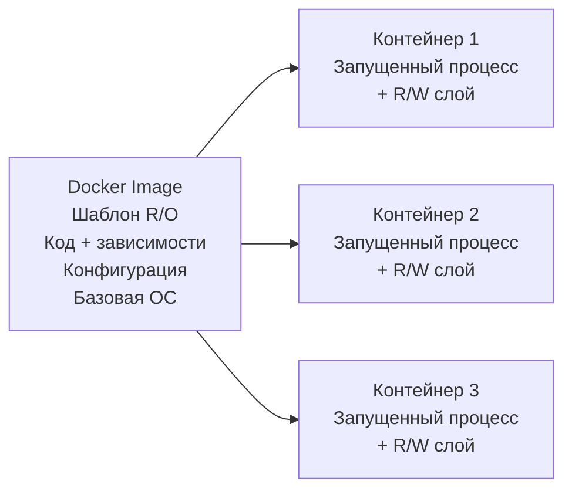
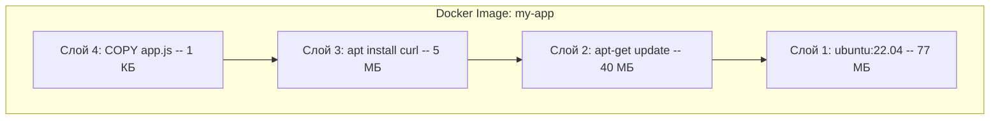
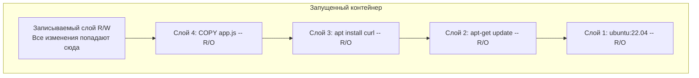
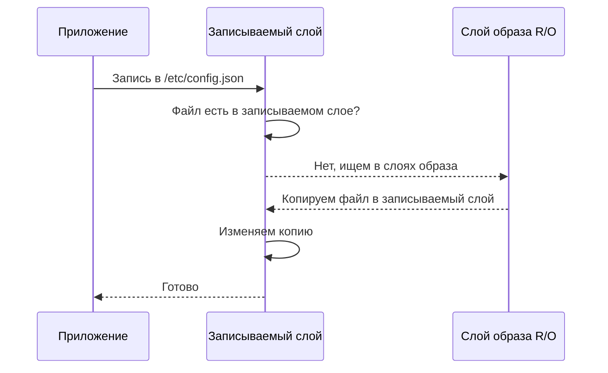
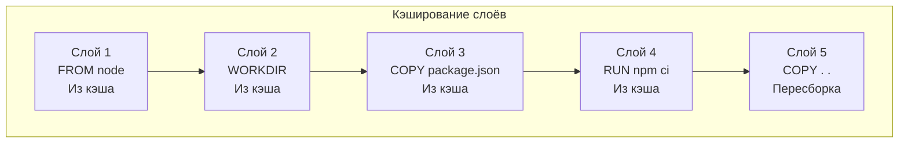
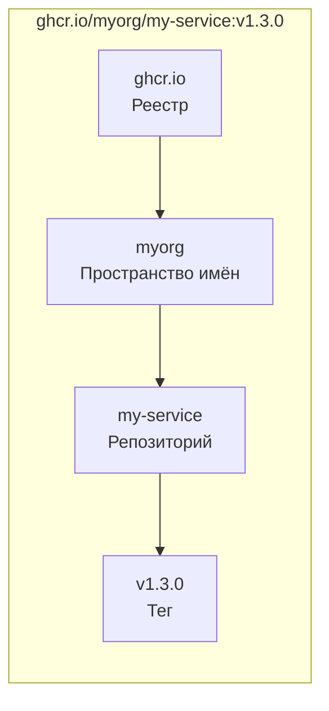
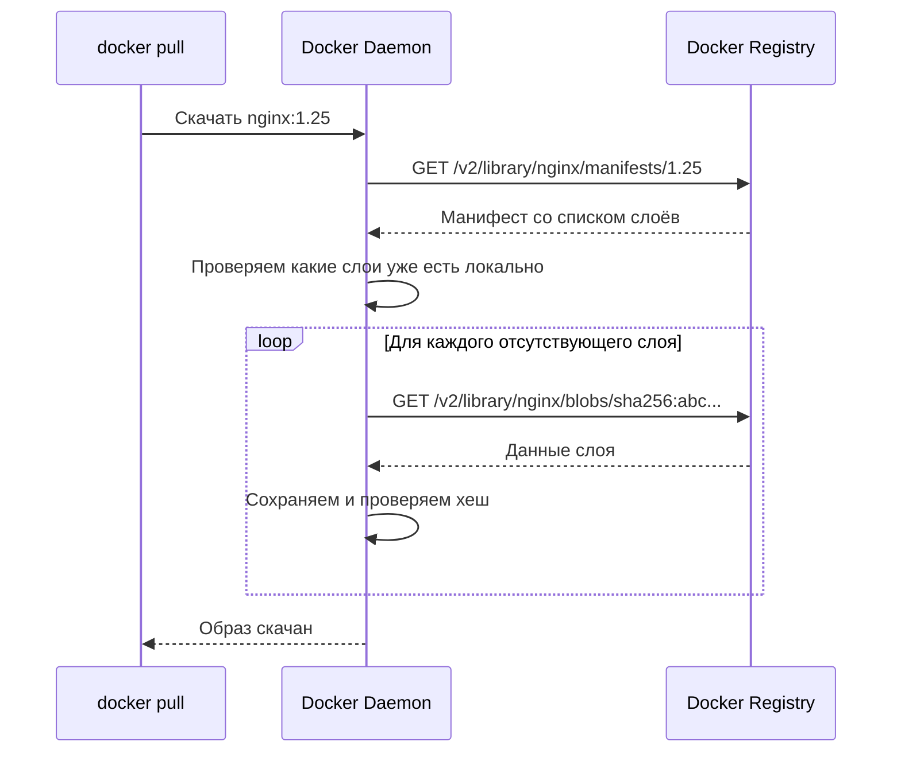
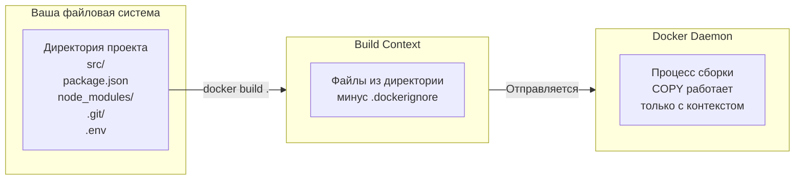

# Уровень 1: Docker-образы -- pull, build, tags, layers, registries

## Введение

Представьте, что вы заказываете пиццу. Вы не едете на ферму за мукой, не выращиваете помидоры и не разводите коров ради моцареллы. Вместо этого вы открываете приложение, выбираете рецепт -- и получаете готовый продукт. Docker-образы работают по тому же принципу: вместо того чтобы вручную устанавливать ОС, библиотеки, среду выполнения и настраивать окружение -- вы берёте готовый образ, в котором всё это уже собрано.

Но образ -- это не просто архив с файлами. Это **слоистая структура** с умным кэшированием, системой адресации по хешам и глобальной сетью реестров для распространения. Понимание того, как устроены образы изнутри, -- ключ к эффективной работе с Docker.

На этом уровне мы подробно разберём:

1. **Что такое образ** -- из чего он состоит и чем отличается от контейнера
2. **Слоистая файловая система** -- как работают layers, UnionFS и Copy-on-Write
3. **Реестры и именование** -- откуда берутся образы и как их правильно называть
4. **docker pull** -- скачивание образов и что происходит под капотом
5. **Dockerfile** -- инструкции для сборки собственных образов
6. **docker build** -- процесс сборки и контекст
7. **Теги и версионирование** -- стратегии именования и ловушка latest
8. **Управление образами** -- просмотр, удаление, экспорт

---

## 1. Что такое Docker-образ

### Определение

Docker-образ (image) -- это **шаблон только для чтения**, содержащий всё необходимое для запуска приложения: исполняемый код, среду выполнения, системные библиотеки, переменные окружения и конфигурационные файлы.

Если проводить аналогию с программированием, образ -- это **класс** в ООП. Сам по себе класс ничего не делает -- он описывает структуру и поведение. Чтобы получить работающий объект, нужно создать **экземпляр** класса. В мире Docker контейнер -- это экземпляр образа.



Из одного образа можно создать сколько угодно контейнеров. Каждый контейнер работает изолированно и имеет собственный записываемый слой для изменений, но **исходный образ при этом не меняется**.

### Образ vs контейнер -- в чём разница

Новички часто путают эти два понятия. Разница проста:

| Характеристика | Образ | Контейнер |
|---|---|---|
| Состояние | Неизменяемый (immutable) | Изменяемый (mutable) |
| Аналогия | Чертёж здания | Построенное здание |
| Хранение | На диске как набор слоёв | В памяти как процесс + R/W слой |
| Создание | `docker build` или `docker pull` | `docker run` или `docker create` |
| Количество | Один экземпляр | Сколько угодно из одного образа |

Ещё одна аналогия: образ -- это **рецепт торта**, а контейнер -- это **сам торт**. По одному рецепту можно испечь сто тортов. Каждый торт живёт своей жизнью -- один можно украсить клубникой, другой шоколадом -- но рецепт от этого не меняется.

### Неизменяемость -- ключевое свойство

Образы **неизменяемы** (immutable). Это значит, что после создания образа его содержимое нельзя изменить. Если вам нужно обновить приложение или добавить библиотеку -- вы создаёте **новый образ** на основе старого.

Неизменяемость даёт два важных преимущества:

1. **Воспроизводимость.** Один и тот же образ на вашем ноутбуке, на сервере тестирования и в продакшене -- это гарантированно одинаковое окружение.
2. **Безопасность.** Запущенный контейнер не может "испортить" образ. Даже если в контейнере произошёл сбой, образ остаётся чистым, и из него можно создать новый контейнер.

---

## 2. Слоистая файловая система

### Зачем нужны слои

Если бы Docker хранил каждый образ как монолитный архив, это было бы крайне неэффективно. Представьте: у вас есть 10 образов на базе `ubuntu:22.04`. Без слоёв каждый из них хранил бы свою копию Ubuntu -- это 770 МБ вместо 77 МБ.

Docker решает эту проблему с помощью **слоёв** (layers). Образ -- это стопка слоёв, где каждый слой представляет набор изменений файловой системы. Слои можно **переиспользовать** между разными образами.

Аналогия: представьте себе стопку прозрачных плёнок для проектора. На каждой плёнке нарисована часть изображения. Когда вы кладёте все плёнки друг на друга, получается полная картинка. При этом одну плёнку (например, с фоном) можно использовать в разных презентациях.

### Как создаются слои

Каждая инструкция в Dockerfile создаёт новый слой. Рассмотрим пример:

```dockerfile
FROM ubuntu:22.04          # Слой 1: базовый образ, ~77 МБ
RUN apt-get update         # Слой 2: обновлённый индекс пакетов, ~40 МБ
RUN apt-get install -y curl # Слой 3: бинарник curl и зависимости, ~5 МБ
COPY app.js /app/          # Слой 4: файл приложения, ~1 КБ
CMD ["node", "app.js"]     # Метаданные, не создаёт отдельного слоя
```

Каждый слой хранит только **разницу** (diff) относительно предыдущего состояния -- какие файлы добавлены, изменены или удалены. Это похоже на систему контроля версий, где каждый коммит хранит только изменения.



### UnionFS -- объединение слоёв

Docker использует **Union File System** (UnionFS) для того, чтобы объединить все слои в единую файловую систему. Пользователь (или приложение внутри контейнера) видит обычную файловую систему с директориями и файлами, не подозревая о слоях.

Существует несколько реализаций UnionFS: **overlay2** (используется по умолчанию в современных версиях Docker), **aufs**, **btrfs** и другие. На практике вам редко придётся задумываться о конкретной реализации -- Docker выбирает оптимальную автоматически.

```bash
# Проверить, какой storage driver используется
docker info | grep "Storage Driver"
# Storage Driver: overlay2
```

### Copy-on-Write -- запись при копировании

Когда контейнер запускается, поверх слоёв образа (все они read-only) добавляется тонкий **записываемый слой** (writable layer). Все изменения, которые контейнер вносит в файловую систему, попадают именно в этот слой.



Но что происходит, когда контейнер хочет **изменить** файл, который принадлежит одному из слоёв образа? Здесь вступает механизм **Copy-on-Write** (CoW):

1. Контейнер хочет изменить файл `/etc/config.json` из слоя 2
2. Docker **копирует** этот файл из слоя 2 в записываемый слой
3. Изменения применяются к копии в записываемом слое
4. Оригинал в слое 2 остаётся нетронутым



Благодаря CoW:
- Образ **никогда не меняется** при работе контейнера
- Несколько контейнеров из одного образа **разделяют** слои образа, экономя место
- Записываемый слой обычно **маленький**, потому что хранит только изменения

### Кэширование слоёв при сборке

При пересборке образа Docker проверяет каждый слой: если инструкция и контекст не изменились, слой берётся из **кэша**. Это драматически ускоряет повторные сборки.

```
$ docker build -t my-app .
[+] Building 0.8s (9/9) FINISHED
 => CACHED [1/5] FROM node:20-alpine        ← Из кэша!
 => CACHED [2/5] WORKDIR /app               ← Из кэша!
 => CACHED [3/5] COPY package*.json ./       ← Из кэша!
 => CACHED [4/5] RUN npm ci                 ← Из кэша!
 => [5/5] COPY . .                          ← Только этот слой пересобирается
```

Кэш инвалидируется **каскадно**: если слой N изменился, то все слои после него (N+1, N+2, ...) тоже пересобираются, даже если их инструкции не менялись. Это ключевая концепция для оптимизации Dockerfile.



### Переиспользование слоёв между образами

Когда несколько образов используют один и тот же базовый образ, общие слои хранятся на диске **в единственном экземпляре**.

```bash
# Оба образа используют node:20-alpine как базовый
docker pull my-frontend:1.0   # Скачивает слои node:20-alpine + свои
docker pull my-backend:1.0    # Слои node:20-alpine уже есть -- не скачиваются!
```

Это экономит и место на диске, и время скачивания. На CI-сервере, где собираются десятки микросервисов на одной базе, экономия может составлять гигабайты.

### Просмотр слоёв образа

Вы можете увидеть все слои образа с помощью команды `docker image history`:

```bash
docker image history nginx:1.25

IMAGE          CREATED       CREATED BY                                    SIZE
a8758716bb6a   2 weeks ago   CMD ["nginx" "-g" "daemon off;"]              0B
<missing>      2 weeks ago   STOPSIGNAL SIGQUIT                            0B
<missing>      2 weeks ago   EXPOSE map[80/tcp:{}]                         0B
<missing>      2 weeks ago   ENTRYPOINT ["/docker-entrypoint.sh"]          0B
<missing>      2 weeks ago   COPY 30-tune-worker-processes.sh /docker...   4.62kB
<missing>      2 weeks ago   COPY 20-envsubst-on-templates.sh /docker...   3.02kB
<missing>      2 weeks ago   COPY 10-listen-on-ipv6-by-default.sh /d...    2.12kB
<missing>      2 weeks ago   COPY docker-entrypoint.sh / # buildkit        1.62kB
<missing>      2 weeks ago   RUN /bin/sh -c set -x     && groupadd ...     112MB
<missing>      2 weeks ago   ENV DYNPKG_RELEASE=2~bookworm                 0B
...
```

Для более подробной информации о конкретном слое используйте `docker image inspect`:

```bash
# Показать все метаданные образа в формате JSON
docker image inspect nginx:1.25

# Показать только список слоёв
docker image inspect nginx:1.25 --format '{{range .RootFS.Layers}}{{println .}}{{end}}'
```

---

## 3. Docker Registry и именование образов

### Что такое реестр

**Docker Registry** -- это хранилище для Docker-образов. Если продолжить аналогию с программированием: реестр -- это как npm для Node.js или PyPI для Python, только для Docker-образов.

Реестр позволяет:
- **Скачивать** образы на локальную машину (`docker pull`)
- **Загружать** свои образы для распространения (`docker push`)
- **Хранить** разные версии образов с помощью тегов
- **Контролировать доступ** к приватным образам

### Основные публичные реестры

| Реестр | Адрес | Особенности |
|---|---|---|
| **Docker Hub** | `docker.io` | Крупнейший публичный реестр, используется по умолчанию. Бесплатно -- 1 приватный репозиторий. |
| **GitHub Container Registry** | `ghcr.io` | Интеграция с GitHub Actions и GitHub Packages. Бесплатно для публичных репозиториев. |
| **Amazon ECR** | `<id>.dkr.ecr.<region>.amazonaws.com` | Приватный реестр в AWS. Интеграция с IAM для авторизации. |
| **Google Artifact Registry** | `<region>-docker.pkg.dev` | Реестр Google Cloud. Поддержка не только Docker, но и npm, Maven и др. |
| **Azure Container Registry** | `<name>.azurecr.io` | Приватный реестр в Azure. Интеграция с Azure AD. |
| **Harbor** | self-hosted | Open-source решение для собственного приватного реестра. |

### Полное имя образа -- анатомия

Полное имя Docker-образа состоит из нескольких частей:

```
[registry/][namespace/]repository[:tag|@digest]
```

Разберём каждую часть:



- **Registry** -- адрес реестра. Если не указан, Docker использует `docker.io` (Docker Hub).
- **Namespace** -- пользователь или организация. Для официальных образов Docker Hub namespace -- это `library` (скрывается).
- **Repository** -- имя образа.
- **Tag** -- версия или вариант. По умолчанию -- `latest`.
- **Digest** -- SHA256-хеш, уникально идентифицирующий конкретную сборку.

Примеры сокращённых и полных имён:

```bash
# Что вы пишете         →  Что Docker на самом деле использует
nginx                   →  docker.io/library/nginx:latest
nginx:1.25              →  docker.io/library/nginx:1.25
myuser/my-app:2.0       →  docker.io/myuser/my-app:2.0
ghcr.io/org/svc:v1.0    →  ghcr.io/org/svc:v1.0  (реестр указан явно)
```

### Типы образов на Docker Hub

Docker Hub разделяет образы на три категории:

**Official Images** -- образы, курируемые Docker Inc. и проверенными сообществами. Примеры: `nginx`, `postgres`, `node`, `python`. У них нет namespace -- они доступны просто по имени. Эти образы проходят проверку безопасности, регулярно обновляются и следуют best practices.

**Verified Publisher** -- образы от проверенных компаний-поставщиков. Примеры: `bitnami/redis`, `datadog/agent`. Docker Hub проверяет, что издатель -- реальная компания.

**Community Images** -- образы от любых пользователей. Формат: `username/imagename`. Никаких гарантий качества или безопасности -- используйте с осторожностью.

💡 **Совет:** для продакшена старайтесь использовать Official Images или Verified Publisher. Community-образы подходят для экспериментов, но в рабочих средах стоит собирать свои образы на основе официальных.

### Авторизация в реестрах

Для работы с приватными реестрами или для загрузки образов необходимо авторизоваться:

```bash
# Авторизация в Docker Hub
docker login

# Авторизация в другом реестре
docker login ghcr.io
docker login <account-id>.dkr.ecr.us-east-1.amazonaws.com

# Выход
docker logout ghcr.io
```

После авторизации Docker сохраняет учётные данные в `~/.docker/config.json`. На CI-серверах обычно используют переменные окружения или credential helpers вместо интерактивного логина.

---

## 4. docker pull -- скачивание образов

### Базовое использование

Команда `docker pull` скачивает образ из реестра на локальную машину:

```bash
# Скачать последнюю версию -- подразумевается тег latest
docker pull nginx

# Скачать конкретную версию
docker pull nginx:1.25

# Скачать из другого реестра
docker pull ghcr.io/myorg/my-app:v1.0

# Скачать конкретную сборку по digest
docker pull nginx@sha256:4c0fdaa8b6341...
```

### Что происходит под капотом

Когда вы выполняете `docker pull`, происходит следующее:



Обратите внимание на ключевой момент: Docker сначала получает **манифест** -- JSON-документ, описывающий из каких слоёв состоит образ и какие у них хеши. Затем Docker проверяет, какие из этих слоёв уже есть на локальной машине, и скачивает только **отсутствующие**.

Вот как выглядит вывод `docker pull` в терминале:

```
$ docker pull node:20-alpine

20-alpine: Pulling from library/node
c926b61bad3b: Pull complete        ← Слой 1: скачан
5765c9a6d4d8: Pull complete        ← Слой 2: скачан
a4dad7bfc247: Pull complete        ← Слой 3: скачан
bfa6f8a61e0b: Pull complete        ← Слой 4: скачан
Digest: sha256:7a91aa397f25...     ← Хеш всего образа
Status: Downloaded newer image for node:20-alpine
docker.io/library/node:20-alpine   ← Полное имя
```

Если затем скачать другой образ на той же базе, часть слоёв будет пропущена:

```
$ docker pull node:20-slim

20-slim: Pulling from library/node
c926b61bad3b: Already exists       ← Этот слой уже есть!
8a7c47254b8a: Pull complete        ← Только новые слои скачиваются
...
```

### Мультиплатформенные образы

Современные Docker-образы часто бывают **мультиплатформенными** -- один и тот же тег содержит варианты для разных архитектур процессоров: `linux/amd64`, `linux/arm64`, `linux/arm/v7` и других.

Docker автоматически выбирает нужную платформу при pull. Но вы можете указать платформу явно:

```bash
# Скачать образ для ARM64 -- полезно, если вы на Mac M1/M2
# и хотите протестировать сборку для x86 серверов
docker pull --platform linux/amd64 nginx:1.25

# Скачать для ARM
docker pull --platform linux/arm64 nginx:1.25
```

Это особенно актуально при разработке на Mac с Apple Silicon (M1/M2/M3), где архитектура -- `arm64`, а серверы в продакшене обычно `amd64`.

### Полезные флаги docker pull

```bash
# Скачать все теги образа -- осторожно, может занять много места
docker pull --all-tags nginx

# Тихий режим -- без вывода прогресса
docker pull --quiet nginx:1.25
# Вернёт только: docker.io/library/nginx:1.25

# Принудительно скачать, даже если образ уже есть локально
# Полезно, когда тег мог быть обновлён в реестре
docker pull nginx:1.25
```

---

## 5. Dockerfile -- инструкции для сборки

### Что такое Dockerfile

`Dockerfile` -- это текстовый файл с инструкциями для сборки Docker-образа. Каждая инструкция описывает один шаг: взять базовый образ, установить пакеты, скопировать файлы, задать команду запуска.

Если образ -- это торт, то Dockerfile -- это **рецепт** с пошаговыми инструкциями. Имея рецепт, любой человек на любой кухне может воспроизвести тот же результат.

### FROM -- базовый образ

Любой Dockerfile начинается с инструкции `FROM`. Она определяет **базовый образ**, на основе которого будет строиться ваш.

```dockerfile
# Типичный выбор для Node.js приложений
FROM node:20-alpine

# Можно указать конкретную платформу
FROM --platform=linux/amd64 python:3.12-slim

# scratch -- специальный пустой образ, для статически скомпилированных бинарников
FROM scratch
```

`FROM` -- единственная обязательная инструкция. Без неё Dockerfile невалиден.

**Как выбрать базовый образ?** Существует несколько вариантов для большинства популярных рантаймов:

| Вариант | Размер | Описание |
|---|---|---|
| `node:20` | ~350 МБ | Полная версия на Debian. Все инструменты. |
| `node:20-slim` | ~80 МБ | Минимальная версия Debian. Без лишних утилит. |
| `node:20-alpine` | ~50 МБ | На основе Alpine Linux. Самая маленькая. |
| `node:20-bookworm` | ~350 МБ | На конкретной версии Debian (Bookworm). |

💡 **Совет:** для продакшена используйте `-alpine` или `-slim` варианты. Меньший образ -- это меньше времени на скачивание, меньше потенциальных уязвимостей и меньше места на диске.

### RUN -- выполнение команд

Инструкция `RUN` выполняет команду внутри контейнера на этапе сборки и сохраняет результат в новом слое.

```dockerfile
# Каждый RUN создаёт новый слой
RUN apt-get update
RUN apt-get install -y curl
```

Поскольку каждый `RUN` -- это слой, имеет смысл объединять связанные команды:

```dockerfile
# Одна инструкция -- один слой
# Символ \ переносит команду на следующую строку
RUN apt-get update && \
    apt-get install -y \
      curl \
      wget \
      git && \
    rm -rf /var/lib/apt/lists/*
```

Удаление кэша `rm -rf /var/lib/apt/lists/*` в том же `RUN` критически важно. Если удалить кэш в отдельном `RUN`, файлы останутся в предыдущем слое и всё равно будут занимать место в итоговом образе.

### COPY и ADD -- копирование файлов

`COPY` копирует файлы из контекста сборки в файловую систему образа:

```dockerfile
# Копировать конкретный файл
COPY package.json /app/

# Копировать несколько файлов по маске
COPY package.json package-lock.json ./

# Копировать всю директорию
COPY . /app/

# Копировать с изменением владельца
COPY --chown=appuser:appgroup . /app/
```

`ADD` делает то же самое, но имеет два дополнительных свойства:
- Автоматически распаковывает локальные `.tar` архивы
- Умеет скачивать файлы по URL

```dockerfile
# ADD распакует архив автоматически
ADD archive.tar.gz /app/

# ADD может скачать файл по URL -- но лучше использовать RUN curl
ADD https://example.com/file.txt /app/
```

📌 **Рекомендация:** всегда используйте `COPY`, если вам не нужна автоматическая распаковка архивов. `COPY` предсказуемее -- он делает ровно одну вещь, и делает её хорошо.

### WORKDIR -- рабочая директория

`WORKDIR` устанавливает рабочую директорию для последующих инструкций `RUN`, `COPY`, `CMD` и `ENTRYPOINT`:

```dockerfile
WORKDIR /app

# Теперь все пути относительны /app
COPY package.json .        # Копирует в /app/package.json
RUN npm install            # Выполняется в /app
COPY . .                   # Копирует всё в /app
```

Если директория не существует, `WORKDIR` создаст её автоматически. Можно использовать `WORKDIR` несколько раз:

```dockerfile
WORKDIR /app
WORKDIR src      # Теперь рабочая директория -- /app/src
WORKDIR /other   # Абсолютный путь -- теперь /other
```

### EXPOSE -- объявление портов

`EXPOSE` **документирует**, какие порты использует приложение внутри контейнера:

```dockerfile
EXPOSE 3000
EXPOSE 8080/tcp
EXPOSE 5432/udp
```

Важно понимать: `EXPOSE` **не открывает порты** для внешнего доступа. Это только метаданные -- подсказка для тех, кто будет использовать образ. Чтобы реально пробросить порт, нужен флаг `-p` при `docker run`:

```bash
# -p host_port:container_port
docker run -p 8080:3000 my-app
```

### CMD и ENTRYPOINT -- команда запуска

Эти инструкции определяют, что происходит при запуске контейнера.

**CMD** задаёт команду по умолчанию, которую легко переопределить:

```dockerfile
CMD ["node", "server.js"]
```

```bash
# Запускает node server.js
docker run my-app

# Переопределяет CMD -- запускает bash вместо server.js
docker run my-app bash
```

**ENTRYPOINT** задаёт основную команду, которую сложнее переопределить:

```dockerfile
ENTRYPOINT ["node"]
CMD ["server.js"]
```

```bash
# Запускает node server.js
docker run my-app

# CMD переопределён, но ENTRYPOINT остаётся -- запускает node repl.js
docker run my-app repl.js
```

Комбинация `ENTRYPOINT` + `CMD` -- мощный паттерн: ENTRYPOINT задаёт программу, CMD задаёт аргументы по умолчанию.

### ENV и ARG -- переменные

**ENV** устанавливает переменные окружения, которые доступны и при сборке, и при запуске контейнера:

```dockerfile
ENV NODE_ENV=production
ENV PORT=3000
```

**ARG** определяет переменные, которые доступны **только при сборке** (не в запущенном контейнере):

```dockerfile
ARG NODE_VERSION=20
FROM node:${NODE_VERSION}-alpine

ARG APP_VERSION=unknown
LABEL version=${APP_VERSION}
```

```bash
# Передать ARG при сборке
docker build --build-arg NODE_VERSION=18 --build-arg APP_VERSION=1.2.3 .
```

### Полный пример Dockerfile

Соберём всё вместе в реалистичном примере для Node.js приложения:

```dockerfile
# Базовый образ -- минимальный Alpine
FROM node:20-alpine

# Метаданные -- кто поддерживает образ
LABEL maintainer="dev@example.com"
LABEL version="1.0"

# Устанавливаем рабочую директорию
WORKDIR /app

# Сначала копируем ТОЛЬКО файлы зависимостей
# Это позволяет кэшировать слой npm install
COPY package.json package-lock.json ./

# Устанавливаем зависимости
# npm ci -- строгая установка по lock-файлу
RUN npm ci --only=production

# Теперь копируем весь остальной код
# Если код изменится, а зависимости нет --
# слой с npm ci будет взят из кэша
COPY . .

# Документируем порт
EXPOSE 3000

# Создаём непривилегированного пользователя
# Никогда не запускайте приложение от root!
RUN addgroup -S appgroup && adduser -S appuser -G appgroup
USER appuser

# Команда запуска
CMD ["node", "server.js"]
```

---

## 6. docker build -- сборка образов

### Базовое использование

Команда `docker build` читает Dockerfile и создаёт из него образ:

```bash
# Собрать образ из текущей директории
docker build .

# Собрать с тегом -- имя:версия
docker build -t my-app:1.0 .

# Указать другой Dockerfile
docker build -f Dockerfile.dev -t my-app:dev .

# Присвоить несколько тегов одновременно
docker build -t my-app:1.0 -t my-app:latest .
```

### Build context -- контекст сборки

Точка (`.`) в конце `docker build -t my-app .` -- это не просто "текущая директория". Это **контекст сборки** (build context) -- набор файлов, которые Docker отправляет демону для сборки.

Когда вы выполняете `docker build .`, Docker **упаковывает** всё содержимое текущей директории и отправляет демону Docker. Именно из этого контекста работает инструкция `COPY` в Dockerfile.



Это имеет важное следствие: `COPY` не может копировать файлы за пределами контекста сборки.

```dockerfile
# Это НЕ сработает -- нельзя выйти за пределы контекста
COPY ../shared/utils.js /app/      # Ошибка!
COPY /etc/hosts /app/              # Ошибка! Абсолютные пути не работают
```

### .dockerignore -- исключение файлов из контекста

Файл `.dockerignore` работает аналогично `.gitignore` -- он указывает, какие файлы и директории **не включать** в контекст сборки:

```
# .dockerignore
node_modules
.git
.env
.env.*
*.log
dist
coverage
.DS_Store
.vscode
.idea
```

Без `.dockerignore` Docker отправит демону **все файлы** из контекста, включая `node_modules` (часто сотни мегабайт), `.git` (вся история репозитория) и `.env` (секреты!).

```bash
# Без .dockerignore
$ docker build .
Sending build context to Docker daemon  450MB  # node_modules + .git + всё остальное

# С .dockerignore
$ docker build .
Sending build context to Docker daemon  2.1MB  # Только нужные файлы
```

### Вывод процесса сборки

При сборке Docker показывает прогресс каждого шага:

```
$ docker build -t my-app:1.0 .

[+] Building 12.3s (10/10) FINISHED
 => [internal] load build definition from Dockerfile       0.0s
 => [internal] load .dockerignore                          0.0s
 => [internal] load metadata for docker.io/library/node    1.2s
 => [1/5] FROM node:20-alpine@sha256:abc123...             3.1s
 => [2/5] WORKDIR /app                                     0.0s
 => [3/5] COPY package*.json ./                            0.1s
 => [4/5] RUN npm ci --only=production                     6.8s
 => [5/5] COPY . .                                         0.2s
 => exporting to image                                     0.8s
 => => naming to docker.io/library/my-app:1.0              0.0s
```

Нумерация `[1/5]`, `[2/5]` и т.д. показывает шаги Dockerfile. Шаги, помеченные `CACHED`, берутся из кэша и выполняются мгновенно.

### Полезные флаги docker build

```bash
# Пересобрать без кэша -- полезно при проблемах с кэшем
docker build --no-cache -t my-app .

# Передать аргументы сборки
docker build --build-arg NODE_VERSION=18 -t my-app .

# Указать целевую платформу
docker build --platform linux/amd64 -t my-app .

# Полный вывод логов -- не сворачивать в компактный вид
docker build --progress=plain -t my-app .

# Собрать определённый stage в multi-stage Dockerfile
docker build --target builder -t my-app:build .
```

---

## 7. Теги и версионирование

### Что такое тег

Тег -- это **человекочитаемая метка**, которая указывает на конкретную версию образа. Один образ может иметь несколько тегов -- они работают как алиасы, указывающие на один и тот же набор слоёв.

```bash
# Присвоить дополнительный тег существующему образу
docker tag my-app:1.0 my-app:latest
docker tag my-app:1.0 registry.example.com/my-app:1.0

# Проверить -- оба тега указывают на тот же IMAGE ID
docker images my-app
REPOSITORY   TAG       IMAGE ID       SIZE
my-app       1.0       abc123def456   180MB
my-app       latest    abc123def456   180MB
```

Аналогия: теги -- это как закладки в книге. Вы можете поставить несколько закладок на одну страницу, и каждая закладка -- это способ быстро найти нужное место. При этом переставить закладку на другую страницу -- дело секунды.

### Стратегии тегирования

#### Семантическое версионирование -- SemVer

Самый популярный подход для приложений с чётким циклом релизов:

```
my-app:1.0.0    ← Точная версия -- patch
my-app:1.0      ← Минорная ветка -- указывает на последний 1.0.x
my-app:1        ← Мажорная ветка -- указывает на последний 1.x.x
my-app:latest   ← Последний релиз
```

Пользователь выбирает уровень конкретности:
- `my-app:1.0.0` -- абсолютная воспроизводимость, всегда один и тот же образ
- `my-app:1.0` -- автоматически получает patch-обновления
- `my-app:1` -- автоматически получает минорные обновления

#### Git-based теги

Привязка образа к конкретному коммиту или ветке:

```bash
my-app:abc123f              # Короткий хеш коммита
my-app:main                 # Последняя сборка из ветки main
my-app:develop              # Последняя сборка из ветки develop
my-app:main-abc123f         # Ветка + хеш для однозначности
my-app:pr-42                # Сборка из pull request
```

Этот подход хорош для CI/CD, где каждый коммит создаёт новый образ.

#### Date-based теги

Полезны для ежедневных или периодических сборок:

```bash
my-app:2024-01-15
my-app:20240115-abc123f     # Дата + хеш коммита
```

#### Environment-based теги

Указывают на образ, задеплоенный в конкретном окружении:

```bash
my-app:staging
my-app:production
```

Такие теги **перезаписываются** при каждом деплое. Они удобны для быстрого понимания, что сейчас работает в каждом окружении, но не подходят для воспроизводимости.

### Ловушка тега latest

Это одно из самых распространённых заблуждений в Docker. Многие думают, что `latest` автоматически указывает на самую свежую версию образа. **Это не так.**

`latest` -- это просто тег по умолчанию, который:
- Присваивается при сборке без явного тега: `docker build -t my-app .` создаёт `my-app:latest`
- Используется при pull без явного тега: `docker pull nginx` = `docker pull nginx:latest`
- **Никак не обновляется автоматически**

Вот проблемный сценарий:

```bash
# Понедельник: собираем и пушим версию 1.0
docker build -t my-app:1.0 -t my-app:latest .
docker push my-app:1.0
docker push my-app:latest     # latest = 1.0

# Среда: собираем версию 1.1, но забываем обновить latest
docker build -t my-app:1.1 .
docker push my-app:1.1
# latest всё ещё указывает на 1.0!

# Другой разработчик:
docker pull my-app:latest     # Получает 1.0, а не 1.1!
```

📌 **Правило: в production всегда используйте конкретные теги.** `latest` подходит только для локальной разработки и экспериментов.

### Digest -- абсолютная идентификация

Теги можно переназначить (один и тот же тег `nginx:1.25` может указывать на разные сборки в разные дни). Если вам нужна **абсолютная гарантия** того, что вы получите конкретную сборку, используйте digest.

Digest -- это SHA256-хеш содержимого образа. Он неизменяем: если содержимое образа хоть немного отличается, хеш будет совершенно другим.

```bash
# Узнать digest образа
docker inspect --format='{{index .RepoDigests 0}}' nginx:1.25
# nginx@sha256:4c0fdaa8b6341bfdeca5f18f7837462c80cff90105d1d300cc13d51e5bc2f0ac

# Использовать digest в docker pull
docker pull nginx@sha256:4c0fdaa8b6341...

# Использовать digest в Dockerfile -- максимальная воспроизводимость
FROM nginx@sha256:4c0fdaa8b6341bfdeca5f18f7837462c80cff90105d1d300cc13d51e5bc2f0ac
```

Digest-pinning особенно важен в CI/CD пайплайнах, где воспроизводимость сборки критична.

---

## 8. Управление образами

### Просмотр локальных образов

```bash
# Список всех локальных образов
docker images
docker image ls       # Полная форма

# Фильтрация по имени
docker images nginx
docker images "my-*"

# Показать только "висячие" образы -- без тега и не используемые
docker images --filter "dangling=true"

# Показать образы от конкретного реестра
docker images --filter "reference=ghcr.io/*/*"

# Пользовательский формат вывода
docker images --format "table {{.Repository}}\t{{.Tag}}\t{{.Size}}"

# Показать полные хеши вместо укороченных
docker images --no-trunc
```

### Информация об образе

```bash
# Подробные метаданные в JSON
docker image inspect nginx:1.25

# Конкретное поле
docker image inspect nginx:1.25 --format '{{.Config.ExposedPorts}}'
docker image inspect nginx:1.25 --format '{{.Os}}/{{.Architecture}}'

# История слоёв
docker image history nginx:1.25
docker image history --no-trunc nginx:1.25    # Полные команды
```

### Удаление образов

```bash
# Удалить конкретный образ по имени:тегу
docker image rm nginx:1.25
docker rmi nginx:1.25              # Сокращённая форма

# Удалить по IMAGE ID
docker rmi abc123def456

# Принудительно удалить, даже если используется контейнером
docker rmi --force nginx:1.25

# Удалить "висячие" образы -- слои без тега, оставшиеся после пересборки
docker image prune

# Удалить ВСЕ неиспользуемые образы -- не привязанные к контейнерам
docker image prune -a

# Удалить неиспользуемые образы старше 24 часов
docker image prune -a --filter "until=24h"

# Удалить всё -- образы, контейнеры, сети, кэш сборки
docker system prune -a
```

💡 **Совет:** регулярно выполняйте `docker image prune` для очистки диска. На активных машинах разработки неиспользуемые образы могут занимать десятки гигабайт.

### Экспорт и импорт

Иногда нужно перенести образ между машинами без реестра (например, на изолированный сервер без интернета):

```bash
# Сохранить образ в .tar файл
docker image save -o my-app.tar my-app:1.0

# Можно сохранить несколько образов
docker image save -o images.tar my-app:1.0 nginx:1.25

# Сжать для экономии места
docker image save my-app:1.0 | gzip > my-app.tar.gz

# Загрузить образ из файла на другой машине
docker image load -i my-app.tar
docker image load -i my-app.tar.gz   # gzip распакуется автоматически
```

### docker push -- загрузка в реестр

Чтобы поделиться образом через реестр:

```bash
# 1. Авторизоваться в реестре
docker login ghcr.io

# 2. Пометить образ тегом с адресом реестра
docker tag my-app:1.0 ghcr.io/myorg/my-app:1.0

# 3. Загрузить
docker push ghcr.io/myorg/my-app:1.0
```

При push Docker загружает только те слои, которых ещё нет в реестре -- аналогично тому, как pull скачивает только отсутствующие слои.

---

## Частые ошибки новичков

### 1. Использование latest в production

```bash
# Плохо -- непредсказуемый деплой
docker pull my-app:latest
docker run my-app:latest
```

**Почему это проблема:** тег `latest` может указывать на разные образы в разные моменты времени. Два сервера, выполнившие `docker pull my-app:latest` с интервалом в час, могут получить разные версии приложения. Это делает деплой невоспроизводимым, а откат -- непредсказуемым.

```bash
# Хорошо -- конкретная версия, воспроизводимый деплой
docker pull my-app:1.2.3
docker run my-app:1.2.3
```

### 2. Отсутствие .dockerignore

```bash
# Плохо -- отправляется всё содержимое директории
$ docker build -t my-app .
Sending build context to Docker daemon  450MB
```

**Почему это проблема:** без `.dockerignore` в контекст сборки попадают `node_modules`, `.git`, `.env` и другие ненужные файлы. Это замедляет сборку и, что хуже, секреты из `.env` могут оказаться внутри образа через `COPY . .`.

```
# Хорошо -- файл .dockerignore в корне проекта
node_modules
.git
.env
.env.*
*.log
.DS_Store
coverage
dist
```

### 3. Каждая команда в отдельном RUN

```dockerfile
# Плохо -- три слоя, удаление в отдельном слое бесполезно
RUN apt-get update
RUN apt-get install -y curl wget
RUN rm -rf /var/lib/apt/lists/*
```

**Почему это проблема:** каждый `RUN` создаёт слой. Файлы, добавленные в слое 2, **навсегда остаются** в этом слое, даже если вы удаляете их в слое 3. Удаление в отдельном слое лишь маскирует файлы, но не уменьшает размер образа.

```dockerfile
# Хорошо -- одна команда, один слой, очистка тут же
RUN apt-get update && \
    apt-get install -y curl wget && \
    rm -rf /var/lib/apt/lists/*
```

### 4. Неоптимальный порядок COPY

```dockerfile
# Плохо -- любое изменение кода инвалидирует кэш npm install
COPY . /app/
RUN npm install
```

**Почему это проблема:** Docker кэширует слои последовательно. Если файл из `COPY . /app/` изменился (например, вы отредактировали один `.js` файл), кэш инвалидируется, и `npm install` выполняется заново. Установка зависимостей -- одна из самых медленных операций, и пересобирать её при каждом изменении кода -- пустая трата времени.

```dockerfile
# Хорошо -- сначала зависимости, потом код
COPY package.json package-lock.json ./
RUN npm ci
COPY . .
```

### 5. Путаница с контекстом сборки

```dockerfile
# Плохо -- абсолютные пути и выход за контекст не работают
COPY /home/user/config.json /app/     # Ошибка!
COPY ../shared/utils.js /app/         # Ошибка!
```

**Почему это проблема:** инструкция `COPY` может работать **только** с файлами внутри контекста сборки. Контекст -- это то, что вы указали в `docker build <context>`. Нельзя обратиться к файлам выше контекста или по абсолютному пути хост-системы.

```dockerfile
# Хорошо -- относительные пути внутри контекста
COPY ./config/config.json /app/
COPY . /app/
```

Если вам нужны файлы из другой директории, измените контекст сборки:

```bash
# Поднять контекст на уровень выше и указать Dockerfile
docker build -f services/api/Dockerfile -t my-api .
```

### 6. Запуск от root

```dockerfile
# Плохо -- приложение работает от root
FROM node:20-alpine
WORKDIR /app
COPY . .
RUN npm ci
CMD ["node", "server.js"]    # Запуск от root!
```

**Почему это проблема:** если злоумышленник найдёт уязвимость в вашем приложении и получит доступ к контейнеру, он будет иметь root-привилегии. Это упрощает эскалацию атаки.

```dockerfile
# Хорошо -- создаём и используем непривилегированного пользователя
FROM node:20-alpine
WORKDIR /app
COPY . .
RUN npm ci
RUN addgroup -S appgroup && adduser -S appuser -G appgroup
USER appuser
CMD ["node", "server.js"]
```

---

## Best practices -- итоговый чеклист

1. **Конкретные теги базовых образов.** Используйте `node:20-alpine`, а не `node` или `node:latest`. Это гарантирует воспроизводимость сборки.

2. **Минимальные базовые образы.** Предпочитайте `-alpine` или `-slim` варианты. Меньше файлов -- меньше уязвимостей, быстрее скачивание.

3. **Оптимизация порядка слоёв.** Располагайте инструкции от редко меняющихся к часто меняющимся: `FROM` -> `RUN apt install` -> `COPY package.json` -> `RUN npm ci` -> `COPY . .`

4. **Объединение RUN-команд.** Связанные команды (установка + очистка кэша) должны быть в одном `RUN` через `&&`.

5. **Обязательный .dockerignore.** Исключайте `node_modules`, `.git`, `.env`, логи и другие ненужные файлы.

6. **Один процесс на контейнер.** Не запускайте nginx + Node.js + Redis в одном контейнере. Каждый сервис -- отдельный образ и контейнер.

7. **Очистка кэшей.** Удаляйте кэши пакетных менеджеров (`rm -rf /var/lib/apt/lists/*`) в том же `RUN`, где устанавливаете пакеты.

8. **Непривилегированный пользователь.** Всегда добавляйте `USER` и не запускайте приложение от root.

9. **Digest pinning в CI/CD.** Для максимальной воспроизводимости используйте `FROM image@sha256:...` вместо тегов.

10. **Регулярная очистка.** Выполняйте `docker image prune` для удаления неиспользуемых образов и освобождения диска.

---

## Итоги уровня

Docker-образ -- это неизменяемый шаблон для создания контейнеров, построенный из **слоёв**. Каждый слой -- это набор изменений файловой системы, созданный одной инструкцией Dockerfile. Слои кэшируются, переиспользуются между образами и скачиваются по отдельности -- всё это делает Docker эффективным инструментом для упаковки и распространения приложений.

Образы хранятся в **реестрах** (Docker Hub, ghcr.io, ECR и др.) и идентифицируются по формату `[registry/][namespace/]repository[:tag|@digest]`. Теги -- удобные метки для людей, digest -- неизменяемые хеши для машин.

Для создания собственных образов используется **Dockerfile** с инструкциями `FROM`, `RUN`, `COPY`, `WORKDIR`, `EXPOSE`, `CMD` и другими. Команда `docker build` читает Dockerfile, выполняет инструкции послойно и создаёт готовый образ.

Ключевые навыки этого уровня:
- Понимание слоистой архитектуры и механизма Copy-on-Write
- Умение скачивать образы из реестров с помощью `docker pull`
- Написание Dockerfile и сборка образов через `docker build`
- Грамотное тегирование и версионирование образов
- Оптимизация порядка слоёв для эффективного кэширования
