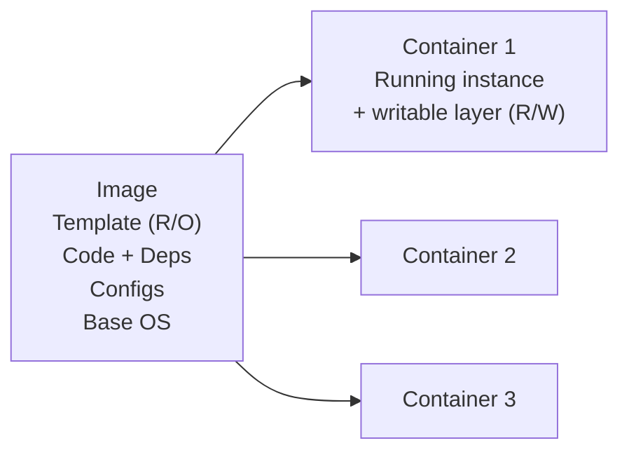
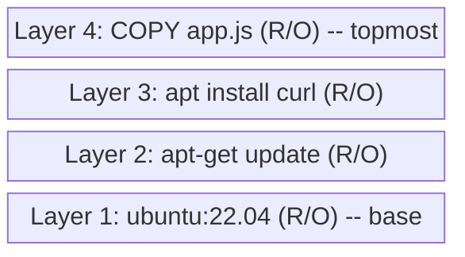
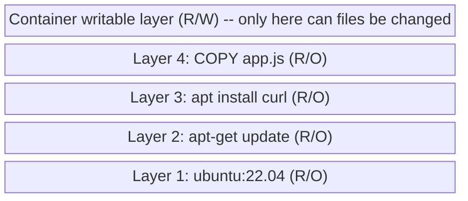

# 🔥 Level 1: Docker Images

## 🎯 What is a Docker image

A Docker image is a **read-only template** that contains everything needed to run an application: code, runtime, libraries, environment variables, and configuration files.

An image can be compared to a **class** in object-oriented programming: by itself it does nothing, but from it you can create one or more **containers** (instances).



📌 **Key property:** images are **immutable**. You cannot modify an existing image — you can only create a new one based on it.

## 🔥 Layered file system

Docker images are built on **layers**. Each instruction in a `Dockerfile` creates a new layer that represents a set of filesystem changes.

### How layers work

```dockerfile
FROM ubuntu:22.04          # Layer 1: base image (~77 MB)
RUN apt-get update         # Layer 2: package update (~40 MB)
RUN apt-get install -y curl # Layer 3: install curl (~5 MB)
COPY app.js /app/          # Layer 4: copy code (~1 KB)
CMD ["node", "app.js"]     # Metadata (does not create a layer)
```



### UnionFS and Copy-on-Write

Docker uses a **Union File System (UnionFS)** to merge all layers into a single filesystem. When a container starts, a **writable layer** is added on top of the image layers:



**Copy-on-Write (CoW):** when a container modifies a file from an image layer, the file is first **copied** to the writable layer, and only then changed. The original in the image layer remains untouched.

💡 **Why layers matter:**
- **Caching.** On rebuild, Docker reuses unchanged layers
- **Reuse.** Multiple images can share common layers (e.g., `ubuntu:22.04`)
- **Disk savings.** Shared layers are stored as a single copy on disk

```bash
# View the layers of an image
docker image history nginx:1.25

# View detailed information
docker image inspect nginx:1.25
```

## 📌 Docker Registry and image naming

### What is a registry

A **Docker Registry** is a storage system for Docker images. A registry stores images and allows you to download (`pull`) and upload (`push`) them.

Main registries:

| Registry | Address | Description |
|--------|-------|----------|
| **Docker Hub** | `docker.io` | Largest public registry (default) |
| **GitHub Container Registry** | `ghcr.io` | GitHub registry, integrates with GitHub Actions |
| **Amazon ECR** | `<id>.dkr.ecr.<region>.amazonaws.com` | AWS private registry |
| **Google Artifact Registry** | `<region>-docker.pkg.dev` | Google Cloud registry |
| **Harbor** | self-hosted | Open-source private registry |

### Full image name

The full name of a Docker image has the format:

```
[registry/][namespace/]repository[:tag|@digest]
```

Examples:

```bash
# Name only (Docker Hub, official image, latest)
nginx

# Name with tag
nginx:1.25

# With namespace (user/organization on Docker Hub)
myuser/my-app:2.0

# Full address with registry
ghcr.io/myorg/my-service:v1.3.0

# With digest (exact identification)
nginx@sha256:abc123def456...
```

📌 **If no registry is specified**, Docker uses `docker.io` (Docker Hub) by default. If no tag is specified, `latest` is used.

### Image types on Docker Hub

- **Official Images** — images maintained by Docker and verified teams (nginx, postgres, node). Have no namespace.
- **Verified Publisher** — images from verified companies (bitnami, datadog)
- **Community Images** — images from any users (`username/image`)

## 🔥 docker pull — downloading images

The `docker pull` command downloads an image from a registry to the local machine.

### Basic usage

```bash
# Download the latest version
docker pull nginx

# Download a specific version
docker pull nginx:1.25

# Download from another registry
docker pull ghcr.io/myorg/my-app:v1.0

# Download by digest
docker pull nginx@sha256:4c0fdaa8b6341...
```

### What happens during docker pull

```
$ docker pull node:20-alpine

20-alpine: Pulling from library/node
c926b61bad3b: Pull complete        ← Layer 1
5765c9a6d4d8: Pull complete        ← Layer 2
a4dad7bfc247: Pull complete        ← Layer 3
bfa6f8a61e0b: Pull complete        ← Layer 4
Digest: sha256:7a91aa397f25...     ← Unique image hash
Status: Downloaded newer image for node:20-alpine
docker.io/library/node:20-alpine   ← Full name
```

Note: each layer is downloaded separately. If a layer is already present on the machine (for example, from another image), it is **not downloaded again**:

```
$ docker pull node:20-slim

20-slim: Pulling from library/node
c926b61bad3b: Already exists       ← Layer already exists!
8a7c47254b8a: Pull complete
...
```

### Useful flags

```bash
# Download all tags of an image
docker pull --all-tags nginx

# Download for a different platform
docker pull --platform linux/arm64 nginx:1.25

# Quiet mode (no progress output)
docker pull --quiet nginx:1.25
```

## 🔥 Dockerfile basics

A `Dockerfile` is a text file with instructions for building a Docker image. Each instruction creates a layer or adds metadata to the image.

### Key instructions

#### FROM — base image

```dockerfile
# Every Dockerfile starts with FROM
FROM node:20-alpine

# You can specify a platform
FROM --platform=linux/amd64 python:3.12-slim

# scratch — empty image (for minimal binaries)
FROM scratch
```

📌 **FROM** is the only required instruction in a Dockerfile.

#### RUN — executing commands

```dockerfile
# Each RUN creates a new layer
RUN apt-get update
RUN apt-get install -y curl

# Better to combine commands to reduce the number of layers
RUN apt-get update && \
    apt-get install -y curl wget && \
    rm -rf /var/lib/apt/lists/*
```

#### COPY and ADD — copying files

```dockerfile
# COPY: copies files from the build context
COPY package.json /app/
COPY . /app/

# ADD: like COPY, but also extracts archives and downloads URLs
ADD archive.tar.gz /app/
```

💡 **Recommendation:** use `COPY` instead of `ADD` unless you need archive extraction. `COPY` is more predictable and easier to understand.

#### WORKDIR — working directory

```dockerfile
WORKDIR /app
# All subsequent commands run in /app
COPY . .
RUN npm install
```

#### EXPOSE — declaring ports

```dockerfile
# Documents which ports the application uses
EXPOSE 3000
EXPOSE 8080/tcp
EXPOSE 5432/udp
```

⚠️ **EXPOSE does not open ports!** It only serves as documentation. Use `-p` with `docker run` to publish ports.

#### CMD and ENTRYPOINT — startup command

```dockerfile
# CMD: default command (can be overridden)
CMD ["node", "server.js"]

# ENTRYPOINT: main command (harder to override)
ENTRYPOINT ["node"]
CMD ["server.js"]  # default arguments for ENTRYPOINT
```

#### ENV — environment variables

```dockerfile
ENV NODE_ENV=production
ENV PORT=3000
```

#### ARG — build arguments

```dockerfile
ARG NODE_VERSION=20
FROM node:${NODE_VERSION}-alpine

ARG APP_VERSION
ENV APP_VERSION=${APP_VERSION}
```

### Example of a complete Dockerfile

```dockerfile
# Base image
FROM node:20-alpine

# Metadata
LABEL maintainer="dev@example.com"
LABEL version="1.0"

# Working directory
WORKDIR /app

# Copy dependency files first (for caching)
COPY package.json package-lock.json ./

# Install dependencies
RUN npm ci --only=production

# Copy the rest of the code
COPY . .

# Document the port
EXPOSE 3000

# Create an unprivileged user
RUN addgroup -S appgroup && adduser -S appuser -G appgroup
USER appuser

# Startup command
CMD ["node", "server.js"]
```

## 🔥 docker build — building images

The `docker build` command reads a `Dockerfile` and creates an image.

### Basic usage

```bash
# Build an image from the current directory
docker build .

# Build with a tag
docker build -t my-app:1.0 .

# Specify a different Dockerfile
docker build -f Dockerfile.dev -t my-app:dev .

# Multiple tags
docker build -t my-app:1.0 -t my-app:latest .
```

### Build context

The **build context** is the set of files available during the build. The dot (`.`) at the end of `docker build .` points to the current directory as the context.

```bash
# Context is the current directory
docker build -t my-app .

# Context is another directory
docker build -t my-app ./services/api
```

⚠️ **Docker sends the entire build context to the daemon!** If the directory has many files (node_modules, .git), the build will be slow. Use `.dockerignore`:

```
# .dockerignore
node_modules
.git
.env
*.log
dist
coverage
```

### Build output

```
$ docker build -t my-app:1.0 .

[+] Building 12.3s (10/10) FINISHED
 => [internal] load build definition from Dockerfile       0.0s
 => [internal] load .dockerignore                          0.0s
 => [internal] load metadata for docker.io/library/node    1.2s
 => [1/5] FROM node:20-alpine@sha256:abc123...             3.1s
 => [2/5] WORKDIR /app                                     0.0s
 => [3/5] COPY package*.json ./                            0.1s
 => [4/5] RUN npm ci --only=production                     6.8s
 => [5/5] COPY . .                                         0.2s
 => exporting to image                                     0.8s
 => => naming to docker.io/library/my-app:1.0              0.0s
```

### Useful flags

```bash
# Build without cache
docker build --no-cache -t my-app .

# Pass build arguments
docker build --build-arg NODE_VERSION=18 -t my-app .

# Specify target platform
docker build --platform linux/amd64 -t my-app .

# Show full output (uncompressed)
docker build --progress=plain -t my-app .
```

## 🔥 Tags and versioning

### What is a tag

A tag is a **human-readable label** for identifying a specific version of an image. One image can have multiple tags.

```bash
# Create a tag
docker tag my-app:1.0 my-app:latest
docker tag my-app:1.0 registry.example.com/my-app:1.0

# List images
docker images my-app
REPOSITORY   TAG       IMAGE ID       SIZE
my-app       1.0       abc123def456   180MB
my-app       latest    abc123def456   180MB  ← same IMAGE ID!
```

### Tagging strategies

#### 1. Semantic Versioning

```
my-app:1.0.0    ← exact version (patch)
my-app:1.0      ← minor version
my-app:1        ← major version
my-app:latest   ← latest version
```

The user chooses the level of specificity:
- `my-app:1.0.0` — full reproducibility, a specific build
- `my-app:1.0` — get the latest patch for 1.0.x
- `my-app:1` — get the latest minor version 1.x.x

#### 2. Git-based tags

```bash
# Commit hash
my-app:abc123f

# Branch
my-app:main
my-app:develop

# Branch + short hash
my-app:main-abc123f
```

#### 3. Date-based tags

```bash
my-app:2024-01-15
my-app:20240115-abc123f
```

#### 4. Environment-based tags

```bash
my-app:staging
my-app:production
```

### The latest tag trap

⚠️ `latest` is **NOT** an automatic tag for the latest version. It is just a default tag that:
- Is assigned when no tag is specified during a build: `docker build -t my-app .` creates `my-app:latest`
- Is used when pulling without a tag: `docker pull nginx` = `docker pull nginx:latest`

```bash
# ❌ Common mistake: assuming latest is always up to date
docker pull my-app:latest  # May point to an old version!

# ✅ Always specify a concrete version
docker pull my-app:1.2.3
```

📌 **In production, always use specific tags**, not `latest`. This ensures deployment reproducibility.

### Digest-based pinning

For maximum reproducibility, you can use a **digest** — the SHA256 hash of the image content:

```bash
# Get the digest
docker inspect --format='{{index .RepoDigests 0}}' nginx:1.25

# Use the digest
docker pull nginx@sha256:4c0fdaa8b6341...

# In Dockerfile
FROM nginx@sha256:4c0fdaa8b6341...
```

A digest guarantees that you get a **bit-for-bit identical** image, even if the tag was reassigned.

## 📌 Managing images

### Viewing images

```bash
# List all local images
docker images
docker image ls

# Filtering
docker images --filter "dangling=true"    # "dangling" images with no tag
docker images --filter "reference=nginx"  # by name
docker images --format "{{.Repository}}:{{.Tag}} {{.Size}}"  # output format

# Detailed information
docker image inspect nginx:1.25

# Layer history
docker image history nginx:1.25
```

### Removing images

```bash
# Remove a specific image
docker image rm nginx:1.25
docker rmi nginx:1.25  # short form

# Remove unused images
docker image prune          # only "dangling" (untagged)
docker image prune -a       # all unused
docker image prune -a --filter "until=24h"  # older than 24 hours
```

### Export and import

```bash
# Save an image to a file
docker image save -o my-app.tar my-app:1.0

# Load an image from a file
docker image load -i my-app.tar
```

## ⚠️ Common beginner mistakes

### 🐛 1. Using latest in production

```bash
# ❌ Ambiguity: what exactly is deployed?
docker pull my-app:latest
docker run my-app:latest
```

> **Why this is a problem:** the `latest` tag can be reassigned at any time. Two `docker pull` commands an hour apart can download different images. This makes deployments non-reproducible and complicates rollbacks.

```bash
# ✅ A specific version = predictable deployment
docker pull my-app:1.2.3
docker run my-app:1.2.3
```

### 🐛 2. Not using .dockerignore

```bash
# ❌ Without .dockerignore EVERYTHING is sent
$ docker build -t my-app .
Sending build context to Docker daemon  450MB  ← including node_modules and .git!
```

> **Why this is a problem:** a huge context slows down the build. Additionally, secrets (.env files) can end up in the image via `COPY . .`.

```
# ✅ .dockerignore file
node_modules
.git
.env
*.log
.DS_Store
coverage
dist
```

### 🐛 3. Each RUN in a separate layer

```dockerfile
# ❌ Three layers that increase the image size
RUN apt-get update
RUN apt-get install -y curl wget
RUN rm -rf /var/lib/apt/lists/*
```

> **Why this is a problem:** each `RUN` creates a layer. Even if you delete files in the next layer, they still take up space in the previous layer. The `apt-get update` cache may become stale on a rebuild.

```dockerfile
# ✅ One command = one layer, cleanup in the same layer
RUN apt-get update && \
    apt-get install -y curl wget && \
    rm -rf /var/lib/apt/lists/*
```

### 🐛 4. Confusing COPY and the build context

```dockerfile
# ❌ Trying to copy a file outside the context
COPY /etc/config.json /app/     # Error! Absolute paths do not work
COPY ../shared/utils.js /app/   # Error! Cannot go outside the context
```

> **Why this is a problem:** `COPY` works **only** with files inside the build context (the directory specified in `docker build`). You cannot copy files from arbitrary locations on the filesystem.

```dockerfile
# ✅ Paths relative to the build context
COPY ./config/config.json /app/
COPY . /app/
```

### 🐛 5. Not understanding layer caching

```dockerfile
# ❌ Cache is invalidated on any code change
COPY . /app/
RUN npm install  # Dependencies reinstalled on every change!
```

> **Why this is a problem:** Docker caches layers top-to-bottom. If a layer changes, all subsequent layers are rebuilt. Copying all the code BEFORE installing dependencies means `npm install` will run on every change to any file.

```dockerfile
# ✅ Dependencies first, then code
COPY package.json package-lock.json ./
RUN npm ci
COPY . .  # A code change does not invalidate the npm install cache
```

## 📌 Best practices

1. ✅ **Use specific tags** for base images: `node:20-alpine`, not `node:latest`
2. ✅ **Minimal base images:** prefer `-alpine` or `-slim` variants
3. ✅ **Optimize layer order:** rarely changing instructions at the top, frequently changing ones at the bottom
4. ✅ **Combine RUN commands** with `&&` to reduce the number of layers
5. ✅ **Use .dockerignore** to exclude unnecessary files from the context
6. ✅ **One process per container** — do not run multiple services in one image
7. ✅ **Clean up package manager caches** in the same `RUN` where packages are installed
8. ✅ **Use digest pinning** in CI/CD for maximum reproducibility

## 📌 Summary

- 🔥 A Docker image is an immutable template made up of layers
- 🔥 Layers are cached and reused, which speeds up builds and saves disk space
- 📌 Images are stored in registries (Docker Hub, ghcr.io, ECR, etc.)
- 📌 Full image name: `[registry/][namespace/]repository[:tag|@digest]`
- ✅ `docker pull` downloads an image, `docker build` builds one from a Dockerfile
- ✅ In production, use specific tags or a digest, not `latest`
- ⚠️ Do not forget `.dockerignore` and optimizing layer order
