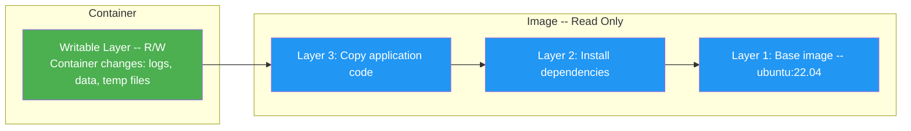
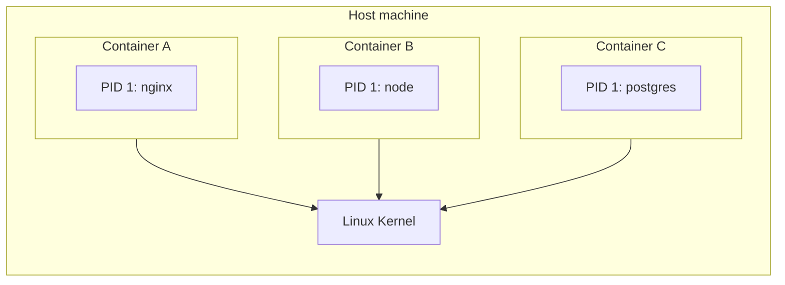
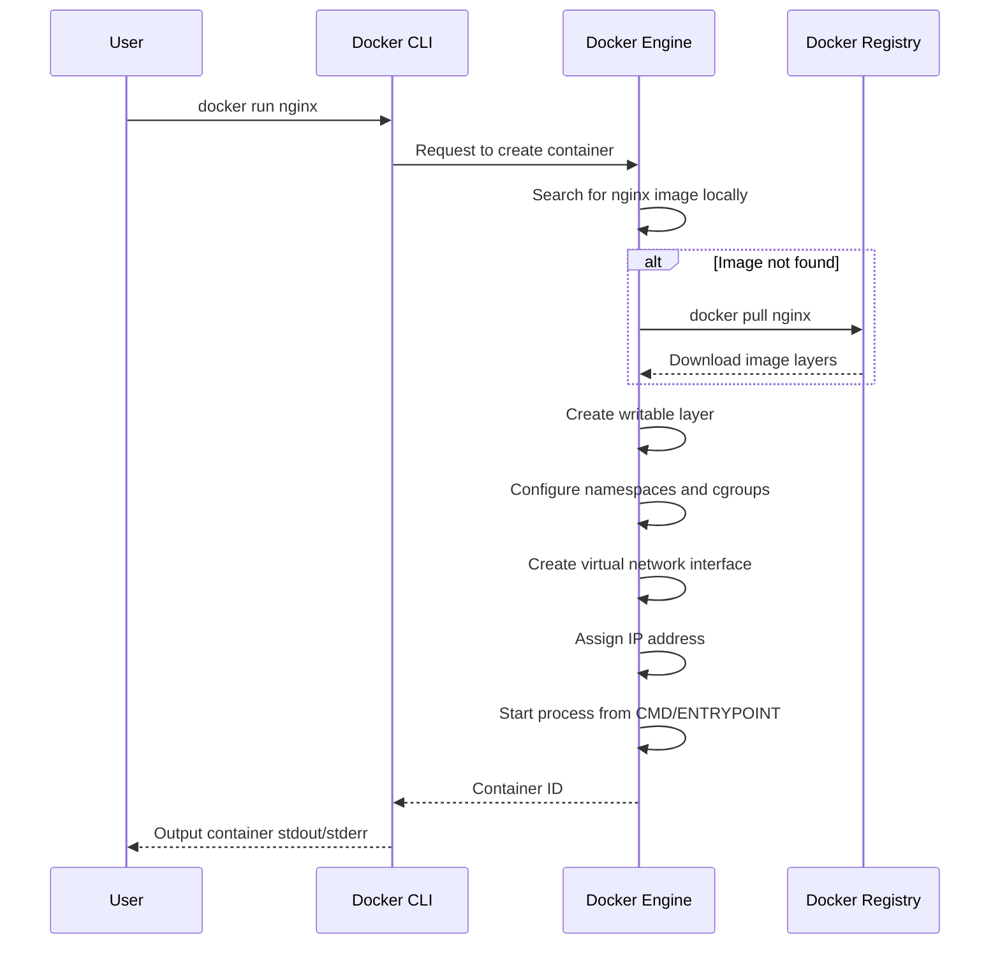
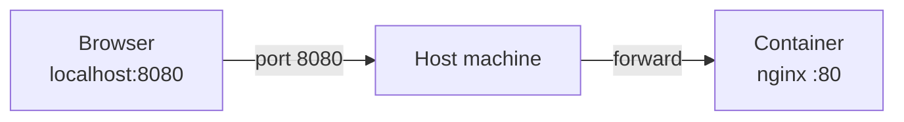
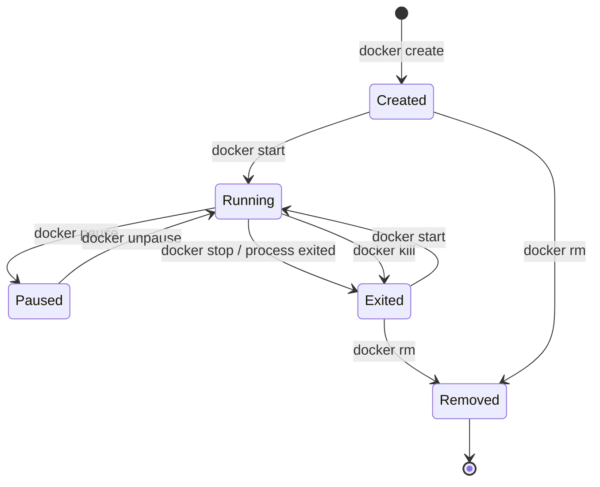
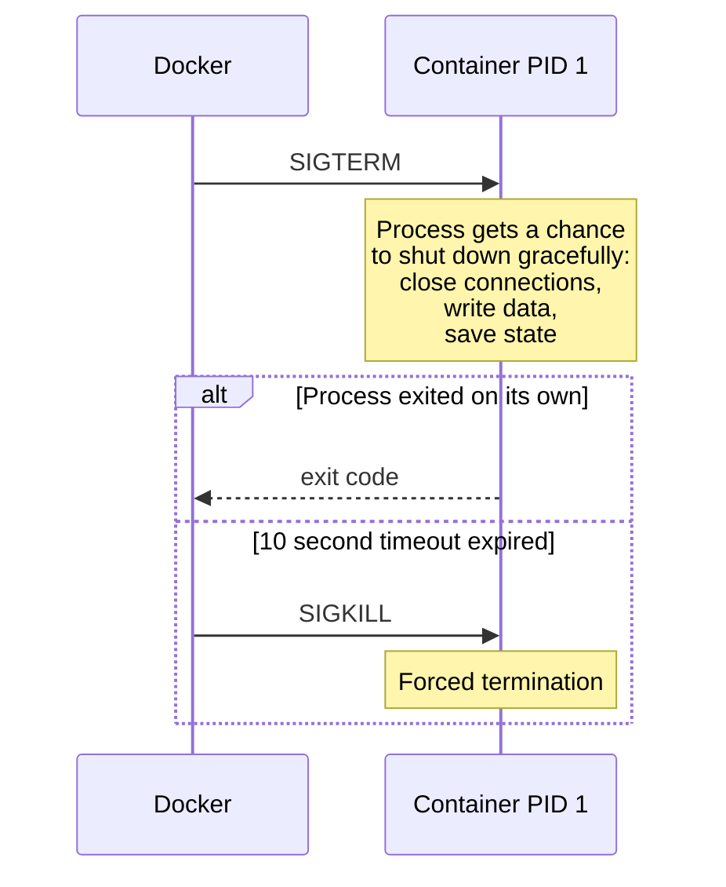

# Level 2: Containers -- Launch, Management, Lifecycle

## Introduction

Imagine an apartment in a multi-story building. Each tenant has their own walls, their own lock on the door, their own water and electricity meter. The neighbor upstairs can't see what's happening in your place, and you can't see what the neighbor is doing. But all the apartments are in the same building and share the same foundation, roof, and utilities.

A Docker container works by the same principle. It's an **isolated environment** in which your application runs. The container gets its own file system, its own network space, its own processes -- but it uses the same operating system kernel of the host machine. This is exactly what makes containers so lightweight compared to virtual machines, which carry an entire OS with them.

In this level, we will explore in detail:

1. **What a container is** -- what it consists of and how it relates to an image
2. **`docker run`** -- the main launch command and all its key flags
3. **Container lifecycle** -- from creation to removal, including all intermediate states
4. **`docker exec`** -- running commands inside a running container
5. **Logs and inspection** -- how to understand what's happening inside
6. **Common mistakes** -- what usually goes wrong for those starting with Docker

---

## 1. What is a Container

### Container and Image -- What's the Difference

Image and container are two different concepts that beginners often confuse. To understand them, think of it this way:

- **Image** -- this is a house blueprint. It describes what everything consists of, but you can't live in it.
- **Container** -- this is a house built from that blueprint. Processes live in it, it has a file system, an application runs in it.

You can create as many containers from one image as you want. Each container is completely independent from the others, even if they were created from the same image. It's like two houses built from the same project -- different people live in each and different furniture is inside.

Technically, when you start a container, Docker takes the read-only layers of the image and adds a **writable layer** on top -- a thin write layer in which all changes made inside the container are recorded.



The writable layer exists as long as the container exists. Delete the container -- lose the writable layer and all changes in it. This is a fundamental property of containers called **ephemerality**.

### What a Container Consists of Internally

A container is not a magical black box. It's a set of Linux kernel functions that together create the illusion of an isolated environment:

| Technology | What it provides | Real-life analogy |
|------------|-----------------|-------------------|
| **Namespaces** | Process, network, file system, user isolation | Walls between apartments |
| **Cgroups** | Resource limits -- CPU, RAM, I/O | Water and electricity meters with quotas |
| **Union FS** | Multi-layer file system with copy-on-write | Building floors, where each floor adds something new |
| **Capabilities** | Fine-grained privilege settings | Access control system -- who can go where |

When you run `docker run`, Docker uses all these mechanisms to create an environment in which the process "thinks" it's the only one on the machine.



Note: each container sees its process as PID 1 (first and main). On the host, these processes have completely different PIDs, but inside the container each one considers itself the sole "master" of the system.

---

## 2. docker run -- The Main Command

### Syntax

```bash
docker run [OPTIONS] IMAGE [COMMAND] [ARGS...]
```

This command does three things at once: creates a container from an image, starts it, and connects your terminal to it (unless the `-d` flag is specified). Essentially, `docker run` is shorthand for `docker create` + `docker start`.

### What Exactly Happens During docker run

When you type `docker run nginx`, a whole chain of actions unfolds behind the scenes:



Each of these steps takes milliseconds. That's why containers start so fast -- unlike virtual machines, there's no need to boot an OS kernel.

### Launch Modes

A Docker container can run in three main modes, and understanding the difference between them is key to productive work.

**Foreground (default mode)** -- the container is attached to your terminal. You see its output, but the terminal is "frozen" while the container is running.

```bash
# Terminal will be busy while nginx is running
docker run nginx
```

**Detached (background mode)** -- the container runs in the background, terminal is free. This is the main mode for server applications.

```bash
# Container starts, outputs ID and returns terminal
docker run -d nginx
# a3f7b2c1d4e5...
```

**Interactive** -- the container is connected to your terminal, and you can enter commands. Used for debugging and experiments.

```bash
# Opens a shell inside the container
docker run -it ubuntu bash
root@a3f7b2c1d4e5:/# ls
bin  boot  dev  etc  home  lib  ...
```

Here `-i` (interactive) keeps stdin open, and `-t` (tty) connects a pseudo-terminal. Without `-t` you won't see the command prompt, without `-i` you can't enter commands.

### Launch Flags: Detailed Breakdown

#### Naming and Identification

By default, Docker gives containers random names like `quirky_einstein` or `zealous_turing`. It's fun, but inconvenient in practice. Always give containers meaningful names:

```bash
# Without a name -- inconvenient
docker run -d nginx
# With a name -- clear what it is
docker run -d --name web-frontend nginx
```

A container name must be unique. If you try to create a second container with the same name, Docker will return an error:

```bash
docker run -d --name web nginx
docker run -d --name web nginx
# Error: Conflict. The container name "/web" is already in use
```

The `--hostname` flag sets the hostname inside the container. This is what you'll see in the bash prompt and what the `hostname` command returns:

```bash
docker run -it --hostname my-dev-box ubuntu bash
root@my-dev-box:/# hostname
my-dev-box
```

#### Port Mapping

A container lives in an isolated network by default. To "reach" a service inside a container from the host machine (or from the outside world), you need to forward a port.

```bash
# Format: -p [host_IP:]host_port:container_port[/protocol]
docker run -d -p 8080:80 nginx
```

Here `8080` is the port on the host, `80` is the port inside the container. Open `http://localhost:8080` -- and you'll see the nginx page.



You can map multiple ports and bind to a specific IP:

```bash
# Multiple ports
docker run -d -p 8080:80 -p 8443:443 nginx

# Only on localhost -- not accessible from outside
docker run -d -p 127.0.0.1:8080:80 nginx

# Random port on host
docker run -d -p 80 nginx
docker port <container_id>  # find out which port was assigned
```

#### Environment Variables

Environment variables are the main way to configure containers. Most official images (PostgreSQL, MySQL, Redis, Node.js) use variables for configuration.

```bash
# Single variable
docker run -d -e POSTGRES_PASSWORD=secret postgres

# Multiple variables
docker run -d \
  -e POSTGRES_USER=admin \
  -e POSTGRES_PASSWORD=secret \
  -e POSTGRES_DB=myapp \
  postgres

# From a file -- convenient when there are many variables
docker run -d --env-file ./database.env postgres
```

`.env` file format:

```env
POSTGRES_USER=admin
POSTGRES_PASSWORD=secret
POSTGRES_DB=myapp
# Comments are supported
```

#### Auto-removal

The `--rm` flag removes the container immediately after it stops. This is indispensable for one-off tasks and experiments:

```bash
# Container will execute the command and remove itself
docker run --rm ubuntu echo "Hello!"

# One-off test of DB connection
docker run --rm postgres pg_isready -h db-host

# Run migrations
docker run --rm -e DATABASE_URL=... myapp npm run migrate
```

Without `--rm`, stopped containers accumulate and take up disk space. Over time, you might discover dozens of "forgotten" containers via `docker ps -a`.

#### Resource Limits

In production, it's critical to limit container resources. Without limits, one "greedy" container can bring down the entire host machine.

```bash
# Memory limit -- container will be killed if exceeded
docker run -d --memory=512m nginx

# CPU limit -- container gets at most 1.5 cores
docker run -d --cpus=1.5 nginx

# Combination of limits
docker run -d \
  --memory=256m \
  --memory-swap=512m \
  --cpus=0.5 \
  nginx
```

What happens when limits are exceeded:

- **Memory**: the container will get OOM (Out Of Memory) and be killed by the Linux kernel. In `docker inspect` you'll see `OOMKilled: true`.
- **CPU**: the container will simply "slow down" but won't be killed. The kernel will limit its allocated CPU time.

#### Restart Policy

The `--restart` flag determines what happens to a container after it crashes:

| Value | Behavior |
|----------|-----------|
| `no` | Don't restart (default) |
| `on-failure` | Restart only on non-zero exit code |
| `on-failure:5` | Like on-failure, but maximum 5 attempts |
| `always` | Always restart, even after manual stop (after Docker restart) |
| `unless-stopped` | Like always, but don't restart if container was stopped manually |

```bash
# For production services
docker run -d --restart=unless-stopped --name web nginx

# For tasks that may fail due to temporary errors
docker run -d --restart=on-failure:3 --name worker myapp-worker
```

### Full Production-like Command

Putting all flags together, a typical service launch command looks like this:

```bash
docker run -d \
  --name api-server \
  --restart unless-stopped \
  -p 3000:3000 \
  -e NODE_ENV=production \
  -e DATABASE_URL=postgres://db:5432/myapp \
  --env-file ./secrets.env \
  -v app-logs:/app/logs \
  --memory=512m \
  --cpus=1.0 \
  myapp:1.2.0
```

Each line is a conscious choice:
- `--name` -- to address the container by name, not by ID
- `--restart unless-stopped` -- automatic recovery after crash
- `-p 3000:3000` -- application port forwarding
- `-e` and `--env-file` -- configuration via environment variables
- `-v` -- preserve logs between restarts
- `--memory` and `--cpus` -- protect host from resource leaks
- `myapp:1.2.0` -- specific image version, not latest

---

## 3. Container Lifecycle

### Container States

A container goes through several states during its lifetime. Understanding these states helps diagnose problems and choose the right management commands.



| State | What it means | How to get there |
|-----------|-------------|-------------|
| **Created** | Container created, but process not started | `docker create` |
| **Running** | Main process is running | `docker start` or `docker run` |
| **Paused** | Processes frozen via cgroups freezer | `docker pause` |
| **Exited** | Main process exited (with any exit code) | `docker stop`, `docker kill`, or process exited on its own |
| **Removed** | Container removed, writable layer erased | `docker rm` |

### Difference Between create, start, and run

Beginners are often confused by the presence of three similar commands. Here's how they relate:

```bash
# Two steps: create, then start
docker create --name web nginx   # state: Created
docker start web                  # state: Running

# One step: create and start
docker run --name web nginx       # the same in one command
```

`docker create` is useful when you need to prepare a container in advance -- for example, configure a network or copy files into it before starting.

### Stopping a Container: stop vs kill

This is an important distinction that affects data integrity.

**`docker stop`** -- graceful stop:



**`docker kill`** -- immediate stop. Docker sends SIGKILL without warning. The process doesn't get a chance to save data.

```bash
# Graceful stop -- default timeout 10 seconds
docker stop my-container

# Graceful stop with increased timeout
docker stop --time=30 my-container

# Immediate stop
docker kill my-container
```

The rule is simple: **always use `docker stop`** unless the container is frozen and not responding to SIGTERM.

### The PID 1 Problem and Signal Forwarding

The main process in a container always gets PID 1. In Linux, the process with PID 1 is special: it's the one that receives signals like SIGTERM. If your application is not PID 1, it won't receive the stop signal.

This is a common problem when using shell scripts as entrypoint:

```bash
#!/bin/bash
# entrypoint.sh

echo "Starting application..."
node server.js
```

In this case, PID 1 gets bash, and node is a child process. When Docker sends SIGTERM, bash receives it, but bash by default doesn't forward the signal to child processes. So node doesn't know it's time to finish, and after 10 seconds SIGKILL arrives.

The solution -- use `exec`:

```bash
#!/bin/bash
# entrypoint.sh

echo "Starting application..."
exec node server.js
# exec replaces the bash process with node
# now node is PID 1 and will receive SIGTERM directly
```

### Lifecycle Management Commands

```bash
# View running containers
docker ps

# All containers, including stopped ones
docker ps -a

# Compact output format
docker ps --format "table {{.Names}}\t{{.Status}}\t{{.Ports}}"

# Filtering
docker ps -a --filter status=exited
docker ps --filter name=web

# Start a stopped container
docker start my-container

# Restart -- stop + start
docker restart my-container

# Pause -- freezing via cgroups
docker pause my-container
docker unpause my-container

# Remove a stopped container
docker rm my-container

# Force remove a running container
docker rm -f my-container

# Remove all stopped containers
docker container prune

# Remove all stopped + unused images + networks
docker system prune
```

`docker pause` freezes all processes in the container. They stop receiving CPU time but remain in memory. This is useful when you need to temporarily "suspend" a container -- for example, to take a file system snapshot.

---

## 4. docker exec -- Commands Inside a Container

### Why exec is Needed

`docker exec` launches a **new process** inside an already running container. It's the main debugging tool. Think of it as an SSH connection to a server, but without SSH -- everything works through the Docker API.

```bash
docker exec [OPTIONS] CONTAINER COMMAND [ARGS...]
```

The key difference from `docker run`: `exec` doesn't create a new container. It connects to an existing one. All processes launched via `exec` share the network, file system, and environment variables with the main container.

### Interactive Access

The most common scenario -- opening a shell inside a container:

```bash
# If the image has bash
docker exec -it my-container bash

# If there's no bash -- Alpine, distroless, etc.
docker exec -it my-container sh

# Run as a specific user
docker exec -it -u root my-container bash

# With a specific working directory
docker exec -it -w /app/src my-container bash
```

The `-it` flags work the same as in `docker run`: `-i` keeps stdin open, `-t` allocates a pseudo-terminal.

### Single Commands

You don't have to open a shell every time. You can run a single command and get the result:

```bash
# View files
docker exec my-app ls -la /app

# Check environment variables
docker exec my-app env

# Check network accessibility
docker exec my-app curl -s localhost:3000/health

# View configuration contents
docker exec my-app cat /etc/nginx/nginx.conf

# Run DB migrations
docker exec my-app npm run db:migrate

# Connect to PostgreSQL
docker exec -it my-postgres psql -U postgres -d mydb
```

### Passing Environment Variables

```bash
# Run a command with an additional variable
docker exec -e DEBUG=true my-app node debug-script.js
```

The variable will be available only for this specific call. It doesn't change the main container process's environment.

### Important Limitations

- `docker exec` only works with **Running** containers. If the container is stopped, use `docker start`, then `exec`.
- A process launched via `exec` gets its own stdin/stdout space, but shares the PID namespace with the main container. You can see it via `docker top`.
- If the main container process terminates, all exec sessions will also be closed.

---

## 5. Logs and Inspection

### docker logs -- Reading Logs

Docker follows a simple rule: everything an application writes to stdout and stderr becomes the container's logs. This is a fundamental difference from traditional servers, where applications write logs to files.

```bash
# All container logs from the beginning
docker logs my-container

# Last 50 lines
docker logs --tail 50 my-container

# Real-time logs -- like tail -f
docker logs -f my-container

# Logs with timestamps
docker logs -t my-container
# 2024-01-15T10:30:45.123456789Z Starting server...
# 2024-01-15T10:30:45.456789012Z Listening on port 3000

# Logs for a specific period
docker logs --since 1h my-container
docker logs --since 2024-01-15T10:00:00 my-container
docker logs --until 2024-01-15T11:00:00 my-container

# Combining -- last hour, only 100 lines, in real time
docker logs --since 1h --tail 100 -f my-container
```

Typical debugging workflow: first `--tail 100` to see the latest messages, then `-f` to follow new ones.

### Why Applications Should Write to stdout

Docker intercepts the main process's stdout/stderr and saves them via the logging driver. If an application writes logs to a file inside the container (for example, `/var/log/app.log`), `docker logs` won't see them.

Many official images solve this problem through symbolic links:

```bash
# In the nginx Dockerfile:
# stdout and stderr redirected via symlinks
RUN ln -sf /dev/stdout /var/log/nginx/access.log \
    && ln -sf /dev/stderr /var/log/nginx/error.log
```

### docker inspect -- Container X-ray

`docker inspect` returns full information about a container in JSON format. It's like a medical record -- here's everything: configuration, network settings, mounts, state.

```bash
# Full JSON -- usually very long
docker inspect my-container

# Specific fields via Go templates
# Container IP address
docker inspect -f '{{range .NetworkSettings.Networks}}{{.IPAddress}}{{end}}' my-container

# Container status
docker inspect -f '{{.State.Status}}' my-container

# Exit code
docker inspect -f '{{.State.ExitCode}}' my-container

# Was there an OOM Kill
docker inspect -f '{{.State.OOMKilled}}' my-container

# All environment variables
docker inspect -f '{{range .Config.Env}}{{println .}}{{end}}' my-container

# Ports
docker inspect -f '{{json .NetworkSettings.Ports}}' my-container | python3 -m json.tool
```

Go templates are a powerful tool, but the syntax is unfamiliar. An alternative is to use `jq`:

```bash
# IP address via jq
docker inspect my-container | jq -r '.[0].NetworkSettings.Networks.bridge.IPAddress'

# All port forwards
docker inspect my-container | jq '.[0].NetworkSettings.Ports'

# Container creation time
docker inspect my-container | jq -r '.[0].Created'
```

### docker stats -- Resource Monitoring

```bash
# Monitor all running containers in real time
docker stats

# Monitor a specific container
docker stats my-container

# Single snapshot without real-time updates
docker stats --no-stream

# Custom format
docker stats --format "table {{.Name}}\t{{.CPUPerc}}\t{{.MemUsage}}"
```

Example `docker stats` output:

```
CONTAINER ID   NAME   CPU %   MEM USAGE / LIMIT     MEM %   NET I/O         BLOCK I/O
a3f7b2c1d4e5   web    0.15%   25.4MiB / 256MiB      9.92%   1.2kB / 648B    0B / 0B
b8e9c3d2f1a6   db     2.31%   180MiB / 512MiB       35.2%   5.6kB / 3.2kB   8.1MB / 12MB
```

### Other Useful Inspection Commands

```bash
# Processes inside the container -- like ps aux
docker top my-container

# Changes in the file system compared to the image
docker diff my-container
# A /app/logs/app.log    -- Added
# C /etc                  -- Changed
# D /tmp/cache            -- Deleted

# Copy files between host and container
docker cp my-container:/app/logs/error.log ./error.log
docker cp ./fix.patch my-container:/app/fix.patch

# Wait for container to finish and get exit code
docker wait my-container
# 0
```

`docker diff` is an underrated tool. It shows which files were added, modified, or deleted in the container's writable layer. This helps you understand what the application does with the file system.

---

## 6. Practical Scenarios

### Scenario 1: Running a Web Application with a Database

```bash
# 1. Create a network for container communication
docker network create myapp

# 2. Start PostgreSQL
docker run -d \
  --name db \
  --network myapp \
  -e POSTGRES_PASSWORD=secret \
  -e POSTGRES_DB=myapp \
  -v pgdata:/var/lib/postgresql/data \
  --memory=512m \
  postgres:16-alpine

# 3. Wait for DB readiness
docker exec db pg_isready -U postgres
# /var/run/postgresql:5432 - accepting connections

# 4. Start the application
docker run -d \
  --name api \
  --network myapp \
  -p 3000:3000 \
  -e DATABASE_URL=postgres://postgres:secret@db:5432/myapp \
  --restart unless-stopped \
  myapp:latest

# 5. Check that it works
curl http://localhost:3000/health
```

Note: `db` is used as the host in `DATABASE_URL` -- this is the container name, which works as a DNS name inside the Docker network.

### Scenario 2: Debugging a Crashed Container

```bash
# 1. Container crashed -- check status
docker ps -a --filter name=my-app
# STATUS: Exited (1) 5 minutes ago

# 2. Read logs
docker logs --tail 200 my-app

# 3. Check details
docker inspect -f '{{.State.ExitCode}}' my-app
# 1

docker inspect -f '{{.State.OOMKilled}}' my-app
# false

# 4. Restart with shell for debugging
docker run -it --rm \
  --entrypoint sh \
  -e DATABASE_URL=postgres://... \
  myapp:latest

# 5. Inside, check the environment
env | grep DATABASE
ls -la /app
node -e "console.log(require('./package.json').version)"
```

### Scenario 3: One-off Tasks

```bash
# Format a JSON file
cat data.json | docker run --rm -i python:3-alpine python3 -m json.tool

# Generate a password
docker run --rm alpine sh -c "cat /dev/urandom | tr -dc 'a-zA-Z0-9' | head -c 32"

# Test DNS
docker run --rm alpine nslookup google.com

# Check SSL certificate
docker run --rm alpine openssl s_client -connect example.com:443
```

---

## 7. Common Beginner Mistakes

### Container Stops Immediately

The most common problem for beginners. You start a container in detached mode, and it instantly goes to Exited status.

```bash
docker run -d ubuntu
docker ps -a
# STATUS: Exited (0) 2 seconds ago
```

Reason: a container lives as long as its main process (PID 1) is running. The `ubuntu` image has `bash` in CMD. Bash without a connected terminal (without `-it`) exits instantly -- there's nothing for it to work with.

```bash
# This doesn't work -- bash will exit instantly
docker run -d ubuntu

# Option 1: interactive mode
docker run -it ubuntu bash

# Option 2: run a long-lived process
docker run -d ubuntu sleep infinity

# Option 3: run tail -- classic trick for "empty" containers
docker run -d ubuntu tail -f /dev/null
```

### Container Name Conflict

```bash
docker run -d --name web nginx
# OK

docker run -d --name web nginx
# docker: Error response from daemon: Conflict.
# The container name "/web" is already in use by container "a3f7b2c..."
```

Solutions:

```bash
# Remove the old container
docker rm -f web
docker run -d --name web nginx

# Or use a different name
docker run -d --name web-2 nginx
```

### Port Conflict

```bash
docker run -d -p 8080:80 --name web1 nginx
# OK

docker run -d -p 8080:80 --name web2 nginx
# Error: Bind for 0.0.0.0:8080 failed: port is already allocated
```

Port `8080` on the host is already taken by the first container. Two containers can't listen on the same host port. But two containers can both listen on port 80 inside -- because each has its own network namespace.

```bash
# Use different ports on the host
docker run -d -p 8080:80 --name web1 nginx
docker run -d -p 8081:80 --name web2 nginx
```

### Data Loss When Deleting a Container

```bash
# Everything written inside the container is lost on docker rm
docker run -d --name db postgres
docker exec db psql -U postgres -c "CREATE TABLE users (id serial, name text);"
docker exec db psql -U postgres -c "INSERT INTO users (name) VALUES ('Alice');"
docker rm -f db

# New container -- clean DB, no table
docker run -d --name db postgres
docker exec db psql -U postgres -c "SELECT * FROM users;"
# ERROR: relation "users" does not exist
```

Solution -- always mount volumes for important data:

```bash
docker run -d --name db \
  -v pgdata:/var/lib/postgresql/data \
  postgres
```

Now data is stored in the `pgdata` volume and will survive container deletion. More details -- in level 4 about volumes.

### Forgotten Containers Taking Up Space

After a few days of working with Docker, you may accumulate dozens of stopped containers:

```bash
docker ps -a --filter status=exited
# ... long list ...

# Check how much space is used
docker system df

# Clean up stopped containers
docker container prune

# Or use --rm when launching test containers
docker run --rm alpine echo "I clean up after myself"
```

The habit of using `--rm` for one-off containers and running `docker container prune` once a week will save you gigabytes of disk space.

### Ignoring Exit Codes

When a container crashes, the first thing to check is the exit code:

| Exit code | Meaning |
|-----------|----------|
| 0 | Normal completion |
| 1 | General application error |
| 126 | Command not executable |
| 127 | Command not found |
| 137 | Killed by SIGKILL signal (often -- OOM) |
| 143 | Killed by SIGTERM signal -- normal completion via docker stop |

```bash
# Check exit code
docker inspect -f '{{.State.ExitCode}}' my-container

# Exit code 137 -- check for OOM
docker inspect -f '{{.State.OOMKilled}}' my-container
```

Exit code 137 is a red flag. It usually means the container ran out of memory. Increase the limit via `--memory` or optimize the application.

---

## Cheat Sheet

### Launch

```bash
docker run -d --name NAME IMAGE              # background launch
docker run -it --rm IMAGE bash               # interactive one-off
docker run -d -p 8080:80 IMAGE               # with port forwarding
docker run -d -e KEY=VALUE IMAGE             # with environment variable
docker run -d --restart unless-stopped IMAGE  # with auto-restart
```

### Lifecycle

```bash
docker ps                    # running containers
docker ps -a                 # all containers
docker stop NAME             # graceful stop
docker kill NAME             # immediate stop
docker start NAME            # start stopped
docker restart NAME          # restart
docker rm NAME               # remove
docker rm -f NAME            # force remove
docker container prune       # clean up stopped
```

### Debugging

```bash
docker logs -f --tail 100 NAME        # logs
docker exec -it NAME bash             # shell inside
docker inspect NAME                   # full information
docker stats                          # real-time resources
docker top NAME                       # processes
docker diff NAME                      # FS changes
docker cp NAME:/path ./local          # copy files
```
