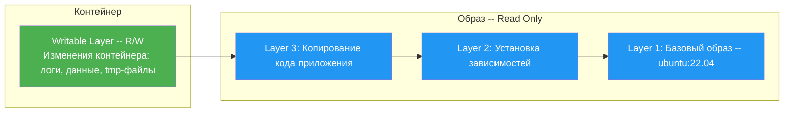
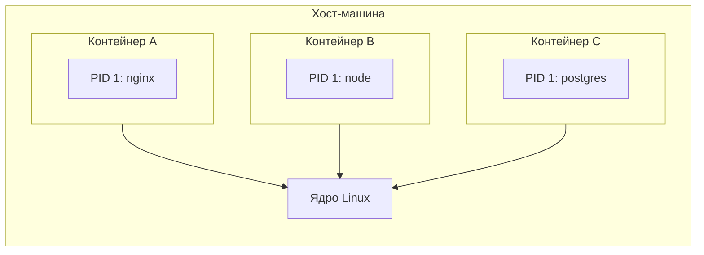
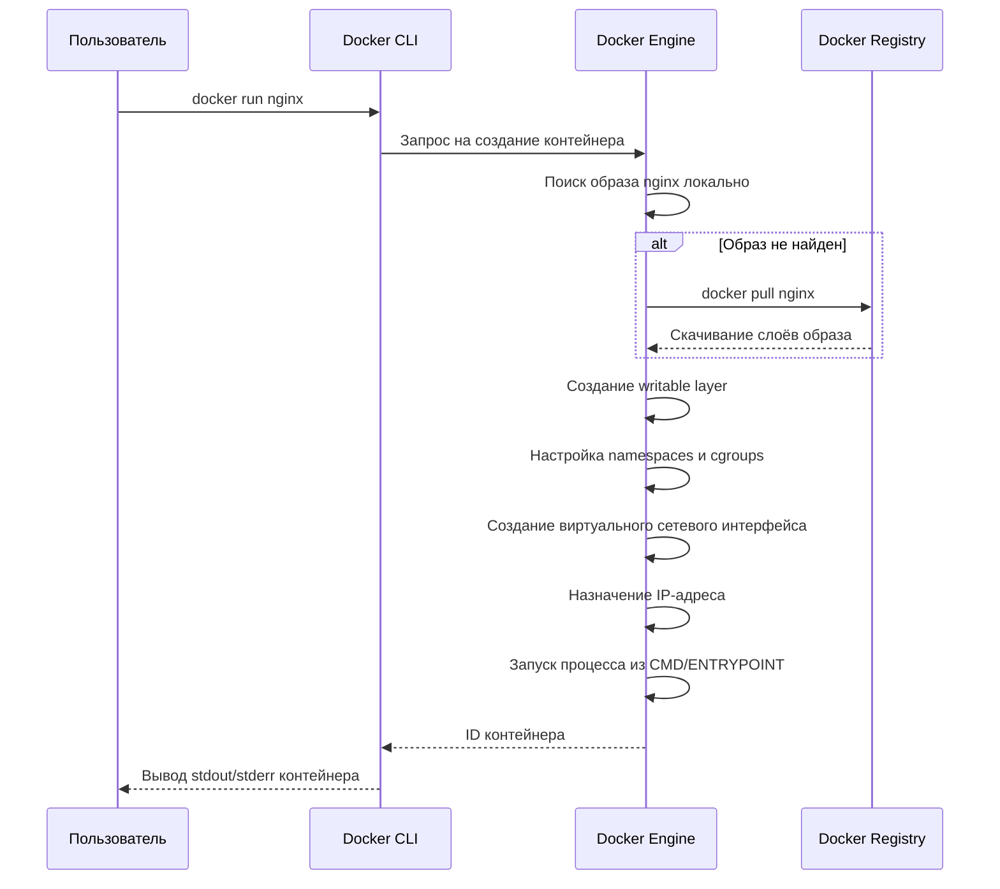
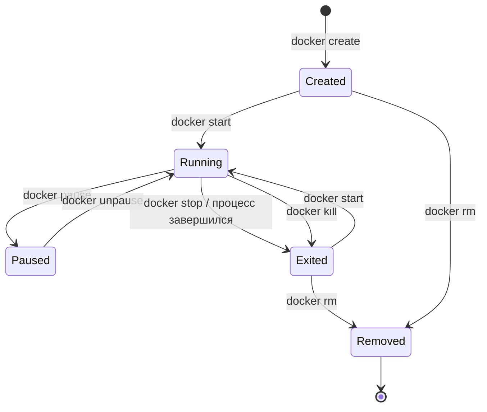
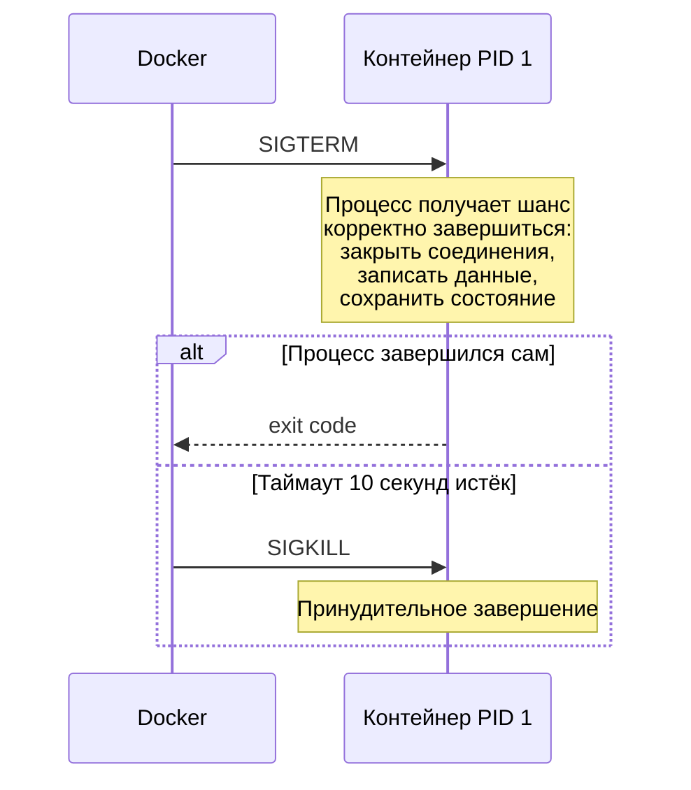

# Уровень 2: Контейнеры -- запуск, управление, жизненный цикл

## Введение

Представьте себе квартиру в многоэтажном доме. У каждого жильца свои стены, свой замок на двери, свой счётчик воды и электричества. Сосед сверху не видит, что происходит у вас, а вы не видите, что делает сосед. При этом все квартиры находятся в одном здании и разделяют общий фундамент, крышу и коммуникации.

Docker-контейнер работает по тому же принципу. Это **изолированная среда**, в которой запускается ваше приложение. Контейнер получает собственную файловую систему, собственное сетевое пространство, собственные процессы -- но при этом использует общее ядро операционной системы хост-машины. Именно это делает контейнеры такими лёгкими по сравнению с виртуальными машинами, которые тащат за собой целую ОС.

На этом уровне мы подробно разберём:

1. **Что такое контейнер** -- из чего он состоит и как соотносится с образом
2. **`docker run`** -- главная команда запуска и все её ключевые флаги
3. **Жизненный цикл контейнера** -- от создания до удаления, включая все промежуточные состояния
4. **`docker exec`** -- выполнение команд внутри работающего контейнера
5. **Логи и инспекция** -- как понять, что происходит внутри
6. **Типичные ошибки** -- что обычно идёт не так у тех, кто начинает работать с Docker

---

## 1. Что такое контейнер

### Контейнер и образ -- в чём разница

Образ (image) и контейнер (container) -- это два разных понятия, которые новички часто путают. Чтобы разобраться, подумайте о них так:

- **Образ** -- это чертёж дома. Он описывает, из чего всё состоит, но в нём нельзя жить.
- **Контейнер** -- это дом, построенный по этому чертежу. В нём живут процессы, в нём есть файловая система, в нём работает приложение.

Из одного образа можно создать сколько угодно контейнеров. Каждый контейнер полностью независим от других, даже если они созданы из одного и того же образа. Это как два дома, построенных по одному проекту, -- в каждом живут разные люди и стоит разная мебель.

Технически, когда вы запускаете контейнер, Docker берёт read-only слои образа и добавляет сверху **writable layer** -- тонкий слой записи, в котором фиксируются все изменения, сделанные внутри контейнера.



Writable layer существует, пока существует контейнер. Удалили контейнер -- потеряли writable layer и все изменения в нём. Это фундаментальное свойство контейнеров, которое называется **эфемерностью**.

### Из чего состоит контейнер изнутри

Контейнер -- это не магический чёрный ящик. Это набор функций ядра Linux, которые вместе создают иллюзию изолированной среды:

| Технология | Что обеспечивает | Аналогия из жизни |
|------------|-----------------|-------------------|
| **Namespaces** | Изоляция процессов, сети, файловой системы, пользователей | Стены между квартирами |
| **Cgroups** | Ограничение ресурсов -- CPU, RAM, I/O | Счётчики воды и электричества с лимитами |
| **Union FS** | Многослойная файловая система с copy-on-write | Этажи здания, где каждый этаж добавляет что-то новое |
| **Capabilities** | Тонкая настройка привилегий | Пропускная система -- кому куда можно |

Когда вы выполняете `docker run`, Docker использует все эти механизмы, чтобы создать среду, в которой процесс "думает", что он единственный на машине.



Обратите внимание: каждый контейнер видит свой процесс как PID 1 (первый и главный). На хосте у этих процессов совсем другие PID, но внутри контейнера каждый из них считает себя единственным "хозяином" системы.

---

## 2. docker run -- главная команда

### Синтаксис

```bash
docker run [OPTIONS] IMAGE [COMMAND] [ARGS...]
```

Эта команда делает сразу три вещи: создаёт контейнер из образа, запускает его и подключает к нему ваш терминал (если не указан флаг `-d`). По сути, `docker run` -- это сокращение для `docker create` + `docker start`.

### Что именно происходит при docker run

Когда вы набираете `docker run nginx`, за кулисами разворачивается целая цепочка действий:



Каждый из этих шагов занимает миллисекунды. Вот почему контейнеры стартуют так быстро -- в отличие от виртуальных машин, здесь не нужно грузить ядро ОС.

### Режимы запуска

Docker-контейнер может работать в трёх основных режимах, и понимание разницы между ними -- ключ к продуктивной работе.

**Foreground (передний план)** -- режим по умолчанию. Контейнер привязан к вашему терминалу. Вы видите его вывод, но терминал "заморожен", пока контейнер работает.

```bash
# Терминал будет занят, пока nginx работает
docker run nginx
```

**Detached (фоновый режим)** -- контейнер работает в фоне, терминал свободен. Это основной режим для серверных приложений.

```bash
# Контейнер стартует, выводит ID и возвращает терминал
docker run -d nginx
# a3f7b2c1d4e5...
```

**Interactive (интерактивный)** -- контейнер подключён к вашему терминалу, и вы можете вводить команды. Используется для отладки и экспериментов.

```bash
# Открывает shell внутри контейнера
docker run -it ubuntu bash
root@a3f7b2c1d4e5:/# ls
bin  boot  dev  etc  home  lib  ...
```

Здесь `-i` (interactive) оставляет stdin открытым, а `-t` (tty) подключает псевдотерминал. Без `-t` вы не увидите приглашение командной строки, без `-i` не сможете вводить команды.

### Флаги запуска: подробный разбор

#### Именование и идентификация

По умолчанию Docker даёт контейнерам случайные имена вроде `quirky_einstein` или `zealous_turing`. Это весело, но неудобно на практике. Всегда давайте контейнерам осмысленные имена:

```bash
# Без имени -- неудобно
docker run -d nginx
# С именем -- ясно, что это такое
docker run -d --name web-frontend nginx
```

Имя контейнера должно быть уникальным. Если вы попытаетесь создать второй контейнер с тем же именем, Docker вернёт ошибку:

```bash
docker run -d --name web nginx
docker run -d --name web nginx
# Error: Conflict. The container name "/web" is already in use
```

Флаг `--hostname` задаёт имя хоста внутри контейнера. Это то, что вы увидите в приглашении bash и что вернёт команда `hostname`:

```bash
docker run -it --hostname my-dev-box ubuntu bash
root@my-dev-box:/# hostname
my-dev-box
```

#### Проброс портов

Контейнер по умолчанию живёт в изолированной сети. Чтобы "достучаться" до сервиса внутри контейнера с хост-машины (или из внешнего мира), нужно пробросить порт.

```bash
# Формат: -p [хост_IP:]хост_порт:контейнер_порт[/протокол]
docker run -d -p 8080:80 nginx
```

Здесь `8080` -- порт на хосте, `80` -- порт внутри контейнера. Откройте `http://localhost:8080` -- и увидите страницу nginx.


Можно пробрасывать несколько портов и привязываться к конкретному IP:

```bash
# Несколько портов
docker run -d -p 8080:80 -p 8443:443 nginx

# Только на localhost -- недоступен извне
docker run -d -p 127.0.0.1:8080:80 nginx

# Случайный порт на хосте
docker run -d -p 80 nginx
docker port <container_id>  # узнать какой порт назначен
```

#### Переменные окружения

Переменные окружения -- основной способ конфигурации контейнеров. Большинство официальных образов (PostgreSQL, MySQL, Redis, Node.js) используют переменные для настройки.

```bash
# Одна переменная
docker run -d -e POSTGRES_PASSWORD=secret postgres

# Несколько переменных
docker run -d \
  -e POSTGRES_USER=admin \
  -e POSTGRES_PASSWORD=secret \
  -e POSTGRES_DB=myapp \
  postgres

# Из файла -- удобно, когда переменных много
docker run -d --env-file ./database.env postgres
```

Формат `.env` файла:

```env
POSTGRES_USER=admin
POSTGRES_PASSWORD=secret
POSTGRES_DB=myapp
# Комментарии поддерживаются
```

#### Автоудаление

Флаг `--rm` удаляет контейнер сразу после его остановки. Это незаменимо для одноразовых задач и экспериментов:

```bash
# Контейнер выполнит команду и удалится
docker run --rm ubuntu echo "Hello!"

# Одноразовый тест подключения к БД
docker run --rm postgres pg_isready -h db-host

# Запуск миграций
docker run --rm -e DATABASE_URL=... myapp npm run migrate
```

Без `--rm` остановленные контейнеры копятся и занимают место на диске. Со временем можно обнаружить десятки "забытых" контейнеров через `docker ps -a`.

#### Ограничение ресурсов

В продакшене критически важно ограничивать ресурсы контейнера. Без лимитов один "прожорливый" контейнер может положить всю хост-машину.

```bash
# Лимит памяти -- контейнер будет убит при превышении
docker run -d --memory=512m nginx

# Лимит CPU -- контейнер получит максимум 1.5 ядра
docker run -d --cpus=1.5 nginx

# Комбинация лимитов
docker run -d \
  --memory=256m \
  --memory-swap=512m \
  --cpus=0.5 \
  nginx
```

Что произойдёт при превышении лимитов:

- **Память**: контейнер получит OOM (Out Of Memory) и будет убит ядром Linux. В `docker inspect` вы увидите `OOMKilled: true`.
- **CPU**: контейнер просто будет "тормозить", но не будет убит. Ядро ограничит ему выделенное процессорное время.

#### Политика перезапуска

Флаг `--restart` определяет, что произойдёт с контейнером после его падения:

| Значение | Поведение |
|----------|-----------|
| `no` | Не перезапускать (по умолчанию) |
| `on-failure` | Перезапускать только при ненулевом exit code |
| `on-failure:5` | Как on-failure, но максимум 5 попыток |
| `always` | Перезапускать всегда, даже при ручной остановке (после перезагрузки Docker) |
| `unless-stopped` | Как always, но не перезапускать, если контейнер был остановлен вручную |

```bash
# Для production-сервисов
docker run -d --restart=unless-stopped --name web nginx

# Для задач, которые могут упасть из-за временной ошибки
docker run -d --restart=on-failure:3 --name worker myapp-worker
```

### Полная production-подобная команда

Собирая все флаги вместе, типичная команда запуска сервиса выглядит так:

```bash
docker run -d \
  --name api-server \
  --restart unless-stopped \
  -p 3000:3000 \
  -e NODE_ENV=production \
  -e DATABASE_URL=postgres://db:5432/myapp \
  --env-file ./secrets.env \
  -v app-logs:/app/logs \
  --memory=512m \
  --cpus=1.0 \
  myapp:1.2.0
```

Каждая строка -- осознанный выбор:
- `--name` -- чтобы обращаться к контейнеру по имени, а не по ID
- `--restart unless-stopped` -- автоматическое восстановление после падения
- `-p 3000:3000` -- проброс порта приложения
- `-e` и `--env-file` -- конфигурация через переменные окружения
- `-v` -- сохранение логов между перезапусками
- `--memory` и `--cpus` -- защита хоста от утечек ресурсов
- `myapp:1.2.0` -- конкретная версия образа, не latest

---

## 3. Жизненный цикл контейнера

### Состояния контейнера

Контейнер за время своей жизни проходит через несколько состояний. Понимание этих состояний помогает диагностировать проблемы и выбирать правильные команды управления.



| Состояние | Что означает | Как попасть |
|-----------|-------------|-------------|
| **Created** | Контейнер создан, но процесс не запущен | `docker create` |
| **Running** | Главный процесс работает | `docker start` или `docker run` |
| **Paused** | Процессы заморожены через cgroups freezer | `docker pause` |
| **Exited** | Главный процесс завершился (с любым exit code) | `docker stop`, `docker kill`, или процесс вышел сам |
| **Removed** | Контейнер удалён, writable layer стёрт | `docker rm` |

### Разница между create, start и run

Начинающих часто путает наличие трёх похожих команд. Вот как они соотносятся:

```bash
# Два шага: создать, потом запустить
docker create --name web nginx   # состояние: Created
docker start web                  # состояние: Running

# Один шаг: создать и запустить
docker run --name web nginx       # то же самое за одну команду
```

`docker create` полезен, когда нужно подготовить контейнер заранее -- например, настроить сеть или скопировать файлы в него до запуска.

### Остановка контейнера: stop vs kill

Это важное различие, которое влияет на целостность данных.

**`docker stop`** -- вежливая остановка:



**`docker kill`** -- немедленная остановка. Docker отправляет SIGKILL без предупреждения. Процесс не получает шанса сохранить данные.

```bash
# Вежливая остановка -- default timeout 10 секунд
docker stop my-container

# Вежливая остановка с увеличенным таймаутом
docker stop --time=30 my-container

# Немедленная остановка
docker kill my-container
```

Правило простое: **всегда используйте `docker stop`**, если только контейнер не завис и не реагирует на SIGTERM.

### Проблема PID 1 и передачи сигналов

Главный процесс в контейнере всегда получает PID 1. В Linux процесс с PID 1 -- особенный: именно ему доставляются сигналы вроде SIGTERM. Если ваше приложение -- не PID 1, оно не получит сигнал остановки.

Это частая проблема при использовании shell-скриптов в качестве entrypoint:

```bash
#!/bin/bash
# entrypoint.sh

echo "Starting application..."
node server.js
```

В этом случае PID 1 получает bash, а node -- дочерний процесс. Когда Docker отправляет SIGTERM, его получает bash, но bash по умолчанию не пробрасывает сигнал дочерним процессам. В итоге node не знает, что пора заканчивать, и через 10 секунд приходит SIGKILL.

Решение -- использовать `exec`:

```bash
#!/bin/bash
# entrypoint.sh

echo "Starting application..."
exec node server.js
# exec заменяет процесс bash на node
# теперь node -- это PID 1 и получит SIGTERM напрямую
```

### Команды управления жизненным циклом

```bash
# Просмотр запущенных контейнеров
docker ps

# Все контейнеры, включая остановленные
docker ps -a

# Компактный формат вывода
docker ps --format "table {{.Names}}\t{{.Status}}\t{{.Ports}}"

# Фильтрация
docker ps -a --filter status=exited
docker ps --filter name=web

# Запуск остановленного контейнера
docker start my-container

# Перезапуск -- stop + start
docker restart my-container

# Пауза -- замораживание через cgroups
docker pause my-container
docker unpause my-container

# Удаление остановленного контейнера
docker rm my-container

# Принудительное удаление запущенного контейнера
docker rm -f my-container

# Удаление всех остановленных контейнеров
docker container prune

# Удаление всех остановленных + неиспользуемых образов + сетей
docker system prune
```

`docker pause` замораживает все процессы в контейнере. Они перестают получать процессорное время, но остаются в памяти. Это полезно, когда нужно временно "приостановить" контейнер -- например, чтобы сделать snapshot файловой системы.

---

## 4. docker exec -- команды внутри контейнера

### Зачем нужен exec

`docker exec` запускает **новый процесс** внутри уже работающего контейнера. Это главный инструмент отладки. Думайте о нём как о SSH-подключении к серверу, только без SSH -- всё работает через Docker API.

```bash
docker exec [OPTIONS] CONTAINER COMMAND [ARGS...]
```

Ключевое отличие от `docker run`: `exec` не создаёт новый контейнер. Он подключается к существующему. Все процессы, запущенные через `exec`, разделяют с основным контейнером сеть, файловую систему и переменные окружения.

### Интерактивный доступ

Самый частый сценарий -- открыть shell внутри контейнера:

```bash
# Если в образе есть bash
docker exec -it my-container bash

# Если bash нет -- Alpine, distroless и т.д.
docker exec -it my-container sh

# Запуск от конкретного пользователя
docker exec -it -u root my-container bash

# С указанием рабочей директории
docker exec -it -w /app/src my-container bash
```

Флаги `-it` работают так же, как в `docker run`: `-i` держит stdin открытым, `-t` выделяет псевдотерминал.

### Одиночные команды

Не обязательно каждый раз открывать shell. Можно выполнить одну команду и получить результат:

```bash
# Просмотр файлов
docker exec my-app ls -la /app

# Проверка переменных окружения
docker exec my-app env

# Проверка сетевой доступности
docker exec my-app curl -s localhost:3000/health

# Просмотр содержимого конфигурации
docker exec my-app cat /etc/nginx/nginx.conf

# Запуск миграций БД
docker exec my-app npm run db:migrate

# Подключение к PostgreSQL
docker exec -it my-postgres psql -U postgres -d mydb
```

### Передача переменных окружения

```bash
# Выполнить команду с дополнительной переменной
docker exec -e DEBUG=true my-app node debug-script.js
```

Переменная будет доступна только для этого конкретного вызова. Она не изменяет окружение основного процесса контейнера.

### Важные ограничения

- `docker exec` работает только с **Running**-контейнерами. Если контейнер остановлен, используйте `docker start`, а затем `exec`.
- Процесс, запущенный через `exec`, получает своё пространство stdin/stdout, но делит PID namespace с основным контейнером. Вы можете увидеть его через `docker top`.
- Если основной процесс контейнера завершится, все exec-сессии тоже будут закрыты.

---

## 5. Логи и инспекция

### docker logs -- чтение логов

В Docker действует простое правило: всё, что приложение пишет в stdout и stderr, становится логами контейнера. Это фундаментальное отличие от традиционных серверов, где приложения пишут логи в файлы.

```bash
# Все логи контейнера от начала работы
docker logs my-container

# Последние 50 строк
docker logs --tail 50 my-container

# Логи в реальном времени -- аналог tail -f
docker logs -f my-container

# Логи с временными метками
docker logs -t my-container
# 2024-01-15T10:30:45.123456789Z Starting server...
# 2024-01-15T10:30:45.456789012Z Listening on port 3000

# Логи за определённый период
docker logs --since 1h my-container
docker logs --since 2024-01-15T10:00:00 my-container
docker logs --until 2024-01-15T11:00:00 my-container

# Комбинирование -- последний час, только 100 строк, в реальном времени
docker logs --since 1h --tail 100 -f my-container
```

Типичный workflow отладки: сначала `--tail 100` чтобы увидеть последние сообщения, затем `-f` чтобы следить за новыми.

### Почему приложения должны писать в stdout

Docker перехватывает stdout/stderr главного процесса и сохраняет их через логгинг-драйвер. Если приложение пишет логи в файл внутри контейнера (например, `/var/log/app.log`), `docker logs` их не увидит.

Многие официальные образы решают эту проблему через символические ссылки:

```bash
# В Dockerfile nginx:
# stdout и stderr перенаправлены через symlinks
RUN ln -sf /dev/stdout /var/log/nginx/access.log \
    && ln -sf /dev/stderr /var/log/nginx/error.log
```

### docker inspect -- рентген контейнера

`docker inspect` возвращает полную информацию о контейнере в JSON-формате. Это как медицинская карта -- здесь всё: конфигурация, сетевые настройки, монтирования, состояние.

```bash
# Полный JSON -- обычно очень длинный
docker inspect my-container

# Конкретные поля через Go-шаблоны
# IP-адрес контейнера
docker inspect -f '{{range .NetworkSettings.Networks}}{{.IPAddress}}{{end}}' my-container

# Статус контейнера
docker inspect -f '{{.State.Status}}' my-container

# Exit code
docker inspect -f '{{.State.ExitCode}}' my-container

# Был ли OOM Kill
docker inspect -f '{{.State.OOMKilled}}' my-container

# Все переменные окружения
docker inspect -f '{{range .Config.Env}}{{println .}}{{end}}' my-container

# Порты
docker inspect -f '{{json .NetworkSettings.Ports}}' my-container | python3 -m json.tool
```

Go-шаблоны -- мощный инструмент, но синтаксис непривычен. Альтернатива -- использовать `jq`:

```bash
# IP-адрес через jq
docker inspect my-container | jq -r '.[0].NetworkSettings.Networks.bridge.IPAddress'

# Все пробросы портов
docker inspect my-container | jq '.[0].NetworkSettings.Ports'

# Время создания контейнера
docker inspect my-container | jq -r '.[0].Created'
```

### docker stats -- мониторинг ресурсов

```bash
# Мониторинг всех запущенных контейнеров в реальном времени
docker stats

# Мониторинг конкретного контейнера
docker stats my-container

# Один снимок без real-time обновления
docker stats --no-stream

# Пользовательский формат
docker stats --format "table {{.Name}}\t{{.CPUPerc}}\t{{.MemUsage}}"
```

Пример вывода `docker stats`:

```
CONTAINER ID   NAME   CPU %   MEM USAGE / LIMIT     MEM %   NET I/O         BLOCK I/O
a3f7b2c1d4e5   web    0.15%   25.4MiB / 256MiB      9.92%   1.2kB / 648B    0B / 0B
b8e9c3d2f1a6   db     2.31%   180MiB / 512MiB       35.2%   5.6kB / 3.2kB   8.1MB / 12MB
```

### Другие полезные команды инспекции

```bash
# Процессы внутри контейнера -- аналог ps aux
docker top my-container

# Изменения в файловой системе по сравнению с образом
docker diff my-container
# A /app/logs/app.log    -- Added
# C /etc                  -- Changed
# D /tmp/cache            -- Deleted

# Копирование файлов между хостом и контейнером
docker cp my-container:/app/logs/error.log ./error.log
docker cp ./fix.patch my-container:/app/fix.patch

# Ожидание завершения контейнера и получение exit code
docker wait my-container
# 0
```

`docker diff` -- недооценённый инструмент. Он показывает, какие файлы были добавлены, изменены или удалены в writable layer контейнера. Это помогает понять, что приложение делает с файловой системой.

---

## 6. Практические сценарии

### Сценарий 1: Запуск веб-приложения с базой данных

```bash
# 1. Создаём сеть для связи контейнеров
docker network create myapp

# 2. Запускаем PostgreSQL
docker run -d \
  --name db \
  --network myapp \
  -e POSTGRES_PASSWORD=secret \
  -e POSTGRES_DB=myapp \
  -v pgdata:/var/lib/postgresql/data \
  --memory=512m \
  postgres:16-alpine

# 3. Ждём готовности БД
docker exec db pg_isready -U postgres
# /var/run/postgresql:5432 - accepting connections

# 4. Запускаем приложение
docker run -d \
  --name api \
  --network myapp \
  -p 3000:3000 \
  -e DATABASE_URL=postgres://postgres:secret@db:5432/myapp \
  --restart unless-stopped \
  myapp:latest

# 5. Проверяем работу
curl http://localhost:3000/health
```

Обратите внимание: в `DATABASE_URL` используется `db` как хост -- это имя контейнера, которое работает как DNS-имя внутри Docker-сети.

### Сценарий 2: Отладка упавшего контейнера

```bash
# 1. Контейнер упал -- смотрим статус
docker ps -a --filter name=my-app
# STATUS: Exited (1) 5 minutes ago

# 2. Читаем логи
docker logs --tail 200 my-app

# 3. Смотрим подробности
docker inspect -f '{{.State.ExitCode}}' my-app
# 1

docker inspect -f '{{.State.OOMKilled}}' my-app
# false

# 4. Запускаем заново с shell для дебага
docker run -it --rm \
  --entrypoint sh \
  -e DATABASE_URL=postgres://... \
  myapp:latest

# 5. Внутри проверяем окружение
env | grep DATABASE
ls -la /app
node -e "console.log(require('./package.json').version)"
```

### Сценарий 3: Одноразовые задачи

```bash
# Форматирование JSON-файла
cat data.json | docker run --rm -i python:3-alpine python3 -m json.tool

# Генерация пароля
docker run --rm alpine sh -c "cat /dev/urandom | tr -dc 'a-zA-Z0-9' | head -c 32"

# Тестирование DNS
docker run --rm alpine nslookup google.com

# Проверка SSL-сертификата
docker run --rm alpine sh -c "apk add --no-cache openssl && echo | openssl s_client -connect example.com:443 2>/dev/null | openssl x509 -noout -dates"
```

---

## 7. Типичные ошибки новичков

### Контейнер сразу останавливается

Самая частая проблема у начинающих. Вы запускаете контейнер в detached-режиме, а он мгновенно переходит в статус Exited.

```bash
docker run -d ubuntu
docker ps -a
# STATUS: Exited (0) 2 seconds ago
```

Причина: контейнер живёт, пока работает его главный процесс (PID 1). У образа `ubuntu` в CMD стоит `bash`. Bash без подключённого терминала (без `-it`) мгновенно завершается -- ему не с чем работать.

```bash
# Так не работает -- bash завершится мгновенно
docker run -d ubuntu

# Вариант 1: интерактивный режим
docker run -it ubuntu bash

# Вариант 2: запустить долгоживущий процесс
docker run -d ubuntu sleep infinity

# Вариант 3: запустить tail -- классический трюк для "пустых" контейнеров
docker run -d ubuntu tail -f /dev/null
```

### Конфликт имён контейнеров

```bash
docker run -d --name web nginx
# OK

docker run -d --name web nginx
# docker: Error response from daemon: Conflict.
# The container name "/web" is already in use by container "a3f7b2c..."
```

Решения:

```bash
# Удалить старый контейнер
docker rm -f web
docker run -d --name web nginx

# Или использовать другое имя
docker run -d --name web-2 nginx
```

### Конфликт портов

```bash
docker run -d -p 8080:80 --name web1 nginx
# OK

docker run -d -p 8080:80 --name web2 nginx
# Error: Bind for 0.0.0.0:8080 failed: port is already allocated
```

Порт `8080` на хосте уже занят первым контейнером. Два контейнера не могут слушать на одном порту хоста. Но два контейнера спокойно могут слушать на порту 80 внутри -- потому что у каждого своё сетевое пространство.

```bash
# Используйте разные порты на хосте
docker run -d -p 8080:80 --name web1 nginx
docker run -d -p 8081:80 --name web2 nginx
```

### Потеря данных при удалении контейнера

```bash
# Всё, что записано внутри контейнера, пропадёт при docker rm
docker run -d --name db postgres
docker exec db psql -U postgres -c "CREATE TABLE users (id serial, name text);"
docker exec db psql -U postgres -c "INSERT INTO users (name) VALUES ('Alice');"
docker rm -f db

# Новый контейнер -- чистая БД, таблицы нет
docker run -d --name db postgres
docker exec db psql -U postgres -c "SELECT * FROM users;"
# ERROR: relation "users" does not exist
```

Решение -- всегда монтируйте тома для важных данных:

```bash
docker run -d --name db \
  -v pgdata:/var/lib/postgresql/data \
  postgres
```

Теперь данные хранятся в томе `pgdata` и переживут удаление контейнера. Подробнее -- в уровне 4 про тома.

### Забытые контейнеры занимают место

После нескольких дней работы с Docker у вас может накопиться десятки остановленных контейнеров:

```bash
docker ps -a --filter status=exited
# ... длинный список ...

# Узнать, сколько места занимают
docker system df

# Очистить остановленные контейнеры
docker container prune

# Или использовать --rm при запуске тестовых контейнеров
docker run --rm alpine echo "I clean up after myself"
```

Привычка использовать `--rm` для одноразовых контейнеров и `docker container prune` раз в неделю сэкономит гигабайты дискового пространства.

### Игнорирование exit code

Когда контейнер падает, первое, что нужно проверить, -- это exit code:

| Exit code | Значение |
|-----------|----------|
| 0 | Нормальное завершение |
| 1 | Общая ошибка приложения |
| 126 | Команда не исполняема |
| 127 | Команда не найдена |
| 137 | Убит сигналом SIGKILL (часто -- OOM) |
| 143 | Убит сигналом SIGTERM -- нормальное завершение через docker stop |

```bash
# Проверить exit code
docker inspect -f '{{.State.ExitCode}}' my-container

# Exit code 137 -- проверить OOM
docker inspect -f '{{.State.OOMKilled}}' my-container
```

Exit code 137 -- тревожный знак. Обычно это означает, что контейнеру не хватило памяти. Увеличьте лимит через `--memory` или оптимизируйте приложение.

---

## Шпаргалка

### Запуск

```bash
docker run -d --name NAME IMAGE              # фоновый запуск
docker run -it --rm IMAGE bash               # интерактивный одноразовый
docker run -d -p 8080:80 IMAGE               # с пробросом порта
docker run -d -e KEY=VALUE IMAGE             # с переменной окружения
docker run -d --restart unless-stopped IMAGE  # с автоперезапуском
```

### Жизненный цикл

```bash
docker ps                    # запущенные контейнеры
docker ps -a                 # все контейнеры
docker stop NAME             # вежливая остановка
docker kill NAME             # немедленная остановка
docker start NAME            # запуск остановленного
docker restart NAME          # перезапуск
docker rm NAME               # удаление
docker rm -f NAME            # принудительное удаление
docker container prune       # очистка остановленных
```

### Отладка

```bash
docker logs -f --tail 100 NAME        # логи
docker exec -it NAME bash             # shell внутри
docker inspect NAME                   # полная информация
docker stats                          # ресурсы в реальном времени
docker top NAME                       # процессы
docker diff NAME                      # изменения FS
docker cp NAME:/path ./local          # копирование файлов
```
