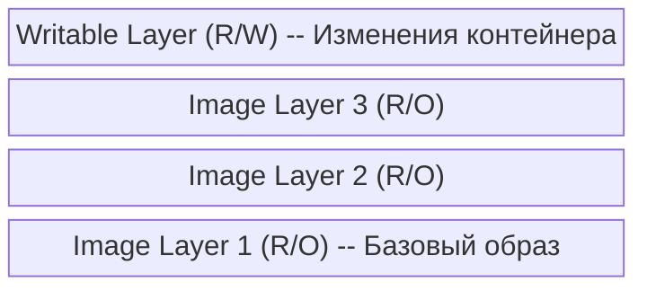
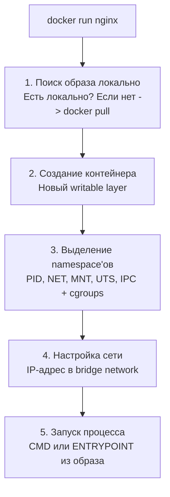
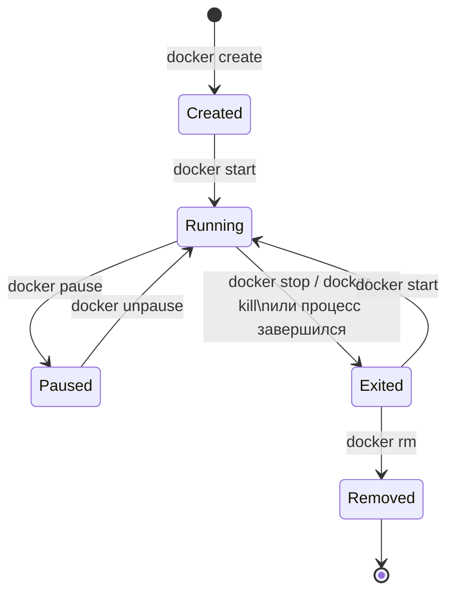

# Уровень 2: Контейнеры

## Что такое контейнер?

Контейнер — это **запущенный экземпляр образа**. Если образ — это рецепт, то контейнер — это приготовленное по нему блюдо. Один образ может породить сколько угодно контейнеров, и каждый из них будет работать изолированно.

Когда вы выполняете `docker run`, Docker:

1. Ищет образ локально (или скачивает из реестра)
2. Создаёт **writable layer** (слой записи) поверх слоёв образа
3. Настраивает **namespace'ы** (изоляция PID, сети, файловой системы)
4. Настраивает **cgroups** (ограничение ресурсов: CPU, RAM)
5. Запускает процесс, указанный в `CMD` или `ENTRYPOINT`



Контейнер **эфемерен** по умолчанию: при удалении все изменения в writable layer теряются. Для сохранения данных используются тома (volumes) — об этом в уровне 4.

---

## docker run

### Базовый синтаксис

```bash
docker run [ОПЦИИ] ОБРАЗ [КОМАНДА] [АРГУМЕНТЫ]
```

### Примеры

```bash
# Запуск и вывод в терминал (foreground)
docker run ubuntu echo "Hello from container!"

# Запуск с интерактивной оболочкой
docker run -it ubuntu bash

# Запуск в фоне (detached mode)
docker run -d nginx

# Запуск с именем и автоудалением
docker run --rm --name my-nginx nginx
```

### Что происходит при `docker run`?



---

## Флаги запуска

### Режимы работы

| Флаг | Описание | Пример |
|------|----------|--------|
| `-d` | Detached — запуск в фоне | `docker run -d nginx` |
| `-it` | Interactive + TTY — интерактивная оболочка | `docker run -it ubuntu bash` |
| `--rm` | Автоудаление после остановки | `docker run --rm alpine echo hi` |

### Идентификация

| Флаг | Описание | Пример |
|------|----------|--------|
| `--name` | Задать имя контейнера | `docker run --name web nginx` |
| `--hostname` | Задать hostname внутри контейнера | `docker run --hostname myhost alpine` |

### Сеть и порты

| Флаг | Описание | Пример |
|------|----------|--------|
| `-p` | Проброс портов host:container | `docker run -p 8080:80 nginx` |
| `--network` | Подключение к сети | `docker run --network mynet nginx` |
| `-P` | Проброс всех EXPOSE-портов на случайные | `docker run -P nginx` |

### Переменные окружения

| Флаг | Описание | Пример |
|------|----------|--------|
| `-e` | Установить переменную | `docker run -e DB_HOST=db myapp` |
| `--env-file` | Загрузить из файла | `docker run --env-file .env myapp` |

### Тома и данные

| Флаг | Описание | Пример |
|------|----------|--------|
| `-v` | Монтирование тома | `docker run -v data:/app/data nginx` |
| `--mount` | Расширенный синтаксис монтирования | `docker run --mount type=bind,src=./,dst=/app myapp` |

### Ограничение ресурсов

| Флаг | Описание | Пример |
|------|----------|--------|
| `--memory` | Лимит оперативной памяти | `docker run --memory=512m nginx` |
| `--cpus` | Лимит CPU | `docker run --cpus=1.5 nginx` |
| `--restart` | Политика перезапуска | `docker run --restart=unless-stopped nginx` |

### Комбинирование флагов

Типичная команда для production-подобного запуска:

```bash
docker run -d \
  --name web-server \
  --restart unless-stopped \
  -p 80:80 \
  -v nginx-conf:/etc/nginx/conf.d \
  -e NGINX_HOST=example.com \
  --memory=256m \
  --cpus=0.5 \
  nginx:1.25-alpine
```

---

## Жизненный цикл контейнера

Контейнер проходит через несколько состояний:



### Команды управления

```bash
# Просмотр запущенных контейнеров
docker ps

# Все контейнеры (включая остановленные)
docker ps -a

# Запуск остановленного контейнера
docker start <name|id>

# Остановка (SIGTERM → ожидание → SIGKILL)
docker stop <name|id>

# Немедленная остановка (SIGKILL)
docker kill <name|id>

# Перезапуск
docker restart <name|id>

# Пауза (замораживание процессов через cgroups)
docker pause <name|id>
docker unpause <name|id>

# Удаление остановленного контейнера
docker rm <name|id>

# Принудительное удаление (даже запущенного)
docker rm -f <name|id>

# Удаление всех остановленных контейнеров
docker container prune
```

### SIGTERM vs SIGKILL

При `docker stop`:
1. Docker отправляет **SIGTERM** главному процессу (PID 1)
2. Процесс получает возможность корректно завершиться (закрыть соединения, записать данные)
3. Если процесс не завершился за **10 секунд** (настраивается через `--time`), отправляется **SIGKILL**

```bash
# Остановка с таймаутом 30 секунд
docker stop --time=30 my-container

# Немедленный SIGKILL (без SIGTERM)
docker kill my-container
```

> **Важно:** Если ваше приложение в контейнере запускается через shell-скрипт, SIGTERM может не дойти до приложения. Используйте `exec` в entrypoint-скрипте:
> ```bash
> #!/bin/bash
> # Плохо: SIGTERM получит bash, а не приложение
> node server.js
>
> # Хорошо: SIGTERM получит node
> exec node server.js
> ```

---

## docker exec

`docker exec` позволяет выполнить команду **в уже запущенном контейнере**. Это главный инструмент для отладки.

```bash
# Выполнить одну команду
docker exec my-container ls /app

# Открыть интерактивную оболочку
docker exec -it my-container bash
# или, если bash нет (Alpine):
docker exec -it my-container sh

# Выполнить команду от другого пользователя
docker exec -u root my-container apt-get update

# Установить переменную окружения
docker exec -e DEBUG=1 my-container node script.js

# Выполнить в определённой рабочей директории
docker exec -w /app/src my-container ls
```

### Типичные сценарии отладки

```bash
# Посмотреть файлы приложения
docker exec my-app ls -la /app

# Проверить переменные окружения
docker exec my-app env

# Проверить сетевые настройки
docker exec my-app cat /etc/hosts

# Проверить доступность сервиса
docker exec my-app curl -s localhost:3000/health

# Подключиться к базе данных внутри контейнера
docker exec -it my-postgres psql -U postgres
```

---

## Просмотр логов

```bash
# Все логи контейнера
docker logs my-container

# Последние 100 строк
docker logs --tail 100 my-container

# Следить за логами в реальном времени
docker logs -f my-container

# Логи с отметками времени
docker logs -t my-container

# Логи за последний час
docker logs --since 1h my-container
```

---

## Полезные команды

```bash
# Подробная информация о контейнере (JSON)
docker inspect my-container

# Только IP-адрес
docker inspect -f '{{range.NetworkSettings.Networks}}{{.IPAddress}}{{end}}' my-container

# Использование ресурсов в реальном времени
docker stats

# Процессы внутри контейнера
docker top my-container

# Копирование файлов в/из контейнера
docker cp my-container:/app/logs ./logs
docker cp ./config.json my-container:/app/config.json

# Ожидание завершения контейнера
docker wait my-container
```

---

## Типичные ошибки новичков

### 1. Контейнер сразу останавливается

```bash
# ❌ Контейнер запустится и сразу выйдет
docker run -d ubuntu

# ✅ Нужен долгоживущий процесс
docker run -d ubuntu sleep infinity
docker run -d ubuntu tail -f /dev/null
```

Причина: контейнер живёт, пока работает его главный процесс (PID 1). Если `CMD` — это `bash` без `-it`, он завершается сразу.

### 2. Потеря данных после удаления

```bash
# ❌ Все данные потеряются при docker rm
docker run -d --name db postgres

# ✅ Используйте тома для persistence
docker run -d --name db -v pgdata:/var/lib/postgresql/data postgres
```

### 3. Забытые контейнеры занимают место

```bash
# Проверить остановленные контейнеры
docker ps -a --filter status=exited

# Очистить
docker container prune

# Или используйте --rm при запуске тестовых контейнеров
docker run --rm alpine echo "I clean up after myself"
```
