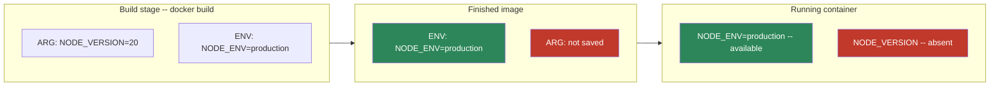
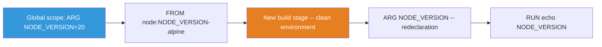
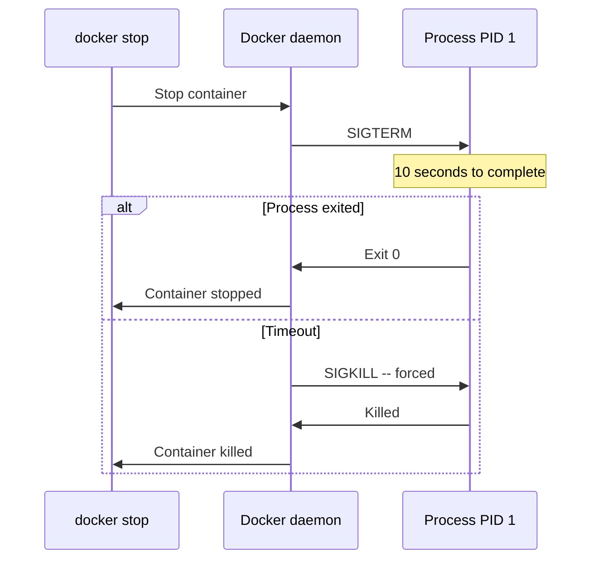
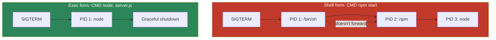
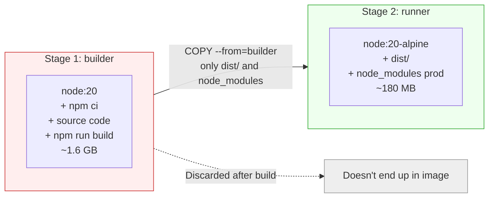
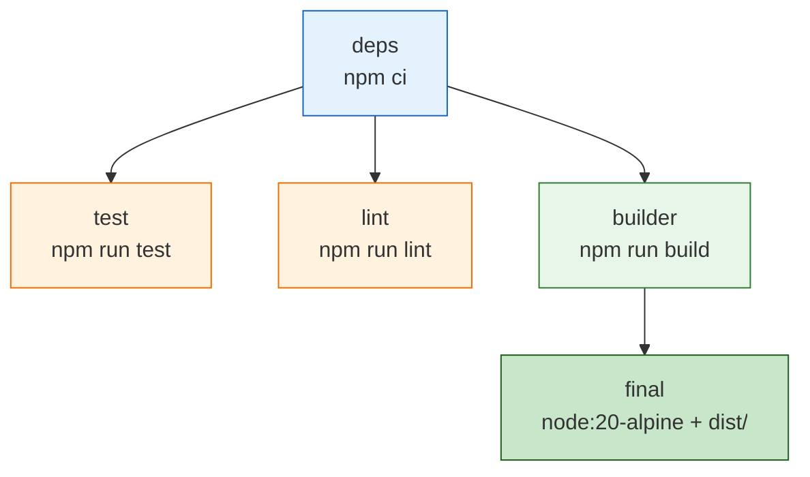

# Level 3: Dockerfile -- Instructions, Patterns, and Best Practices

## Introduction

Imagine you order furniture from IKEA. Along with the parts, you receive assembly instructions -- a step-by-step document where each step builds on the previous one. Skip a step or mix up the order -- and the wardrobe won't assemble. A Dockerfile is exactly the same instruction manual, but for building a Docker image. Each line is a step: take a base, copy files, install dependencies, configure launch.

In previous levels, we worked with ready-made images -- downloaded them from Docker Hub and ran containers. Now it's time to learn how to create **your own** images. This is a skill essential for real Docker work: every project, every service, every microservice is packaged into an image through a Dockerfile.

In this level, we will explore in detail:

1. **WORKDIR** -- how to set the working directory and why `RUN cd` doesn't work
2. **ENV and ARG** -- two ways to work with variables that beginners constantly confuse
3. **CMD and ENTRYPOINT** -- nuances of process launching, exec form vs shell form, signal handling
4. **COPY and ADD** -- copying files and pitfalls
5. **.dockerignore** -- protecting the build context
6. **Multi-stage builds** -- the main tool for production images
7. **Best practices** -- patterns that distinguish a professional Dockerfile from an amateur one

---

## 1. How Dockerfile Works: Layers and Cache

### Dockerfile Anatomy

Before diving into individual instructions, it's important to understand the overall mechanics. A Dockerfile is a text file where each instruction creates a **new layer** in the image. Docker executes instructions strictly top to bottom, and each layer "stacks" on top of the previous one -- like layers in a sandwich.

```dockerfile
# Base image -- first layer
FROM node:20-alpine

# Set working directory -- metadata layer
WORKDIR /app

# Copy dependency files -- data layer
COPY package*.json ./

# Install dependencies -- data layer
RUN npm ci

# Copy source code -- data layer
COPY . .

# Declare port -- metadata layer
EXPOSE 3000

# Launch command -- metadata layer
CMD ["node", "server.js"]
```

### Layer Caching System

Docker caches each layer. On rebuild, Docker checks: has anything changed at this step? If not -- take the layer from cache. If yes -- rebuild this layer **and all subsequent ones**.


In the diagram, green layers are taken from cache, red ones are rebuilt. If only the source code changed, the `COPY . .` layer is invalidated, and with it -- all subsequent layers. But the `RUN npm ci` layer remains cached because `package*.json` didn't change.

This is the key principle: **arrange instructions from rarely changing to frequently changing**. Dependencies change once a week, source code -- dozens of times a day. That's why `COPY package*.json` goes before `COPY . .`.

### Assembly Line Analogy

Think of a Dockerfile as a factory assembly line. Each station on the line performs one operation: the first station prepares the base, the second adds components, the third assembles, the fourth tests. If something changes at station three, station four must also rework. But stations one and two -- no, they already did their part and the result is saved.

---

## 2. WORKDIR -- Working Directory

### What It Is and Why

`WORKDIR` sets the working directory for all subsequent instructions: `RUN`, `CMD`, `ENTRYPOINT`, `COPY`, `ADD`. It's analogous to the `cd` command in a terminal, but with an important difference -- the effect persists between instructions.

```dockerfile
WORKDIR /app

# All relative paths are now from /app
COPY package.json ./        # Copies to /app/package.json
RUN npm install              # Runs in directory /app
COPY . .                     # Copies to /app/
```

### Automatic Directory Creation

If the directory doesn't exist, `WORKDIR` will create the entire chain automatically. No need to call `mkdir` first:

```dockerfile
# Will create /app/src/components, even if /app doesn't exist
WORKDIR /app/src/components
```

### Multiple WORKDIRs

You can call `WORKDIR` multiple times. Each subsequent call can be either absolute or relative:

```dockerfile
WORKDIR /app
# Current directory: /app

WORKDIR src
# Current directory: /app/src

WORKDIR ../config
# Current directory: /app/config
```

### Using Environment Variables

`WORKDIR` supports variables set via `ENV`:

```dockerfile
ENV APP_HOME=/application
WORKDIR $APP_HOME
# Working directory = /application
```

### Why You Can't Use RUN cd

This is one of the most common traps for beginners. Each `RUN` instruction launches in a **new shell process**. The state of the previous `RUN` doesn't carry over:

```dockerfile
# ❌ Bad: cd doesn't persist between instructions
RUN cd /app
RUN pwd             # Will output /, not /app!
RUN npm install     # Will run in /, not in /app!
```

```dockerfile
# ✅ Good: WORKDIR persists between instructions
WORKDIR /app
RUN pwd             # Will output /app
RUN npm install     # Will run in /app
```

If you need to run a command in a specific directory **within a single RUN instruction**, you can use `cd` via `&&`:

```dockerfile
# This works because everything is in one shell
RUN cd /app/migrations && npm run migrate
```

But for setting a permanent working directory, always use `WORKDIR`.

---

## 3. ENV -- Environment Variables

### What It Is and Why

`ENV` sets environment variables available **both during image build and when the container runs**. This is important to understand -- a variable set via `ENV` becomes part of the image and will be present in all containers created from this image.

```dockerfile
ENV NODE_ENV=production
ENV APP_PORT=3000
ENV DATABASE_URL=postgres://localhost:5432/mydb
```

### Syntax

There are two syntaxes -- modern and deprecated:

```dockerfile
# Modern syntax (recommended)
ENV NODE_ENV=production

# Deprecated syntax (works but not recommended)
ENV NODE_ENV production
```

Multiple variables can be defined in one instruction:

```dockerfile
ENV NODE_ENV=production \
    APP_PORT=3000 \
    LOG_LEVEL=warn
```

### ENV Scope

Variables set via `ENV` are available in three contexts:

1. **In subsequent Dockerfile instructions** -- in `RUN`, `CMD`, `ENTRYPOINT`, `COPY`, `ADD`:

```dockerfile
ENV APP_VERSION=2.0.0
RUN echo "Building version $APP_VERSION"
```

2. **Inside the running container** -- any process inside the container will see this variable:

```bash
docker run my-app env | grep APP_VERSION
# APP_VERSION=2.0.0
```

3. **Can be overridden at launch** via the `-e` flag:

```bash
docker run -e NODE_ENV=development my-app
# Inside the container NODE_ENV=development, not production
```

### ENV is Saved in the Image

Important nuance: `ENV` is **written to image metadata**. This means anyone who downloads your image will see the values of all `ENV`:

```bash
docker inspect my-app | jq '.[0].Config.Env'
# ["NODE_ENV=production", "APP_PORT=3000", ...]
```

Never store secrets in `ENV` -- passwords, tokens, API keys. For secrets, use Docker secrets or variables at launch (`docker run -e`).

---

## 4. ARG -- Build Arguments

### What It Is and Why

`ARG` defines variables available **only during the build** of the image. After the build completes, they disappear -- they're not present in the running container.

Analogy: `ARG` is like parameters you give the factory when placing an order. The factory uses them during production, but they're not visible in the finished product. `ENV` is like a label on the product that stays forever.

```dockerfile
# Define argument with default value
ARG NODE_VERSION=20
ARG APP_ENV=production

# Use in instructions
FROM node:${NODE_VERSION}-alpine
```

### Passing Arguments During Build

`ARG` values can be overridden when calling `docker build`:

```bash
docker build --build-arg NODE_VERSION=18 --build-arg APP_ENV=staging .
```

If an argument is not passed and there's no default value, the variable will be an empty string.

### Key Difference Between ENV and ARG

Beginners constantly confuse `ENV` and `ARG`. Here's a table that puts everything in place:

| Characteristic | ENV | ARG |
|---|---|---|
| Available during `docker build` | Yes | Yes |
| Available in the container | Yes | No |
| Override at launch | `docker run -e` | Cannot |
| Override during build | Cannot | `--build-arg` |
| Saved in the image | Yes | No |
| Visible via `docker inspect` | Yes | No |



### Pattern: Pass ARG into ENV

Often you need to pass a value at build time but make it available in the container too. For this, you use a combination of `ARG` + `ENV`:

```dockerfile
ARG APP_VERSION=1.0.0
ENV APP_VERSION=${APP_VERSION}

# Now APP_VERSION is available both at build time and in the container
```

```bash
docker build --build-arg APP_VERSION=2.5.0 -t my-app .
docker run my-app env | grep APP_VERSION
# APP_VERSION=2.5.0
```

### ARG Scope Relative to FROM

This is a subtle point that even experienced developers stumble on. `ARG` declared **before** `FROM` is available **only in the `FROM` instruction itself**:

```dockerfile
# This ARG is available ONLY in the FROM instruction
ARG NODE_VERSION=20
FROM node:${NODE_VERSION}-alpine

# NODE_VERSION is no longer defined here!
RUN echo $NODE_VERSION   # Empty string
```

To use an argument after `FROM`, you need to redeclare it:

```dockerfile
ARG NODE_VERSION=20
FROM node:${NODE_VERSION}-alpine

# Redeclare ARG -- value is inherited
ARG NODE_VERSION
RUN echo "Node version: $NODE_VERSION"   # Node version: 20
```

Why is it structured this way? Each `FROM` starts a **new build stage** with a clean environment. Arguments before `FROM` exist in a special "global" space, available only for selecting the base image.



---

## 5. CMD -- Default Command

### What It Is and Why

`CMD` determines the command that runs when the container starts. The key word here is **default**. The user can easily replace `CMD` by passing a different command at `docker run`.

Analogy: `CMD` is like the program that opens when you turn on a computer. If you configured the browser to auto-start -- it will open. But you can always close it and open something else.

### Three Forms of CMD

**1. Exec form -- Recommended**

```dockerfile
CMD ["node", "server.js"]
```

The command is passed as a JSON array of strings. Docker starts the process **directly**, without a shell wrapper. The process gets PID 1 -- this is important for correct signal handling.

**2. Shell form**

```dockerfile
CMD node server.js
```

Docker wraps the command in `/bin/sh -c "node server.js"`. The shell gets PID 1, and `node` becomes a child process. This has critical consequences for signal handling, which we'll discuss below.

**3. Parameters for ENTRYPOINT form**

```dockerfile
ENTRYPOINT ["python"]
CMD ["app.py"]
# Equivalent: python app.py
```

Here `CMD` passes arguments to `ENTRYPOINT`. If the user specifies their own arguments at `docker run`, they replace `CMD`, but `ENTRYPOINT` remains.

### Overriding CMD

```bash
# Launch with CMD from Dockerfile
docker run my-image              # Will run: node server.js

# Override CMD
docker run my-image node test.js # Will run: node test.js
docker run my-image sh           # Will run: sh
docker run my-image ls -la       # Will run: ls -la
```

There can only be one `CMD` in a Dockerfile. If there are multiple, only the **last** one executes.

---

## 6. ENTRYPOINT -- Entry Point

### What It Is and Why

`ENTRYPOINT` determines the executable file that **always** runs when the container starts. Unlike `CMD`, it cannot be replaced by simply adding arguments at `docker run`.

Analogy: if `CMD` is the default program, then `ENTRYPOINT` is the operating system. You can change programs, but the OS stays in place.

```dockerfile
# Exec form (recommended)
ENTRYPOINT ["python", "app.py"]

# Shell form (not recommended for production)
ENTRYPOINT python app.py
```

### Overriding ENTRYPOINT

The only way to replace `ENTRYPOINT` at launch is the `--entrypoint` flag:

```bash
docker run --entrypoint sh my-image
docker run --entrypoint /bin/bash my-image
```

---

## 7. CMD + ENTRYPOINT -- The Powerful Combination

### How They Work Together

The most flexible pattern -- use `ENTRYPOINT` for a fixed executable and `CMD` for default arguments:

```dockerfile
ENTRYPOINT ["python"]
CMD ["app.py"]
```

```bash
docker run my-image              # python app.py
docker run my-image test.py      # python test.py
docker run my-image -c "print(1)"  # python -c "print(1)"
```

Arguments from `docker run` **replace** `CMD` but **append** to `ENTRYPOINT`.

### Comparison Table

| Scenario | Only CMD | Only ENTRYPOINT | ENTRYPOINT + CMD |
|---|---|---|---|
| `docker run img` | Executes CMD | Executes ENTRYPOINT | ENTRYPOINT + CMD |
| `docker run img args` | args replace CMD | ENTRYPOINT + args | ENTRYPOINT + args |
| `docker run --entrypoint x img` | x replaces CMD | x replaces ENTRYPOINT | x replaces ENTRYPOINT |

### Pattern: Wrapper Script

One of the most useful patterns in production is using an entrypoint script. This script performs preparatory actions, then passes control to the main command:

```dockerfile
COPY entrypoint.sh /entrypoint.sh
RUN chmod +x /entrypoint.sh
ENTRYPOINT ["/entrypoint.sh"]
CMD ["start"]
```

```bash
#!/bin/sh
# entrypoint.sh

echo "Waiting for database..."
until pg_isready -h $DB_HOST; do
  sleep 1
done

echo "Running migrations..."
npm run migrate

# exec "$@" replaces the current process with the CMD command
# This is critically important -- the CMD process gets PID 1
exec "$@"
```

```bash
docker run my-app           # Migrations, then start
docker run my-app test      # Migrations, then test
docker run my-app seed      # Migrations, then seed
```

The `exec "$@"` construct at the end of the script is key. It replaces the shell process with the process from `CMD`. Without `exec`, the CMD process remains a child, and the shell remains PID 1. This leads to signal handling problems.

### Exec Form vs Shell Form: Signal Handling

This is one of the most important topics in Docker and one of the main causes of production problems. Let's break it down in detail.

When you run `docker stop`, Docker sends the container a `SIGTERM` signal. The container is given 10 seconds (by default) for graceful shutdown. If the process doesn't exit within that time, Docker sends `SIGKILL` -- forced termination.



The problem arises when using the shell form:

```dockerfile
# Shell form
CMD npm start
# Docker runs: /bin/sh -c "npm start"
# PID 1 = /bin/sh
# PID 2 = npm
# PID 3 = node server.js
```

SIGTERM goes to the process with PID 1 -- that is, `/bin/sh`. Shell by default does **not forward** signals to child processes. As a result, `node` doesn't receive SIGTERM, can't perform graceful shutdown, and after 10 seconds the container is killed via SIGKILL.

```dockerfile
# Exec form
CMD ["node", "server.js"]
# Docker runs: node server.js
# PID 1 = node server.js
```

SIGTERM goes directly to `node`, which can correctly close database connections, finish writing logs, and shut down cleanly.



The takeaway is simple: **always use exec form for CMD and ENTRYPOINT in production**.

---

## 8. COPY -- Copying Files

### What It Is and Why

`COPY` copies files and directories from the **build context** into the image's file system. The build context is the directory you specify in the `docker build` command:

```bash
docker build -t my-app .
#                       ^ dot -- current directory = build context
```

When running `docker build`, Docker packages the entire build context and sends it to the Docker daemon. Therefore, the context size directly affects build speed.

### Basic Syntax

```dockerfile
# Copy a single file
COPY package.json /app/

# Copy several files
COPY package.json package-lock.json /app/

# Copy using glob patterns
COPY package*.json /app/

# Copy a directory
COPY src/ /app/src/

# Copy everything from context
COPY . /app/
```

### Build Context Boundaries

COPY works **only** with files inside the build context. Trying to copy a file outside the context will cause an error:

```dockerfile
# ❌ Error: file outside context
COPY ../config.json /app/
# COPY failed: forbidden path outside the build context
```

If you need a file from a parent directory, change the build context:

```bash
# Context is the parent directory
docker build -f app/Dockerfile -t my-app ..
```

### Owner and Permissions

By default, all files are copied with root ownership. This can be changed via the `--chown` flag:

```dockerfile
# Set owner on copy
COPY --chown=node:node package.json /app/
COPY --chown=1000:1000 . /app/
```

### Correct Order for Caching

The order of `COPY` instructions critically affects caching efficiency. The rule is simple: copy what changes rarely first, then what changes often.

```dockerfile
# ✅ Correct: dependencies first, then code
COPY package.json package-lock.json ./
RUN npm ci
COPY . .
```

Why does this work? If you changed only the source code but didn't touch `package.json`, then:
- The `COPY package.json package-lock.json ./` layer is taken from cache
- The `RUN npm ci` layer is taken from cache (dependencies didn't change)
- Only the `COPY . .` layer rebuilds

Without this optimization, every code change would cause reinstallation of all dependencies -- and that's 1-5 minutes:

```dockerfile
# ❌ Bad: on any code change, dependencies reinstall
COPY . .
RUN npm ci
```

### COPY and Symbolic Links

`COPY` by default does **not follow** symbolic links. If the build context has a symlink to a file outside the context, that file won't be copied. The link itself will be copied, which will likely be "broken" inside the image.

---

## 9. ADD -- Extended Copying

### Differences from COPY

`ADD` does the same thing as `COPY`, but with two additional features:

**1. Automatic tar archive extraction:**

```dockerfile
# ADD unpacks the archive automatically
ADD app.tar.gz /app/
# Result: archive contents in /app/

# COPY just copies the file
COPY app.tar.gz /app/
# Result: file app.tar.gz in /app/
```

Supported formats: `.tar`, `.tar.gz`, `.tgz`, `.tar.bz2`, `.tar.xz`.

**2. Downloading files from URL:**

```dockerfile
ADD https://example.com/config.json /app/config.json
```

### When to Use ADD vs COPY

Docker's official recommendation -- **use COPY by default**. `ADD` is only needed when you really need automatic tar archive extraction.

| Situation | Recommendation |
|---|---|
| Copying local files | `COPY` |
| Copying with owner change | `COPY --chown` |
| Extracting a local tar archive | `ADD` |
| Downloading from URL | `RUN curl` + `RUN tar` |

Why not use `ADD` for downloading? Because `ADD` from URL does **not unpack** archives (extraction only works for local files), doesn't support authentication, and creates a layer that can't be cleaned up afterward:

```dockerfile
# ❌ ADD will download but NOT unpack
ADD https://example.com/app.tar.gz /app/
# The container will have the file app.tar.gz, not its contents

# ✅ Explicit and predictable approach
RUN curl -fsSL https://example.com/app.tar.gz | tar -xz -C /app/
```

Another problem with `ADD` -- **unobviousness**. Someone reading the Dockerfile can't immediately tell whether `ADD` will just copy a file or extract it. `COPY` always does one thing -- copies. Predictability is more important than brevity.

---

## 10. .dockerignore -- Excluding Files from Context

### Why .dockerignore Is Needed

When you run `docker build .`, Docker packages **everything** in the specified directory into a tar archive and sends it to the Docker daemon. If the directory contains `node_modules` at 500 MB, `.git` at 200 MB, logs at 100 MB -- all of this gets into the context, even if you don't use these files in the Dockerfile.

`.dockerignore` is a filter that cuts out unnecessary files **before** sending the context. The syntax is similar to `.gitignore`.

Three reasons to always create a `.dockerignore`:

**1. Build speed:**

```bash
# Without .dockerignore
Sending build context to Docker daemon  500MB  # 30 seconds of waiting

# With .dockerignore
Sending build context to Docker daemon  2MB    # Instant
```

**2. Security:**

Without `.dockerignore`, the context (and potentially the image via `COPY . .`) includes:
- `.env` with passwords and tokens
- `*.pem` with private keys
- `credentials/` with secrets
- `.git/` with commit history, which may contain previously removed secrets

**3. Cache stability:**

If `.git/` gets into the context, every commit invalidates the `COPY . .` layer cache, even if the code itself didn't change.

### Syntax

```
# Comments
node_modules
.git
.env
.env.*
*.log

# Wildcard patterns
**/*.test.js
**/*.spec.ts
**/temp

# Exception from exception -- ! brings a file back
*.md
!README.md

# Specific paths
docs/
coverage/
.vscode/
.idea/
```

### Typical .dockerignore for Node.js

```
node_modules
npm-debug.log*
.git
.gitignore
.dockerignore
Dockerfile
docker-compose*.yml
.env
.env.*
*.md
!README.md
coverage
.nyc_output
.vscode
.idea
*.swp
*.swo
dist
build
```

Note: `Dockerfile` and `docker-compose*.yml` are also excluded. Docker needs them for building, but they're not needed **inside** the image.

---

## 11. Multi-stage Builds -- Multi-stage Building

### The Problem of Bloated Images

Consider a typical Dockerfile for a Node.js application:

```dockerfile
FROM node:20
WORKDIR /app
COPY . .
RUN npm ci
RUN npm run build
CMD ["node", "dist/server.js"]
```

What ends up in the final image?
- Base image `node:20` -- ~900 MB (full Debian OS + Node.js + npm + yarn)
- `node_modules` -- 200-500 MB (including devDependencies: TypeScript, eslint, jest...)
- TypeScript source code -- not needed in production
- Compiled JavaScript in `dist/` -- the only thing actually needed

Total: the image weighs ~1.5 GB, of which only ~50 MB is really needed.

### Solution: Separate Build and Run

Multi-stage builds allow using **multiple FROM instructions** in a single Dockerfile. Each `FROM` starts a new stage with a clean environment. Files from intermediate stages can be copied to the final stage, while the intermediate stages themselves don't end up in the final image.

```dockerfile
# ==========================================
# Stage 1: Build
# ==========================================
FROM node:20 AS builder
WORKDIR /app

COPY package*.json ./
RUN npm ci

COPY . .
RUN npm run build

# ==========================================
# Stage 2: Production
# ==========================================
FROM node:20-alpine
WORKDIR /app

# Copy only what's needed for running
COPY --from=builder /app/dist ./dist
COPY --from=builder /app/node_modules ./node_modules
COPY --from=builder /app/package.json ./

CMD ["node", "dist/server.js"]

# Result: ~180 MB instead of 1.5 GB
```

The `COPY --from=builder` instruction copies files from the `builder` stage. Everything else from the first stage -- TypeScript compiler, devDependencies, source `.ts` files -- is discarded.



### Advanced Pattern: Multiple Parallel Stages

Multi-stage doesn't have to be just two stages. Stages can branch, and BuildKit will build independent branches **in parallel**:

```dockerfile
# Stage 1: shared dependencies
FROM node:20-alpine AS deps
WORKDIR /app
COPY package*.json ./
RUN npm ci

# Stage 2a: tests (branch)
FROM deps AS test
COPY . .
RUN npm run test

# Stage 2b: linting (branch, parallel with tests)
FROM deps AS lint
COPY . .
RUN npm run lint

# Stage 2c: build (branch, parallel with tests and linting)
FROM deps AS builder
COPY . .
RUN npm run build
RUN npm prune --production

# Stage 3: final image
FROM node:20-alpine
WORKDIR /app
COPY --from=builder /app/dist ./dist
COPY --from=builder /app/node_modules ./node_modules
CMD ["node", "dist/server.js"]
```

You can build only the stage you need:

```bash
# Run only tests
docker build --target test -t myapp-test .

# Run only linter
docker build --target lint -t myapp-lint .

# Full build (default -- last stage)
docker build -t myapp .
```



### COPY --from with External Images

`COPY --from` can copy not only from previous stages but also from any public images:

```dockerfile
# Copy nginx config from the official image
COPY --from=nginx:alpine /etc/nginx/nginx.conf /etc/nginx/nginx.conf

# Copy a utility binary
COPY --from=aquasec/trivy:latest /usr/local/bin/trivy /usr/local/bin/trivy
```

This is convenient when you need one utility from another image without installing the entire package.

---

## 12. BuildKit Cache Mounts

BuildKit provides `--mount=type=cache` -- a mechanism for caching package manager directories **between builds**. Unlike regular layer caching, cache mounts are stored separately and don't end up in the final image.

Think of it as a locker on a construction site: every day the builder doesn't bring all tools from home, but leaves them in the locker on site. The next day, the tools are already there.

```dockerfile
# syntax=docker/dockerfile:1

# Node.js: npm cache between builds
FROM node:20-alpine
WORKDIR /app
COPY package*.json ./
RUN --mount=type=cache,target=/root/.npm \
    npm ci
COPY . .
RUN npm run build
```

```dockerfile
# syntax=docker/dockerfile:1

# Python: pip cache between builds
FROM python:3.12-slim
WORKDIR /app
COPY requirements.txt .
RUN --mount=type=cache,target=/root/.cache/pip \
    pip install -r requirements.txt
COPY . .
```

```dockerfile
# syntax=docker/dockerfile:1

# Go: module cache and compilation cache
FROM golang:1.22-alpine
WORKDIR /app
COPY go.mod go.sum ./
RUN --mount=type=cache,target=/go/pkg/mod \
    go mod download
COPY . .
RUN --mount=type=cache,target=/root/.cache/go-build \
    go build -o server .
```

Note the `# syntax=docker/dockerfile:1` line at the beginning of the file -- it activates the extended Dockerfile syntax needed for cache mounts.

---

## 13. Best Practices Checklist

1. **Specific base image tags.** Use `node:20-alpine`, not `node` or `node:latest`. This guarantees build reproducibility.

2. **Minimal base images.** Prefer `-alpine` or `-slim` variants. Fewer files -- fewer vulnerabilities, faster downloads.

3. **Layer order optimization.** Arrange instructions from rarely changing to frequently changing: `FROM` -> `RUN apt install` -> `COPY package.json` -> `RUN npm ci` -> `COPY . .`

4. **Combine RUN commands.** Related commands (install + cache cleanup) should be in one `RUN` via `&&`.

5. **Mandatory .dockerignore.** Exclude `node_modules`, `.git`, `.env`, logs, and other unnecessary files.

6. **One process per container.** Don't run nginx + Node.js + Redis in one container. Each service -- separate image and container.

7. **Clean caches.** Delete package manager caches (`rm -rf /var/lib/apt/lists/*`) in the same `RUN` where you install packages.

8. **Unprivileged user.** Always add `USER` and don't run the application as root.

9. **Digest pinning in CI/CD.** For maximum reproducibility, use `FROM image@sha256:...` instead of tags.

10. **Use multi-stage builds.** Separate the build environment from the production environment. The final image should contain only what's needed to run.

---

## Level Summary

A Dockerfile is a step-by-step instruction manual for building a Docker image. Each instruction creates a new layer, and Docker caches every layer for faster rebuilds.

Key instructions: `FROM` (base image), `WORKDIR` (working directory), `COPY`/`ADD` (file copying), `RUN` (execute commands), `ENV`/`ARG` (variables), `EXPOSE` (declare ports), `CMD`/`ENTRYPOINT` (launch command).

Always use exec form (`["cmd", "arg"]`) for CMD and ENTRYPOINT to ensure correct signal handling. Place rarely changing instructions at the top and frequently changing ones at the bottom for efficient caching.

Multi-stage builds are the most powerful optimization tool -- they let you separate the build environment (compilers, devDependencies) from the production environment (only the compiled result).
