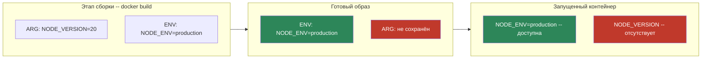
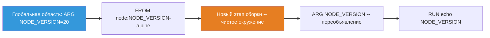
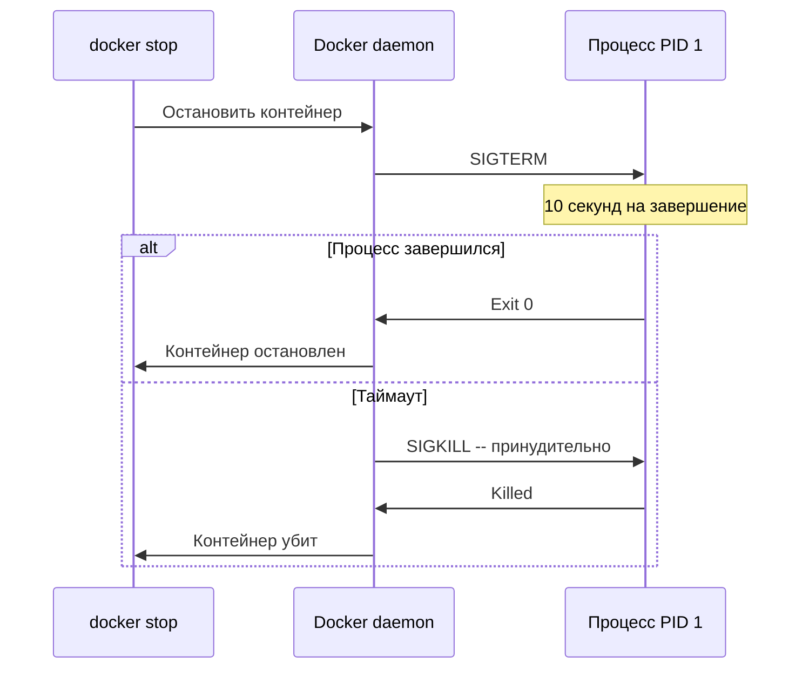
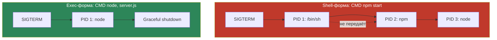
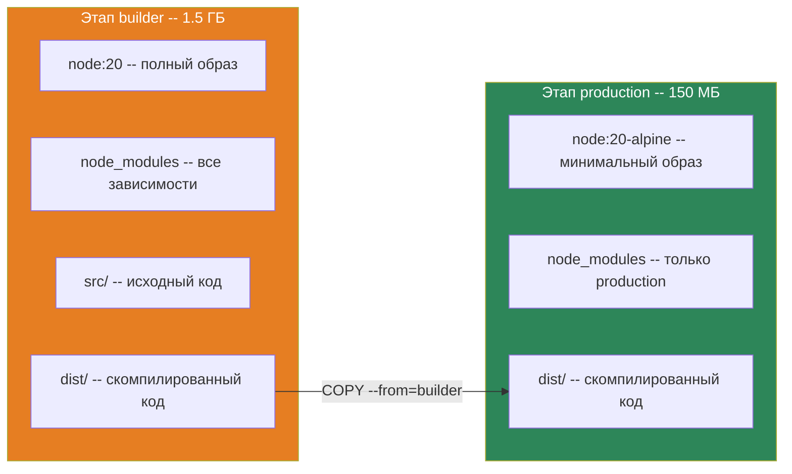

# Уровень 3: Dockerfile -- инструкции, паттерны и лучшие практики

## Введение

Представьте, что вы заказываете мебель из IKEA. Вместе с деталями вы получаете инструкцию по сборке -- пошаговый документ, где каждый шаг опирается на предыдущий. Пропустите шаг или перепутаете порядок -- и шкаф не соберётся. Dockerfile -- это точно такая же инструкция, только для сборки Docker-образа. Каждая строка -- это шаг: взять базу, скопировать файлы, установить зависимости, настроить запуск.

На предыдущих уровнях мы работали с готовыми образами -- скачивали их из Docker Hub и запускали контейнеры. Теперь пришло время научиться создавать **собственные** образы. Это навык, без которого невозможна реальная работа с Docker: каждый проект, каждый сервис, каждый микросервис упаковывается в образ через Dockerfile.

На этом уровне мы подробно разберём:

1. **WORKDIR** -- как задавать рабочую директорию и почему `RUN cd` не работает
2. **ENV и ARG** -- два способа работы с переменными, которые новички постоянно путают
3. **CMD и ENTRYPOINT** -- тонкости запуска процессов, exec-форма vs shell-форма, обработка сигналов
4. **COPY и ADD** -- копирование файлов и подводные камни
5. **.dockerignore** -- защита контекста сборки
6. **Multi-stage builds** -- главный инструмент для production-образов
7. **Best practices** -- паттерны, которые отличают профессиональный Dockerfile от любительского

---

## 1. Как устроен Dockerfile: слои и кэш

### Анатомия Dockerfile

Прежде чем погружаться в отдельные инструкции, важно понять общую механику. Dockerfile -- это текстовый файл, в котором каждая инструкция создаёт **новый слой** в образе. Docker выполняет инструкции строго сверху вниз, и каждый слой "ложится" поверх предыдущего -- как слои в бутерброде.

```dockerfile
# Базовый образ -- первый слой
FROM node:20-alpine

# Установка рабочей директории -- слой с метаданными
WORKDIR /app

# Копирование файлов зависимостей -- слой с данными
COPY package*.json ./

# Установка зависимостей -- слой с данными
RUN npm ci

# Копирование исходного кода -- слой с данными
COPY . .

# Объявление порта -- слой с метаданными
EXPOSE 3000

# Команда запуска -- слой с метаданными
CMD ["node", "server.js"]
```

### Система кэширования слоёв

Docker кэширует каждый слой. При повторной сборке Docker проверяет: изменилось ли что-то на этом шаге? Если нет -- берёт слой из кэша. Если да -- пересобирает этот слой **и все последующие**.


На диаграмме зелёные слои взяты из кэша, красные -- пересобраны. Если изменился только исходный код, слой `COPY . .` инвалидируется, а за ним -- все последующие. Но слой `RUN npm ci` остаётся в кэше, потому что `package*.json` не изменились.

Это ключевой принцип: **располагайте инструкции от редко меняющихся к часто меняющимся**. Зависимости меняются раз в неделю, исходный код -- десятки раз в день. Поэтому `COPY package*.json` идёт перед `COPY . .`.

### Аналогия с конвейером

Подумайте о Dockerfile как о конвейере на заводе. Каждая станция конвейера выполняет одну операцию: первая станция готовит основу, вторая добавляет компоненты, третья собирает, четвёртая тестирует. Если на третьей станции что-то изменилось, четвёртая тоже должна заработать заново. Но первая и вторая -- нет, они уже сделали свою часть и результат сохранился.

---

## 2. WORKDIR -- рабочая директория

### Что это и зачем

`WORKDIR` устанавливает рабочую директорию для всех последующих инструкций: `RUN`, `CMD`, `ENTRYPOINT`, `COPY`, `ADD`. Это аналог команды `cd` в терминале, но с важным отличием -- эффект сохраняется между инструкциями.

```dockerfile
WORKDIR /app

# Все относительные пути теперь от /app
COPY package.json ./        # Копируется в /app/package.json
RUN npm install              # Выполняется в директории /app
COPY . .                     # Копируется в /app/
```

### Автоматическое создание директории

Если директория не существует, `WORKDIR` создаст всю цепочку автоматически. Не нужно предварительно вызывать `mkdir`:

```dockerfile
# Создаст /app/src/components, даже если /app не существует
WORKDIR /app/src/components
```

### Множественные WORKDIR

Вы можете вызывать `WORKDIR` несколько раз. Каждый последующий вызов может быть как абсолютным, так и относительным:

```dockerfile
WORKDIR /app
# Текущая директория: /app

WORKDIR src
# Текущая директория: /app/src

WORKDIR ../config
# Текущая директория: /app/config
```

### Использование переменных окружения

`WORKDIR` поддерживает переменные, заданные через `ENV`:

```dockerfile
ENV APP_HOME=/application
WORKDIR $APP_HOME
# Рабочая директория = /application
```

### Почему нельзя использовать RUN cd

Это одна из самых частых ловушек для новичков. Каждая инструкция `RUN` запускается в **новом shell-процессе**. Состояние предыдущего `RUN` не переносится:

```dockerfile
# ❌ Плохо: cd не сохраняется между инструкциями
RUN cd /app
RUN pwd             # Выведет /, а не /app!
RUN npm install     # Выполнится в /, а не в /app!
```

```dockerfile
# ✅ Хорошо: WORKDIR сохраняется между инструкциями
WORKDIR /app
RUN pwd             # Выведет /app
RUN npm install     # Выполнится в /app
```

Если вам нужно выполнить команду в определённой директории **внутри одной инструкции RUN**, можно использовать `cd` через `&&`:

```dockerfile
# Это работает, потому что всё в одном shell
RUN cd /app/migrations && npm run migrate
```

Но для установки постоянной рабочей директории всегда используйте `WORKDIR`.

---

## 3. ENV -- переменные окружения

### Что это и зачем

`ENV` устанавливает переменные окружения, которые доступны **и при сборке образа, и при запуске контейнера**. Это аналог `export` в bash -- переменная становится частью окружения процесса.

```dockerfile
ENV NODE_ENV=production
ENV APP_PORT=3000
ENV DATABASE_URL=postgres://localhost:5432/mydb
```

### Синтаксис

Существует два синтаксиса -- современный и устаревший:

```dockerfile
# Современный синтаксис (рекомендуется)
ENV NODE_ENV=production

# Устаревший синтаксис (работает, но не рекомендуется)
ENV NODE_ENV production
```

Несколько переменных можно определить в одной инструкции:

```dockerfile
ENV NODE_ENV=production \
    APP_PORT=3000 \
    LOG_LEVEL=warn
```

### Область видимости ENV

Переменные, заданные через `ENV`, доступны в трёх контекстах:

1. **В последующих инструкциях Dockerfile** -- в `RUN`, `CMD`, `ENTRYPOINT`, `COPY`, `ADD`:

```dockerfile
ENV APP_VERSION=2.0.0
RUN echo "Building version $APP_VERSION"
```

2. **Внутри запущенного контейнера** -- любой процесс внутри контейнера увидит эту переменную:

```bash
docker run my-app env | grep APP_VERSION
# APP_VERSION=2.0.0
```

3. **Можно переопределить при запуске** через флаг `-e`:

```bash
docker run -e NODE_ENV=development my-app
# Внутри контейнера NODE_ENV=development, а не production
```

### ENV сохраняется в образе

Важный нюанс: `ENV` **записывается в метаданные образа**. Это означает, что любой, кто скачает ваш образ, увидит значения всех `ENV`:

```bash
docker inspect my-app | jq '.[0].Config.Env'
# ["NODE_ENV=production", "APP_PORT=3000", ...]
```

Никогда не храните в `ENV` секреты -- пароли, токены, ключи API. Для секретов используйте Docker secrets или переменные при запуске (`docker run -e`).

---

## 4. ARG -- аргументы сборки

### Что это и зачем

`ARG` определяет переменные, которые доступны **только во время сборки** образа. После завершения сборки они исчезают -- в запущенном контейнере их нет.

Аналогия: `ARG` -- это параметры, которые вы передаёте на завод при размещении заказа. Завод использует их при производстве, но в готовом изделии их не видно. `ENV` -- это наклейка на изделии, которая остаётся навсегда.

```dockerfile
# Определяем аргумент с значением по умолчанию
ARG NODE_VERSION=20
ARG APP_ENV=production

# Используем в инструкциях
FROM node:${NODE_VERSION}-alpine
```

### Передача аргументов при сборке

Значения `ARG` можно переопределить при вызове `docker build`:

```bash
docker build --build-arg NODE_VERSION=18 --build-arg APP_ENV=staging .
```

Если аргумент не передан и нет значения по умолчанию, переменная будет пустой строкой.

### Ключевое отличие ENV от ARG

Новички постоянно путают `ENV` и `ARG`. Вот таблица, которая расставляет всё по местам:

| Характеристика | ENV | ARG |
|---|---|---|
| Доступность при сборке | Да | Да |
| Доступность в контейнере | Да | Нет |
| Переопределение при запуске | `docker run -e` | Нельзя |
| Переопределение при сборке | Нельзя | `--build-arg` |
| Сохраняется в образе | Да | Нет |
| Виден через `docker inspect` | Да | Нет |



### Паттерн: пробросить ARG в ENV

Часто нужно передать значение при сборке, но сделать его доступным и в контейнере. Для этого используется комбинация `ARG` + `ENV`:

```dockerfile
ARG APP_VERSION=1.0.0
ENV APP_VERSION=${APP_VERSION}

# Теперь APP_VERSION доступна и при сборке, и в контейнере
```

```bash
docker build --build-arg APP_VERSION=2.5.0 -t my-app .
docker run my-app env | grep APP_VERSION
# APP_VERSION=2.5.0
```

### Область видимости ARG относительно FROM

Это тонкий момент, на котором спотыкаются даже опытные разработчики. `ARG`, объявленный **до** `FROM`, доступен **только в самой инструкции `FROM`**:

```dockerfile
# Этот ARG доступен ТОЛЬКО в инструкции FROM
ARG NODE_VERSION=20
FROM node:${NODE_VERSION}-alpine

# Здесь NODE_VERSION уже не определён!
RUN echo $NODE_VERSION   # Пустая строка
```

Чтобы использовать аргумент после `FROM`, его нужно объявить заново:

```dockerfile
ARG NODE_VERSION=20
FROM node:${NODE_VERSION}-alpine

# Переобъявляем ARG -- значение наследуется
ARG NODE_VERSION
RUN echo "Node version: $NODE_VERSION"   # Node version: 20
```

Почему так устроено? Каждый `FROM` начинает **новый этап сборки** с чистым окружением. Аргументы до `FROM` существуют в особом "глобальном" пространстве, доступном только для выбора базового образа.



---

## 5. CMD -- команда по умолчанию

### Что это и зачем

`CMD` определяет команду, которая выполняется при запуске контейнера. Ключевое слово здесь -- **по умолчанию**. Пользователь может легко заменить `CMD`, передав другую команду при `docker run`.

Аналогия: `CMD` -- это программа, которая открывается при включении компьютера. Если вы настроили автозапуск браузера -- он откроется. Но вы всегда можете закрыть его и открыть что-то другое.

### Три формы CMD

**1. Exec-форма -- рекомендуемая**

```dockerfile
CMD ["node", "server.js"]
```

Команда передаётся как JSON-массив строк. Docker запускает процесс **напрямую**, без оболочки shell. Процесс получает PID 1 -- это важно для корректной обработки сигналов.

**2. Shell-форма**

```dockerfile
CMD node server.js
```

Docker оборачивает команду в `/bin/sh -c "node server.js"`. Shell получает PID 1, а `node` становится дочерним процессом. Это имеет критические последствия для обработки сигналов, о которых мы поговорим ниже.

**3. Форма параметров для ENTRYPOINT**

```dockerfile
ENTRYPOINT ["python"]
CMD ["app.py"]
# Эквивалент: python app.py
```

Здесь `CMD` передаёт аргументы в `ENTRYPOINT`. Если пользователь укажет свои аргументы при `docker run`, они заменят `CMD`, но `ENTRYPOINT` останется.

### Переопределение CMD

```bash
# Запуск с CMD из Dockerfile
docker run my-image              # Запустит: node server.js

# Переопределение CMD
docker run my-image node test.js # Запустит: node test.js
docker run my-image sh           # Запустит: sh
docker run my-image ls -la       # Запустит: ls -la
```

В Dockerfile может быть только один `CMD`. Если указано несколько, выполнится **последний**.

---

## 6. ENTRYPOINT -- точка входа

### Что это и зачем

`ENTRYPOINT` определяет исполняемый файл, который **всегда** запускается при старте контейнера. В отличие от `CMD`, его нельзя заменить простым добавлением аргументов при `docker run`.

Аналогия: если `CMD` -- это программа по умолчанию, то `ENTRYPOINT` -- это операционная система. Вы можете менять программы, но ОС остаётся на месте.

```dockerfile
# Exec-форма (рекомендуется)
ENTRYPOINT ["python", "app.py"]

# Shell-форма (не рекомендуется для production)
ENTRYPOINT python app.py
```

### Переопределение ENTRYPOINT

Единственный способ заменить `ENTRYPOINT` при запуске -- флаг `--entrypoint`:

```bash
docker run --entrypoint sh my-image
docker run --entrypoint /bin/bash my-image
```

---

## 7. CMD + ENTRYPOINT -- мощная комбинация

### Как они работают вместе

Самый гибкий паттерн -- использовать `ENTRYPOINT` для фиксированного исполняемого файла и `CMD` для аргументов по умолчанию:

```dockerfile
ENTRYPOINT ["python"]
CMD ["app.py"]
```

```bash
docker run my-image              # python app.py
docker run my-image test.py      # python test.py
docker run my-image -c "print(1)"  # python -c "print(1)"
```

Аргументы из `docker run` **заменяют** `CMD`, но **добавляются** к `ENTRYPOINT`.

### Сравнительная таблица

| Сценарий | Только CMD | Только ENTRYPOINT | ENTRYPOINT + CMD |
|---|---|---|---|
| `docker run img` | Выполнит CMD | Выполнит ENTRYPOINT | ENTRYPOINT + CMD |
| `docker run img args` | args заменяет CMD | ENTRYPOINT + args | ENTRYPOINT + args |
| `docker run --entrypoint x img` | x заменяет CMD | x заменяет ENTRYPOINT | x заменяет ENTRYPOINT |

### Паттерн: обёртка-скрипт

Один из самых полезных паттернов в production -- использование entrypoint-скрипта. Этот скрипт выполняет подготовительные действия, а затем передаёт управление основной команде:

```dockerfile
COPY entrypoint.sh /entrypoint.sh
RUN chmod +x /entrypoint.sh
ENTRYPOINT ["/entrypoint.sh"]
CMD ["start"]
```

```bash
#!/bin/sh
# entrypoint.sh

echo "Waiting for database..."
until pg_isready -h $DB_HOST; do
  sleep 1
done

echo "Running migrations..."
npm run migrate

# exec "$@" заменяет текущий процесс на команду из CMD
# Это критически важно -- CMD-процесс получает PID 1
exec "$@"
```

```bash
docker run my-app           # Миграции, затем start
docker run my-app test      # Миграции, затем test
docker run my-app seed      # Миграции, затем seed
```

Конструкция `exec "$@"` в конце скрипта -- ключевая. Она заменяет shell-процесс на процесс из `CMD`. Без `exec` процесс из `CMD` останется дочерним, а shell -- процессом с PID 1. Это приведёт к проблемам с обработкой сигналов.

### Exec-форма vs shell-форма: обработка сигналов

Это одна из самых важных тем в Docker и одна из главных причин проблем в production. Разберём подробно.

Когда вы выполняете `docker stop`, Docker отправляет контейнеру сигнал `SIGTERM`. Контейнеру даётся 10 секунд (по умолчанию) на graceful shutdown. Если за это время процесс не завершился, Docker отправляет `SIGKILL` -- принудительное завершение.



Проблема возникает при использовании shell-формы:

```dockerfile
# Shell-форма
CMD npm start
# Docker запускает: /bin/sh -c "npm start"
# PID 1 = /bin/sh
# PID 2 = npm
# PID 3 = node server.js
```

SIGTERM приходит процессу с PID 1 -- то есть `/bin/sh`. Shell по умолчанию **не передаёт** сигнал дочерним процессам. В результате `node` не получает SIGTERM, не может выполнить graceful shutdown, и через 10 секунд контейнер убивается через SIGKILL.

```dockerfile
# Exec-форма
CMD ["node", "server.js"]
# Docker запускает: node server.js
# PID 1 = node server.js
```

SIGTERM приходит напрямую в `node`, который может корректно закрыть соединения с базой, дописать логи и завершиться аккуратно.



Вывод простой: **всегда используйте exec-форму для CMD и ENTRYPOINT в production**.

---

## 8. COPY -- копирование файлов

### Что это и зачем

`COPY` копирует файлы и директории из **контекста сборки** в файловую систему образа. Контекст сборки -- это директория, которую вы указываете в команде `docker build`:

```bash
docker build -t my-app .
#                       ^ точка -- текущая директория = контекст сборки
```

При запуске `docker build` Docker упаковывает весь контекст сборки и отправляет его Docker daemon. Поэтому размер контекста напрямую влияет на скорость сборки.

### Базовый синтаксис

```dockerfile
# Копировать один файл
COPY package.json /app/

# Копировать несколько файлов
COPY package.json package-lock.json /app/

# Копировать с использованием glob-паттернов
COPY package*.json /app/

# Копировать директорию
COPY src/ /app/src/

# Копировать всё из контекста
COPY . /app/
```

### Границы контекста сборки

COPY работает **только** с файлами внутри контекста сборки. Попытка скопировать файл за пределами контекста вызовет ошибку:

```dockerfile
# ❌ Ошибка: файл за пределами контекста
COPY ../config.json /app/
# COPY failed: forbidden path outside the build context
```

Если вам нужен файл из родительской директории, измените контекст сборки:

```bash
# Контекст -- родительская директория
docker build -f app/Dockerfile -t my-app ..
```

### Владелец и права доступа

По умолчанию все файлы копируются с правами root. Это можно изменить через флаг `--chown`:

```dockerfile
# Установить владельца при копировании
COPY --chown=node:node package.json /app/
COPY --chown=1000:1000 . /app/
```

### Правильный порядок для кэширования

Порядок инструкций `COPY` критически влияет на эффективность кэширования. Правило простое: сначала копируйте то, что меняется редко, потом -- то, что меняется часто.

```dockerfile
# ✅ Правильно: сначала зависимости, потом код
COPY package.json package-lock.json ./
RUN npm ci
COPY . .
```

Почему это работает? Если вы изменили только исходный код, но не трогали `package.json`, то:
- Слой `COPY package.json package-lock.json ./` берётся из кэша
- Слой `RUN npm ci` берётся из кэша (зависимости не изменились)
- Только слой `COPY . .` пересобирается

Без этой оптимизации каждое изменение в коде вызывало бы переустановку всех зависимостей -- а это 1-5 минут:

```dockerfile
# ❌ Плохо: при любом изменении кода зависимости устанавливаются заново
COPY . .
RUN npm ci
```

### COPY и символические ссылки

`COPY` по умолчанию **не следует** за символическими ссылками. Если в контексте сборки есть symlink на файл за пределами контекста, этот файл не будет скопирован. Скопируется сама ссылка, которая, скорее всего, будет "битой" внутри образа.

---

## 9. ADD -- расширенное копирование

### Отличия от COPY

`ADD` делает то же, что `COPY`, но с двумя дополнительными возможностями:

**1. Автоматическая распаковка tar-архивов:**

```dockerfile
# ADD распакует архив автоматически
ADD app.tar.gz /app/
# Результат: содержимое архива в /app/

# COPY просто скопирует файл
COPY app.tar.gz /app/
# Результат: файл app.tar.gz в /app/
```

Поддерживаемые форматы: `.tar`, `.tar.gz`, `.tgz`, `.tar.bz2`, `.tar.xz`.

**2. Скачивание файлов по URL:**

```dockerfile
ADD https://example.com/config.json /app/config.json
```

### Когда использовать ADD, а когда COPY

Официальная рекомендация Docker -- **используйте COPY по умолчанию**. `ADD` нужен только когда вам действительно нужна автоматическая распаковка tar-архива.

| Ситуация | Рекомендация |
|---|---|
| Копирование локальных файлов | `COPY` |
| Копирование с изменением владельца | `COPY --chown` |
| Распаковка локального tar-архива | `ADD` |
| Скачивание из URL | `RUN curl` + `RUN tar` |

Почему не использовать `ADD` для скачивания? Потому что `ADD` из URL **не распаковывает** архив (распаковка работает только для локальных файлов), не поддерживает аутентификацию, и создаёт слой, который нельзя потом очистить:

```dockerfile
# ❌ ADD скачает, но НЕ распакует
ADD https://example.com/app.tar.gz /app/
# В контейнере будет файл app.tar.gz, а не его содержимое

# ✅ Явный и предсказуемый способ
RUN curl -fsSL https://example.com/app.tar.gz | tar -xz -C /app/
```

Вторая проблема с `ADD` -- **неочевидность**. Читающий Dockerfile не может сразу понять, будет ли `ADD` просто копировать файл или распакует его. `COPY` всегда делает одно и то же -- копирует. Предсказуемость важнее краткости.

---

## 10. .dockerignore -- исключение файлов из контекста

### Зачем нужен .dockerignore

Когда вы выполняете `docker build .`, Docker упаковывает **всю** указанную директорию в tar-архив и отправляет Docker daemon. Если в директории лежит `node_modules` размером 500 МБ, `.git` на 200 МБ, логи на 100 МБ -- всё это попадёт в контекст, даже если вы не используете эти файлы в Dockerfile.

`.dockerignore` -- это фильтр, который отсекает ненужные файлы **до** отправки контекста. Синтаксис аналогичен `.gitignore`.

Три причины всегда создавать `.dockerignore`:

**1. Скорость сборки:**

```bash
# Без .dockerignore
Sending build context to Docker daemon  500MB  # 30 секунд ожидания

# С .dockerignore
Sending build context to Docker daemon  2MB    # Мгновенно
```

**2. Безопасность:**

Без `.dockerignore` в контекст (и потенциально в образ через `COPY . .`) попадают:
- `.env` с паролями и токенами
- `*.pem` с приватными ключами
- `credentials/` с секретами
- `.git/` с историей коммитов, которая может содержать ранее удалённые секреты

**3. Стабильность кэша:**

Если `.git/` попадёт в контекст, каждый коммит инвалидирует кэш слоя `COPY . .`, даже если сам код не изменился.

### Синтаксис

```
# Комментарии
node_modules
.git
.env
.env.*
*.log

# Паттерны с wildcard
**/*.test.js
**/*.spec.ts
**/temp

# Исключение из исключения -- ! возвращает файл обратно
*.md
!README.md

# Конкретные пути
docs/
coverage/
.vscode/
.idea/
```

### Типичный .dockerignore для Node.js

```
node_modules
npm-debug.log*
.git
.gitignore
.dockerignore
Dockerfile
docker-compose*.yml
.env
.env.*
*.md
!README.md
coverage
.nyc_output
.vscode
.idea
*.swp
*.swo
dist
build
```

Обратите внимание: `Dockerfile` и `docker-compose*.yml` тоже исключены. Они нужны Docker для сборки, но не нужны **внутри** образа.

---

## 11. Multi-stage builds -- многоэтапная сборка

### Проблема раздутых образов

Рассмотрим типичный Dockerfile для Node.js-приложения:

```dockerfile
FROM node:20
WORKDIR /app
COPY . .
RUN npm ci
RUN npm run build
CMD ["node", "dist/server.js"]
```

Что попадёт в финальный образ?
- Базовый образ `node:20` -- ~900 МБ (полная ОС Debian + Node.js + npm + yarn)
- `node_modules` -- 200-500 МБ (включая devDependencies: TypeScript, eslint, jest...)
- Исходный код на TypeScript -- не нужен в production
- Скомпилированный JavaScript в `dist/` -- единственное, что реально нужно

Итого: образ весит ~1.5 ГБ, из которых реально нужно ~50 МБ.

### Решение: разделить сборку и запуск

Multi-stage builds позволяют использовать **несколько инструкций FROM** в одном Dockerfile. Каждый `FROM` начинает новый этап с чистым окружением. Из промежуточных этапов можно копировать файлы в финальный, а сами промежуточные этапы не попадают в итоговый образ.

```dockerfile
# ==========================================
# Этап 1: Сборка
# ==========================================
FROM node:20 AS builder
WORKDIR /app

COPY package*.json ./
RUN npm ci

COPY . .
RUN npm run build

# ==========================================
# Этап 2: Production
# ==========================================
FROM node:20-alpine AS production
WORKDIR /app

# Копируем ТОЛЬКО то, что нужно
COPY --from=builder /app/dist ./dist
COPY --from=builder /app/package*.json ./
RUN npm ci --omit=dev

EXPOSE 3000
CMD ["node", "dist/server.js"]
```



Результат: вместо 1.5 ГБ -- образ на 150 МБ. В 10 раз меньше. Это быстрее скачивается, быстрее деплоится, занимает меньше места в registry и на серверах.

### Как работает COPY --from

Ключевая инструкция multi-stage builds -- `COPY --from=<этап>`. Она копирует файлы не из контекста сборки, а **из другого этапа**:

```dockerfile
# Копирование из именованного этапа
COPY --from=builder /app/dist ./dist

# Копирование из этапа по номеру (0-based)
COPY --from=0 /app/dist ./dist

# Копирование из внешнего образа (не из этапа сборки!)
COPY --from=nginx:alpine /etc/nginx/nginx.conf /etc/nginx/
```

### Реальный пример: React + Nginx

Один из самых распространённых кейсов -- статический фронтенд:

```dockerfile
# Этап 1: Сборка React-приложения
FROM node:20-alpine AS build
WORKDIR /app
COPY package*.json ./
RUN npm ci
COPY . .
RUN npm run build

# Этап 2: Раздача статики через Nginx
FROM nginx:alpine
COPY --from=build /app/build /usr/share/nginx/html
COPY nginx.conf /etc/nginx/conf.d/default.conf
EXPOSE 80
CMD ["nginx", "-g", "daemon off;"]
```

Результат: образ ~25 МБ. Внутри только Nginx и статические файлы. Ни Node.js, ни npm, ни исходный код -- ничего лишнего.

### Реальный пример: Go-приложение

Go компилируется в единственный бинарный файл, что позволяет использовать `scratch` -- полностью пустой образ:

```dockerfile
# Этап 1: Компиляция
FROM golang:1.22 AS builder
WORKDIR /app
COPY go.mod go.sum ./
RUN go mod download
COPY . .
RUN CGO_ENABLED=0 GOOS=linux go build -o /server ./cmd/server

# Этап 2: Минимальный образ
FROM scratch
COPY --from=builder /server /server
EXPOSE 8080
ENTRYPOINT ["/server"]
```

Результат: образ ~10 МБ. Только бинарник -- ни shell, ни утилит, ни даже операционной системы.

### Сборка конкретного этапа

Иногда полезно собрать только промежуточный этап -- например, для отладки:

```bash
# Собрать только этап builder
docker build --target builder -t my-app:builder .

# Запустить контейнер из builder-этапа
docker run -it my-app:builder sh
# Внутри есть исходники, node_modules, можно отлаживать

# Собрать финальный образ (по умолчанию -- последний этап)
docker build -t my-app:latest .
```

### Трёхэтапная сборка: build, test, production

В реальных CI/CD пайплайнах часто используют три и более этапов:

```dockerfile
# Этап 1: Установка зависимостей
FROM node:20-alpine AS deps
WORKDIR /app
COPY package*.json ./
RUN npm ci

# Этап 2: Тестирование
FROM deps AS test
COPY . .
RUN npm run lint
RUN npm run test

# Этап 3: Сборка
FROM deps AS build
COPY . .
RUN npm run build

# Этап 4: Production
FROM node:20-alpine AS production
WORKDIR /app
COPY --from=build /app/dist ./dist
COPY --from=deps /app/node_modules ./node_modules
COPY --from=build /app/package.json ./
CMD ["node", "dist/server.js"]
```

Этап `test` не влияет на финальный образ, но если тесты не пройдут -- сборка прервётся. Это позволяет встроить проверку качества прямо в процесс сборки образа.

---

## 12. Дополнительные инструкции

### HEALTHCHECK -- проверка здоровья контейнера

Docker может автоматически проверять, работает ли приложение внутри контейнера. Если проверка провалится -- контейнер получит статус `unhealthy`, и оркестратор (Docker Swarm, Kubernetes) сможет перезапустить его.

```dockerfile
HEALTHCHECK --interval=30s --timeout=10s --retries=3 --start-period=5s \
  CMD curl -f http://localhost:3000/health || exit 1
```

Параметры:
- `--interval=30s` -- проверять каждые 30 секунд
- `--timeout=10s` -- если проверка не ответила за 10 секунд -- считать провалом
- `--retries=3` -- 3 провала подряд = unhealthy
- `--start-period=5s` -- дать приложению 5 секунд на старт перед первой проверкой

```bash
docker ps
# CONTAINER ID  IMAGE     STATUS
# abc123        my-app    Up 5 min (healthy)
# def456        my-api    Up 2 min (unhealthy)
```

### EXPOSE -- документация портов

`EXPOSE` **не публикует** порт -- это только документация для тех, кто читает Dockerfile:

```dockerfile
EXPOSE 3000
EXPOSE 3000/tcp
EXPOSE 5432/udp
```

Для реальной публикации порта нужен флаг `-p` при запуске:

```bash
docker run -p 8080:3000 my-app
```

### USER -- пользователь для запуска

По умолчанию все процессы внутри контейнера работают от root. Это опасно -- если приложение скомпрометировано, атакующий получает root-доступ. Инструкция `USER` переключает контекст на непривилегированного пользователя:

```dockerfile
# Создать пользователя и группу
RUN addgroup -S appgroup && adduser -S appuser -G appgroup

# Дать права на рабочую директорию
RUN chown -R appuser:appgroup /app

# Переключиться на пользователя
USER appuser

# Все последующие RUN, CMD, ENTRYPOINT выполняются от appuser
CMD ["node", "server.js"]
```

### LABEL -- метаданные образа

```dockerfile
LABEL maintainer="dev@example.com"
LABEL version="1.0.0"
LABEL description="Production API server"
```

Метки можно просмотреть через `docker inspect` и использовать для фильтрации образов.

---

## 13. Best practices: чеклист для production

### 1. Используйте конкретные теги базовых образов

```dockerfile
# ❌ latest может измениться в любой момент
FROM node:latest

# ❌ Мажорная версия -- тоже рискованно
FROM node:20

# ✅ Конкретная версия + минимальный образ
FROM node:20.11-alpine
```

Тег `latest` -- это не "последняя стабильная версия". Это просто тег, который указывает на какой-то образ. Он может обновиться, и ваша сборка неожиданно сломается.

### 2. Минимизируйте количество слоёв

Каждая инструкция `RUN` создаёт новый слой. Объединяйте связанные команды:

```dockerfile
# ❌ 4 слоя
RUN apt-get update
RUN apt-get install -y curl
RUN apt-get install -y wget
RUN apt-get clean

# ✅ 1 слой + очистка кэша
RUN apt-get update && \
    apt-get install -y curl wget && \
    apt-get clean && \
    rm -rf /var/lib/apt/lists/*
```

Очистка кэша пакетного менеджера в отдельном `RUN` **не уменьшает** размер образа -- файлы остаются в предыдущем слое. Очистка должна быть в том же `RUN`, что и установка.

### 3. Один процесс -- один контейнер

```dockerfile
# ❌ Два процесса в одном контейнере
CMD service nginx start && node server.js

# ✅ Отдельные контейнеры
# docker-compose.yml:
# nginx:
#   image: nginx:alpine
# app:
#   build: .
```

Этот принцип позволяет масштабировать, обновлять и мониторить каждый сервис независимо.

### 4. Не храните секреты в образе

Секреты, записанные в слой образа, невозможно удалить -- даже если вы удалите файл в следующем слое, он остаётся в предыдущем:

```dockerfile
# ❌ Секрет навсегда в слое, даже после rm
COPY .env /app/.env
RUN source /app/.env && rm /app/.env

# ✅ Docker BuildKit secrets -- не сохраняются в слоях
RUN --mount=type=secret,id=npmrc,target=/root/.npmrc npm ci
```

```bash
# Передача секрета при сборке через BuildKit
DOCKER_BUILDKIT=1 docker build --secret id=npmrc,src=$HOME/.npmrc -t my-app .
```

### 5. Используйте multi-stage builds

Для любого production-образа многоэтапная сборка -- обязательный инструмент. Разделяйте среду сборки и среду запуска.

### 6. Добавляйте .dockerignore

Всегда создавайте `.dockerignore` в корне проекта. Это первое, что нужно сделать после создания Dockerfile.

### 7. Запускайте от непривилегированного пользователя

Всегда добавляйте `USER` перед `CMD`/`ENTRYPOINT` в production-образах.

---

## Частые ошибки новичков

### 1. Shell-форма CMD в production

```dockerfile
# ❌ Shell-форма: node не получает SIGTERM
CMD npm start
```

Почему это ошибка: процесс `node` не получит сигнал `SIGTERM` при `docker stop`. Контейнер будет убит через SIGKILL после таймаута, без graceful shutdown. Соединения с базой не закроются корректно, запросы обрежутся.

```dockerfile
# ✅ Exec-форма: node получает PID 1 и обрабатывает сигналы
CMD ["node", "server.js"]
```

### 2. COPY . . без .dockerignore

```dockerfile
# ❌ В образ попадает всё: node_modules, .git, .env
COPY . .
```

Почему это ошибка: образ раздувается на сотни мегабайт ненужных файлов. В образ попадают секреты из `.env`. Кэш постоянно инвалидируется из-за `.git/`.

```dockerfile
# ✅ Создайте .dockerignore перед использованием COPY . .
```

### 3. Установка зависимостей после COPY . .

```dockerfile
# ❌ Каждое изменение кода пересобирает зависимости
COPY . .
RUN npm install
```

Почему это ошибка: любое изменение в любом файле инвалидирует кэш `COPY . .`, и следующий слой `RUN npm install` тоже пересобирается. Вместо 2 секунд сборка занимает 2 минуты.

```dockerfile
# ✅ Сначала зависимости, потом код
COPY package.json package-lock.json ./
RUN npm ci
COPY . .
```

### 4. Использование ADD вместо COPY

```dockerfile
# ❌ Неочевидное поведение -- будет ли распаковка?
ADD package.json /app/
```

Почему это ошибка: `ADD` имеет неявные побочные эффекты. Человек, читающий Dockerfile, не может сразу понять, что произойдёт. `COPY` всегда предсказуем.

```dockerfile
# ✅ COPY для обычного копирования
COPY package.json /app/
```

### 5. Запуск от root в production

```dockerfile
# ❌ Если приложение скомпрометировано -- атакующий получает root
FROM node:20-alpine
WORKDIR /app
COPY . .
CMD ["node", "server.js"]
```

Почему это ошибка: нарушение принципа наименьших привилегий. Уязвимость в приложении даёт атакующему root-права внутри контейнера, что расширяет вектор атаки.

```dockerfile
# ✅ Непривилегированный пользователь
FROM node:20-alpine
WORKDIR /app
COPY . .
RUN addgroup -S appgroup && adduser -S appuser -G appgroup
RUN chown -R appuser:appgroup /app
USER appuser
CMD ["node", "server.js"]
```

### 6. Путаница с областью видимости ARG

```dockerfile
# ❌ ARG до FROM недоступен после FROM
ARG APP_VERSION=1.0.0
FROM node:20-alpine
RUN echo $APP_VERSION   # Пустая строка!
```

Почему это ошибка: `ARG` до `FROM` живёт в глобальной области и используется только для выбора базового образа. После `FROM` начинается новый контекст.

```dockerfile
# ✅ Переобъявите ARG после FROM
ARG APP_VERSION=1.0.0
FROM node:20-alpine
ARG APP_VERSION
RUN echo $APP_VERSION   # 1.0.0
```

### 7. npm install вместо npm ci

```dockerfile
# ❌ npm install может обновить lock-файл
RUN npm install

# ✅ npm ci строго следует lock-файлу
RUN npm ci
```

Почему это ошибка: `npm install` может установить другие версии зависимостей, чем те, что зафиксированы в `package-lock.json`. В production это может привести к неожиданным багам. `npm ci` удаляет `node_modules` и устанавливает **ровно** те версии, что указаны в lock-файле.

---

## Итоги

Dockerfile -- это рецепт для создания Docker-образа. Каждая инструкция -- шаг рецепта, и порядок шагов критически важен для корректности и производительности.

Ключевые выводы:

- `WORKDIR` устанавливает рабочую директорию; `RUN cd` не работает между инструкциями
- `ENV` -- переменные для контейнера и сборки; `ARG` -- только для сборки
- `CMD` -- команда по умолчанию, легко переопределяется; `ENTRYPOINT` -- фиксированная точка входа
- Всегда используйте exec-форму для `CMD` и `ENTRYPOINT` -- иначе сигналы не дойдут до процесса
- `COPY` для копирования файлов; `ADD` -- только для распаковки tar-архивов
- `.dockerignore` -- обязательный файл в каждом проекте с Docker
- Multi-stage builds -- главный инструмент для production-образов
- Порядок инструкций определяет эффективность кэширования: от редко меняющихся к часто меняющимся
