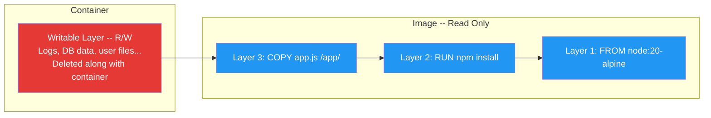
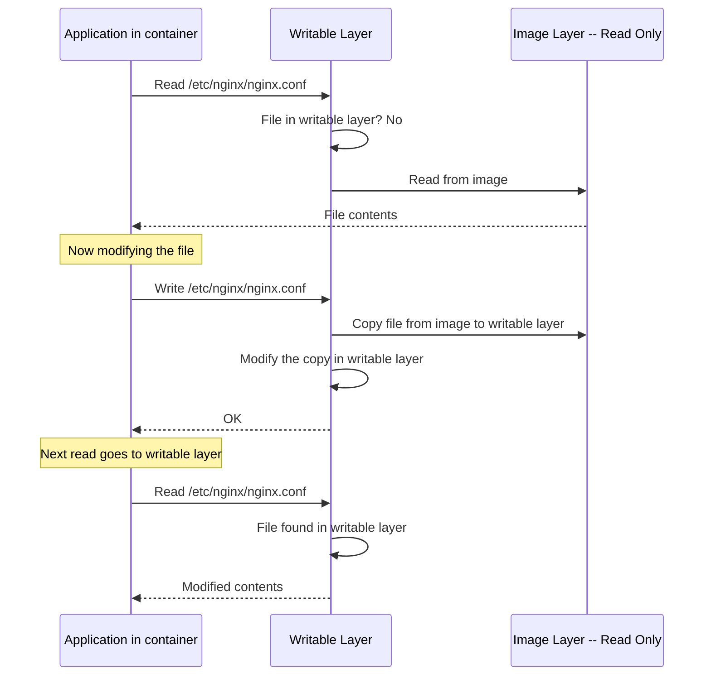
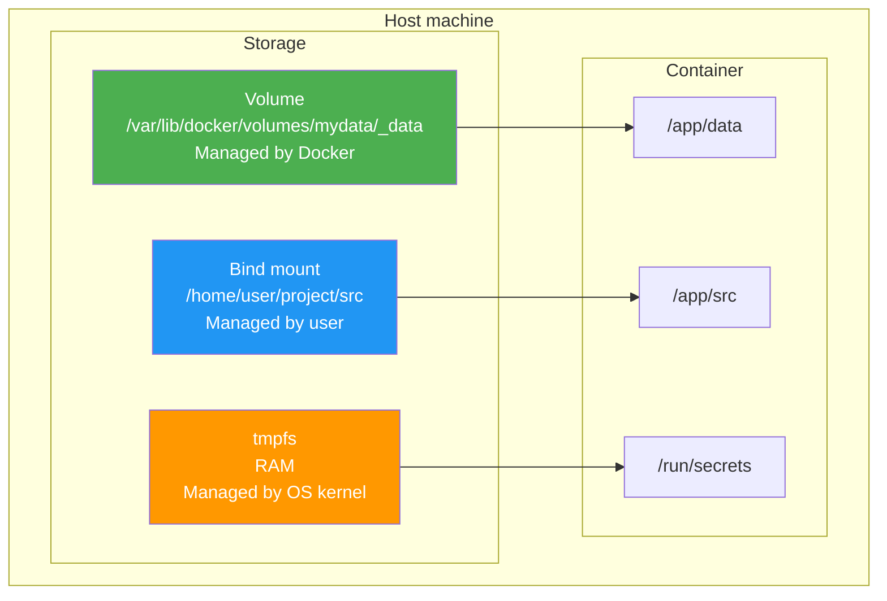
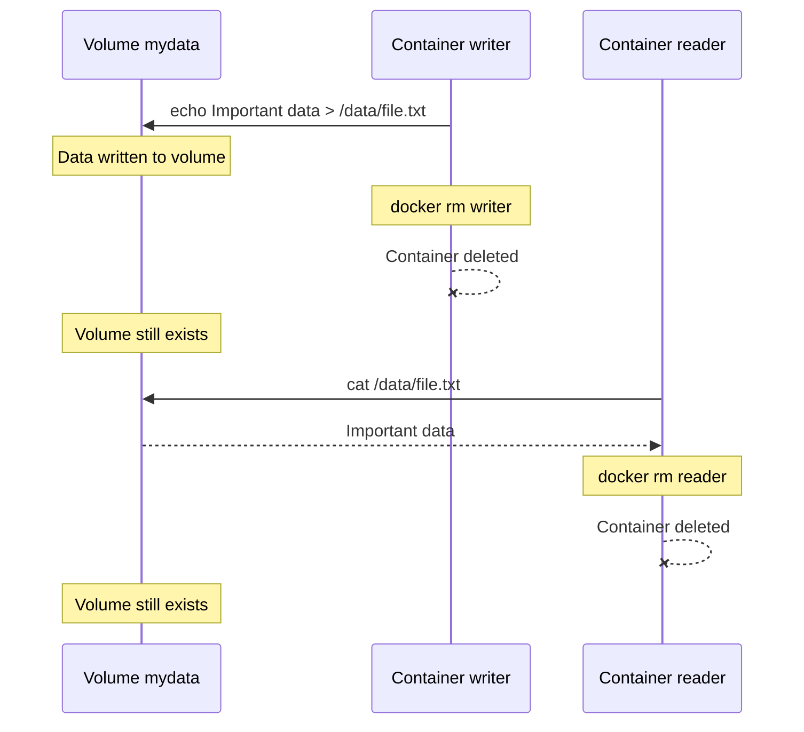
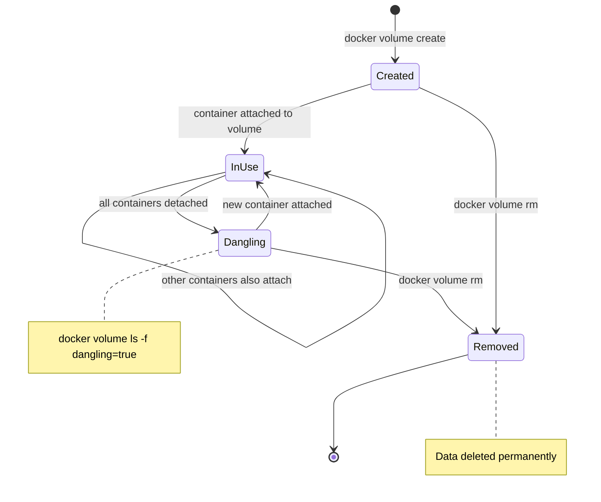
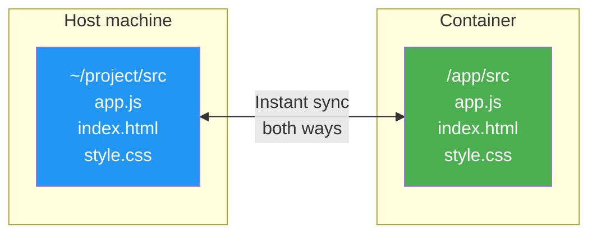
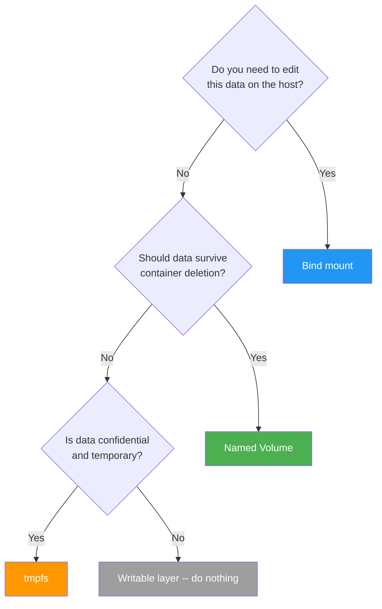
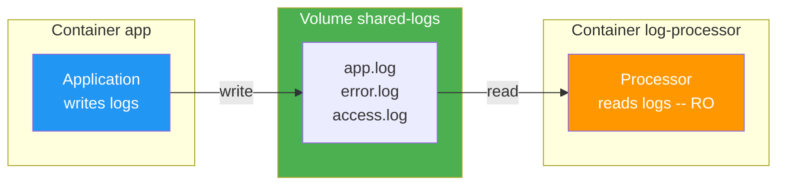
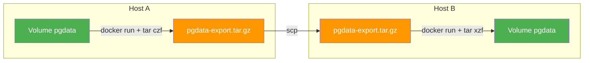

# Level 4: Volumes and Data -- Persistence in Docker

## Introduction

Imagine you're working at a desk with your documents, notes, and blueprints spread out. Every evening, a cleaner throws away absolutely everything on the desk. In the morning, the desk is clean -- not a single paper. Yesterday's report, which you worked on for half a day, went into the trash.

That's exactly how a Docker container works. Its file system is that desk. Everything the container writes inside itself exists only as long as the container is alive. Delete the container -- lose everything. This is not a bug, it's a fundamental property called **ephemerality**.

But real applications need persistent data. A database must remember records between restarts. User files shouldn't disappear. Logs need to be saved for analysis. How do you reconcile container ephemerality with the need for persistent data?

Docker solves this problem with **mounts** -- mechanisms that link directories inside a container with storage outside it. In this level, we will explore in detail:

1. **Why data in a container disappears** -- how the writable layer works and why it's temporary
2. **Volumes** -- Docker-managed volumes, the main tool for data storage
3. **Bind mounts** -- direct mounting of host directories
4. **tmpfs** -- storing data in RAM
5. **`-v` vs `--mount` syntax** -- two mounting methods and when to use each
6. **Read-only containers** -- protecting the file system
7. **Data sharing between containers** -- collaboration patterns
8. **Backup and restore** -- how not to lose data
9. **VOLUME in Dockerfile** -- declaring mount points in an image
10. **Common mistakes** -- what usually goes wrong for beginners

---

## 1. Why Data in a Container Disappears

### Writable Layer -- Temporary Write Layer

When Docker creates a container from an image, it takes all the read-only layers of the image and adds a thin **writable layer** on top. All changes the container makes to its file system go into this layer: creating files, modifying configs, writing logs -- everything.



The problem is that the writable layer is **tied to the container**. Delete the container -- delete the writable layer. Recreate the container from the same image -- get a clean writable layer with no trace of the past.

Let's see this in action:

```bash
# Create a container with PostgreSQL
docker run --name mydb -d -e POSTGRES_PASSWORD=secret postgres:16

# Create a table and insert data
docker exec mydb psql -U postgres -c "CREATE TABLE users (id INT, name TEXT)"
docker exec mydb psql -U postgres -c "INSERT INTO users VALUES (1, 'Alice')"
docker exec mydb psql -U postgres -c "SELECT * FROM users"
#  id | name
# ----+-------
#   1 | Alice

# Delete the container
docker rm -f mydb

# Create a new container from the same image
docker run --name mydb -d -e POSTGRES_PASSWORD=secret postgres:16
docker exec mydb psql -U postgres -c "SELECT * FROM users"
# ERROR: relation "users" does not exist
```

The `users` table, the row with Alice -- everything is gone. The new container got a clean writable layer and knows nothing about the previous container's data.

### Copy-on-Write and Performance

The writable layer operates on the **Copy-on-Write** (CoW) principle. When a container wants to modify a file that belongs to a read-only image layer, Docker first **copies** that file to the writable layer, and only then does the container modify it. Subsequent reads of that file go to the writable layer.



This mechanics has two important consequences:

1. **Write performance is lower.** First write to a file from the image requires copying it. For a database that constantly writes to disk, this can be a noticeable slowdown.
2. **The writable layer grows.** Each modified file adds a copy. If a container writes actively, its writable layer can become very large.

This is why for data that is actively read and written -- databases, download files, logs -- **external storage must be used**: volumes or bind mounts. They bypass Copy-on-Write and give native file system performance.

### What Is Lost Without Mounts

Without external storage mechanisms, you lose data in several scenarios:

| Situation | What happens |
|----------|----------------|
| `docker rm` | Container deleted along with writable layer |
| `docker rm -f` | Force stop and deletion |
| Image update | Old container must be deleted and a new one created |
| Host failure | Writable layer may be corrupted |
| `docker system prune` | Mass deletion of unused containers |

The conclusion is simple: **if data must survive the container, it must not be inside the container**.

---

## 2. Three Types of Mounting

Docker provides three mechanisms for connecting external storage to a container. Each solves its own task. To understand the difference, let's continue the desk analogy.

**Volume** -- this is an office safe. You put documents there, and the cleaner won't touch them. The safe key is with the office manager (Docker Engine). You don't know and don't care where exactly the safe stands in the building -- you just open it and work with the contents.

**Bind mount** -- this is when you bring a folder from home to your desk. You know exactly where it came from, and any changes to it are immediately reflected both at home and on the desk. But if you move to another office, the habit of storing the folder "in the third drawer of the right cabinet" won't work anymore.

**tmpfs** -- this is a sticky note you attach to your monitor. While the monitor is on -- the sticky note is in place. Turn it off -- the sticky note is gone. Nothing got on paper -- perfect for notes nobody should see.



### Comparison Table

| Characteristic | Volume | Bind mount | tmpfs |
|----------------|--------|------------|-------|
| **Where data is stored** | Docker-managed area | Any path on host | RAM |
| **Who manages** | Docker Engine | User | OS kernel |
| **Survives container stop** | Yes | Yes | No |
| **Survives container deletion** | Yes | Yes | No |
| **Access from multiple containers** | Yes | Yes | No |
| **Performance** | Native | Depends on OS | Maximum |
| **Security** | Isolated from host | Direct host access | Data doesn't hit disk |
| **Main use case** | Production data | Development | Secrets, cache |

The selection rule is simple:

- **Production data** (DB, user files) -- Volume
- **Development** (source code, configs) -- Bind mount
- **Secrets and temporary data** -- tmpfs

---

## 3. Named Volumes

### Creation and Basic Usage

Named volumes are Docker's **recommended way** to store data. Docker fully manages their lifecycle: creation, storage, cleanup. You don't need to think about paths on the host -- Docker decides where to physically store the data.

```bash
# Create a named volume
docker volume create pgdata

# View volume information
docker volume inspect pgdata
# [
#     {
#         "CreatedAt": "2026-04-02T10:30:00Z",
#         "Driver": "local",
#         "Labels": {},
#         "Mountpoint": "/var/lib/docker/volumes/pgdata/_data",
#         "Name": "pgdata",
#         "Options": {},
#         "Scope": "local"
#     }
# ]
```

Note the `Mountpoint` -- this is the actual path on the host where Docker stores the volume's data. But you don't need to work with this path directly. You address the volume by name.

### Attaching a Volume to a Container

```bash
# Run PostgreSQL with a named volume for data
docker run -d \
  --name db \
  -e POSTGRES_PASSWORD=secret \
  -v pgdata:/var/lib/postgresql/data \
  postgres:16
```

Here `-v pgdata:/var/lib/postgresql/data` means: "attach the volume named `pgdata` to the directory `/var/lib/postgresql/data` inside the container." Everything PostgreSQL writes to that directory actually goes into the volume.

### Data Survives the Container

The main advantage of volumes -- **data doesn't depend on the container**. Delete the container, create a new one, attach the same volume -- data is there.

```bash
# Step 1: write data
docker run --name writer -v mydata:/data alpine sh -c "echo 'Important data' > /data/file.txt"
docker rm writer

# Container writer is deleted, but volume mydata is not

# Step 2: read data from a new container
docker run --name reader -v mydata:/data alpine cat /data/file.txt
# Important data
docker rm reader
```



### Automatic Volume Creation

If you specify a volume name that doesn't exist, Docker creates it automatically:

```bash
# Volume "newvolume" doesn't exist -- Docker creates it
docker run -v newvolume:/data alpine ls /data
```

This is convenient, but can be unexpected. If you made a typo in the volume name -- say, you wrote `pgdta` instead of `pgdata` -- Docker silently creates a new empty volume instead of connecting the existing one. This is one reason why the `--mount` syntax is considered safer (it will error if the volume isn't found).

### Volume Lifecycle



Full set of commands for managing volumes:

```bash
# Create
docker volume create mydata

# List all volumes
docker volume ls

# List "dangling" volumes -- not attached to any container
docker volume ls -f dangling=true

# Detailed information
docker volume inspect mydata

# Delete specific volume
docker volume rm mydata

# Delete all unused volumes
docker volume prune

# Delete with force confirmation
docker volume prune -f
```

---

## 4. Anonymous Volumes vs Named Volumes

### What Is an Anonymous Volume

An anonymous volume is created when you specify only the path inside the container, without a name:

```bash
# Anonymous volume -- no name before the colon
docker run -v /data alpine ls

# Or via the VOLUME instruction in Dockerfile
# VOLUME /var/lib/postgresql/data
```

Docker creates a volume with a long random hash instead of a name:

```bash
docker volume ls
# DRIVER  VOLUME NAME
# local   a1b2c3d4e5f6789abcdef0123456789abcdef0123456789abcdef012345
# local   pgdata
```

### Why Anonymous Volumes Are a Bad Idea

Continuing our analogy: an anonymous volume is like a safe without a number or label. There are 50 identical safes in the office, and you don't remember which one you put the annual report in.

| Characteristic | Named volume | Anonymous volume |
|----------------|-----------------|---------------|
| **Name** | You choose: `pgdata`, `app-logs` | Random hash: `a1b2c3d4e5...` |
| **Lookup** | `docker volume inspect pgdata` | Need to browse hashes |
| **Reattach** | `-v pgdata:/data` | Need to know the hash |
| **Cleanup** | `docker volume rm pgdata` | `docker volume prune` deletes all dangling |
| **Purpose** | Clear from name | A mystery |

```bash
# With named volumes, everything is clear
docker run -v postgres-data:/var/lib/postgresql/data postgres:16
docker run -v redis-data:/data redis:7
docker run -v app-uploads:/app/uploads my-app

docker volume ls
# DRIVER  VOLUME NAME
# local   postgres-data    -- PostgreSQL data
# local   redis-data       -- Redis data
# local   app-uploads      -- user uploads

# With anonymous volumes -- chaos
docker volume ls
# DRIVER  VOLUME NAME
# local   7f3a1b2c4d5e... -- what is this?
# local   a9e8d7c6b5a4... -- and this?
# local   c1d2e3f4a5b6... -- no idea
```

📌 **Rule: always use named volumes.** The only exception is the "empty" anonymous volume pattern for protecting a directory from bind mount overwriting. More on this in the errors section.

---

## 5. Bind Mounts -- Mounting Host Directories

### How Bind Mounts Work

A bind mount creates a **direct mirror** between a directory on the host and a directory in the container. This is not copying -- it's exactly a mirror. Any change on one side is instantly visible on the other.

```bash
# Mount ~/project/src from host to /app/src in container
docker run -v $(pwd)/src:/app/src my-app
```

Changed a file on the host in your IDE -- the container sees the change immediately. The container created a file in `/app/src` -- it instantly appears on the host in `./src`.



### Main Use Case: Development

Bind mounts are indispensable for development. They allow you to edit code in your familiar IDE on the host while running it inside a container with the right environment.

```bash
# Typical Node.js development command
docker run -d \
  --name dev-server \
  -v $(pwd)/src:/app/src \
  -v $(pwd)/package.json:/app/package.json \
  -p 3000:3000 \
  my-node-app npm run dev

# You edit src/App.tsx in VS Code on the host
# Hot-reload in the container picks up the change
# Browser at http://localhost:3000 refreshes
```

Without bind mounts, you'd have to rebuild the image after every code change -- a painfully slow development cycle.

### Mounting Individual Files

Bind mounts work not only with directories but also with individual files. This is convenient for configs:

```bash
# Only the Nginx config -- read-only
docker run -d \
  -v $(pwd)/nginx.conf:/etc/nginx/nginx.conf:ro \
  -p 80:80 \
  nginx

# Custom PostgreSQL config
docker run -d \
  -v $(pwd)/postgresql.conf:/etc/postgresql/postgresql.conf:ro \
  -v pgdata:/var/lib/postgresql/data \
  -e POSTGRES_PASSWORD=secret \
  postgres:16 -c 'config_file=/etc/postgresql/postgresql.conf'
```

The `:ro` suffix (read-only) is an important detail. It guarantees the container can't modify your config. More on read-only in a separate section.

### Absolute Paths Required

This is one of the most common sources of errors for beginners. Docker distinguishes volumes and bind mounts by the path format. If the path starts with `/` -- it's a bind mount. If without `/` -- Docker considers it a volume name.

```bash
# ❌ Docker thinks "src" is a volume name!
docker run -v src:/app/src my-app
# Creates a VOLUME named "src" instead of bind mount for ./src

# ✅ Absolute path -- unambiguously a bind mount
docker run -v $(pwd)/src:/app/src my-app
docker run -v /home/user/project/src:/app/src my-app
```

### Gotcha: Bind Mount Overwrites Contents

When you mount a host directory into a container, the container's contents in that directory are **completely replaced** by the host's contents. What was in the container before mounting -- disappears.

```bash
# In the my-app image, /app contains:
# /app/node_modules/  (installed during build)
# /app/package.json
# /app/src/

# Mount the project from host -- but host has no node_modules!
docker run -v $(pwd):/app my-app
# /app/node_modules/ -- EMPTY, because the host doesn't have this folder
# Application won't start: dependencies not found
```

The solution -- an anonymous volume to protect node_modules:

```bash
docker run \
  -v $(pwd):/app \
  -v /app/node_modules \
  my-app
# First -v: mounts the project from host
# Second -v: creates an anonymous volume for node_modules
# node_modules from the image is preserved in the anonymous volume
```

---

## 6. When to Use Volume vs Bind Mount

Beginners often confuse the two mechanisms or use one instead of the other. Here are clear selection rules:

### Volume -- for Application-Managed Data

```bash
# ✅ Database -- data managed by PostgreSQL, not by you
docker run -v pgdata:/var/lib/postgresql/data postgres:16

# ✅ User uploads -- files created by the application
docker run -v uploads:/app/uploads my-app

# ✅ Logs -- created by the application
docker run -v app-logs:/var/log/app my-app
```

### Bind Mount -- for Data You Edit on the Host

```bash
# ✅ Source code -- you edit in IDE
docker run -v $(pwd)/src:/app/src my-app

# ✅ Configuration files -- you create and control
docker run -v $(pwd)/nginx.conf:/etc/nginx/nginx.conf:ro nginx

# ✅ Test fixtures -- you prepared on the host
docker run -v $(pwd)/fixtures:/app/test-data:ro my-app
```

### When the Boundary Is Unclear

Sometimes the choice isn't obvious. Here's a guide:



---

## 7. -v vs --mount Syntax

Docker supports two syntaxes for mounting. Both do the same thing but behave differently on errors.

### -v Syntax

Compact, familiar, widely used in documentation and tutorials:

```bash
# Volume
docker run -v mydata:/app/data image

# Bind mount
docker run -v /host/path:/container/path image

# With flags
docker run -v mydata:/app/data:ro image
```

Format: `[source:]destination[:options]`

### --mount Syntax

More explicit, self-documenting. Each parameter is named:

```bash
# Volume
docker run --mount source=mydata,target=/app/data image

# Bind mount
docker run --mount type=bind,source=/host/path,target=/container/path image

# With flags
docker run --mount source=mydata,target=/app/data,readonly image

# tmpfs
docker run --mount type=tmpfs,target=/tmp,tmpfs-size=100m image
```

### Critical Difference: Error Behavior

This is where the two syntaxes fundamentally diverge:

```bash
# Path /nonexistent/path does NOT exist on host

# -v: silently creates directory /nonexistent/path on host
docker run -v /nonexistent/path:/data alpine ls /data
# No error! Created an empty directory

# --mount: returns a clear error
docker run --mount type=bind,source=/nonexistent/path,target=/data alpine ls /data
# Error response from daemon: invalid mount config: ...
# bind source path does not exist: /nonexistent/path
```

Same with non-existent volumes:

```bash
# Volume "mydata" does NOT exist

# -v: silently creates the volume
docker run -v mydata:/data alpine ls /data
# Volume created automatically, no error

# --mount: returns an error
docker run --mount source=mydata,target=/data alpine ls /data
# Error: No such volume: mydata
```

### Which Syntax to Choose

| Context | Recommendation | Reason |
|----------|--------------|---------|
| Quick command in terminal | `-v` | Compactness |
| Shell scripts | `--mount` | Errors don't pass silently |
| CI/CD pipelines | `--mount` | Predictability |
| docker-compose.yml | `volumes:` section | Its own syntax |
| Team documentation | `--mount` | Self-documenting |

💡 **Tip:** start with `-v` for terminal experiments, switch to `--mount` for anything going into scripts and production.

---

## 8. tmpfs -- Storing in RAM

### When Data Shouldn't Hit Disk

tmpfs creates a file system directly in RAM. Data is never written to physical disk and disappears when the container stops.

Three main scenarios:

1. **Secrets.** Passwords, API keys, tokens -- if they hit disk, they can be extracted even after container deletion (disk data isn't overwritten instantly). tmpfs guarantees secrets exist only in RAM.

2. **Temporary files.** Cache, sessions, intermediate computation results -- data not needed after restart.

3. **High-performance I/O.** Writing to RAM is orders of magnitude faster than writing to disk. If an application intensively works with temp files, tmpfs gives a noticeable speedup.

### Syntax and Parameters

```bash
# Simple tmpfs
docker run --tmpfs /tmp nginx

# With size limit
docker run --mount type=tmpfs,target=/tmp,tmpfs-size=100m nginx

# With access permissions
docker run --mount type=tmpfs,target=/tmp,tmpfs-size=64m,tmpfs-mode=1777 nginx
```

tmpfs parameters:

| Parameter | Description | Example |
|----------|----------|--------|
| `tmpfs-size` | Maximum size | `tmpfs-size=100m` |
| `tmpfs-mode` | Access permissions in octal | `tmpfs-mode=1777` |

If you don't specify `tmpfs-size`, tmpfs can take up to 50% of the host's RAM. Always set a limit.

### Example: Safe Secret Handling

```bash
docker run -d \
  --name secure-app \
  --mount type=tmpfs,target=/run/secrets,tmpfs-size=1m \
  -e DB_PASSWORD=super-secret-123 \
  my-app

# Secrets stored only in RAM
# Even with physical access to the host disk
# they cannot be extracted from the file system
```

### tmpfs vs Volume: What to Choose for /tmp

```bash
# ❌ Volume for /tmp: creates unnecessary persistence
# Temporary files survive restarts -- not needed and clutters disk
docker run -v tmp-data:/tmp my-app

# ✅ tmpfs for /tmp: data lives only in RAM
docker run --tmpfs /tmp:size=50m my-app

# ❌ Nothing for /tmp: data goes to writable layer
# Container size grows, slower due to Copy-on-Write
docker run my-app
```

---

## 9. Read-Only Containers and Mounts

### Why Make a Container Read-Only

In a production environment, a container shouldn't be able to modify its file system. If an attacker gains access to the container, they can't:

- Replace application binaries
- Modify configuration files
- Install malware
- Change startup scripts

The `--read-only` flag makes the entire container file system read-only:

```bash
# Container file system -- read-only
docker run --read-only nginx
```

But many applications need to write to certain directories -- logs, cache, PID files, temporary files. The solution -- targeted exceptions via tmpfs and volumes:

```bash
# Read-only with targeted exceptions
docker run --read-only \
  --tmpfs /var/cache/nginx \
  --tmpfs /var/run \
  --tmpfs /tmp \
  -p 80:80 \
  nginx
```

### Read-Only Mount :ro

The `:ro` suffix makes a specific mount read-only. The container can read data but can't modify it:

```bash
# Config -- read-only, logs -- writable
docker run -d \
  -v $(pwd)/nginx.conf:/etc/nginx/nginx.conf:ro \
  -v web-content:/usr/share/nginx/html:ro \
  -v nginx-logs:/var/log/nginx \
  -p 80:80 \
  nginx
```

### Production Pattern: Maximum Protection

```bash
docker run -d \
  --name production-app \
  --read-only \
  --tmpfs /tmp:size=50m \
  --tmpfs /var/run \
  -v app-logs:/var/log/app \
  -v $(pwd)/config.yaml:/app/config.yaml:ro \
  --restart unless-stopped \
  --memory=512m \
  --cpus=1.0 \
  my-production-app:1.2.0
```

Here each line is a conscious security decision:
- `--read-only` -- container can't change its files
- `--tmpfs /tmp` -- temporary files in RAM, limited to 50 MB
- `-v app-logs:/var/log/app` -- logs persist in a named volume
- `config.yaml:ro` -- config available but container can't modify it

---

## 10. Data Sharing Between Containers

### Shared Volume for Multiple Containers

One volume can be attached to multiple containers simultaneously. This allows building architectures where containers interact through a shared file system.

```bash
# Create a shared volume
docker volume create shared-logs

# Application writes logs
docker run -d --name app \
  -v shared-logs:/var/log/app \
  my-app

# Separate container processes logs
docker run -d --name log-processor \
  -v shared-logs:/logs:ro \
  log-processor-image
```



### Sidecar Pattern

A sidecar is a helper container that runs alongside the main one and performs a service function. A shared volume is the main communication method between them.

```bash
# Main application generates static files
docker run -d --name static-generator \
  -v web-content:/output \
  static-site-builder

# Nginx serves these files
docker run -d --name web \
  -v web-content:/usr/share/nginx/html:ro \
  -p 80:80 \
  nginx
```

### Writer-Reader Pattern with Time Sync

```bash
# Writer: writes metrics every 5 seconds
docker run -d --name metrics-writer \
  -v metrics:/data \
  alpine sh -c "while true; do date >> /data/metrics.txt; sleep 5; done"

# Reader: checks metrics every 10 seconds
docker run -d --name metrics-reader \
  -v metrics:/data:ro \
  alpine sh -c "while true; do echo '--- Latest ---'; tail -5 /data/metrics.txt; sleep 10; done"
```

⚠️ **Important:** Docker doesn't provide file locking mechanisms between containers. If two containers write to the same file simultaneously, data loss is possible. For coordination, use application-level mechanisms (database, message queue) or separate files by container.

---

## 11. Volume Backup and Restore

### Backing Up a Volume to a tar Archive

Docker doesn't have a built-in `docker volume backup` command. But backups are easy to do via a temporary container:

```bash
# Create a container that:
# 1. Mounts volume mydata as /source (read-only)
# 2. Mounts current host directory as /backup
# 3. Archives /source contents to /backup
docker run --rm \
  -v mydata:/source:ro \
  -v $(pwd)/backups:/backup \
  alpine tar czf /backup/mydata-$(date +%Y%m%d).tar.gz -C /source .
```

Breaking it down:
- `--rm` -- container deletes itself after completion
- `-v mydata:/source:ro` -- attach volume read-only (backup shouldn't modify data)
- `-v $(pwd)/backups:/backup` -- backup directory on host
- `tar czf` -- create compressed archive
- `-C /source .` -- archive contents, not the directory itself

### Restoring from Backup

```bash
# Create a new volume
docker volume create mydata-restored

# Unpack archive into new volume
docker run --rm \
  -v mydata-restored:/target \
  -v $(pwd)/backups:/backup:ro \
  alpine tar xzf /backup/mydata-20260402.tar.gz -C /target
```

### Copying a Volume

Sometimes you need to copy a volume -- for example, for testing with real data:

```bash
# Create a copy
docker volume create pgdata-test

docker run --rm \
  -v pgdata:/source:ro \
  -v pgdata-test:/target \
  alpine sh -c "cp -a /source/. /target/"
```

### Migrating a Volume Between Hosts

```bash
# On source host: archive volume and send
docker run --rm \
  -v pgdata:/source:ro \
  -v $(pwd):/backup \
  alpine tar czf /backup/pgdata-export.tar.gz -C /source .

scp pgdata-export.tar.gz user@new-host:~/

# On target host: create volume and restore
docker volume create pgdata

docker run --rm \
  -v pgdata:/target \
  -v ~/:/backup:ro \
  alpine tar xzf /backup/pgdata-export.tar.gz -C /target
```



---

## 12. VOLUME in Dockerfile

### What the VOLUME Instruction Does

The `VOLUME` instruction in a Dockerfile declares that the specified directory should be mounted as a volume:

```dockerfile
FROM postgres:16
# DB data should be in a volume
VOLUME /var/lib/postgresql/data
```

When you run a container from this image **without** the `-v` flag, Docker automatically creates an **anonymous volume** for the specified directory. When you run **with** `-v` -- your named volume is used.

```bash
# Without -v: anonymous volume is created
docker run -d postgres:16
# docker volume ls will show a volume with a hash

# With -v: your volume is used
docker run -d -v pgdata:/var/lib/postgresql/data postgres:16
```

### Why VOLUME Is Needed in Dockerfile

1. **Documentation.** The image developer communicates: "this directory contains important data worth persisting."
2. **Accidental loss protection.** Even if the user forgets to specify `-v`, data goes to an anonymous volume, not the writable layer.
3. **Hint for orchestrators.** Docker Compose, Kubernetes, and other tools can automatically create volumes for directories declared via `VOLUME`.

### Trap: VOLUME and Instruction Order

This is one of the most treacherous traps in Dockerfile. After the `VOLUME` instruction, any changes to the specified directory via `RUN`, `COPY`, or `ADD` are **not saved** to the image.

```dockerfile
FROM node:20-alpine
WORKDIR /app

# ❌ WRONG: VOLUME before COPY
VOLUME /app/data
RUN mkdir -p /app/data && echo "seed" > /app/data/seed.txt
# File seed.txt does NOT end up in the image!
# Each container will get an empty volume
```

Why? Because after `VOLUME`, Docker starts writing changes to the specified directory to a temporary volume, not to an image layer. When the build completes, this temporary volume is discarded.

```dockerfile
FROM node:20-alpine
WORKDIR /app

# ✅ CORRECT: VOLUME at the end
COPY . .
RUN npm ci
RUN mkdir -p /app/data && echo "seed" > /app/data/seed.txt
VOLUME /app/data
# seed.txt ends up in the image if no external volume is used
```

📌 **Rule: the VOLUME instruction should always be as close to the end of the Dockerfile as possible.**

---

## 13. Volume Drivers

### Why Drivers Are Needed

By default, Docker uses the `local` driver -- it stores data on the host's local disk in `/var/lib/docker/volumes/`. But in a production environment, one host is usually not enough:

- Data must be accessible from **multiple hosts** in a cluster
- **Replication** is needed for fault tolerance
- Data should be stored in **cloud storage**

Volume drivers exist for this -- plugins that connect Docker to external storage systems.

```bash
# NFS -- network file system
docker volume create --driver local \
  --opt type=nfs \
  --opt o=addr=192.168.1.100,rw \
  --opt device=:/exports/data \
  nfs-data

docker run -v nfs-data:/data my-app
```

### Popular Drivers

| Driver | Storage | Scenario |
|---------|-----------|----------|
| `local` | Local disk | Single host, development |
| NFS | Network FS | Shared access on local network |
| AWS EFS / EBS | Amazon cloud | Production on AWS |
| Azure File Storage | Microsoft cloud | Production on Azure |
| GlusterFS | Distributed FS | On-premise clusters |
| Ceph | Distributed FS | Large clusters |

For beginners, the `local` driver is sufficient. Cloud and network drivers are a topic for the orchestration level (Docker Swarm, Kubernetes).

---

## 14. Practical Recipes

### PostgreSQL with Persistent Data

```bash
docker volume create pgdata

docker run -d \
  --name postgres \
  -e POSTGRES_USER=app \
  -e POSTGRES_PASSWORD=secret \
  -e POSTGRES_DB=myapp \
  -v pgdata:/var/lib/postgresql/data \
  -p 5432:5432 \
  --restart unless-stopped \
  postgres:16
```

### Nginx with Custom Config and Logs

```bash
docker volume create nginx-logs

docker run -d \
  --name web \
  --read-only \
  --tmpfs /var/cache/nginx \
  --tmpfs /var/run \
  -v $(pwd)/nginx.conf:/etc/nginx/nginx.conf:ro \
  -v $(pwd)/html:/usr/share/nginx/html:ro \
  -v nginx-logs:/var/log/nginx \
  -p 80:80 \
  --restart unless-stopped \
  nginx
```

### Node.js Development Environment

```bash
docker run -d \
  --name dev \
  -v $(pwd)/src:/app/src \
  -v $(pwd)/package.json:/app/package.json \
  -v /app/node_modules \
  -p 3000:3000 \
  my-node-dev npm run dev
```

### Automatic Scheduled Backup

```bash
#!/bin/bash
# backup.sh
BACKUP_DIR="/backups"
DATE=$(date +%Y%m%d_%H%M%S)

docker run --rm \
  -v pgdata:/source:ro \
  -v $BACKUP_DIR:/backup \
  alpine tar czf /backup/pgdata-$DATE.tar.gz -C /source .

# Remove backups older than 7 days
find $BACKUP_DIR -name "pgdata-*.tar.gz" -mtime +7 -delete

echo "Backup completed: pgdata-$DATE.tar.gz"
```

---

## 15. Best Practices

### Named Volumes for All Data

```bash
# ✅ Clear what each volume stores
docker run -v postgres-data:/var/lib/postgresql/data postgres:16
docker run -v redis-data:/data redis:7
docker run -v app-uploads:/app/uploads my-app

# ❌ Anonymous volumes -- purpose unclear
docker run -v /var/lib/postgresql/data postgres:16
```

### Bind Mounts -- Only for Development

```bash
# ✅ Development: bind mount for hot-reload
docker run -v $(pwd)/src:/app/src -p 3000:3000 dev-image

# ✅ Production: named volume
docker run -v app-data:/app/data -p 3000:3000 prod-image
```

### Read-Only by Default

```bash
# ✅ Everything that doesn't need write -- read-only
docker run \
  -v $(pwd)/config.yaml:/app/config.yaml:ro \
  -v static-assets:/app/public:ro \
  -v app-logs:/var/log/app \
  my-app
```

### Regular Cleanup

```bash
# Show dangling volumes
docker volume ls -f dangling=true

# Delete unused volumes
docker volume prune

# Full system cleanup
docker system prune --volumes
```

### Don't Store Data in Writable Layer

```bash
# ❌ Logs in container -- lost on deletion
docker run my-app
# Application writes to /var/log/app -- this is writable layer

# ✅ Logs in volume -- survives container
docker run -v app-logs:/var/log/app my-app
```

### --mount for Scripts and CI/CD

```bash
# ✅ In scripts: errors don't pass silently
docker run \
  --mount source=mydata,target=/data \
  --mount type=bind,source=/host/config,target=/app/config,readonly \
  my-app

# ❌ In scripts: -v silently creates directory/volume on typo
docker run -v mydata:/data -v /host/config:/app/config:ro my-app
```

---

## Common Beginner Mistakes

### 1. Forgot to Attach a Volume -- Data Lost

```bash
# ❌ No volume: DB data disappears on container deletion
docker run -d --name db -e POSTGRES_PASSWORD=secret postgres:16
docker rm -f db
# All data lost permanently!
```

Why this is an error: PostgreSQL writes data to `/var/lib/postgresql/data` inside the container. Without an external volume, this data lives in the writable layer. Deleted container -- deleted writable layer with data.

```bash
# ✅ Always attach a volume for DB data
docker run -d --name db \
  -e POSTGRES_PASSWORD=secret \
  -v pgdata:/var/lib/postgresql/data \
  postgres:16
```

### 2. Relative Path Instead of Absolute

```bash
# ❌ Docker interprets "src" as a volume name, not a path
docker run -v src:/app/src my-app
# Creates a VOLUME named "src"

# ❌ Dot-slash behaves differently in different Docker versions
docker run -v ./src:/app/src my-app
```

Why this is an error: Docker determines mount type by string format. If the string starts with `/` or `~/` -- it's a bind mount. Otherwise, Docker considers it a volume name.

```bash
# ✅ Use $(pwd) or full path
docker run -v $(pwd)/src:/app/src my-app
docker run -v /home/user/project/src:/app/src my-app
```

### 3. Bind Mount Overwrites node_modules

```bash
# ❌ Host has no node_modules -- container won't see them either
docker run -v $(pwd):/app my-node-app
# Error: Cannot find module 'express'
```

Why this is an error: a bind mount **completely replaces** the target directory's contents. If `node_modules` were installed in the image during build, but the host doesn't have them -- the container sees an empty directory.

```bash
# ✅ Anonymous volume "protects" node_modules from overwriting
docker run \
  -v $(pwd):/app \
  -v /app/node_modules \
  my-node-app
```

### 4. Permission Problems

```bash
# ❌ Container creates files as root -- host user can't edit them
docker run -v $(pwd)/data:/data alpine sh -c "echo test > /data/file.txt"
ls -la data/file.txt
# -rw-r--r-- root root file.txt
```

Why this is an error: by default, the container process runs as root (UID 0). Files created via bind mount get the container process's UID/GID.

```bash
# ✅ Run container as current user
docker run \
  -v $(pwd)/data:/data \
  --user $(id -u):$(id -g) \
  alpine sh -c "echo test > /data/file.txt"

ls -la data/file.txt
# -rw-r--r-- youruser youruser file.txt
```

### 5. Using tmpfs for Data That Must Be Saved

```bash
# ❌ DB data in tmpfs -- everything lost on container stop
docker run --tmpfs /var/lib/postgresql/data postgres:16
```

Why this is an error: tmpfs stores data only in RAM. When the container stops or the host reboots, memory is freed -- data disappears.

```bash
# ✅ Volume for data, tmpfs for temp files
docker run \
  -v pgdata:/var/lib/postgresql/data \
  --tmpfs /tmp:size=50m \
  postgres:16
```

### 6. VOLUME Before COPY in Dockerfile

```dockerfile
# ❌ Files added after VOLUME don't end up in the image
FROM node:20-alpine
WORKDIR /app
VOLUME /app/data
RUN echo "seed data" > /app/data/seed.txt
# seed.txt will NOT be in the image!
```

Why this is an error: after the `VOLUME` instruction, all changes to the specified directory are written to a temporary volume that's discarded after the build.

```dockerfile
# ✅ VOLUME -- at the end of Dockerfile
FROM node:20-alpine
WORKDIR /app
COPY . .
RUN npm ci
RUN echo "seed data" > /app/data/seed.txt
VOLUME /app/data
```

### 7. Not Cleaning Unused Volumes

```bash
# After a month of working with Docker
docker volume ls | wc -l
# 47
# 47 volumes! Most -- anonymous, from long-deleted containers
```

Why this is an error: anonymous volumes are not automatically deleted when containers are removed (unless you use `docker rm -v`). They accumulate and take up disk space.

```bash
# ✅ Regular cleanup
docker volume ls -f dangling=true
docker volume prune

# ✅ Delete container along with anonymous volumes
docker rm -v my-container
```

---

## Summary

In this level, we covered three mechanisms for working with data in Docker:

- **Volumes** -- Docker-managed volumes. The main tool for storing persistent data. Use named volumes for databases, uploads, logs.

- **Bind mounts** -- direct mounting of host directories. Indispensable for development hot-reload of code. Require absolute paths. Don't use in production.

- **tmpfs** -- file system in RAM. Data never hits disk. Perfect for secrets, cache, and temporary files.

Key rules:

- ✅ Named volumes for all data that must survive the container
- ✅ `--mount` syntax in scripts and CI/CD for predictable behavior
- ✅ `:ro` for everything the container shouldn't modify
- ✅ `--read-only` for production containers with targeted exceptions
- ✅ Regular cleanup of unused volumes via `docker volume prune`
- ✅ Volume backups via a temporary container with `tar`
- ✅ `VOLUME` in Dockerfile -- closer to the end of the file
- ❌ Never store important data in the container's writable layer
- ❌ Don't use anonymous volumes without good reason
- ❌ Don't use bind mounts in production
