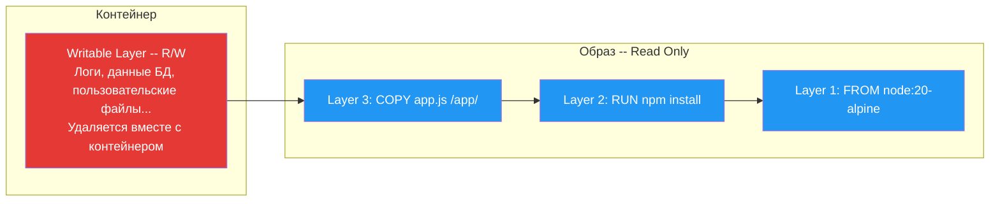
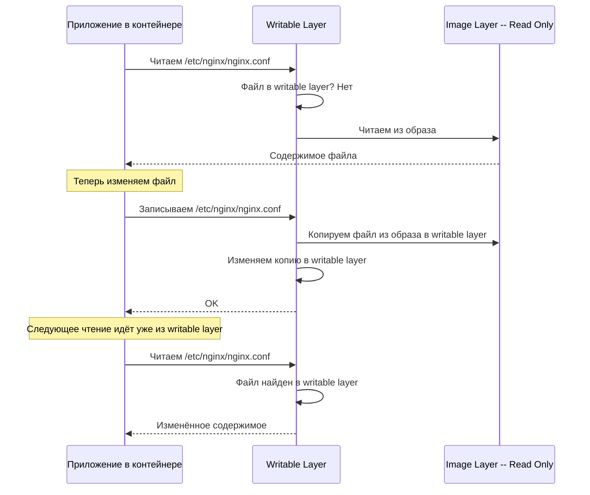
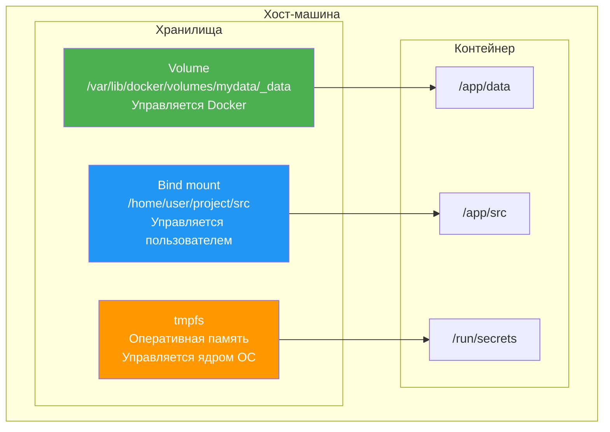
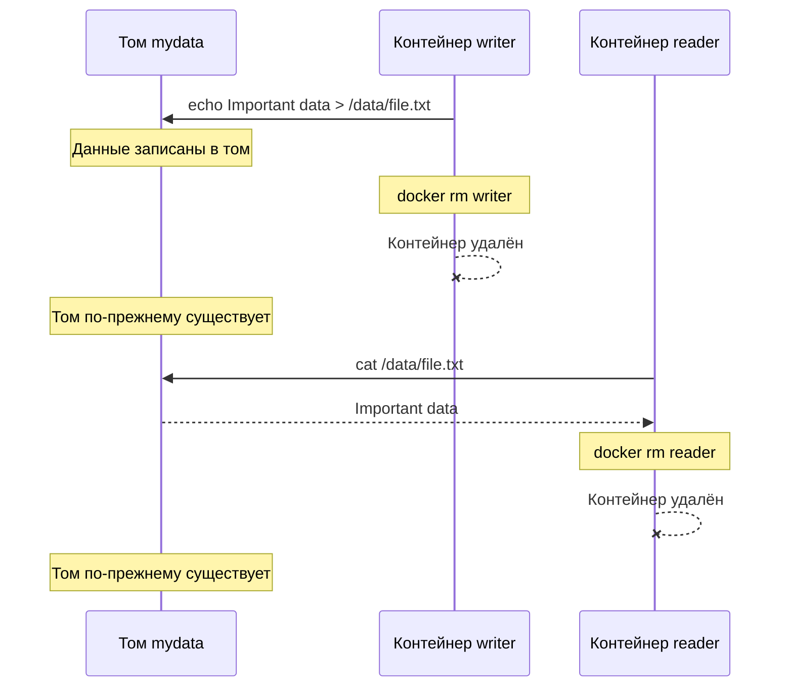
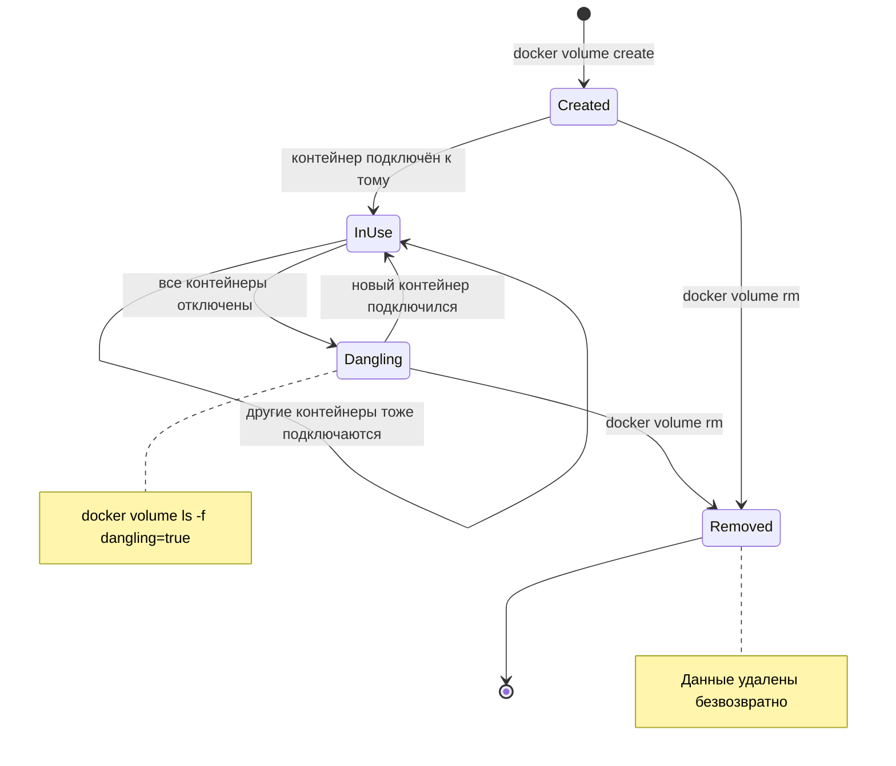
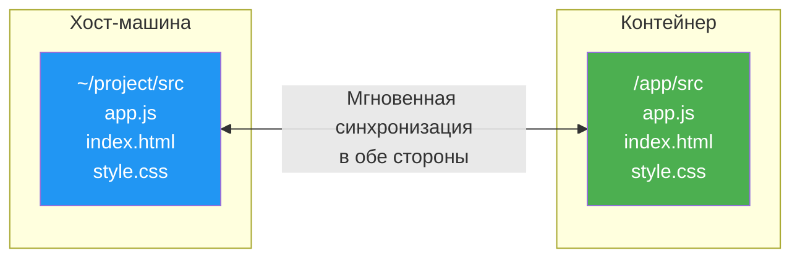
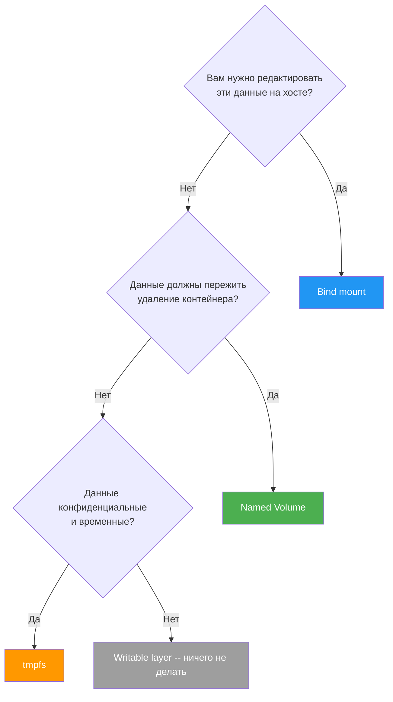
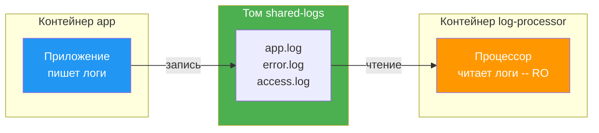
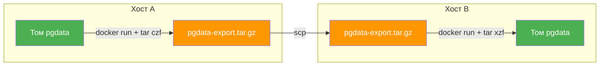

# Уровень 4: Тома и данные -- персистентность в Docker

## Введение

Представьте, что вы работаете за столом, на котором лежат ваши документы, заметки и чертежи. Каждый вечер уборщик выбрасывает абсолютно всё, что лежит на столе. Утром стол чистый -- ни одной бумаги. Вчерашний отчёт, над которым вы трудились полдня, отправился в мусорку.

Именно так работает контейнер Docker. Его файловая система -- это тот самый стол. Всё, что контейнер записывает внутри себя, существует только пока контейнер жив. Удалили контейнер -- потеряли всё. Это не баг, это фундаментальное свойство, которое называется **эфемерностью**.

Но ведь реальные приложения нуждаются в постоянных данных. База данных должна помнить записи между перезапусками. Пользовательские файлы не должны исчезать. Логи нужно сохранять для анализа. Как совместить эфемерность контейнеров с потребностью в постоянных данных?

Docker решает эту проблему с помощью **монтирований** -- механизмов, которые связывают директории внутри контейнера с хранилищами за его пределами. На этом уровне мы подробно разберём:

1. **Почему данные в контейнере пропадают** -- как устроен writable layer и почему он временный
2. **Volumes** -- управляемые Docker тома, основной инструмент для хранения данных
3. **Bind mounts** -- прямое подключение директорий хоста
4. **tmpfs** -- хранение данных в оперативной памяти
5. **Синтаксис `-v` vs `--mount`** -- два способа монтирования и когда какой использовать
6. **Read-only контейнеры** -- защита файловой системы
7. **Обмен данными между контейнерами** -- паттерны совместной работы
8. **Бэкап и восстановление** -- как не потерять данные
9. **VOLUME в Dockerfile** -- объявление точек монтирования в образе
10. **Типичные ошибки** -- что обычно идёт не так у новичков

---

## 1. Почему данные в контейнере пропадают

### Writable layer -- временный слой записи

Когда Docker создаёт контейнер из образа, он берёт все read-only слои образа и добавляет сверху тонкий **writable layer** -- слой для записи. Все изменения, которые контейнер делает в своей файловой системе, попадают именно в этот слой: создание файлов, изменение конфигов, записи в лог -- всё.



Проблема в том, что writable layer **привязан к контейнеру**. Удалили контейнер -- удалился writable layer. Пересоздали контейнер из того же образа -- получили чистый writable layer, без каких-либо следов прошлого.

Давайте посмотрим на это в действии:

```bash
# Создаём контейнер с PostgreSQL
docker run --name mydb -d -e POSTGRES_PASSWORD=secret postgres:16

# Создаём таблицу и вставляем данные
docker exec mydb psql -U postgres -c "CREATE TABLE users (id INT, name TEXT)"
docker exec mydb psql -U postgres -c "INSERT INTO users VALUES (1, 'Alice')"
docker exec mydb psql -U postgres -c "SELECT * FROM users"
#  id | name
# ----+-------
#   1 | Alice

# Удаляем контейнер
docker rm -f mydb

# Создаём новый контейнер из того же образа
docker run --name mydb -d -e POSTGRES_PASSWORD=secret postgres:16
docker exec mydb psql -U postgres -c "SELECT * FROM users"
# ERROR: relation "users" does not exist
```

Таблица `users`, строка с Alice -- всё исчезло. Новый контейнер получил чистый writable layer и ничего не знает о данных прошлого контейнера.

### Copy-on-Write и производительность

Writable layer работает по принципу **Copy-on-Write** (CoW). Когда контейнер хочет изменить файл, который находится в read-only слое образа, Docker сначала **копирует** этот файл в writable layer, и только потом контейнер его изменяет. Последующие чтения этого файла идут уже из writable layer.



Эта механика имеет два важных следствия:

1. **Производительность записи ниже.** Первая запись в файл из образа требует его копирования. Для базы данных, которая постоянно пишет на диск, это может быть заметным "тормозом".
2. **Writable layer растёт.** Каждый изменённый файл добавляет копию. Если контейнер активно пишет, его writable layer может стать очень большим.

Именно поэтому для данных, которые активно читаются и записываются -- базы данных, файлы загрузок, логи -- **необходимо использовать внешние хранилища**: volumes или bind mounts. Они работают в обход Copy-on-Write и дают нативную производительность файловой системы.

### Что теряется без монтирований

Без механизмов внешнего хранения вы теряете данные в нескольких сценариях:

| Ситуация | Что происходит |
|----------|----------------|
| `docker rm` | Контейнер удалён вместе с writable layer |
| `docker rm -f` | Принудительная остановка и удаление |
| Обновление образа | Старый контейнер нужно удалить и создать новый |
| Сбой хоста | Writable layer может быть повреждён |
| `docker system prune` | Массовое удаление неиспользуемых контейнеров |

Вывод простой: **если данные должны пережить контейнер, они не должны находиться внутри контейнера**.

---

## 2. Три типа монтирования

Docker предоставляет три механизма для подключения внешних хранилищ к контейнеру. Каждый решает свою задачу. Чтобы понять разницу, продолжим аналогию с рабочим столом.

**Volume** -- это сейф в офисе. Вы кладёте туда документы, и уборщик их не тронет. Ключ от сейфа -- у офис-менеджера (Docker Engine). Вы не знаете и не заботитесь, где именно стоит сейф в здании -- вы просто открываете его и работаете с содержимым.

**Bind mount** -- это когда вы приносите на стол папку из дома. Вы точно знаете, откуда она, и любые изменения в ней немедленно отражаются и дома, и на столе. Но если вы переедете в другой офис, привычка хранить папку "в третьем ящике правой тумбочки" уже не сработает.

**tmpfs** -- это стикер, который вы приклеиваете на монитор. Пока монитор включён -- стикер на месте. Выключили -- стикер пропал. На бумагу ничего не попало -- идеально для записок, которые никто не должен увидеть.



### Сравнительная таблица

| Характеристика | Volume | Bind mount | tmpfs |
|----------------|--------|------------|-------|
| **Где хранятся данные** | Управляемая область Docker | Любой путь на хосте | Оперативная память |
| **Кто управляет** | Docker Engine | Пользователь | Ядро ОС |
| **Переживает остановку контейнера** | Да | Да | Нет |
| **Переживает удаление контейнера** | Да | Да | Нет |
| **Доступ из нескольких контейнеров** | Да | Да | Нет |
| **Производительность** | Нативная | Зависит от ОС | Максимальная |
| **Безопасность** | Изолирован от хоста | Прямой доступ к хосту | Данные не попадают на диск |
| **Основное применение** | Продакшен-данные | Разработка | Секреты, кэш |

Правило выбора простое:

- **Продакшен-данные** (БД, файлы пользователей) -- Volume
- **Разработка** (исходный код, конфиги) -- Bind mount
- **Секреты и временные данные** -- tmpfs

---

## 3. Named Volumes -- именованные тома

### Создание и базовое использование

Именованные тома -- это **рекомендуемый Docker-ом способ** хранения данных. Docker полностью управляет их жизненным циклом: создание, хранение, очистка. Вам не нужно думать о путях на хосте -- Docker сам решает, где физически хранить данные.

```bash
# Создать именованный том
docker volume create pgdata

# Посмотреть информацию о томе
docker volume inspect pgdata
# [
#     {
#         "CreatedAt": "2026-04-02T10:30:00Z",
#         "Driver": "local",
#         "Labels": {},
#         "Mountpoint": "/var/lib/docker/volumes/pgdata/_data",
#         "Name": "pgdata",
#         "Options": {},
#         "Scope": "local"
#     }
# ]
```

Обратите внимание на `Mountpoint` -- это реальный путь на хосте, где Docker хранит данные тома. Но вам не нужно работать с этим путём напрямую. Вы обращаетесь к тому по имени.

### Подключение тома к контейнеру

```bash
# Запустить PostgreSQL с именованным томом для данных
docker run -d \
  --name db \
  -e POSTGRES_PASSWORD=secret \
  -v pgdata:/var/lib/postgresql/data \
  postgres:16
```

Здесь `-v pgdata:/var/lib/postgresql/data` означает: "подключи том с именем `pgdata` к директории `/var/lib/postgresql/data` внутри контейнера". Всё, что PostgreSQL запишет в эту директорию, на самом деле попадёт в том.

### Данные переживают контейнер

Главное преимущество томов -- **данные не зависят от контейнера**. Удалите контейнер, создайте новый, подключите тот же том -- данные на месте.

```bash
# Шаг 1: записываем данные
docker run --name writer -v mydata:/data alpine sh -c "echo 'Important data' > /data/file.txt"
docker rm writer

# Контейнер writer удалён, но том mydata -- нет

# Шаг 2: читаем данные из нового контейнера
docker run --name reader -v mydata:/data alpine cat /data/file.txt
# Important data
docker rm reader
```



### Автоматическое создание тома

Если вы указываете имя тома, которого не существует, Docker создаст его автоматически:

```bash
# Тома "newvolume" не существует -- Docker создаст его
docker run -v newvolume:/data alpine ls /data
```

Это удобно, но может быть неожиданным. Если вы опечатались в имени тома -- скажем, написали `pgdta` вместо `pgdata` -- Docker молча создаст новый пустой том вместо подключения существующего. Это одна из причин, почему `--mount` синтаксис считается более безопасным (он выдаст ошибку, если том не найден).

### Жизненный цикл тома



Полный набор команд для управления томами:

```bash
# Создание
docker volume create mydata

# Список всех томов
docker volume ls

# Список "висящих" томов -- не подключены ни к одному контейнеру
docker volume ls -f dangling=true

# Детальная информация
docker volume inspect mydata

# Удаление конкретного тома
docker volume rm mydata

# Удаление всех неиспользуемых томов
docker volume prune

# Удаление с принудительным подтверждением
docker volume prune -f
```

---

## 4. Анонимные тома vs именованные тома

### Что такое анонимный том

Анонимный том создаётся, когда вы указываете только путь внутри контейнера, без имени:

```bash
# Анонимный том -- нет имени перед двоеточием
docker run -v /data alpine ls

# Или через инструкцию VOLUME в Dockerfile
# VOLUME /var/lib/postgresql/data
```

Docker создаёт том с длинным случайным хэшем вместо имени:

```bash
docker volume ls
# DRIVER  VOLUME NAME
# local   a1b2c3d4e5f6789abcdef0123456789abcdef0123456789abcdef012345
# local   pgdata
```

### Почему анонимные тома -- плохая идея

Продолжая нашу аналогию: анонимный том -- это сейф без номера и без ярлыка. В офисе стоит 50 одинаковых сейфов, и вы не помните, в какой именно положили годовой отчёт.

| Характеристика | Именованный том | Анонимный том |
|----------------|-----------------|---------------|
| **Имя** | Выбираете вы: `pgdata`, `app-logs` | Случайный хэш: `a1b2c3d4e5...` |
| **Поиск** | `docker volume inspect pgdata` | Нужно перебирать хэши |
| **Переподключение** | `-v pgdata:/data` | Нужно знать хэш |
| **Очистка** | `docker volume rm pgdata` | `docker volume prune` удалит все висящие |
| **Назначение** | Понятно из имени | Загадка |

```bash
# С именованным томом всё понятно
docker run -v postgres-data:/var/lib/postgresql/data postgres:16
docker run -v redis-data:/data redis:7
docker run -v app-uploads:/app/uploads my-app

docker volume ls
# DRIVER  VOLUME NAME
# local   postgres-data    -- данные PostgreSQL
# local   redis-data       -- данные Redis
# local   app-uploads      -- загрузки пользователей

# С анонимными томами -- хаос
docker volume ls
# DRIVER  VOLUME NAME
# local   7f3a1b2c4d5e... -- что это?
# local   a9e8d7c6b5a4... -- а это?
# local   c1d2e3f4a5b6... -- понятия не имею
```

📌 **Правило: всегда используйте именованные тома.** Единственное исключение -- приём с "пустым" анонимным томом для защиты директории от перезаписи bind mount-ом. Об этом -- в разделе ошибок.

---

## 5. Bind mounts -- монтирование директорий хоста

### Как работает bind mount

Bind mount создаёт **прямое зеркало** между директорией на хосте и директорией в контейнере. Это не копирование -- это именно зеркало. Любое изменение на одной стороне мгновенно видно на другой.

```bash
# Подключить ~/project/src с хоста к /app/src в контейнере
docker run -v $(pwd)/src:/app/src my-app
```

Изменили файл на хосте в IDE -- контейнер тут же видит изменение. Контейнер создал файл в `/app/src` -- он тут же появляется на хосте в `./src`.



### Главный use case: разработка

Bind mounts незаменимы при разработке. Они позволяют редактировать код в привычной IDE на хосте, а запускать его внутри контейнера с нужным окружением.

```bash
# Типичная команда для Node.js-разработки
docker run -d \
  --name dev-server \
  -v $(pwd)/src:/app/src \
  -v $(pwd)/package.json:/app/package.json \
  -p 3000:3000 \
  my-node-app npm run dev

# Вы редактируете src/App.tsx в VS Code на хосте
# Hot-reload в контейнере подхватывает изменение
# Браузер на http://localhost:3000 обновляется
```

Без bind mounts пришлось бы каждый раз пересобирать образ после каждого изменения в коде -- мучительно медленный цикл разработки.

### Монтирование отдельных файлов

Bind mount работает не только с директориями, но и с отдельными файлами. Это удобно для конфигов:

```bash
# Только конфиг Nginx -- read-only
docker run -d \
  -v $(pwd)/nginx.conf:/etc/nginx/nginx.conf:ro \
  -p 80:80 \
  nginx

# Кастомный конфиг PostgreSQL
docker run -d \
  -v $(pwd)/postgresql.conf:/etc/postgresql/postgresql.conf:ro \
  -v pgdata:/var/lib/postgresql/data \
  -e POSTGRES_PASSWORD=secret \
  postgres:16 -c 'config_file=/etc/postgresql/postgresql.conf'
```

Суффикс `:ro` (read-only) -- важная деталь. Он гарантирует, что контейнер не сможет изменить ваш конфиг. Подробнее о read-only -- в отдельном разделе.

### Абсолютные пути обязательны

Это источник одной из самых частых ошибок у новичков. Docker различает тома и bind mounts по формату пути. Если путь начинается с `/` -- это bind mount. Если без `/` -- Docker считает это именем тома.

```bash
# ❌ Docker думает, что "src" -- это имя тома!
docker run -v src:/app/src my-app
# Создаст ТОМ с именем "src" вместо bind mount для ./src

# ✅ Абсолютный путь -- однозначно bind mount
docker run -v $(pwd)/src:/app/src my-app
docker run -v /home/user/project/src:/app/src my-app
```

### Подводный камень: bind mount перезаписывает содержимое

Когда вы монтируете директорию хоста внутрь контейнера, содержимое контейнера в этой директории **полностью заменяется** содержимым с хоста. То, что было в контейнере до монтирования -- исчезает.

```bash
# В образе my-app директория /app содержит:
# /app/node_modules/  (установлены при сборке)
# /app/package.json
# /app/src/

# Монтируем проект с хоста -- а на хосте нет node_modules!
docker run -v $(pwd):/app my-app
# /app/node_modules/ -- ПУСТА, потому что на хосте нет этой папки
# Приложение не запустится: зависимости не найдены
```

Решение -- анонимный том для защиты node_modules:

```bash
docker run \
  -v $(pwd):/app \
  -v /app/node_modules \
  my-app
# Первый -v: монтирует проект с хоста
# Второй -v: создаёт анонимный том для node_modules
# node_modules из образа сохраняется в анонимном томе
```

---

## 6. Когда использовать Volume, а когда Bind mount

Новички часто путают два механизма или используют один вместо другого. Вот чёткие правила выбора:

### Volume -- для данных, управляемых приложением

```bash
# ✅ База данных -- данные управляются PostgreSQL, не вами
docker run -v pgdata:/var/lib/postgresql/data postgres:16

# ✅ Загрузки пользователей -- файлы создаются приложением
docker run -v uploads:/app/uploads my-app

# ✅ Логи -- создаются приложением
docker run -v app-logs:/var/log/app my-app
```

### Bind mount -- для данных, которые вы редактируете на хосте

```bash
# ✅ Исходный код -- вы редактируете в IDE
docker run -v $(pwd)/src:/app/src my-app

# ✅ Конфигурационные файлы -- вы создали и контролируете
docker run -v $(pwd)/nginx.conf:/etc/nginx/nginx.conf:ro nginx

# ✅ Тестовые данные -- вы подготовили на хосте
docker run -v $(pwd)/fixtures:/app/test-data:ro my-app
```

### Когда граница нечёткая

Иногда выбор неочевиден. Вот ориентир:



---

## 7. Синтаксис -v vs --mount

Docker поддерживает два синтаксиса для монтирования. Оба делают одно и то же, но ведут себя по-разному при ошибках.

### Синтаксис -v

Компактный, привычный, широко используется в документации и туториалах:

```bash
# Volume
docker run -v mydata:/app/data image

# Bind mount
docker run -v /host/path:/container/path image

# С флагами
docker run -v mydata:/app/data:ro image
```

Формат: `[источник:]назначение[:опции]`

### Синтаксис --mount

Более явный, самодокументирующийся. Каждый параметр указывается по имени:

```bash
# Volume
docker run --mount source=mydata,target=/app/data image

# Bind mount
docker run --mount type=bind,source=/host/path,target=/container/path image

# С флагами
docker run --mount source=mydata,target=/app/data,readonly image

# tmpfs
docker run --mount type=tmpfs,target=/tmp,tmpfs-size=100m image
```

### Критическая разница: поведение при ошибках

Вот где два синтаксиса расходятся принципиально:

```bash
# Путь /nonexistent/path НЕ существует на хосте

# -v: тихо создаст директорию /nonexistent/path на хосте
docker run -v /nonexistent/path:/data alpine ls /data
# Никакой ошибки! Создалась пустая директория

# --mount: вернёт понятную ошибку
docker run --mount type=bind,source=/nonexistent/path,target=/data alpine ls /data
# Error response from daemon: invalid mount config: ...
# bind source path does not exist: /nonexistent/path
```

То же самое с несуществующими томами:

```bash
# Том "mydata" НЕ существует

# -v: тихо создаст том
docker run -v mydata:/data alpine ls /data
# Том создан автоматически, никакой ошибки

# --mount: вернёт ошибку
docker run --mount source=mydata,target=/data alpine ls /data
# Error: No such volume: mydata
```

### Какой синтаксис выбрать

| Контекст | Рекомендация | Причина |
|----------|--------------|---------|
| Быстрая команда в терминале | `-v` | Компактность |
| Shell-скрипты | `--mount` | Ошибки не проходят молча |
| CI/CD пайплайны | `--mount` | Предсказуемость |
| docker-compose.yml | `volumes:` секция | Свой синтаксис |
| Документация команды | `--mount` | Самодокументирующийся |

💡 **Совет:** начинайте с `-v` для экспериментов в терминале, переходите на `--mount` для всего, что идёт в скрипты и production.

---

## 8. tmpfs -- хранение в оперативной памяти

### Когда данные не должны попадать на диск

tmpfs создаёт файловую систему прямо в оперативной памяти. Данные никогда не записываются на физический диск и исчезают при остановке контейнера.

Три основных сценария:

1. **Секреты.** Пароли, API-ключи, токены -- если они попадут на диск, их можно будет извлечь даже после удаления контейнера (данные на диске не перезаписываются мгновенно). tmpfs гарантирует, что секреты существуют только в RAM.

2. **Временные файлы.** Кэш, сессии, промежуточные результаты вычислений -- данные, которые не нужны после перезапуска.

3. **Высокопроизводительный I/O.** Запись в RAM на порядки быстрее записи на диск. Если приложение интенсивно работает с временными файлами, tmpfs даёт заметное ускорение.

### Синтаксис и параметры

```bash
# Простой tmpfs
docker run --tmpfs /tmp nginx

# С ограничением размера
docker run --mount type=tmpfs,target=/tmp,tmpfs-size=100m nginx

# С настройкой прав доступа
docker run --mount type=tmpfs,target=/tmp,tmpfs-size=64m,tmpfs-mode=1777 nginx
```

Параметры tmpfs:

| Параметр | Описание | Пример |
|----------|----------|--------|
| `tmpfs-size` | Максимальный размер | `tmpfs-size=100m` |
| `tmpfs-mode` | Права доступа в восьмеричном формате | `tmpfs-mode=1777` |

Если не указать `tmpfs-size`, tmpfs может занять до 50% оперативной памяти хоста. Всегда устанавливайте лимит.

### Пример: безопасная работа с секретами

```bash
docker run -d \
  --name secure-app \
  --mount type=tmpfs,target=/run/secrets,tmpfs-size=1m \
  -e DB_PASSWORD=super-secret-123 \
  my-app

# Секреты хранятся только в RAM
# Даже при физическом доступе к диску хоста
# их невозможно извлечь из файловой системы
```

### tmpfs vs volume: что выбрать для /tmp

```bash
# ❌ Volume для /tmp: создаёт ненужную персистентность
# Временные файлы переживают перезапуск -- это не нужно и захламляет диск
docker run -v tmp-data:/tmp my-app

# ✅ tmpfs для /tmp: данные живут только в RAM
docker run --tmpfs /tmp:size=50m my-app

# ❌ Ничего для /tmp: данные попадают в writable layer
# Растёт размер контейнера, медленнее из-за Copy-on-Write
docker run my-app
```

---

## 9. Read-only контейнеры и монтирования

### Зачем делать контейнер read-only

В production-среде контейнер не должен иметь возможности модифицировать свою файловую систему. Если злоумышленник получит доступ к контейнеру, он не сможет:

- Подменить бинарники приложения
- Модифицировать конфигурационные файлы
- Установить вредоносное ПО
- Изменить скрипты запуска

Флаг `--read-only` делает всю файловую систему контейнера доступной только для чтения:

```bash
# Файловая система контейнера -- read-only
docker run --read-only nginx
```

Но многие приложения нуждаются в записи в определённые директории -- логи, кэш, PID-файлы, временные файлы. Решение -- точечные исключения через tmpfs и volumes:

```bash
# Read-only с точечными исключениями
docker run --read-only \
  --tmpfs /var/cache/nginx \
  --tmpfs /var/run \
  --tmpfs /tmp \
  -p 80:80 \
  nginx
```

### Read-only монтирование :ro

Суффикс `:ro` делает конкретное монтирование доступным только для чтения. Контейнер может читать данные, но не может их изменять:

```bash
# Конфиг -- только чтение, логи -- запись
docker run -d \
  -v $(pwd)/nginx.conf:/etc/nginx/nginx.conf:ro \
  -v web-content:/usr/share/nginx/html:ro \
  -v nginx-logs:/var/log/nginx \
  -p 80:80 \
  nginx
```

### Production-паттерн: максимальная защита

```bash
docker run -d \
  --name production-app \
  --read-only \
  --tmpfs /tmp:size=50m \
  --tmpfs /var/run \
  -v app-logs:/var/log/app \
  -v $(pwd)/config.yaml:/app/config.yaml:ro \
  --restart unless-stopped \
  --memory=512m \
  --cpus=1.0 \
  my-production-app:1.2.0
```

Здесь каждая строка -- осознанное решение по безопасности:

- `--read-only` -- контейнер не может менять свои файлы
- `--tmpfs /tmp` -- временные файлы в RAM, ограничены 50 МБ
- `-v app-logs:/var/log/app` -- логи персистятся в именованном томе
- `config.yaml:ro` -- конфиг доступен, но изменить его контейнер не может

---

## 10. Обмен данными между контейнерами

### Общий том для нескольких контейнеров

Один том можно подключить к нескольким контейнерам одновременно. Это позволяет строить архитектуры, где контейнеры взаимодействуют через общую файловую систему.

```bash
# Создаём общий том
docker volume create shared-logs

# Приложение пишет логи
docker run -d --name app \
  -v shared-logs:/var/log/app \
  my-app

# Отдельный контейнер обрабатывает логи
docker run -d --name log-processor \
  -v shared-logs:/logs:ro \
  log-processor-image
```



### Паттерн: sidecar

Sidecar -- это вспомогательный контейнер, который работает рядом с основным и выполняет служебную функцию. Общий том -- основной способ связи между ними.

```bash
# Основное приложение генерирует статические файлы
docker run -d --name static-generator \
  -v web-content:/output \
  static-site-builder

# Nginx раздаёт эти файлы
docker run -d --name web \
  -v web-content:/usr/share/nginx/html:ro \
  -p 80:80 \
  nginx
```

### Паттерн: writer-reader с временной синхронизацией

```bash
# Writer: записывает метрики каждые 5 секунд
docker run -d --name metrics-writer \
  -v metrics:/data \
  alpine sh -c "while true; do date >> /data/metrics.txt; sleep 5; done"

# Reader: проверяет метрики каждые 10 секунд
docker run -d --name metrics-reader \
  -v metrics:/data:ro \
  alpine sh -c "while true; do echo '--- Latest ---'; tail -5 /data/metrics.txt; sleep 10; done"
```

⚠️ **Важно:** Docker не предоставляет механизмов блокировки файлов между контейнерами. Если два контейнера одновременно пишут в один файл, возможна потеря данных. Для координации используйте механизмы на уровне приложения (базу данных, очередь сообщений) или разделяйте файлы по контейнерам.

---

## 11. Бэкап и восстановление томов

### Бэкап тома в tar-архив

Docker не имеет встроенной команды `docker volume backup`. Но бэкап легко делается через временный контейнер:

```bash
# Создаём контейнер, который:
# 1. Монтирует том mydata как /source (read-only)
# 2. Монтирует текущую директорию хоста как /backup
# 3. Архивирует содержимое /source в /backup
docker run --rm \
  -v mydata:/source:ro \
  -v $(pwd)/backups:/backup \
  alpine tar czf /backup/mydata-$(date +%Y%m%d).tar.gz -C /source .
```

Разберём по частям:

- `--rm` -- контейнер удалится после завершения
- `-v mydata:/source:ro` -- подключаем том только для чтения (бэкап не должен менять данные)
- `-v $(pwd)/backups:/backup` -- директория для бэкапов на хосте
- `tar czf` -- создаём сжатый архив
- `-C /source .` -- архивируем содержимое, а не саму директорию

### Восстановление из бэкапа

```bash
# Создаём новый том
docker volume create mydata-restored

# Распаковываем архив в новый том
docker run --rm \
  -v mydata-restored:/target \
  -v $(pwd)/backups:/backup:ro \
  alpine tar xzf /backup/mydata-20260402.tar.gz -C /target
```

### Копирование тома

Иногда нужно скопировать том -- например, для тестирования на реальных данных:

```bash
# Создаём копию
docker volume create pgdata-test

docker run --rm \
  -v pgdata:/source:ro \
  -v pgdata-test:/target \
  alpine sh -c "cp -a /source/. /target/"
```

### Миграция тома между хостами

```bash
# На исходном хосте: архивируем том и отправляем
docker run --rm \
  -v pgdata:/source:ro \
  -v $(pwd):/backup \
  alpine tar czf /backup/pgdata-export.tar.gz -C /source .

scp pgdata-export.tar.gz user@new-host:~/

# На целевом хосте: создаём том и восстанавливаем
docker volume create pgdata

docker run --rm \
  -v pgdata:/target \
  -v ~/:/backup:ro \
  alpine tar xzf /backup/pgdata-export.tar.gz -C /target
```



---

## 12. VOLUME в Dockerfile

### Что делает инструкция VOLUME

Инструкция `VOLUME` в Dockerfile объявляет, что указанная директория должна быть подключена как том:

```dockerfile
FROM postgres:16
# Данные БД должны быть в томе
VOLUME /var/lib/postgresql/data
```

Когда вы запускаете контейнер из этого образа **без** флага `-v`, Docker автоматически создаёт **анонимный том** для указанной директории. Когда запускаете **с** `-v` -- используется ваш именованный том.

```bash
# Без -v: создаётся анонимный том
docker run -d postgres:16
# docker volume ls покажет том с хэшем

# С -v: используется ваш том
docker run -d -v pgdata:/var/lib/postgresql/data postgres:16
```

### Зачем нужен VOLUME в Dockerfile

1. **Документация.** Разработчик образа сообщает: "эта директория содержит важные данные, которые стоит персистить".
2. **Защита от случайной потери.** Даже если пользователь забудет указать `-v`, данные попадут в анонимный том, а не в writable layer.
3. **Подсказка для оркестраторов.** Docker Compose, Kubernetes и другие инструменты могут автоматически создавать тома для директорий, объявленных через `VOLUME`.

### Ловушка: VOLUME и порядок инструкций

Это одна из самых коварных ловушек в Dockerfile. После инструкции `VOLUME` любые изменения в указанной директории через `RUN`, `COPY` или `ADD` **не сохраняются** в образе.

```dockerfile
FROM node:20-alpine
WORKDIR /app

# ❌ НЕПРАВИЛЬНО: VOLUME до COPY
VOLUME /app/data
RUN mkdir -p /app/data && echo "seed" > /app/data/seed.txt
# Файл seed.txt НЕ попадёт в образ!
# Каждый контейнер получит пустой том
```

Почему? Потому что после `VOLUME` Docker начинает записывать изменения в указанной директории во временный том, а не в слой образа. Когда сборка завершается, этот временный том отбрасывается.

```dockerfile
FROM node:20-alpine
WORKDIR /app

# ✅ ПРАВИЛЬНО: VOLUME в конце
COPY . .
RUN npm ci
RUN mkdir -p /app/data && echo "seed" > /app/data/seed.txt
VOLUME /app/data
# seed.txt попадёт в образ, если не используется внешний том
```

📌 **Правило: инструкция VOLUME всегда должна быть как можно ближе к концу Dockerfile.**

---

## 13. Volume drivers -- драйверы томов

### Зачем нужны драйверы

По умолчанию Docker использует драйвер `local` -- он хранит данные на локальном диске хоста в директории `/var/lib/docker/volumes/`. Но в production-среде одного хоста обычно недостаточно:

- Данные должны быть доступны **с нескольких хостов** в кластере
- Нужна **репликация** для отказоустойчивости
- Данные должны храниться в **облачном хранилище**

Для этого существуют volume drivers -- плагины, которые подключают Docker к внешним системам хранения.

```bash
# NFS -- сетевая файловая система
docker volume create --driver local \
  --opt type=nfs \
  --opt o=addr=192.168.1.100,rw \
  --opt device=:/exports/data \
  nfs-data

docker run -v nfs-data:/data my-app
```

### Популярные драйверы

| Драйвер | Хранилище | Сценарий |
|---------|-----------|----------|
| `local` | Локальный диск | Одиночный хост, разработка |
| NFS | Сетевая ФС | Общий доступ в локальной сети |
| AWS EFS / EBS | Amazon облако | Production в AWS |
| Azure File Storage | Microsoft облако | Production в Azure |
| GlusterFS | Распределённая ФС | On-premise кластеры |
| Ceph | Распределённая ФС | Крупные кластеры |

Для начинающих достаточно драйвера `local`. Облачные и сетевые драйверы -- тема для уровня оркестрации (Docker Swarm, Kubernetes).

---

## 14. Практические рецепты

### PostgreSQL с персистентными данными

```bash
docker volume create pgdata

docker run -d \
  --name postgres \
  -e POSTGRES_USER=app \
  -e POSTGRES_PASSWORD=secret \
  -e POSTGRES_DB=myapp \
  -v pgdata:/var/lib/postgresql/data \
  -p 5432:5432 \
  --restart unless-stopped \
  postgres:16
```

### Nginx с кастомным конфигом и логами

```bash
docker volume create nginx-logs

docker run -d \
  --name web \
  --read-only \
  --tmpfs /var/cache/nginx \
  --tmpfs /var/run \
  -v $(pwd)/nginx.conf:/etc/nginx/nginx.conf:ro \
  -v $(pwd)/html:/usr/share/nginx/html:ro \
  -v nginx-logs:/var/log/nginx \
  -p 80:80 \
  --restart unless-stopped \
  nginx
```

### Среда разработки Node.js

```bash
docker run -d \
  --name dev \
  -v $(pwd)/src:/app/src \
  -v $(pwd)/package.json:/app/package.json \
  -v /app/node_modules \
  -p 3000:3000 \
  my-node-dev npm run dev
```

### Автоматический бэкап по расписанию

```bash
# Скрипт backup.sh
#!/bin/bash
BACKUP_DIR="/backups"
DATE=$(date +%Y%m%d_%H%M%S)

docker run --rm \
  -v pgdata:/source:ro \
  -v $BACKUP_DIR:/backup \
  alpine tar czf /backup/pgdata-$DATE.tar.gz -C /source .

# Удаляем бэкапы старше 7 дней
find $BACKUP_DIR -name "pgdata-*.tar.gz" -mtime +7 -delete

echo "Backup completed: pgdata-$DATE.tar.gz"
```

---

## 15. Best practices

### Именованные тома для всех данных

```bash
# ✅ Понятно, что хранит каждый том
docker run -v postgres-data:/var/lib/postgresql/data postgres:16
docker run -v redis-data:/data redis:7
docker run -v app-uploads:/app/uploads my-app

# ❌ Анонимные тома -- невозможно понять назначение
docker run -v /var/lib/postgresql/data postgres:16
```

### Bind mounts -- только для разработки

```bash
# ✅ Разработка: bind mount для hot-reload
docker run -v $(pwd)/src:/app/src -p 3000:3000 dev-image

# ✅ Продакшен: именованный том
docker run -v app-data:/app/data -p 3000:3000 prod-image
```

### Read-only по умолчанию

```bash
# ✅ Всё, что не требует записи -- read-only
docker run \
  -v $(pwd)/config.yaml:/app/config.yaml:ro \
  -v static-assets:/app/public:ro \
  -v app-logs:/var/log/app \
  my-app
```

### Регулярная очистка

```bash
# Показать "висящие" тома
docker volume ls -f dangling=true

# Удалить неиспользуемые тома
docker volume prune

# Полная очистка системы
docker system prune --volumes
```

### Не хранить данные в writable layer

```bash
# ❌ Логи в контейнере -- потеряются при удалении
docker run my-app
# Приложение пишет в /var/log/app -- это writable layer

# ✅ Логи в томе -- переживут контейнер
docker run -v app-logs:/var/log/app my-app
```

### --mount для скриптов и CI/CD

```bash
# ✅ В скрипте: ошибки не проходят молча
docker run \
  --mount source=mydata,target=/data \
  --mount type=bind,source=/host/config,target=/app/config,readonly \
  my-app

# ❌ В скрипте: -v тихо создаст директорию/том при опечатке
docker run -v mydata:/data -v /host/config:/app/config:ro my-app
```

---

## Частые ошибки новичков

### 1. Забыли подключить том -- данные потеряны

```bash
# ❌ Нет тома: данные БД исчезнут при удалении контейнера
docker run -d --name db -e POSTGRES_PASSWORD=secret postgres:16
docker rm -f db
# Все данные потеряны безвозвратно!
```

Почему это ошибка: PostgreSQL записывает данные в `/var/lib/postgresql/data` внутри контейнера. Без внешнего тома эти данные живут в writable layer. Удалили контейнер -- удалили writable layer вместе с данными.

```bash
# ✅ Всегда подключайте том для данных БД
docker run -d --name db \
  -e POSTGRES_PASSWORD=secret \
  -v pgdata:/var/lib/postgresql/data \
  postgres:16
```

### 2. Относительный путь вместо абсолютного

```bash
# ❌ Docker интерпретирует "src" как имя тома, а не путь
docker run -v src:/app/src my-app
# Создаст ТОМ с именем "src"

# ❌ Точка-слэш ведёт себя по-разному в разных версиях Docker
docker run -v ./src:/app/src my-app
```

Почему это ошибка: Docker определяет тип монтирования по формату строки. Если строка начинается с `/` или `~/` -- это bind mount. В остальных случаях Docker считает это именем тома.

```bash
# ✅ Используйте $(pwd) или полный путь
docker run -v $(pwd)/src:/app/src my-app
docker run -v /home/user/project/src:/app/src my-app
```

### 3. Bind mount перезаписывает node_modules

```bash
# ❌ На хосте нет node_modules -- контейнер тоже их не увидит
docker run -v $(pwd):/app my-node-app
# Ошибка: Cannot find module 'express'
```

Почему это ошибка: bind mount **полностью заменяет** содержимое целевой директории. Если в образе `node_modules` установлены при сборке, но на хосте их нет -- контейнер увидит пустую директорию.

```bash
# ✅ Анонимный том "защищает" node_modules от перезаписи
docker run \
  -v $(pwd):/app \
  -v /app/node_modules \
  my-node-app
```

### 4. Проблемы с правами доступа

```bash
# ❌ Контейнер создаёт файлы от root -- хост-пользователь не может их редактировать
docker run -v $(pwd)/data:/data alpine sh -c "echo test > /data/file.txt"
ls -la data/file.txt
# -rw-r--r-- root root file.txt
```

Почему это ошибка: по умолчанию процесс в контейнере работает от root (UID 0). Файлы, созданные через bind mount, получают UID/GID процесса контейнера.

```bash
# ✅ Запускайте контейнер от текущего пользователя
docker run \
  -v $(pwd)/data:/data \
  --user $(id -u):$(id -g) \
  alpine sh -c "echo test > /data/file.txt"

ls -la data/file.txt
# -rw-r--r-- youruser youruser file.txt
```

### 5. Использование tmpfs для данных, которые нужно сохранить

```bash
# ❌ Данные БД в tmpfs -- всё пропадёт при остановке контейнера
docker run --tmpfs /var/lib/postgresql/data postgres:16
```

Почему это ошибка: tmpfs хранит данные только в оперативной памяти. При остановке контейнера или перезагрузке хоста память освобождается -- данные исчезают.

```bash
# ✅ Volume для данных, tmpfs для временных файлов
docker run \
  -v pgdata:/var/lib/postgresql/data \
  --tmpfs /tmp:size=50m \
  postgres:16
```

### 6. VOLUME до COPY в Dockerfile

```dockerfile
# ❌ Файлы, добавленные после VOLUME, не попадут в образ
FROM node:20-alpine
WORKDIR /app
VOLUME /app/data
RUN echo "seed data" > /app/data/seed.txt
# seed.txt НЕ будет в образе!
```

Почему это ошибка: после инструкции `VOLUME` все изменения в указанной директории записываются во временный том, который отбрасывается после сборки.

```dockerfile
# ✅ VOLUME -- в конце Dockerfile
FROM node:20-alpine
WORKDIR /app
COPY . .
RUN npm ci
RUN echo "seed data" > /app/data/seed.txt
VOLUME /app/data
```

### 7. Не чистят неиспользуемые тома

```bash
# Через месяц работы с Docker
docker volume ls | wc -l
# 47
# 47 томов! Большинство -- анонимные, от давно удалённых контейнеров
```

Почему это ошибка: анонимные тома не удаляются автоматически при удалении контейнера (если не использовать `docker rm -v`). Они накапливаются и занимают место на диске.

```bash
# ✅ Регулярная очистка
docker volume ls -f dangling=true
docker volume prune

# ✅ Удаление контейнера вместе с анонимными томами
docker rm -v my-container
```

---

## Итоги

На этом уровне мы разобрали три механизма работы с данными в Docker:

- **Volumes** -- управляемые Docker тома. Основной инструмент для хранения персистентных данных. Используйте именованные тома для баз данных, загрузок, логов.

- **Bind mounts** -- прямое монтирование директорий хоста. Незаменимы при разработке для hot-reload кода. Требуют абсолютные пути. Не используйте в production.

- **tmpfs** -- файловая система в оперативной памяти. Данные не попадают на диск. Идеально для секретов, кэша и временных файлов.

Ключевые правила:

- ✅ Именованные тома для всех данных, которые должны пережить контейнер
- ✅ `--mount` синтаксис в скриптах и CI/CD для предсказуемого поведения
- ✅ `:ro` для всего, что контейнер не должен изменять
- ✅ `--read-only` для production-контейнеров с точечными исключениями
- ✅ Регулярная очистка неиспользуемых томов через `docker volume prune`
- ✅ Бэкап томов через временный контейнер с `tar`
- ✅ `VOLUME` в Dockerfile -- ближе к концу файла
- ❌ Никогда не храните важные данные в writable layer контейнера
- ❌ Не используйте анонимные тома без крайней необходимости
- ❌ Не используйте bind mounts в production
