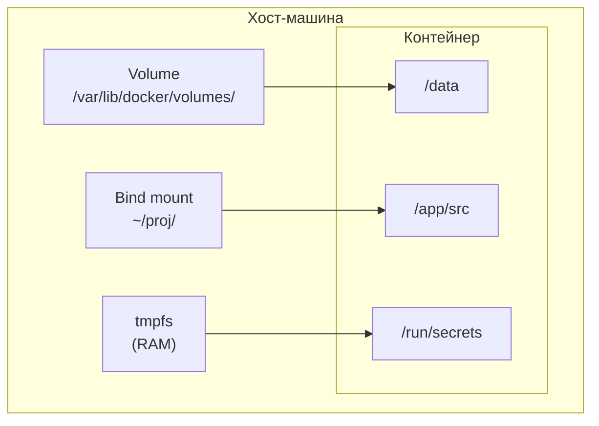

# Уровень 4: Тома и данные -- персистентность в Docker

## 🎯 Проблема: контейнеры эфемерны

Контейнеры по своей природе **временные**. Когда контейнер удаляется, все данные внутри него исчезают безвозвратно. Это фундаментальное свойство Docker.

```bash
# Создаём контейнер и записываем данные
docker run --name mydb -d postgres:16
docker exec mydb psql -U postgres -c "CREATE TABLE users (id INT, name TEXT)"
docker exec mydb psql -U postgres -c "INSERT INTO users VALUES (1, 'Alice')"

# Удаляем контейнер
docker rm -f mydb

# Создаём новый контейнер -- данных нет!
docker run --name mydb -d postgres:16
docker exec mydb psql -U postgres -c "SELECT * FROM users"
# ERROR: relation "users" does not exist
```

Это означает, что без специальных механизмов:
- Базы данных теряют данные при перезапуске
- Логи исчезают вместе с контейнером
- Загруженные пользователем файлы пропадают
- Конфигурации нужно пересоздавать каждый раз

Docker решает эту проблему с помощью **трёх типов монтирования**: volumes (тома), bind mounts и tmpfs.

---

## 🔥 Три типа хранения данных в Docker

Docker предоставляет три механизма для работы с данными за пределами файловой системы контейнера:

| Тип | Где хранятся данные | Управление | Использование |
|---|---|---|---|
| **Volumes** | Область Docker на хосте | Docker Engine | Продакшен-данные |
| **Bind mounts** | Любой путь на хосте | Пользователь | Разработка, конфиги |
| **tmpfs** | Оперативная память | Ядро ОС | Секреты, временные файлы |

### Визуальная модель



---

## 🔥 Named Volumes -- именованные тома

Именованные тома -- это **рекомендуемый способ** хранения персистентных данных в Docker. Docker полностью управляет их жизненным циклом.

### Создание и использование

```bash
# Создать том
docker volume create mydata

# Запустить контейнер с томом
docker run -d --name app -v mydata:/app/data nginx

# Тот же синтаксис с --mount (более явный)
docker run -d --name app --mount source=mydata,target=/app/data nginx
```

### Жизненный цикл тома

```bash
# Создание
docker volume create pgdata

# Просмотр информации
docker volume inspect pgdata
# [{ "Name": "pgdata",
#    "Driver": "local",
#    "Mountpoint": "/var/lib/docker/volumes/pgdata/_data",
#    "Scope": "local" }]

# Список всех томов
docker volume ls

# Удаление тома
docker volume rm pgdata

# Удаление неиспользуемых томов
docker volume prune
```

### Данные переживают контейнер

```bash
# Контейнер 1: записываем данные
docker run --name writer -v mydata:/data alpine sh -c "echo 'Hello' > /data/test.txt"
docker rm writer

# Контейнер 2: данные на месте!
docker run --name reader -v mydata:/data alpine cat /data/test.txt
# Hello
docker rm reader
```

### Автоматическое создание тома

Если том не существует, Docker создаст его автоматически:

```bash
# Том "newvolume" будет создан автоматически
docker run -v newvolume:/data alpine ls /data
```

---

## 🔥 Анонимные тома vs Именованные тома

### Анонимные тома

Создаются при использовании `-v` без имени или через `VOLUME` в Dockerfile:

```bash
# Анонимный том (без имени)
docker run -v /data alpine ls

# В Dockerfile
# VOLUME /data
```

Анонимные тома получают случайное имя (хэш) и **не переиспользуются** между контейнерами:

```bash
docker volume ls
# DRIVER  VOLUME NAME
# local   a1b2c3d4e5f6g7h8...  (анонимный)
# local   mydata                 (именованный)
```

### Сравнение

| Характеристика | Именованный том | Анонимный том |
|---|---|---|
| **Имя** | Задаётся пользователем | Случайный хэш |
| **Переиспользование** | Легко подключить к другому контейнеру | Сложно найти и подключить |
| **Удаление** | Вручную `docker volume rm` | `docker volume prune` или `docker rm -v` |
| **Идентификация** | Понятно назначение | Непонятно, что хранит |
| **Рекомендация** | Для продакшена | Избегать |

📌 **Всегда используйте именованные тома.** Анонимные тома создают мусор и усложняют управление данными.

---

## 🔥 Bind Mounts -- монтирование директорий хоста

Bind mounts напрямую подключают **директорию или файл с хоста** внутрь контейнера. Изменения видны мгновенно в обе стороны.

### Синтаксис

```bash
# Короткий синтаксис (-v)
docker run -v /host/path:/container/path image

# Полный синтаксис (--mount)
docker run --mount type=bind,source=/host/path,target=/container/path image
```

### Главный use case: разработка

```bash
# Монтируем исходный код для live-reload
docker run -d \
  -v $(pwd)/src:/app/src \
  -v $(pwd)/package.json:/app/package.json \
  -p 3000:3000 \
  my-node-app

# Теперь изменения в ./src на хосте мгновенно видны в контейнере
```

### Монтирование конфигурационных файлов

```bash
# Nginx-конфиг с хоста
docker run -d \
  -v $(pwd)/nginx.conf:/etc/nginx/nginx.conf:ro \
  -p 80:80 \
  nginx

# PostgreSQL-конфиг
docker run -d \
  -v $(pwd)/postgresql.conf:/etc/postgresql/postgresql.conf:ro \
  -v pgdata:/var/lib/postgresql/data \
  postgres:16 -c 'config_file=/etc/postgresql/postgresql.conf'
```

### Абсолютные пути обязательны

```bash
# ❌ Относительный путь интерпретируется как имя тома!
docker run -v ./src:/app/src image
# Docker может создать ТОМ с именем "./src" вместо bind mount

# ✅ Абсолютный путь
docker run -v $(pwd)/src:/app/src image
docker run -v /home/user/project/src:/app/src image
```

### Различия bind mount и volume

| Характеристика | Volume | Bind Mount |
|---|---|---|
| **Расположение на хосте** | Управляется Docker | Любой путь |
| **Создание** | Docker создаёт | Должна существовать |
| **Бэкап** | `docker volume` команды | Стандартные инструменты ОС |
| **Переносимость** | Между хостами (с драйверами) | Привязан к конкретному хосту |
| **Производительность** | Оптимальная | Зависит от ОС (macOS медленнее) |
| **Безопасность** | Изолирован от хоста | Доступ к файлам хоста |

---

## 🔥 `-v` vs `--mount` -- два синтаксиса

Docker поддерживает два синтаксиса для монтирования. `--mount` более явный и рекомендуется для новых проектов.

### Синтаксис `-v` (volume)

```bash
# Volume
docker run -v mydata:/app/data image

# Bind mount
docker run -v /host/path:/container/path image

# С флагами
docker run -v mydata:/app/data:ro image
```

### Синтаксис `--mount`

```bash
# Volume
docker run --mount source=mydata,target=/app/data image

# Bind mount
docker run --mount type=bind,source=/host/path,target=/container/path image

# С флагами
docker run --mount source=mydata,target=/app/data,readonly image

# tmpfs
docker run --mount type=tmpfs,target=/tmp,tmpfs-size=100m image
```

### Ключевые различия

| Поведение | `-v` | `--mount` |
|---|---|---|
| **Несуществующий путь хоста** | Создаст директорию | Вернёт ошибку |
| **Несуществующий том** | Создаст автоматически | Вернёт ошибку |
| **Читаемость** | Компактный | Самодокументирующийся |
| **tmpfs** | Нужен `--tmpfs` | `type=tmpfs` |

```bash
# ❌ -v тихо создаёт директорию, если путь не существует
docker run -v /nonexistent/path:/data alpine ls /data
# Создаст /nonexistent/path на хосте (пустая директория)

# ✅ --mount вернёт понятную ошибку
docker run --mount type=bind,source=/nonexistent/path,target=/data alpine ls /data
# Error: /nonexistent/path does not exist
```

💡 **Рекомендация:** используйте `--mount` в скриптах и CI/CD, `-v` -- для быстрых команд в терминале.

---

## 🔥 tmpfs -- монтирование в оперативную память

tmpfs-монтирования хранят данные **только в памяти**. Данные никогда не записываются на диск и исчезают при остановке контейнера.

### Когда использовать tmpfs

- **Секреты:** пароли, токены, ключи -- не попадут на диск
- **Временные файлы:** кэш, сессии, промежуточные данные
- **Высокопроизводительный I/O:** когда нужна максимальная скорость записи/чтения

### Синтаксис

```bash
# Флаг --tmpfs
docker run --tmpfs /tmp nginx

# --mount синтаксис (позволяет настроить размер)
docker run --mount type=tmpfs,target=/tmp,tmpfs-size=100m nginx

# Ограничение размера и прав
docker run --mount type=tmpfs,target=/tmp,tmpfs-size=64m,tmpfs-mode=1777 nginx
```

### Пример: безопасная работа с секретами

```bash
# Секреты хранятся только в RAM
docker run -d \
  --mount type=tmpfs,target=/run/secrets,tmpfs-size=1m \
  -e DB_PASSWORD=secret123 \
  my-app

# Даже если атакующий получит доступ к диску хоста,
# секретов там не будет
```

### Параметры tmpfs

| Параметр | Описание | Пример |
|---|---|---|
| `tmpfs-size` | Максимальный размер в байтах | `tmpfs-size=100m` |
| `tmpfs-mode` | Права доступа (восьмеричные) | `tmpfs-mode=1777` |

---

## 🔥 Read-only контейнеры и монтирования

### Read-only контейнер

Флаг `--read-only` делает **всю файловую систему** контейнера доступной только для чтения:

```bash
# Контейнер не может писать в свою файловую систему
docker run --read-only nginx
# nginx: [emerg] mkdir() "/var/cache/nginx" failed: Read-only file system

# Решение: разрешить запись в нужные директории через tmpfs
docker run --read-only \
  --tmpfs /var/cache/nginx \
  --tmpfs /var/run \
  --tmpfs /tmp \
  nginx
```

### Read-only монтирование `:ro`

Суффикс `:ro` делает конкретное монтирование доступным только для чтения:

```bash
# Конфиг -- только для чтения, данные -- для записи
docker run -d \
  -v $(pwd)/nginx.conf:/etc/nginx/nginx.conf:ro \
  -v web-data:/usr/share/nginx/html:ro \
  -v logs:/var/log/nginx \
  nginx
```

### Зачем использовать read-only

- **Безопасность:** атакующий не сможет модифицировать бинарники или конфиги
- **Стабильность:** контейнер не может "сломать" себя случайной записью
- **Воспроизводимость:** гарантия, что контейнер работает точно как образ

```bash
# Production-паттерн: read-only + точечные исключения
docker run --read-only \
  --tmpfs /tmp:size=50m \
  --tmpfs /var/run \
  -v app-logs:/var/log/app \
  -v $(pwd)/config.yaml:/app/config.yaml:ro \
  my-production-app
```

---

## 🔥 Обмен данными между контейнерами

Тома позволяют нескольким контейнерам работать с одними и теми же данными:

```bash
# Создаём общий том
docker volume create shared-data

# Контейнер-писатель
docker run -d --name writer \
  -v shared-data:/data \
  alpine sh -c "while true; do date >> /data/log.txt; sleep 5; done"

# Контейнер-читатель
docker run -d --name reader \
  -v shared-data:/data:ro \
  alpine sh -c "while true; do cat /data/log.txt; sleep 10; done"
```

### Паттерн: сайдкар для логирования

```bash
# Приложение пишет логи
docker run -d --name app \
  -v app-logs:/var/log/app \
  my-app

# Сайдкар читает и отправляет логи
docker run -d --name log-shipper \
  -v app-logs:/logs:ro \
  fluentd
```

---

## 🔥 Бэкап и восстановление томов

### Бэкап тома в tar-архив

```bash
# Создаём временный контейнер, который монтирует том и директорию для бэкапа
docker run --rm \
  -v mydata:/source:ro \
  -v $(pwd)/backups:/backup \
  alpine tar czf /backup/mydata-backup.tar.gz -C /source .
```

### Восстановление из бэкапа

```bash
# Создаём новый том и восстанавливаем данные
docker volume create mydata-restored

docker run --rm \
  -v mydata-restored:/target \
  -v $(pwd)/backups:/backup:ro \
  alpine tar xzf /backup/mydata-backup.tar.gz -C /target
```

### Копирование тома

```bash
# Копирование данных из одного тома в другой
docker volume create mydata-copy

docker run --rm \
  -v mydata:/source:ro \
  -v mydata-copy:/target \
  alpine sh -c "cp -a /source/. /target/"
```

---

## 📌 Volume drivers -- драйверы томов

По умолчанию Docker использует драйвер `local`, который хранит данные на локальном диске. Но существуют драйверы для удалённого хранения:

```bash
# Создание тома с драйвером (пример: NFS)
docker volume create --driver local \
  --opt type=nfs \
  --opt o=addr=192.168.1.100,rw \
  --opt device=:/path/to/share \
  nfs-data

# Использование
docker run -v nfs-data:/data my-app
```

Популярные драйверы:
- **local** -- локальное хранение (по умолчанию)
- **nfs** -- Network File System
- **Azure File Storage**, **AWS EFS** -- облачные хранилища
- **GlusterFS**, **Ceph** -- распределённые файловые системы

---

## 🔥 VOLUME в Dockerfile

Инструкция `VOLUME` в Dockerfile объявляет точку монтирования:

```dockerfile
FROM postgres:16
# Объявляем том для данных
VOLUME /var/lib/postgresql/data
```

### Что делает VOLUME в Dockerfile

1. При `docker run` без `-v` создаётся **анонимный том**
2. Данные в указанной директории **не включаются** в слои образа
3. Служит **документацией** -- какие директории нужно персистить

```bash
# Без -v: создаётся анонимный том для /var/lib/postgresql/data
docker run -d postgres:16

# С -v: используется именованный том
docker run -d -v pgdata:/var/lib/postgresql/data postgres:16
```

### ⚠️ Ловушка VOLUME в Dockerfile

```dockerfile
FROM node:20-alpine
WORKDIR /app

# ❌ VOLUME до COPY/RUN: изменения в /app/data не сохранятся в образе!
VOLUME /app/data
RUN echo "test" > /app/data/file.txt  # Этот файл НЕ попадёт в образ

# ✅ Правильно: VOLUME в конце
COPY . .
RUN npm ci
VOLUME /app/data
```

📌 Инструкции `RUN`, `COPY` после `VOLUME` для той же директории **не сохраняются** в слоях образа.

---

## 🔥 Best practices

### 1. Используйте именованные тома для данных

```bash
# ✅ Именованный том: понятно, что хранит
docker run -v postgres-data:/var/lib/postgresql/data postgres:16

# ❌ Анонимный том: невозможно идентифицировать
docker run -v /var/lib/postgresql/data postgres:16
```

### 2. Bind mounts -- только для разработки

```bash
# ✅ Разработка: bind mount для hot-reload
docker run -v $(pwd)/src:/app/src -p 3000:3000 dev-image

# ✅ Продакшен: именованный том
docker run -v app-data:/app/data -p 3000:3000 prod-image
```

### 3. Read-only по умолчанию

```bash
# ✅ Явно указывайте, что нужно только чтение
docker run -v config:/etc/app/config:ro my-app
```

### 4. Регулярно чистите неиспользуемые тома

```bash
# Просмотр "висящих" томов
docker volume ls -f dangling=true

# Удаление неиспользуемых
docker volume prune
```

### 5. Не храните данные в контейнере

```bash
# ❌ Логи внутри контейнера -- потеряются
docker run my-app  # логи пишутся в /var/log/app/

# ✅ Логи в томе
docker run -v app-logs:/var/log/app my-app
```

### 6. Используйте --mount в скриптах

```bash
# ✅ Явный синтаксис, ошибки при несуществующих путях
docker run --mount source=mydata,target=/data my-app

# ❌ -v тихо создаст директорию/том
docker run -v mydata:/data my-app
```

---

## ⚠️ Частые ошибки новичков

### 🐛 1. Забыли подключить том -- данные потеряны

```bash
# ❌ Нет тома: данные БД исчезнут при удалении контейнера
docker run -d --name db postgres:16
docker rm -f db
# Все данные потеряны!
```

> **Почему это ошибка:** контейнер хранит данные в своей файловой системе (writable layer). При удалении контейнера этот слой удаляется вместе со всеми данными.

```bash
# ✅ Том сохраняет данные между контейнерами
docker run -d --name db -v pgdata:/var/lib/postgresql/data postgres:16
docker rm -f db
docker run -d --name db2 -v pgdata:/var/lib/postgresql/data postgres:16
# Данные на месте!
```

### 🐛 2. Относительный путь вместо абсолютного в bind mount

```bash
# ❌ Docker интерпретирует как имя тома, а не путь!
docker run -v src:/app/src my-app
# Создаст ТОМ с именем "src", а не bind mount для ./src

# ❌ Точка-слэш может вести себя по-разному в разных версиях
docker run -v ./src:/app/src my-app
```

> **Почему это ошибка:** Docker различает тома и bind mounts по наличию `/` в начале пути. Строка без `/` интерпретируется как имя тома.

```bash
# ✅ Абсолютный путь для bind mount
docker run -v $(pwd)/src:/app/src my-app
docker run -v /home/user/project/src:/app/src my-app
```

### 🐛 3. Перезапись содержимого контейнера bind mount-ом

```bash
# ❌ Пустая директория хоста заменит node_modules контейнера!
docker run -v $(pwd):/app my-node-app
# /app/node_modules в контейнере теперь ПУСТА
# (потому что на хосте нет node_modules)
```

> **Почему это ошибка:** bind mount полностью заменяет содержимое целевой директории в контейнере. Если на хосте нет нужных файлов, контейнер их тоже не увидит.

```bash
# ✅ Используйте анонимный том для node_modules
docker run \
  -v $(pwd):/app \
  -v /app/node_modules \
  my-node-app
# node_modules из образа сохранится в анонимном томе
```

### 🐛 4. Проблемы с правами доступа

```bash
# ❌ Контейнер работает от root, файлы на хосте принадлежат root
docker run -v $(pwd)/data:/data alpine sh -c "echo test > /data/file.txt"
ls -la data/file.txt
# -rw-r--r-- root root file.txt  -- хост-пользователь не может редактировать!
```

> **Почему это ошибка:** процесс в контейнере по умолчанию работает от root (UID 0). Файлы, созданные через bind mount, получают UID/GID процесса контейнера.

```bash
# ✅ Запускайте контейнер от текущего пользователя
docker run -v $(pwd)/data:/data --user $(id -u):$(id -g) alpine \
  sh -c "echo test > /data/file.txt"
```

### 🐛 5. Использование tmpfs для данных, которые нужно сохранить

```bash
# ❌ Данные в tmpfs исчезнут при остановке контейнера!
docker run --tmpfs /var/lib/postgresql/data postgres:16
# После docker stop все данные БД потеряны
```

> **Почему это ошибка:** tmpfs хранит данные только в оперативной памяти. При остановке или перезапуске контейнера все данные удаляются.

```bash
# ✅ tmpfs только для временных данных и секретов
docker run \
  -v pgdata:/var/lib/postgresql/data \
  --tmpfs /tmp \
  postgres:16
```

---

## 📌 Итоги

- ✅ **Volumes** -- основной способ хранения данных, управляется Docker
- ✅ **Bind mounts** -- монтирование директорий хоста, идеально для разработки
- ✅ **tmpfs** -- данные в RAM, для секретов и временных файлов
- ✅ Всегда используйте **именованные тома**, избегайте анонимных
- ✅ `--mount` -- явный синтаксис, рекомендуется для скриптов
- ✅ `-v` -- компактный синтаксис для быстрых команд
- ✅ `:ro` -- read-only для конфигов и данных, которые не нужно менять
- ✅ `--read-only` -- защищает файловую систему контейнера целиком
- ✅ Бэкап томов через временный контейнер с `tar`
- ✅ `docker volume prune` -- удаление неиспользуемых томов
- ✅ Bind mounts требуют **абсолютные пути**
- ✅ Один контейнер может использовать **несколько типов монтирования** одновременно
