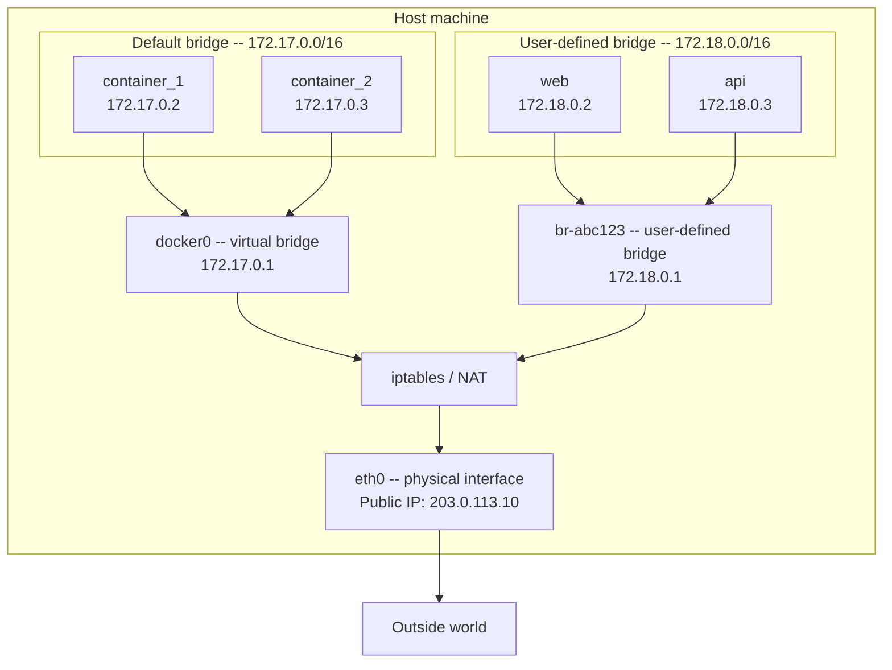
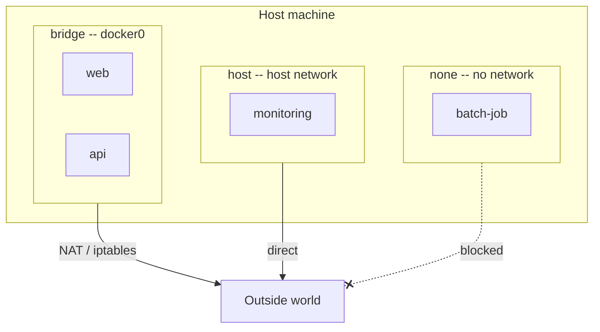
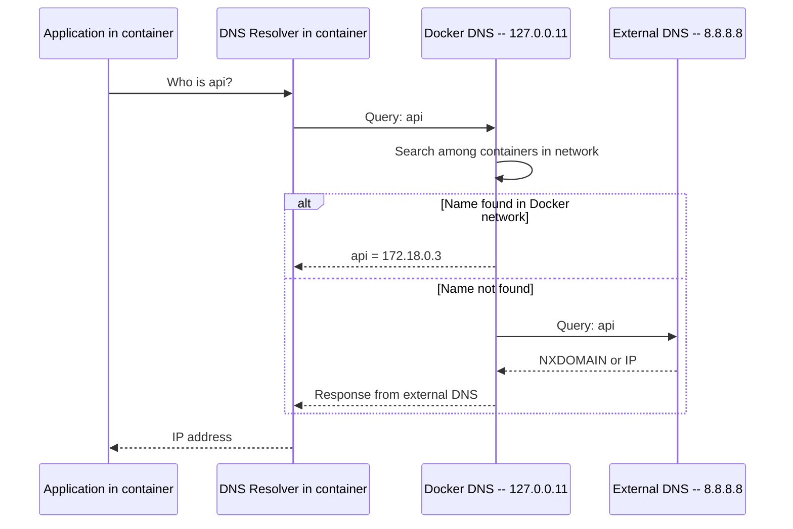
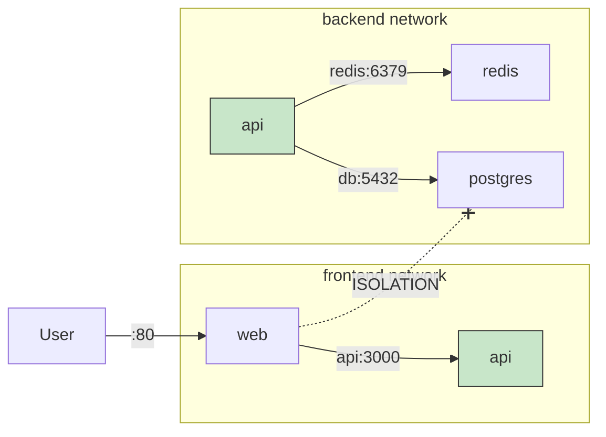

# Level 5: Networking -- How Containers Communicate

## Introduction

Imagine an office building with multiple floors. On each floor -- its own company with its own internal phone network. Employees of one company can call each other by short numbers: "dial 101 -- accounting, 102 -- warehouse." But you can't call another floor by a short number -- you need to dial the full city number. And for the outside world to call you, you need to publish your number in the directory.

Docker networks work by the same principle. Each network is a "floor" with internal telephony. Containers within one network find each other by name (like by short number). Containers in different networks are isolated from each other. And for the outside world to reach a container -- you need to "publish" the port.

In this level, we will explore in detail:

1. **Why containers need a network** -- the isolation problem and its solutions
2. **Network drivers** -- bridge, host, none, overlay, macvlan and when to use each
3. **Bridge networks** -- default bridge vs user-defined, why default bridge isn't suitable for real projects
4. **DNS in Docker** -- how containers find each other by name
5. **Port forwarding** -- how to make a service accessible from outside, syntax and pitfalls
6. **Network isolation** -- how to restrict access between containers
7. **Practical patterns** -- network architecture for real applications
8. **Common mistakes** -- what usually goes wrong for beginners

---

## 1. Why Containers Need Networking

### The Problem: Containers Are Isolated by Default

Every Docker container runs in its **own network namespace**. This is a fundamental Linux mechanism that gives a container:

- Its own IP address
- Its own routing table
- Its own set of network interfaces
- Its own firewall rules (iptables)

This means two containers by default don't know about each other -- just like two computers in different apartments aren't connected to the same network.

```bash
# Start two containers
docker run -d --name web nginx
docker run -d --name api node:20

# web trying to reach api by name -- doesn't work
docker exec web curl http://api:3000
# curl: (6) Could not resolve host: api
```

Why is this a problem? Because modern applications consist of multiple services:

- **Frontend** needs to reach **backend**
- **Backend** needs to reach **database** and **cache**
- **User from browser** needs to reach the application in the container
- Meanwhile, the **database** should not be publicly accessible

All of this is solved through Docker's networking subsystem.

### How Docker Creates Networking: Bird's Eye View

Before diving into details, let's look at the big picture of what happens at the host machine level when Docker configures networking.



Docker creates **virtual network bridges** on the host machine. Each container connects to such a bridge via a virtual network interface (veth pair). The bridge acts as a switch -- it routes traffic between connected containers. For external network access, NAT is used through iptables.

If you're familiar with virtual machines -- this is similar to a virtual switch in VMware or VirtualBox, only lighter.

---

## 2. Docker Network Drivers

Docker supports several network drivers. Each driver is a way of organizing networking for containers, optimized for a specific scenario.

### Driver Overview

| Driver | How it works | When to use | Analogy |
|---|---|---|---|
| **bridge** | Virtual bridge on host, NAT for external access | Default, for most tasks | Office network with router |
| **host** | Container uses host network directly | Maximum performance, monitoring | Plugging directly into provider socket |
| **none** | Complete network disabling | Batch tasks, enhanced security | Computer without network card |
| **overlay** | Network across multiple Docker hosts | Docker Swarm, clusters | VPN between offices in different cities |
| **macvlan** | Container gets MAC address in physical network | Legacy equipment integration | Separate patch cord into server room socket |

### Networks Created on Docker Installation

When Docker is installed, three networks are created automatically:

```bash
docker network ls
# NETWORK ID     NAME      DRIVER    SCOPE
# a1b2c3d4e5f6   bridge    bridge    local
# d7e8f9a0b1c2   host      host      local
# e3f4a5b6c7d8   none      null      local
```

- **bridge** -- default network. All containers without explicit `--network` go here.
- **host** -- special network removing network isolation between container and host.
- **none** -- special network completely disabling container's network stack.

These networks cannot be deleted -- they're built into Docker.

### Visual Model



Next we'll examine each driver in detail, but the main focus is on bridge -- the one you'll use in 90% of cases.

---

## 3. Bridge Network -- The Main Driver

Bridge is the most important and frequently used Docker network driver. It creates a virtual Ethernet bridge on the host machine, to which containers connect. This is like a home router: devices connect to the router and see each other through it, and for internet access the router performs NAT.

### 3.1. Default Bridge (docker0)

When running a container without specifying a network, it automatically connects to the **default bridge** -- a network named `bridge` with Linux interface `docker0`:

```bash
# Both containers go into default bridge
docker run -d --name web nginx
docker run -d --name api node:20

# Check IP addresses
docker inspect web --format '{{range .NetworkSettings.Networks}}{{.IPAddress}}{{end}}'
# 172.17.0.2

docker inspect api --format '{{range .NetworkSettings.Networks}}{{.IPAddress}}{{end}}'
# 172.17.0.3
```

Containers get IP addresses from the `172.17.0.0/16` subnet. Gateway -- `172.17.0.1` (the docker0 bridge itself on the host).

You can verify that containers can communicate **by IP address**:

```bash
docker exec web curl http://172.17.0.3:3000
# Works -- api responds
```

But try reaching **by name**:

```bash
docker exec web curl http://api:3000
# curl: (6) Could not resolve host: api
```

Doesn't work. And this is the main problem with default bridge.

### 3.2. Why Default Bridge Is a Bad Choice

Default bridge has several serious limitations making it unsuitable for real projects:

**No automatic DNS.** Containers can't find each other by name. The only way to communicate is by IP address, but IP addresses change every time a container is recreated.

**No isolation between applications.** All containers launched without `--network` end up in the same network. Your test redis container can "see" the production postgres container -- they're both in default bridge.

**Unpredictable IP addresses.** Docker allocates IPs on a "first available" basis. Today postgres is `172.17.0.2`, and tomorrow after recreation -- `172.17.0.5`. All clients using hardcoded IPs will break.

**Deprecated --link mechanism.** Docker used to offer `--link` for connecting containers in default bridge. This mechanism has long been deprecated and should not be used.

```bash
# ❌ Deprecated: don't use --link
docker run -d --name db postgres:16
docker run -d --name app --link db:database my-app
# Works, but this is a legacy approach
```

> 📌 **Default bridge is only suitable for quick one-off tests. For everything else -- create custom networks.**

### 3.3. User-Defined Bridge -- The Right Choice

User-defined bridge networks solve all the problems of default bridge. Creating such a network is one command:

```bash
# Create a network
docker network create my-app-net

# Run containers in this network
docker run -d --name web --network my-app-net nginx
docker run -d --name api --network my-app-net node:20

# DNS by container name works!
docker exec web curl http://api:3000
# Response from api server
```

What changed? Docker launched a **built-in DNS server** (127.0.0.11) for this network. Now each container can reach other containers by name -- like employees in an office can call each other by short numbers.

### Default Bridge vs User-Defined Bridge Comparison

| Feature | Default bridge | User-defined bridge |
|---|---|---|
| **DNS by container name** | No | Yes |
| **Automatic isolation** | All together | Only network participants |
| **Hot-plugging** | No | `docker network connect` |
| **Subnet configuration** | Limited | Full (`--subnet`, `--gateway`) |
| **Network aliases** | No | Yes (`--network-alias`) |
| **Docker recommendation** | Not recommended | Recommended |

### Creating a Network with Extended Parameters

When creating a network, you can set a specific subnet, gateway, and IP range:

```bash
docker network create \
  --driver bridge \
  --subnet 172.20.0.0/16 \
  --gateway 172.20.0.1 \
  --ip-range 172.20.240.0/20 \
  custom-net
```

This is useful when you need to:
- Avoid conflicts with existing subnets in a corporate network
- Assign predictable IP addresses to containers (though it's better to rely on DNS)
- Integrate with external monitoring systems that filter by IP ranges

---

## 4. DNS in Docker Networks

### How Built-in DNS Works

DNS is perhaps the most important function of custom Docker networks. Without it, you'd have to manually track container IP addresses, which turns work into a nightmare.

In every custom network, Docker runs a DNS server at `127.0.0.11`. You can verify this by looking inside `/etc/resolv.conf` in the container:

```bash
docker network create my-net
docker run -d --name web --network my-net nginx

docker exec web cat /etc/resolv.conf
# nameserver 127.0.0.11
# options ndots:0
```

When a container performs a DNS query (for example, `curl http://api:3000`), here's what happens:



Docker DNS first searches for the name among containers in the same network. If not found -- it forwards the query to external DNS (by default -- the host machine's DNS). This means from inside a container you can resolve both other container names and regular domain names like `google.com`.

### What Resolves Through Docker DNS

In a custom network, Docker DNS knows about three types of names:

**1. Container name** (`--name`):

```bash
docker run -d --name postgres --network backend postgres:16
# Other containers in backend can reach postgres by name "postgres"
```

**2. Network aliases** (`--network-alias`):

```bash
docker run -d --name postgres-primary \
  --network backend \
  --network-alias db \
  --network-alias database \
  postgres:16

# Container is available by any of the names:
# postgres-primary, db, database
docker exec api ping db
# PING db (172.18.0.2): 56 data bytes
```

Aliases are especially useful for abstraction. Say your application reaches the database by the name `db`. Today `db` is PostgreSQL, and tomorrow you decided to switch to MySQL. Just stop the PostgreSQL container and launch MySQL with the same alias `db` -- the application won't notice.

**3. Docker Compose service names** -- created automatically (we'll cover this in the Docker Compose level).

### Multiple Containers with the Same Alias

If multiple containers are registered under the same alias, Docker performs the simplest **DNS-level load balancing** (DNS round-robin):

```bash
docker network create lb-net

docker run -d --name worker1 --network lb-net --network-alias worker alpine sleep 3600
docker run -d --name worker2 --network lb-net --network-alias worker alpine sleep 3600
docker run -d --name worker3 --network lb-net --network-alias worker alpine sleep 3600

# DNS returns different IPs on each query
docker run --rm --network lb-net alpine nslookup worker
# Name:      worker
# Address 1: 172.18.0.2 worker1
# Address 2: 172.18.0.3 worker2
# Address 3: 172.18.0.4 worker3
```

> ⚠️ DNS round-robin is not a real load balancer. DNS responses are cached, and traffic distribution will be uneven. For production load balancing, use nginx, HAProxy, or Traefik.

### Custom DNS Settings

Docker allows fine-tuning DNS behavior of containers:

```bash
# Specify a particular external DNS server
docker run --dns 8.8.8.8 --dns 8.8.4.4 alpine nslookup google.com

# Specify search domain
docker run --dns-search example.com alpine ping web
# Tries web.example.com

# Add entry to container's /etc/hosts
docker run --add-host myhost:10.0.0.5 alpine ping myhost
# PING myhost (10.0.0.5): 56 data bytes
```

### Accessing the Host Machine from a Container

A common task -- connecting from a container to a service on the host machine. For example, backend in a container, and the database running on the host for debugging.

```bash
# On macOS and Windows -- works out of the box
docker run --rm alpine ping host.docker.internal

# On Linux -- needs to be specified explicitly
docker run --add-host host.docker.internal:host-gateway alpine \
  curl http://host.docker.internal:3000
```

`host-gateway` is a special value that Docker replaces with the host machine's IP (usually the bridge network gateway IP).

> 📌 **`host.docker.internal`** -- standard name for accessing the host machine from a container. On Linux it requires explicit `--add-host`, on macOS and Windows it works automatically.

---

## 5. Port Forwarding -- Publishing Services

### Why Port Forwarding Is Needed

Containers in a bridge network live in an isolated subnet like `172.18.0.0/16`. This subnet is inaccessible from the outside world -- and this is correct from a security standpoint. But if you've launched a web server in a container, users need to be able to connect to it.

Port mapping creates a "tunnel" between a port on the host machine and a port inside the container:


### -p Syntax

The `-p` (or `--publish`) flag sets a port forwarding rule:

```bash
# Basic format: -p <host_port>:<container_port>
docker run -p 8080:80 nginx
# localhost:8080 on host -> port 80 in container
```

Full format: `-p [host_IP:]host_port:container_port[/protocol]`

```bash
# Binding to a specific interface (localhost only)
docker run -p 127.0.0.1:8080:80 nginx
# Accessible only from the host itself, not from external network

# Random port on host
docker run -p 80 nginx
# Docker will assign a free port (usually 32768+)
docker port <container_id>
# 80/tcp -> 0.0.0.0:32771

# Publish all ports from EXPOSE
docker run -P nginx
# Docker publishes all Dockerfile EXPOSE ports on random host ports

# UDP port
docker run -p 5353:53/udp dns-server

# Multiple ports
docker run -p 80:80 -p 443:443 nginx

# TCP and UDP on the same port
docker run -p 53:53/tcp -p 53:53/udp dns-server
```

### How It Works Under the Hood

When you run `docker run -p 8080:80 nginx`, Docker does the following:

1. Creates an iptables rule redirecting traffic from host port 8080 to the container's IP, port 80
2. Docker-proxy (userland proxy) listens on port 8080 and forwards connections

You can see these rules:

```bash
# iptables rules created by Docker
sudo iptables -t nat -L DOCKER -n
# DNAT tcp -- 0.0.0.0/0  0.0.0.0/0  tcp dpt:8080 to:172.17.0.2:80
```

### EXPOSE vs -p -- Important Distinction

Many beginners confuse the `EXPOSE` instruction in Dockerfile and the `-p` flag at launch. Let's sort this out once and for all.

**`EXPOSE` in Dockerfile -- documentation, nothing more:**

```dockerfile
FROM nginx
EXPOSE 80 443
# Says: "Attention, this application listens on ports 80 and 443"
# But does NOT publish them externally
```

**`-p` at launch -- actual port publishing:**

```bash
# Without -p: nginx runs but is inaccessible from outside
docker run -d nginx
# With -p: nginx accessible on localhost:8080
docker run -d -p 8080:80 nginx
```

**`-P` (uppercase) -- publishing all EXPOSE ports on random host ports:**

```bash
docker run -d -P nginx
docker port <container_id>
# 80/tcp -> 0.0.0.0:32771
# 443/tcp -> 0.0.0.0:32772
```

> 📌 `EXPOSE` is a hint for people and tools. `-p` is actual action. `EXPOSE` without `-p` opens nothing.

### Viewing Published Ports

```bash
# All container ports
docker port my-container
# 80/tcp -> 0.0.0.0:8080
# 443/tcp -> 0.0.0.0:8443

# Specific port
docker port my-container 80
# 0.0.0.0:8080
```

### Port Forwarding Security

By default, `-p 8080:80` binds the port to **all interfaces** (`0.0.0.0`). On a server with a public IP, this means the service is accessible from the internet. This is a serious security risk for internal services.

```bash
# ❌ Dangerous on a server with a public IP
docker run -p 5432:5432 postgres:16
# Database accessible to the entire internet!

# ✅ Safe: binding to localhost only
docker run -p 127.0.0.1:5432:5432 postgres:16
# Database accessible only from the server itself
```

---

## 6. Communication Between Containers

### Within One Network -- It's Simple

Containers in the same custom network communicate directly by names. **Port forwarding is not needed** -- ports are available within the network automatically:

```bash
docker network create app-net

# Database -- port NOT published externally
docker run -d --name postgres --network app-net \
  -e POSTGRES_PASSWORD=secret \
  postgres:16

# Backend -- connects to DB by name "postgres"
docker run -d --name api --network app-net \
  -e DB_HOST=postgres \
  -e DB_PORT=5432 \
  -p 3000:3000 \
  my-api

# api reaches postgres:5432 inside the network
# Port 5432 NOT published -- DB inaccessible from outside
# Port 3000 published -- API accessible to users
```

Note the key point: **we publish only the API port**, and the database port stays inside the network. This is a basic security principle -- minimize attack surface.

### Between Different Networks -- Isolation

Containers in **different networks can't see each other**. This is not a bug -- it's a feature, and a very important one:

```bash
docker network create frontend
docker network create backend

docker run -d --name web --network frontend nginx
docker run -d --name api --network backend node:20

# web can NOT reach api
docker exec web curl http://api:3000
# curl: (6) Could not resolve host: api
```

Even if you know the container's IP address in another network -- you can't reach it. Docker configures iptables to block traffic between different bridge networks.

### Container Bridge Between Networks

A container can be connected to multiple networks simultaneously. This creates a "bridge" -- a container that sees both sides:

```bash
docker network create frontend
docker network create backend

# API server connected to both networks
docker run -d --name api --network frontend my-api
docker network connect backend api

# Database -- only in backend
docker run -d --name db --network backend postgres:16

# Web server -- only in frontend
docker run -d --name web --network frontend nginx
```

What we get:



- **web** sees **api** (both in frontend)
- **api** sees **db** and **redis** (all in backend)
- **web** does NOT see **db** (isolation between networks)

This is a classic pattern -- the API server acts as a "gateway" between public and private networks.

### Hot-Plugging and Disconnecting

A feature of custom networks -- a container can be connected to an additional network or disconnected from one **without restarting**:

```bash
# Container already running in frontend network
docker run -d --name app --network frontend my-app

# Connect also to backend -- without stopping
docker network connect backend app

# Check which networks the container is in
docker inspect app --format '{{json .NetworkSettings.Networks}}' | jq
# {
#   "frontend": { "IPAddress": "172.18.0.2" },
#   "backend":  { "IPAddress": "172.19.0.3" }
# }

# Disconnect from frontend -- also without stopping
docker network disconnect frontend app
```

This is useful for debugging -- you can temporarily connect a debug container to a problematic service's network.

---

## 7. Host Network -- Working Without Isolation

### What It Is

In `host` mode, a container **doesn't get its own network namespace**. Instead, it directly uses the host machine's network stack -- same interfaces, same IPs, same ports:

```bash
# nginx listens on port 80 directly on the host
docker run --network host nginx
# Accessible on http://localhost:80 without -p
```

If a bridge network is like an office with its own internal telephony and PBX, then host network is like taking a city phone and putting it right on the worker's desk. No internal PBX, calls go directly.

### When Host Network Is Useful

**Maximum network performance.** No overhead from virtual bridge, NAT, and iptables. For high-load network applications, this can give a noticeable boost.

**Working with the network stack.** Applications for network monitoring, metric collection, traffic analysis -- they need to see all host network interfaces.

**Multiple ports.** If an application uses dozens or hundreds of ports (for example, a SIP server), listing each one via `-p` is inconvenient.

### Host Network Limitations

```bash
# ❌ Port conflict: two nginx can't listen on one port
docker run --network host --name web1 nginx
docker run --network host --name web2 nginx
# Error: bind: address already in use

# ❌ No network isolation -- container sees ALL host interfaces

# ❌ Doesn't work on macOS and Windows!
# Docker Desktop uses a Linux VM,
# so host is the VM's network, not your Mac/Windows
```

> 📌 Host network is a specialized tool for specific tasks. In 95% of cases, bridge with port forwarding is the right choice.

---

## 8. None Network -- Complete Disabling

The `none` mode completely disables networking for a container. It only has a loopback interface (127.0.0.1):

```bash
docker run --network none alpine ip addr
# 1: lo: <LOOPBACK,UP> ... inet 127.0.0.1/8
# No other interfaces

docker run --network none alpine ping google.com
# ping: bad address 'google.com'
```

It's like a computer with its Ethernet cable unplugged and Wi-Fi turned off. It works, can process data, but can't send or receive anything over the network.

### When None Is Useful

- **Batch tasks without network** -- file processing, report generation, computations. If a task doesn't need network, why give it access?
- **Enhanced security** -- even if the container has malicious code, it can't send data out.
- **Testing** -- how does the application behave without network access?

---

## 9. Practical Network Patterns

### Classic Three-Tier Architecture

```yaml
# docker-compose.yml
services:
  web:
    image: nginx
    networks:
      - frontend
    ports:
      - "80:80"

  api:
    image: my-api
    networks:
      - frontend
      - backend
    ports:
      - "3000:3000"

  db:
    image: postgres:16
    networks:
      - backend
    volumes:
      - pgdata:/var/lib/postgresql/data

networks:
  frontend:
  backend:

volumes:
  pgdata:
```

- **web** (frontend) -- accessible from outside, reaches only **api**
- **api** (backend + frontend) -- gateway between public and private
- **db** (backend) -- accessible only from **api**, completely hidden from outside

### Debug Container

```bash
# Create a debug container in the same network as the problem service
docker run -it --rm --network my-app-net nicolaka/netshoot bash

# Inside: full suite of network debugging tools
curl http://api:3000          # HTTP test
nslookup api                   # DNS test
ping db                        # Connectivity test
tcpdump -i eth0                # Traffic capture
```

---

## Common Beginner Mistakes

### 1. Using Default Bridge for Multi-Container Applications

```bash
# ❌ Containers can't reach each other by name
docker run -d --name db postgres:16
docker run -d --name api my-api
# api can't reach db by name "db"
```

Solution: create a custom network:

```bash
docker network create myapp
docker run -d --name db --network myapp postgres:16
docker run -d --name api --network myapp my-api
```

### 2. Publishing Ports Unnecessarily

```bash
# ❌ Database port published to the whole world
docker run -d -p 5432:5432 postgres:16
```

If the database only needs to be accessed by other containers in the same network, don't publish the port:

```bash
# ✅ No -p flag -- accessible only within the network
docker run -d --network myapp postgres:16
```

### 3. Forgetting That Host Network Doesn't Work on macOS/Windows

```bash
# ❌ Won't work as expected on Docker Desktop
docker run --network host nginx
```

On Docker Desktop, `--network host` refers to the Linux VM's network, not your Mac/Windows network.

---

## Summary

Docker networking allows containers to communicate with each other and with the outside world. The main driver you'll use in 90% of cases is **bridge**.

Key rules:

- ✅ Always create custom bridge networks for multi-container applications
- ✅ Containers in the same custom network can reach each other by name (DNS)
- ✅ Publish only the ports that need to be accessible from outside
- ✅ Use network isolation to protect sensitive services (databases, caches)
- ✅ A container can be connected to multiple networks simultaneously
- ❌ Don't use default bridge for real applications
- ❌ Don't publish database ports to the outside world
- ❌ Don't use `--network host` on macOS/Windows (it works differently)
