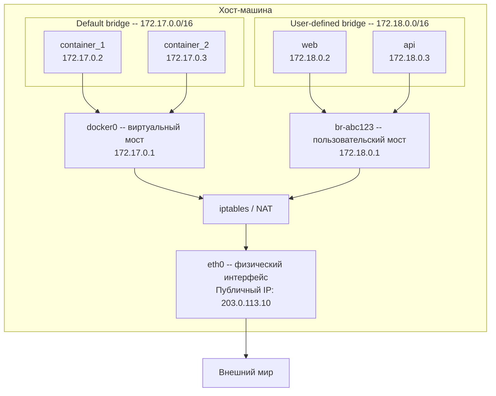
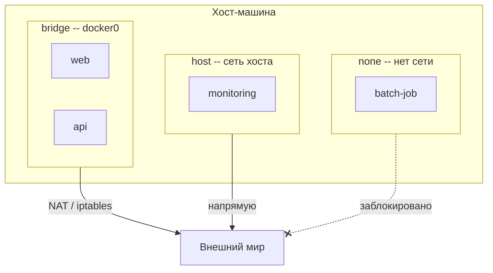
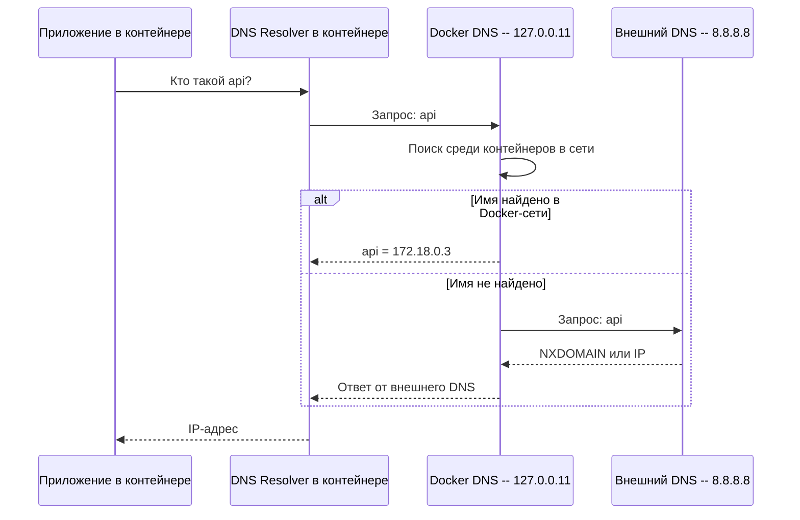
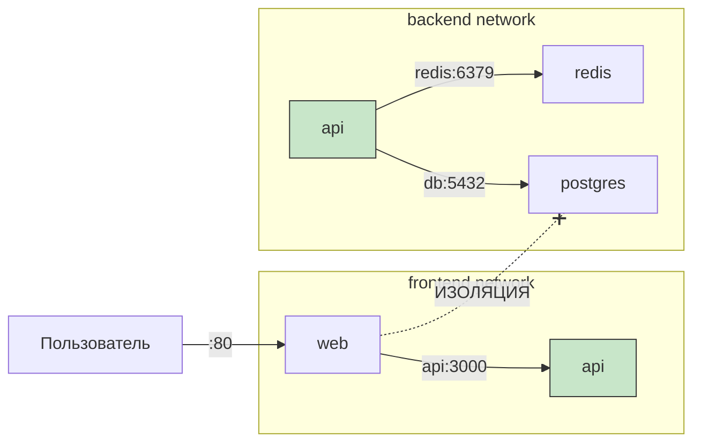
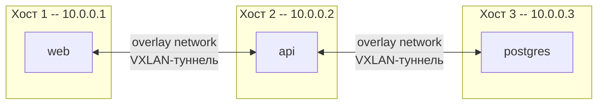

# Уровень 5: Сеть -- как контейнеры общаются друг с другом

## Введение

Представьте офисное здание с несколькими этажами. На каждом этаже -- своя компания со своей внутренней телефонной сетью. Сотрудники одной компании могут звонить друг другу по коротким номерам: "наберите 101 -- бухгалтерия, 102 -- склад". Но позвонить на другой этаж по короткому номеру нельзя -- нужно набирать полный городской номер. А чтобы вам позвонили извне, нужно опубликовать свой номер в справочнике.

Docker-сети работают по тому же принципу. Каждая сеть -- это "этаж" с внутренней телефонией. Контейнеры внутри одной сети находят друг друга по имени (как по короткому номеру). Контейнеры в разных сетях изолированы друг от друга. А чтобы внешний мир мог достучаться до контейнера -- нужно "опубликовать" порт.

На этом уровне мы подробно разберём:

1. **Зачем контейнерам сеть** -- проблема изоляции и способы её решения
2. **Сетевые драйверы** -- bridge, host, none, overlay, macvlan и когда какой применять
3. **Bridge-сети** -- default bridge vs user-defined, почему default bridge не подходит для реальных проектов
4. **DNS в Docker** -- как контейнеры находят друг друга по имени
5. **Проброс портов** -- как сделать сервис доступным извне, синтаксис и подводные камни
6. **Сетевая изоляция** -- как разграничить доступ между контейнерами
7. **Практические паттерны** -- архитектура сетей для реальных приложений
8. **Типичные ошибки** -- что обычно идёт не так у новичков

---

## 1. Зачем контейнерам сеть

### Проблема: контейнеры изолированы по умолчанию

Каждый Docker-контейнер запускается в **собственном сетевом пространстве имён** (network namespace). Это фундаментальный механизм Linux, который даёт контейнеру:

- Собственный IP-адрес
- Собственную таблицу маршрутизации
- Собственный набор сетевых интерфейсов
- Собственные правила файрвола (iptables)

Это означает, что два контейнера по умолчанию не знают друг о друге -- так же как два компьютера в разных квартирах не подключены к одной сети.

```bash
# Запускаем два контейнера
docker run -d --name web nginx
docker run -d --name api node:20

# web пытается обратиться к api по имени -- не работает
docker exec web curl http://api:3000
# curl: (6) Could not resolve host: api
```

Почему это проблема? Потому что современные приложения состоят из множества сервисов:

- **Frontend** должен обращаться к **backend**
- **Backend** должен обращаться к **базе данных** и **кэшу**
- **Пользователь из браузера** должен достучаться до приложения в контейнере
- При этом **база данных** не должна быть доступна публично

Всё это решается через сетевую подсистему Docker.

### Как Docker создаёт сеть: вид с высоты птичьего полёта

Прежде чем погружаться в детали, давайте посмотрим на общую картину того, что происходит на уровне хост-машины, когда Docker настраивает сеть.



Docker создаёт **виртуальные сетевые мосты** (bridges) на хост-машине. Каждый контейнер подключается к такому мосту через виртуальный сетевой интерфейс (veth pair). Мост играет роль свича -- он коммутирует трафик между подключёнными контейнерами. Для выхода во внешнюю сеть используется NAT через iptables.

Если вы знакомы с виртуальными машинами -- это похоже на виртуальный свич в VMware или VirtualBox, только легковеснее.

---

## 2. Сетевые драйверы Docker

Docker поддерживает несколько сетевых драйверов. Каждый драйвер -- это способ организации сети для контейнеров, оптимизированный под определённый сценарий.

### Обзор драйверов

| Драйвер | Как работает | Когда использовать | Аналогия |
|---|---|---|---|
| **bridge** | Виртуальный мост на хосте, NAT для выхода наружу | По умолчанию, для большинства задач | Офисная сеть с роутером |
| **host** | Контейнер использует сеть хоста напрямую | Максимальная производительность, мониторинг | Подключение напрямую к розетке провайдера |
| **none** | Полное отключение сети | Batch-задачи, повышенная безопасность | Компьютер без сетевой карты |
| **overlay** | Сеть между несколькими Docker-хостами | Docker Swarm, кластеры | VPN между офисами в разных городах |
| **macvlan** | Контейнер получает MAC-адрес в физической сети | Интеграция с legacy-оборудованием | Отдельный патч-корд в серверную розетку |

### Какие сети создаются при установке Docker

При установке Docker автоматически создаёт три сети:

```bash
docker network ls
# NETWORK ID     NAME      DRIVER    SCOPE
# a1b2c3d4e5f6   bridge    bridge    local
# d7e8f9a0b1c2   host      host      local
# e3f4a5b6c7d8   none      null      local
```

- **bridge** -- сеть по умолчанию. Все контейнеры без явного указания `--network` попадают сюда.
- **host** -- специальная сеть, убирающая сетевую изоляцию между контейнером и хостом.
- **none** -- специальная сеть, полностью отключающая сетевой стек контейнера.

Эти сети нельзя удалить -- они встроены в Docker.

### Визуальная модель



Дальше мы разберём каждый драйвер в деталях, но основной акцент сделаем на bridge -- именно его вы будете использовать в 90% случаев.

---

## 3. Bridge network -- основной драйвер

Bridge -- самый важный и часто используемый сетевой драйвер Docker. Он создаёт виртуальный Ethernet-мост на хост-машине, к которому подключаются контейнеры. Это похоже на домашний роутер: устройства подключены к роутеру и видят друг друга через него, а для выхода в интернет роутер выполняет NAT.

### 3.1. Default bridge (docker0)

При запуске контейнера без указания сети он автоматически подключается к **default bridge** -- сети с именем `bridge` и Linux-интерфейсом `docker0`:

```bash
# Оба контейнера попадают в default bridge
docker run -d --name web nginx
docker run -d --name api node:20

# Смотрим IP-адреса
docker inspect web --format '{{range .NetworkSettings.Networks}}{{.IPAddress}}{{end}}'
# 172.17.0.2

docker inspect api --format '{{range .NetworkSettings.Networks}}{{.IPAddress}}{{end}}'
# 172.17.0.3
```

Контейнеры получают IP-адреса из подсети `172.17.0.0/16`. Шлюз -- `172.17.0.1` (сам мост docker0 на хосте).

Можно убедиться, что контейнеры могут общаться **по IP-адресу**:

```bash
docker exec web curl http://172.17.0.3:3000
# Работает -- api отвечает
```

Но попробуйте обратиться **по имени**:

```bash
docker exec web curl http://api:3000
# curl: (6) Could not resolve host: api
```

Не работает. И это главная проблема default bridge.

### 3.2. Почему default bridge -- плохой выбор

Default bridge имеет ряд серьёзных ограничений, из-за которых он не подходит для реальных проектов:

**Нет автоматического DNS.** Контейнеры не могут находить друг друга по имени. Единственный способ связи -- по IP-адресу, но IP-адреса меняются при каждом пересоздании контейнера.

**Нет изоляции между приложениями.** Все контейнеры, запущенные без `--network`, попадают в одну и ту же сеть. Ваш тестовый контейнер redis может "увидеть" production-контейнер postgres -- они оба в default bridge.

**IP-адреса непредсказуемы.** Docker выделяет IP по принципу "первый свободный". Сегодня postgres -- это `172.17.0.2`, а завтра после пересоздания -- `172.17.0.5`. Все клиенты, использующие жёстко прописанный IP, сломаются.

**Устаревший механизм --link.** Docker раньше предлагал `--link` для связи контейнеров в default bridge. Этот механизм давно помечен как deprecated и не должен использоваться.

```bash
# ❌ Deprecated: не используйте --link
docker run -d --name db postgres:16
docker run -d --name app --link db:database my-app
# Работает, но это legacy-подход
```

> 📌 **Default bridge подходит только для быстрых одноразовых тестов. Для всего остального -- создавайте пользовательские сети.**

### 3.3. User-defined bridge -- правильный выбор

Пользовательские bridge-сети решают все проблемы default bridge. Создать такую сеть -- одна команда:

```bash
# Создаём сеть
docker network create my-app-net

# Запускаем контейнеры в этой сети
docker run -d --name web --network my-app-net nginx
docker run -d --name api --network my-app-net node:20

# DNS по имени контейнера работает!
docker exec web curl http://api:3000
# Ответ от api-сервера
```

Что изменилось? Docker запустил **встроенный DNS-сервер** (127.0.0.11) для этой сети. Теперь каждый контейнер может обращаться к другим контейнерам по имени -- как сотрудники в офисе могут звонить друг другу по короткому номеру.

### Сравнение default bridge и user-defined bridge

| Возможность | Default bridge | User-defined bridge |
|---|---|---|
| **DNS по имени контейнера** | Нет | Да |
| **Автоматическая изоляция** | Все вместе | Только участники сети |
| **Горячее подключение** | Нет | `docker network connect` |
| **Настройка подсети** | Ограничена | Полная (`--subnet`, `--gateway`) |
| **Сетевые алиасы** | Нет | Да (`--network-alias`) |
| **Рекомендация Docker** | Не рекомендуется | Рекомендуется |

### Создание сети с расширенными параметрами

При создании сети можно задать конкретную подсеть, шлюз и диапазон IP-адресов:

```bash
docker network create \
  --driver bridge \
  --subnet 172.20.0.0/16 \
  --gateway 172.20.0.1 \
  --ip-range 172.20.240.0/20 \
  custom-net
```

Это полезно, когда вам нужно:
- Избежать конфликтов с существующими подсетями в корпоративной сети
- Назначить контейнерам предсказуемые IP-адреса (хотя лучше полагаться на DNS)
- Интегрироваться с внешними системами мониторинга, которые фильтруют по IP-диапазонам

---

## 4. DNS в Docker-сетях

### Как работает встроенный DNS

DNS -- пожалуй, самая важная функция пользовательских сетей Docker. Без него пришлось бы вручную отслеживать IP-адреса контейнеров, что превращает работу в кошмар.

В каждой пользовательской сети Docker запускает DNS-сервер на адресе `127.0.0.11`. Вы можете убедиться в этом, заглянув в `/etc/resolv.conf` внутри контейнера:

```bash
docker network create my-net
docker run -d --name web --network my-net nginx

docker exec web cat /etc/resolv.conf
# nameserver 127.0.0.11
# options ndots:0
```

Когда контейнер выполняет DNS-запрос (например, `curl http://api:3000`), происходит следующее:



Docker DNS сначала ищет имя среди контейнеров в той же сети. Если не находит -- пробрасывает запрос на внешний DNS (по умолчанию -- DNS хост-машины). Это означает, что из контейнера можно резолвить как имена других контейнеров, так и обычные доменные имена вроде `google.com`.

### Что резолвится через Docker DNS

В пользовательской сети Docker DNS знает о трёх типах имён:

**1. Имя контейнера** (`--name`):

```bash
docker run -d --name postgres --network backend postgres:16
# Другие контейнеры в backend могут обращаться к postgres по имени "postgres"
```

**2. Сетевые алиасы** (`--network-alias`):

```bash
docker run -d --name postgres-primary \
  --network backend \
  --network-alias db \
  --network-alias database \
  postgres:16

# Контейнер доступен по любому из имён:
# postgres-primary, db, database
docker exec api ping db
# PING db (172.18.0.2): 56 data bytes
```

Алиасы особенно полезны для абстрагирования. Допустим, ваше приложение обращается к базе по имени `db`. Сегодня за `db` стоит PostgreSQL, а завтра вы решили перейти на MySQL. Достаточно остановить контейнер PostgreSQL и запустить MySQL с тем же алиасом `db` -- приложение ничего не заметит.

**3. Имена сервисов Docker Compose** -- создаются автоматически (это мы разберём в уровне про Docker Compose).

### Несколько контейнеров с одним алиасом

Если несколько контейнеров зарегистрированы под одним алиасом, Docker выполняет простейшую **балансировку нагрузки на уровне DNS** (DNS round-robin):

```bash
docker network create lb-net

docker run -d --name worker1 --network lb-net --network-alias worker alpine sleep 3600
docker run -d --name worker2 --network lb-net --network-alias worker alpine sleep 3600
docker run -d --name worker3 --network lb-net --network-alias worker alpine sleep 3600

# DNS возвращает разные IP при каждом запросе
docker run --rm --network lb-net alpine nslookup worker
# Name:      worker
# Address 1: 172.18.0.2 worker1
# Address 2: 172.18.0.3 worker2
# Address 3: 172.18.0.4 worker3
```

> ⚠️ DNS round-robin -- не настоящий балансировщик нагрузки. DNS-ответы кэшируются, и распределение трафика будет неравномерным. Для production-балансировки используйте nginx, HAProxy или Traefik.

### Кастомные DNS-настройки

Docker позволяет тонко настраивать DNS-поведение контейнеров:

```bash
# Указать конкретный внешний DNS-сервер
docker run --dns 8.8.8.8 --dns 8.8.4.4 alpine nslookup google.com

# Указать домен поиска
docker run --dns-search example.com alpine ping web
# Пробует web.example.com

# Добавить запись в /etc/hosts контейнера
docker run --add-host myhost:10.0.0.5 alpine ping myhost
# PING myhost (10.0.0.5): 56 data bytes
```

### Доступ к хост-машине из контейнера

Частая задача -- подключиться из контейнера к сервису на хост-машине. Например, backend в контейнере, а база данных запущена на хосте для отладки.

```bash
# На macOS и Windows -- работает из коробки
docker run --rm alpine ping host.docker.internal

# На Linux -- нужно явно указать
docker run --add-host host.docker.internal:host-gateway alpine \
  curl http://host.docker.internal:3000
```

`host-gateway` -- это специальное значение, которое Docker заменяет на IP хост-машины (обычно IP шлюза bridge-сети).

> 📌 **`host.docker.internal`** -- стандартное имя для доступа к хост-машине из контейнера. На Linux требует явного `--add-host`, на macOS и Windows работает автоматически.

---

## 5. Проброс портов -- публикация сервисов

### Зачем нужен проброс портов

Контейнеры в bridge-сети живут в изолированной подсети вроде `172.18.0.0/16`. Эта подсеть недоступна из внешнего мира -- и это правильно с точки зрения безопасности. Но если вы запустили веб-сервер в контейнере, пользователи должны иметь возможность к нему подключиться.

Проброс портов (port mapping) создаёт "туннель" между портом на хост-машине и портом внутри контейнера:


### Синтаксис -p

Флаг `-p` (или `--publish`) задаёт правило проброса порта:

```bash
# Базовый формат: -p <хост_порт>:<контейнер_порт>
docker run -p 8080:80 nginx
# localhost:8080 на хосте -> порт 80 в контейнере
```

Полный формат: `-p [хост_IP:]хост_порт:контейнер_порт[/протокол]`

```bash
# Привязка к конкретному интерфейсу (только localhost)
docker run -p 127.0.0.1:8080:80 nginx
# Доступ только с самого хоста, не из внешней сети

# Случайный порт на хосте
docker run -p 80 nginx
# Docker назначит свободный порт (обычно 32768+)
docker port <container_id>
# 80/tcp -> 0.0.0.0:32771

# Публикация всех портов из EXPOSE
docker run -P nginx
# Docker опубликует все порты из Dockerfile EXPOSE на случайных портах хоста

# UDP-порт
docker run -p 5353:53/udp dns-server

# Несколько портов
docker run -p 80:80 -p 443:443 nginx

# TCP и UDP на одном порту
docker run -p 53:53/tcp -p 53:53/udp dns-server
```

### Как это работает под капотом

Когда вы запускаете `docker run -p 8080:80 nginx`, Docker делает следующее:

1. Создаёт правило iptables, перенаправляющее трафик с порта 8080 хоста на IP контейнера, порт 80
2. Docker-proxy (userland proxy) слушает порт 8080 и пробрасывает соединения

Вы можете увидеть эти правила:

```bash
# Правила iptables, созданные Docker
sudo iptables -t nat -L DOCKER -n
# DNAT tcp -- 0.0.0.0/0  0.0.0.0/0  tcp dpt:8080 to:172.17.0.2:80
```

### EXPOSE vs -p -- важное различие

Многие новички путают инструкцию `EXPOSE` в Dockerfile и флаг `-p` при запуске. Давайте разберёмся раз и навсегда.

**`EXPOSE` в Dockerfile -- это документация, не более:**

```dockerfile
FROM nginx
EXPOSE 80 443
# Говорит: "Внимание, это приложение слушает порты 80 и 443"
# Но НЕ публикует их наружу
```

**`-p` при запуске -- реальная публикация порта:**

```bash
# Без -p: nginx работает, но недоступен снаружи
docker run -d nginx
# С -p: nginx доступен на localhost:8080
docker run -d -p 8080:80 nginx
```

**`-P` (заглавная) -- публикация всех EXPOSE-портов на случайных портах хоста:**

```bash
docker run -d -P nginx
docker port <container_id>
# 80/tcp -> 0.0.0.0:32771
# 443/tcp -> 0.0.0.0:32772
```

> 📌 `EXPOSE` -- это подсказка для людей и инструментов. `-p` -- это реальное действие. `EXPOSE` без `-p` ничего не открывает.

### Просмотр опубликованных портов

```bash
# Все порты контейнера
docker port my-container
# 80/tcp -> 0.0.0.0:8080
# 443/tcp -> 0.0.0.0:8443

# Конкретный порт
docker port my-container 80
# 0.0.0.0:8080
```

### Безопасность проброса портов

По умолчанию `-p 8080:80` привязывает порт к **всем интерфейсам** (`0.0.0.0`). На сервере с публичным IP это означает, что сервис доступен из интернета. Это серьёзный риск безопасности для внутренних сервисов.

```bash
# ❌ Опасно на сервере с публичным IP
docker run -p 5432:5432 postgres:16
# База данных доступна всему интернету!

# ✅ Безопасно: привязка только к localhost
docker run -p 127.0.0.1:5432:5432 postgres:16
# База доступна только с самого сервера
```

---

## 6. Связь между контейнерами

### Внутри одной сети -- всё просто

Контейнеры в одной пользовательской сети общаются напрямую по именам. **Проброс портов не нужен** -- порты доступны внутри сети автоматически:

```bash
docker network create app-net

# База данных -- порт НЕ публикуется наружу
docker run -d --name postgres --network app-net \
  -e POSTGRES_PASSWORD=secret \
  postgres:16

# Backend -- подключается к БД по имени "postgres"
docker run -d --name api --network app-net \
  -e DB_HOST=postgres \
  -e DB_PORT=5432 \
  -p 3000:3000 \
  my-api

# api обращается к postgres:5432 внутри сети
# Порт 5432 НЕ опубликован -- БД недоступна снаружи
# Порт 3000 опубликован -- API доступен пользователям
```

Заметьте ключевой момент: **публикуем только порт API**, а порт базы данных остаётся внутри сети. Это базовый принцип безопасности -- минимальная поверхность атаки.

### Между разными сетями -- изоляция

Контейнеры в **разных сетях не видят друг друга**. Это не баг -- это фича, и очень важная:

```bash
docker network create frontend
docker network create backend

docker run -d --name web --network frontend nginx
docker run -d --name api --network backend node:20

# web НЕ может достучаться до api
docker exec web curl http://api:3000
# curl: (6) Could not resolve host: api
```

Даже если вы знаете IP-адрес контейнера в другой сети -- обратиться к нему не получится. Docker настраивает iptables так, чтобы трафик между разными bridge-сетями блокировался.

### Контейнер-мост между сетями

Контейнер может быть подключён к нескольким сетям одновременно. Это позволяет создать "мост" -- контейнер, который видит обе стороны:

```bash
docker network create frontend
docker network create backend

# API-сервер подключён к обеим сетям
docker run -d --name api --network frontend my-api
docker network connect backend api

# База данных -- только в backend
docker run -d --name db --network backend postgres:16

# Веб-сервер -- только в frontend
docker run -d --name web --network frontend nginx
```

Что получилось:



- **web** видит **api** (оба в frontend)
- **api** видит **db** и **redis** (все в backend)
- **web** НЕ видит **db** (изоляция между сетями)

Это классический паттерн -- API-сервер играет роль "шлюза" между публичной и приватной сетями.

### Горячее подключение и отключение

Особенность пользовательских сетей -- контейнер можно подключить к дополнительной сети или отключить от неё **без перезапуска**:

```bash
# Контейнер уже работает в сети frontend
docker run -d --name app --network frontend my-app

# Подключаем также к backend -- без остановки
docker network connect backend app

# Смотрим, в каких сетях находится контейнер
docker inspect app --format '{{json .NetworkSettings.Networks}}' | jq
# {
#   "frontend": { "IPAddress": "172.18.0.2" },
#   "backend":  { "IPAddress": "172.19.0.3" }
# }

# Отключаем от frontend -- тоже без остановки
docker network disconnect frontend app
```

Это полезно при отладке -- можно временно подключить debug-контейнер к сети проблемного сервиса.

---

## 7. Host network -- работа без изоляции

### Что это такое

В режиме `host` контейнер **не получает собственное сетевое пространство имён**. Вместо этого он напрямую использует сетевой стек хост-машины -- те же интерфейсы, те же IP-адреса, те же порты:

```bash
# nginx слушает порт 80 прямо на хосте
docker run --network host nginx
# Доступен на http://localhost:80 без -p
```

Если представить bridge-сеть как офис со своей внутренней телефонией и АТС, то host network -- это когда вы берёте городской телефон и ставите его прямо на стол работника. Никакой внутренней АТС, звонки идут напрямую.

### Когда host network полезен

**Максимальная сетевая производительность.** Нет overhead от виртуального моста, NAT и iptables. Для сетевых приложений с высокой нагрузкой это может дать ощутимый прирост.

**Работа с сетевым стеком.** Приложения для мониторинга сети, сбора метрик, анализа трафика -- им нужно видеть все сетевые интерфейсы хоста.

**Множество портов.** Если приложение использует десятки или сотни портов (например, SIP-сервер), перечислять каждый через `-p` неудобно.

### Ограничения host network

```bash
# ❌ Конфликт портов: два nginx не могут слушать один порт
docker run --network host --name web1 nginx
docker run --network host --name web2 nginx
# Error: bind: address already in use

# ❌ Нет сетевой изоляции -- контейнер видит ВСЕ интерфейсы хоста

# ❌ Не работает на macOS и Windows!
# Docker Desktop использует виртуальную машину Linux,
# поэтому host -- это сеть VM, а не вашего Mac/Windows
```

> 📌 Host network -- специальный инструмент для конкретных задач. В 95% случаев bridge с пробросом портов -- правильный выбор.

---

## 8. None network -- полное отключение

Режим `none` полностью отключает сеть у контейнера. У него остаётся только loopback-интерфейс (127.0.0.1):

```bash
docker run --network none alpine ip addr
# 1: lo: <LOOPBACK,UP> ... inet 127.0.0.1/8
# Никаких других интерфейсов

docker run --network none alpine ping google.com
# ping: bad address 'google.com'
```

Это как компьютер с вытащенным Ethernet-кабелем и выключенным Wi-Fi. Он работает, может обрабатывать данные, но не может ничего отправить или принять по сети.

### Когда none полезен

- **Batch-задачи без сети** -- обработка файлов, генерация отчётов, вычисления. Если задаче не нужна сеть, зачем давать ей доступ?
- **Повышенная безопасность** -- даже если в контейнере окажется вредоносный код, он не сможет отправить данные наружу.
- **Тестирование** -- как приложение ведёт себя при отсутствии сети? Корректно ли обрабатывает timeout?

---

## 9. Overlay network -- сеть между хостами

Overlay -- это сетевой драйвер для **распределённых систем**, когда контейнеры работают на разных физических машинах (нодах). Overlay создаёт виртуальную сеть поверх существующей инфраструктуры, позволяя контейнерам на разных хостах общаться так, будто они в одной локальной сети.



Overlay используется в Docker Swarm и Kubernetes. Если вы работаете с одним хостом (а это 90% случаев для начинающих), overlay вам не нужен. Мы упоминаем его для полноты картины.

```bash
# Overlay требует Docker Swarm
docker swarm init
docker network create --driver overlay my-overlay-net
```

---

## 10. Управление сетями -- команды

### Полный набор команд

```bash
# Создать сеть
docker network create my-net

# Создать сеть с параметрами
docker network create \
  --driver bridge \
  --subnet 172.20.0.0/16 \
  --gateway 172.20.0.1 \
  custom-net

# Список всех сетей
docker network ls

# Подробная информация о сети
docker network inspect my-net

# Подключить работающий контейнер к сети
docker network connect my-net existing-container

# Отключить контейнер от сети
docker network disconnect my-net existing-container

# Удалить сеть (должна быть пустой)
docker network rm my-net

# Удалить все неиспользуемые сети
docker network prune
```

### Инспекция сети

Команда `docker network inspect` -- ваш главный инструмент отладки сетевых проблем:

```bash
docker network inspect my-app-net
```

Она покажет:
- Подсеть и шлюз
- Список подключённых контейнеров с их IP-адресами
- Драйвер и конфигурацию сети
- Параметры (Labels, Options)

```json
{
    "Name": "my-app-net",
    "Driver": "bridge",
    "IPAM": {
        "Config": [
            {
                "Subnet": "172.18.0.0/16",
                "Gateway": "172.18.0.1"
            }
        ]
    },
    "Containers": {
        "a1b2c3...": {
            "Name": "web",
            "IPv4Address": "172.18.0.2/16"
        },
        "d4e5f6...": {
            "Name": "api",
            "IPv4Address": "172.18.0.3/16"
        }
    }
}
```

---

## 11. Практические паттерны

### Паттерн 1: Веб-приложение с базой данных

Самый распространённый сценарий -- приложение + база данных в изолированной сети:

```bash
# Создаём изолированную сеть
docker network create webapp

# База данных -- порт НЕ публикуется наружу
docker run -d --name db \
  --network webapp \
  -v pgdata:/var/lib/postgresql/data \
  -e POSTGRES_PASSWORD=secret \
  postgres:16

# Приложение -- подключается к БД по имени, публикует HTTP
docker run -d --name app \
  --network webapp \
  -e DATABASE_URL=postgresql://postgres:secret@db:5432/postgres \
  -p 3000:3000 \
  my-app
```

Ключевые моменты:
- БД доступна только внутри сети `webapp` -- нет публичного порта
- Приложение обращается к БД по DNS-имени `db`
- Только порт 3000 приложения доступен снаружи

### Паттерн 2: Reverse proxy перед сервисами

```bash
docker network create proxy-net

# Backend-сервисы -- без публичных портов
docker run -d --name api1 --network proxy-net my-api-1
docker run -d --name api2 --network proxy-net my-api-2
docker run -d --name frontend --network proxy-net my-frontend

# Nginx -- единственная точка входа
docker run -d --name proxy \
  --network proxy-net \
  -v ./nginx.conf:/etc/nginx/nginx.conf:ro \
  -p 80:80 -p 443:443 \
  nginx
```

В `nginx.conf` сервисы доступны по именам:

```nginx
upstream api {
    server api1:3000;
    server api2:3000;
}

server {
    listen 80;
    location /api/ {
        proxy_pass http://api;
    }
    location / {
        proxy_pass http://frontend:3000;
    }
}
```

### Паттерн 3: Многоуровневая изоляция

```bash
# Три уровня изоляции
docker network create public    # nginx <-> frontend
docker network create internal  # frontend <-> api
docker network create data      # api <-> databases

# Nginx -- только в public
docker run -d --name nginx --network public -p 80:80 nginx

# Frontend -- в public и internal
docker run -d --name frontend --network public my-frontend
docker network connect internal frontend

# API -- в internal и data
docker run -d --name api --network internal my-api
docker network connect data api

# БД -- только в data
docker run -d --name postgres --network data postgres:16
docker run -d --name redis --network data redis:7
```

Результат:
- nginx видит frontend, но НЕ видит api и БД
- frontend видит nginx и api, но НЕ видит БД
- api видит frontend и БД, но НЕ видит nginx
- БД видит только api

### Паттерн 4: Отладка сетевых проблем

Когда что-то не работает, полезно запустить отладочный контейнер в той же сети:

```bash
# Контейнер с сетевыми утилитами
docker run -it --rm \
  --network my-app-net \
  nicolaka/netshoot \
  bash

# Внутри netshoot доступны: ping, curl, dig, nslookup,
# tcpdump, iperf, ss, ip и десятки других утилит

# Проверить DNS
dig api
nslookup postgres

# Проверить доступность порта
curl -v http://api:3000/health

# Проверить сетевые соединения
ss -tuln

# Подключиться к сети конкретного контейнера для отладки
docker run -it --rm \
  --network container:my-app \
  nicolaka/netshoot \
  tcpdump -i eth0 port 80
```

> 💡 Образ `nicolaka/netshoot` -- швейцарский нож для отладки Docker-сетей. Держите его в закладках.

---

## 12. Best practices

### 1. Всегда создавайте пользовательские сети

```bash
# ✅ Пользовательская сеть: DNS, изоляция, гибкость
docker network create my-app
docker run --network my-app --name api my-api

# ❌ Default bridge: нет DNS, нет изоляции
docker run --name api my-api
```

### 2. Не публикуйте порты внутренних сервисов

```bash
# ❌ Redis доступен всему интернету
docker run -p 6379:6379 redis

# ✅ Redis доступен только внутри Docker-сети
docker run --network backend --name redis redis
```

### 3. Привязывайте публичные порты к 127.0.0.1

```bash
# ❌ Порт доступен на всех интерфейсах, включая публичный IP
docker run -p 3000:3000 my-app

# ✅ Порт доступен только с localhost
docker run -p 127.0.0.1:3000:3000 my-app
```

### 4. Используйте сетевые алиасы для абстракции

```bash
# ✅ Алиас "db" позволяет заменить реализацию без изменения клиентов
docker run --network app --network-alias db postgres:16
# Позже можно заменить на MySQL, сохранив алиас "db"
docker run --network app --network-alias db mysql:8
```

### 5. Разделяйте сети по назначению

```bash
# ✅ Каждый слой в своей сети
docker network create frontend
docker network create backend
docker network create monitoring
```

### 6. Используйте EXPOSE как документацию

```dockerfile
# ✅ Сразу видно, какие порты использует приложение
FROM node:20-alpine
EXPOSE 3000
# Документация для docker port, docker-compose и разработчиков
```

### 7. Не используйте жёстко прописанные IP-адреса

```bash
# ❌ IP может измениться при пересоздании
docker run -e DB_HOST=172.17.0.2 my-app

# ✅ DNS-имя стабильно
docker run --network app-net -e DB_HOST=postgres my-app
```

---

## 13. Частые ошибки новичков

### 1. DNS не работает -- забыли создать пользовательскую сеть

```bash
# ❌ Default bridge -- DNS по имени не работает
docker run -d --name db postgres:16
docker run -d --name app -e DB_HOST=db my-app
# app не может найти "db" по имени
```

> Почему это ошибка: default bridge не предоставляет DNS-резолвинг имён контейнеров. Контейнеры могут общаться только по IP-адресам, которые непредсказуемо меняются.

```bash
# ✅ Пользовательская сеть -- DNS работает
docker network create app-net
docker run -d --name db --network app-net postgres:16
docker run -d --name app --network app-net -e DB_HOST=db my-app
```

### 2. Публикация портов внутренних сервисов

```bash
# ❌ Зачем Redis торчит наружу?
docker run -d -p 6379:6379 redis
# Любой в вашей сети может подключиться и стереть данные
```

> Почему это ошибка: публикация порта открывает сервис для внешнего мира. Базы данных, кэши, очереди сообщений -- всё это должно быть доступно только через внутреннюю сеть Docker.

```bash
# ✅ Redis доступен только контейнерам в сети backend
docker network create backend
docker run -d --name redis --network backend redis
docker run -d --name app --network backend -e REDIS_HOST=redis my-app
```

### 3. Жёстко прописанные IP-адреса

```bash
# ❌ Прописали IP -- работает... пока не пересоздадим контейнер
docker run -d --name db postgres:16
# IP: 172.17.0.2
docker run -d -e DB_HOST=172.17.0.2 my-app

# Через неделю пересоздали db
docker rm -f db
docker run -d --name db postgres:16
# IP: 172.17.0.5 -- приложение сломано!
```

> Почему это ошибка: Docker не гарантирует одинаковый IP при пересоздании контейнера. DNS-имена стабильны, IP-адреса -- нет.

```bash
# ✅ DNS-имя всегда указывает на актуальный IP
docker network create app-net
docker run -d --name db --network app-net postgres:16
docker run -d --name app --network app-net -e DB_HOST=db my-app
```

### 4. Порт 0.0.0.0 на сервере с публичным IP

```bash
# ❌ На production-сервере с IP 203.0.113.10
docker run -p 3000:3000 my-app
# Эквивалентно -p 0.0.0.0:3000:3000
# Сервис доступен из интернета на http://203.0.113.10:3000
```

> Почему это ошибка: по умолчанию `-p` привязывает порт ко всем сетевым интерфейсам. На сервере с публичным IP это значит, что любой человек в интернете может подключиться.

```bash
# ✅ Привязка к localhost -- доступ только с самого сервера
docker run -p 127.0.0.1:3000:3000 my-app
# Используйте nginx или другой reverse proxy для публичного доступа
```

### 5. Контейнеры в разных сетях не видят друг друга

```bash
# ❌ Контейнеры в разных сетях -- изоляция!
docker network create net-a
docker network create net-b
docker run -d --name svc-a --network net-a alpine sleep 3600
docker run -d --name svc-b --network net-b alpine sleep 3600

docker exec svc-a ping svc-b
# ping: bad address 'svc-b'
```

> Почему это ошибка: сетевая изоляция -- это фича, а не баг. Docker намеренно блокирует трафик между разными сетями.

```bash
# ✅ Способ 1: поместить оба в одну сеть
docker run -d --name svc-a --network shared alpine sleep 3600
docker run -d --name svc-b --network shared alpine sleep 3600

# ✅ Способ 2: подключить контейнер к дополнительной сети
docker network connect net-a svc-b
```

### 6. Путаница EXPOSE и -p

```bash
# ❌ "Я написал EXPOSE в Dockerfile, почему не работает?"
# Dockerfile:
# FROM nginx
# EXPOSE 80

docker run my-nginx
curl http://localhost:80
# curl: (7) Failed to connect -- порт не опубликован!
```

> Почему это ошибка: `EXPOSE` -- только документация, метаданные образа. Реальная публикация порта происходит через `-p` при запуске контейнера.

```bash
# ✅ Реальная публикация через -p
docker run -p 8080:80 my-nginx
curl http://localhost:8080
# Работает!
```

### 7. Забытые сети засоряют систему

```bash
# За месяц работы накопились десятки неиспользуемых сетей
docker network ls
# 47 сетей, из которых 40 -- от давно удалённых контейнеров
```

> Почему это проблема: каждая сеть занимает ресурсы ядра (виртуальный мост, iptables-правила). Со временем это может вызвать проблемы.

```bash
# ✅ Регулярная очистка
docker network prune
# WARNING! This will remove all custom networks not used by at least one container.
# Are you sure you want to continue? [y/N] y
```

---

## 14. Итоги

**Сетевые драйверы:**
- ✅ **Bridge** -- стандартный драйвер, виртуальная сеть с NAT. Используйте для 90% задач
- ✅ **Host** -- контейнер использует сеть хоста напрямую. Для специфических задач с высокой нагрузкой
- ✅ **None** -- полное отключение сети. Для batch-задач и повышенной безопасности
- ✅ **Overlay** -- сеть между несколькими хостами. Для Docker Swarm и распределённых систем

**Bridge-сети:**
- ✅ **Default bridge** -- автоматическая сеть без DNS. Только для быстрых тестов
- ✅ **User-defined bridge** -- DNS по имени контейнера, изоляция, горячее подключение. Рекомендуется для всех проектов

**DNS:**
- ✅ Docker DNS (127.0.0.11) резолвит имена контейнеров и алиасы
- ✅ DNS работает только в пользовательских сетях
- ✅ `host.docker.internal` -- доступ к хост-машине из контейнера

**Проброс портов:**
- ✅ `-p хост:контейнер` -- реальная публикация порта
- ✅ `EXPOSE` -- только документация, не публикует порт
- ✅ Привязывайте к `127.0.0.1` для безопасности

**Безопасность:**
- ✅ Не публикуйте порты внутренних сервисов
- ✅ Разделяйте сети по назначению
- ✅ Используйте DNS-имена, а не IP-адреса
- ✅ Контейнер в нескольких сетях = контролируемый шлюз между ними
