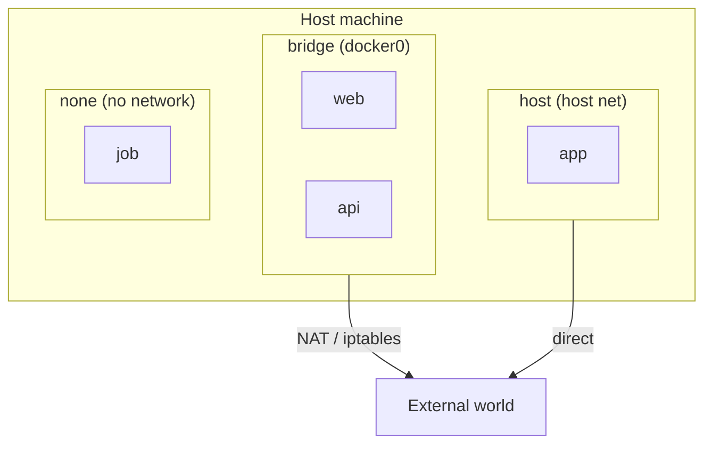
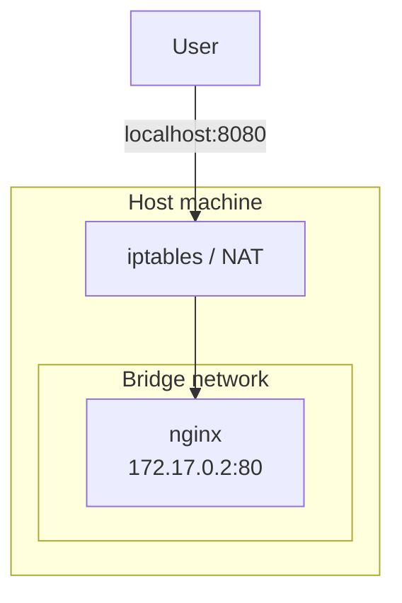
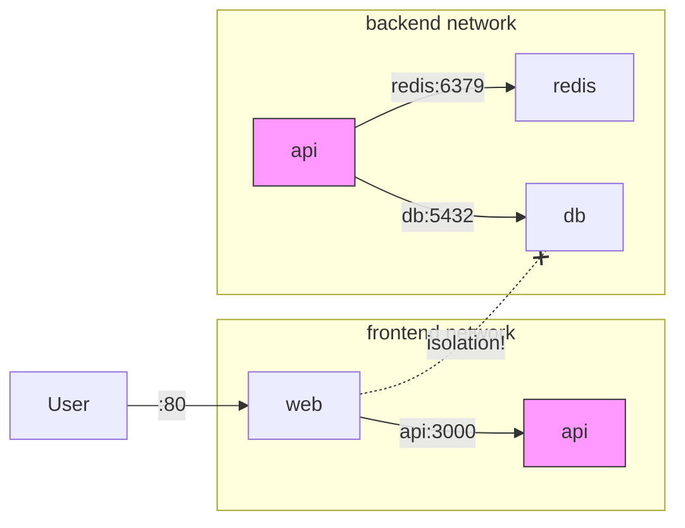

# Level 5: Networking — How Containers Communicate

## 🎯 The Problem: Containers Are Isolated

By default, every Docker container runs in its own **network namespace**. This means the container has its own IP address, its own routing table, and its own network stack. Containers cannot simply reach each other or the outside world.

```bash
# Two containers know nothing about each other
docker run -d --name web nginx
docker run -d --name api node:20

# web cannot reach api by name
docker exec web curl http://api:3000
# curl: (6) Could not resolve host: api
```

This raises questions:
- How does a frontend container reach a backend container?
- How does a user in a browser reach an application running in a container?
- How do you isolate a database from public access?
- How do multiple microservices communicate within a single application?

Docker addresses these needs through its **networking subsystem** with multiple drivers and mechanisms.

---

## 🔥 Docker Network Drivers

Docker supports several network drivers, each suited to a specific scenario:

| Driver | Description | When to use |
|---|---|---|
| **bridge** | Virtual bridge on the host | Default, for standalone containers |
| **host** | Container uses the host network directly | Maximum performance, no isolation |
| **none** | Networking completely disabled | Batch jobs with no network, security |
| **overlay** | Network spanning multiple Docker hosts | Docker Swarm, distributed systems |
| **macvlan** | Container gets a MAC address on the physical network | Integration with legacy systems |

### Visual Model



---

## 🔥 Bridge Network — The Default Network

When Docker is installed, it automatically creates three networks:

```bash
docker network ls
# NETWORK ID     NAME      DRIVER    SCOPE
# a1b2c3d4e5f6   bridge    bridge    local
# d7e8f9a0b1c2   host      host      local
# e3f4a5b6c7d8   none      null      local
```

### Default Bridge (docker0)

When you start a container without specifying a network, it joins the **default bridge** (`docker0`):

```bash
# Both containers are in the default bridge
docker run -d --name web nginx
docker run -d --name api node:20

# View a container's IP address
docker inspect web --format '{{range .NetworkSettings.Networks}}{{.IPAddress}}{{end}}'
# 172.17.0.2

docker inspect api --format '{{range .NetworkSettings.Networks}}{{.IPAddress}}{{end}}'
# 172.17.0.3
```

### Default Bridge Limitations

The default bridge has important limitations:

```bash
# ❌ DNS resolution by name does NOT work in the default bridge
docker exec web curl http://api:3000
# curl: (6) Could not resolve host: api

# ✅ You can only reach by IP address
docker exec web curl http://172.17.0.3:3000
```

Other default bridge limitations:
- **No automatic DNS** — containers cannot find each other by name
- **All containers share the same network** — no isolation between applications
- **IP addresses change** — when a container is recreated, its IP may differ
- **Uses the legacy `--link`** — for connecting containers (deprecated)

📌 **The default bridge is only suitable for quick tests. Use user-defined networks for real projects.**

---

## 🔥 User-defined Bridge Networks

User-defined bridge networks solve all the problems of the default bridge:

### Creating and Using

```bash
# Create a network
docker network create my-app-net

# Start containers in this network
docker run -d --name web --network my-app-net nginx
docker run -d --name api --network my-app-net node:20

# ✅ DNS by container name works!
docker exec web curl http://api:3000
# Response from the api server
```

### Automatic DNS

In a user-defined network, Docker runs a **built-in DNS server** (127.0.0.11) that resolves container names:

```bash
docker network create backend
docker run -d --name postgres --network backend postgres:16
docker run -d --name api --network backend my-api

# api can reach postgres by name
docker exec api psql -h postgres -U user -d mydb
# Connection established!
```

### Network Aliases

Additional DNS names can be assigned via `--network-alias`:

```bash
docker run -d --name postgres-primary \
  --network backend \
  --network-alias db \
  --network-alias postgres \
  postgres:16

# Container is reachable by any of the names:
# postgres-primary, db, postgres
docker exec api ping db
# PING db (172.18.0.2): 56 data bytes
```

### Advantages of User-defined Networks

| Feature | Default bridge | User-defined bridge |
|---|---|---|
| **DNS by name** | No | Yes |
| **Isolation** | All together | Only network participants |
| **Hot connect** | No | `docker network connect` |
| **Subnet configuration** | Limited | Full (`--subnet`) |
| **Configuration** | Fixed | Flexible |

---

## 🔥 Managing Networks

### Core Commands

```bash
# Create a network
docker network create my-net

# Create a network with parameters
docker network create \
  --driver bridge \
  --subnet 172.20.0.0/16 \
  --gateway 172.20.0.1 \
  --ip-range 172.20.240.0/20 \
  custom-net

# List networks
docker network ls

# Detailed information
docker network inspect my-net

# Connect a container to a network
docker network connect my-net existing-container

# Disconnect a container from a network
docker network disconnect my-net existing-container

# Remove a network
docker network rm my-net

# Remove all unused networks
docker network prune
```

### Hot Connect and Disconnect

A container can be connected to an additional network **without restarting**:

```bash
# Container in the frontend network
docker run -d --name app --network frontend my-app

# Also connect to backend
docker network connect backend app

# Now app is reachable from both networks
docker inspect app --format '{{json .NetworkSettings.Networks}}' | jq
# { "frontend": { "IPAddress": "172.18.0.2" },
#   "backend":  { "IPAddress": "172.19.0.3" } }
```

---

## 🔥 Port Mapping

Containers in a bridge network are isolated from the outside world. To make a service accessible from outside, you need to **publish a port** via `-p` or `--publish`:

### Syntax

```bash
# Basic: hostPort:containerPort
docker run -p 8080:80 nginx
# localhost:8080 → container:80

# Specific interface only
docker run -p 127.0.0.1:8080:80 nginx
# Accessible only from localhost, not from the external network

# Random port on the host
docker run -p 80 nginx
# or
docker run -P nginx
# Docker will pick a free port (usually 32768+)

# UDP port
docker run -p 5353:53/udp dns-server

# Multiple ports
docker run -p 80:80 -p 443:443 nginx

# TCP and UDP on the same port
docker run -p 53:53/tcp -p 53:53/udp dns-server
```

### Viewing Published Ports

```bash
docker port my-container
# 80/tcp -> 0.0.0.0:8080
# 443/tcp -> 0.0.0.0:8443

# Specific port
docker port my-container 80
# 0.0.0.0:8080
```

### EXPOSE vs -p

```dockerfile
# EXPOSE in a Dockerfile — documentation only!
FROM nginx
EXPOSE 80 443
# This does NOT publish the port; it only informs which ports the application listens on
```

```bash
# -P publishes ALL ports from EXPOSE to random host ports
docker run -P nginx

# -p publishes specific ports
docker run -p 8080:80 nginx
```

📌 **`EXPOSE` — documentation. `-p` — actual publishing.**

### How Port Mapping Works



Docker uses **iptables** (Linux) to redirect traffic from a host port to a container port.

---

## 🔥 Communication Between Containers

### Within the Same Network

Containers in the same user-defined network communicate directly by name:

```bash
docker network create app-net

# Backend
docker run -d --name api --network app-net \
  -e DB_HOST=postgres \
  my-api

# Database
docker run -d --name postgres --network app-net \
  -e POSTGRES_PASSWORD=secret \
  postgres:16

# api reaches postgres by the name "postgres"
# Port 5432 does not need to be published — it is accessible within the network
```

### Between Different Networks — Isolation

Containers in **different networks cannot see each other**:

```bash
docker network create frontend
docker network create backend

docker run -d --name web --network frontend nginx
docker run -d --name api --network backend node:20

# web cannot reach api
docker exec web curl http://api:3000
# curl: (6) Could not resolve host: api
```

### Bridging Between Networks

A container can be connected to multiple networks, acting as a "bridge":

```bash
docker network create frontend
docker network create backend

# api is connected to both networks
docker run -d --name api --network frontend my-api
docker network connect backend api

# web can see api (both in frontend)
# api can see db (both in backend)
# web CANNOT see db (isolation!)
docker run -d --name db --network backend postgres:16
docker run -d --name web --network frontend nginx
```

### Typical Microservices Architecture



---

## 🔥 Host Network Mode

In `host` mode, the container **directly uses the host's network stack** — no virtual bridge, no NAT, no iptables:

```bash
# Container listens on port 80 directly on the host
docker run --network host nginx
# nginx is available at http://localhost:80 without -p
```

### When to Use Host Network

- **Maximum performance** — no overhead from NAT/bridge
- **Applications that work with the network stack** — monitoring, sniffing
- **Many ports** — no need to enumerate each one with `-p`

### Limitations

```bash
# ❌ Port conflict: two nginx instances cannot both listen on port 80
docker run --network host --name web1 nginx
docker run --network host --name web2 nginx
# Error: bind: address already in use

# ❌ No network isolation — the container sees all host interfaces
# ❌ Does not work on macOS and Windows (Docker Desktop uses a VM)
```

📌 **Host network — for specific use cases. In most situations, bridge + port mapping is sufficient.**

---

## 🔥 None Network — Complete Disconnection

The `none` mode completely disables networking for the container:

```bash
docker run --network none alpine ping google.com
# ping: bad address 'google.com'

docker run --network none alpine ip addr
# 1: lo: <LOOPBACK,UP> ... inet 127.0.0.1/8
# Loopback interface only
```

### When to Use

- Batch jobs that don't require networking (file processing, computation)
- Enhanced security — the container cannot send data outside
- Testing application behavior without a network

---

## 🔥 DNS in Docker Networks

### Built-in DNS Server

In user-defined networks, Docker runs a DNS server at `127.0.0.11`:

```bash
docker network create my-net
docker run -d --name web --network my-net nginx

docker exec web cat /etc/resolv.conf
# nameserver 127.0.0.11
# options ndots:0
```

### What Gets Resolved

- **Container name** (`--name`) — `web`, `api`, `postgres`
- **Network aliases** (`--network-alias`) — arbitrary DNS names
- **Service names** in Docker Compose — automatically

### Custom DNS

```bash
# Specify an external DNS server
docker run --dns 8.8.8.8 --dns 8.8.4.4 alpine nslookup google.com

# Add a DNS record
docker run --add-host myhost:10.0.0.5 alpine ping myhost

# Add a record for host.docker.internal (access to the host)
docker run --add-host host.docker.internal:host-gateway alpine \
  curl http://host.docker.internal:3000
```

📌 **`host.docker.internal`** — a special name for reaching the host machine from a container. On Linux it requires `--add-host`; on macOS/Windows it works out of the box.

---

## 🔥 Practical Patterns

### Pattern 1: Web Application with a Database

```bash
# Create an isolated network
docker network create webapp

# Database — port is NOT published to the outside
docker run -d --name db \
  --network webapp \
  -v pgdata:/var/lib/postgresql/data \
  -e POSTGRES_PASSWORD=secret \
  postgres:16

# Application — connects to the DB by name, publishes HTTP
docker run -d --name app \
  --network webapp \
  -e DATABASE_URL=postgresql://postgres:secret@db:5432/postgres \
  -p 3000:3000 \
  my-app
```

### Pattern 2: Reverse Proxy

```bash
docker network create proxy-net

# Backend services
docker run -d --name api1 --network proxy-net my-api-1
docker run -d --name api2 --network proxy-net my-api-2

# Nginx as a reverse proxy — the only container with a public port
docker run -d --name proxy \
  --network proxy-net \
  -v ./nginx.conf:/etc/nginx/nginx.conf:ro \
  -p 80:80 -p 443:443 \
  nginx
```

### Pattern 3: Network Debugging

```bash
# Attach to a container's network for debugging
docker run -it --rm \
  --network container:my-app \
  nicolaka/netshoot \
  tcpdump -i eth0 port 80

# Check connectivity
docker run --rm --network my-net alpine ping -c 3 api
docker run --rm --network my-net curlimages/curl curl -s http://api:3000/health
```

---

## 🔥 Best Practices

### 1. Always Create User-defined Networks

```bash
# ✅ User-defined network with DNS
docker network create my-app
docker run --network my-app --name api my-api

# ❌ Default bridge — no DNS, no isolation
docker run --name api my-api
```

### 2. Do Not Publish Database Ports

```bash
# ❌ Database is accessible to everyone
docker run -p 5432:5432 postgres:16

# ✅ Database is only accessible within the network
docker run --network backend postgres:16
```

### 3. Bind Ports to 127.0.0.1

```bash
# ❌ Port is accessible from the external network
docker run -p 8080:80 nginx

# ✅ Port is only accessible from localhost
docker run -p 127.0.0.1:8080:80 nginx
```

### 4. Use Network Aliases for Flexibility

```bash
# ✅ An alias lets you swap the implementation without changing clients
docker run --network app --network-alias db postgres:16
# Can later be replaced with MySQL while keeping the "db" alias
```

### 5. Separate Networks by Purpose

```bash
# ✅ Isolation: frontend cannot see database
docker network create frontend
docker network create backend
```

### 6. Use EXPOSE as Documentation

```dockerfile
# ✅ Document ports in the Dockerfile
FROM node:20-alpine
EXPOSE 3000
# Developers immediately see which port is needed
```

---

## ⚠️ Common Beginner Mistakes

### 🐛 1. Using the Default Bridge for Container Communication

```bash
# ❌ DNS does not work in the default bridge
docker run -d --name db postgres:16
docker run -d --name app -e DB_HOST=db my-app
# app cannot find "db" by name
```

> **Why this is a mistake:** the default bridge does not provide DNS resolution. Containers can only communicate by IP address, which changes when a container is recreated.

```bash
# ✅ User-defined network with DNS
docker network create app-net
docker run -d --name db --network app-net postgres:16
docker run -d --name app --network app-net -e DB_HOST=db my-app
```

### 🐛 2. Publishing Ports for Internal Services

```bash
# ❌ Why publish the Redis port to the outside?
docker run -d -p 6379:6379 redis
# Anyone on the network can connect to your Redis!
```

> **Why this is a mistake:** publishing a port exposes the service to the outside world. Internal services (databases, caches, queues) should only be accessible via Docker's internal network.

```bash
# ✅ Redis is only accessible within the network
docker network create backend
docker run -d --name redis --network backend redis
docker run -d --name app --network backend -e REDIS_HOST=redis my-app
```

### 🐛 3. Hardcoded IP Addresses

```bash
# ❌ IP address may change when the container is recreated
docker run -d --name db postgres:16
# IP: 172.17.0.2
docker run -d -e DB_HOST=172.17.0.2 my-app

docker rm -f db
docker run -d --name db postgres:16
# IP: 172.17.0.5 — the application is broken!
```

> **Why this is a mistake:** Docker does not guarantee the same IP when a container is recreated. DNS names are stable; IP addresses are not.

```bash
# ✅ Use DNS names
docker network create app-net
docker run -d --name db --network app-net postgres:16
docker run -d --name app --network app-net -e DB_HOST=db my-app
# "db" always resolves to the current IP
```

### 🐛 4. Forgetting That -p 8080:80 Opens the Port on ALL Interfaces

```bash
# ❌ Port is accessible from the internet (if the host has a public IP)
docker run -p 3000:3000 my-app
# Equivalent to -p 0.0.0.0:3000:3000
```

> **Why this is a mistake:** by default, `-p` binds the port to all interfaces (`0.0.0.0`). On a server with a public IP, this means the port is accessible from the internet.

```bash
# ✅ Bind to localhost
docker run -p 127.0.0.1:3000:3000 my-app
# Accessible only from the host itself
```

### 🐛 5. Trying to Connect Containers Across Different Networks

```bash
# ❌ Containers in different networks cannot see each other
docker network create net-a
docker network create net-b
docker run -d --name svc-a --network net-a alpine sleep 3600
docker run -d --name svc-b --network net-b alpine sleep 3600

docker exec svc-a ping svc-b
# ping: bad address 'svc-b'
```

> **Why this is a mistake:** network isolation is a feature of Docker. Containers in different networks are intentionally invisible to each other.

```bash
# ✅ Connect the container to the required network
docker network connect net-a svc-b
# Now svc-b is reachable from net-a

# Or place both in the same network
docker run -d --name svc-a --network shared alpine sleep 3600
docker run -d --name svc-b --network shared alpine sleep 3600
```

---

## 📌 Summary

- ✅ **Bridge** — the standard driver, creates a virtual network on the host
- ✅ **Default bridge** — automatic network without DNS, for tests only
- ✅ **User-defined bridge** — DNS by container name, isolation, flexibility
- ✅ **Port mapping** (`-p`) — publishing container ports on the host
- ✅ **EXPOSE** — documentation in the Dockerfile, does not publish the port
- ✅ Containers in the same network communicate by **DNS names**
- ✅ Containers in **different networks are isolated** from each other
- ✅ `docker network connect` — connect to a network **without restarting**
- ✅ **Host network** — no isolation, maximum performance
- ✅ **None network** — completely disables networking for security
- ✅ Do not publish ports for internal services (databases, caches, queues)
- ✅ Bind ports to `127.0.0.1` for security
- ✅ Use **network aliases** for flexible service replacement
